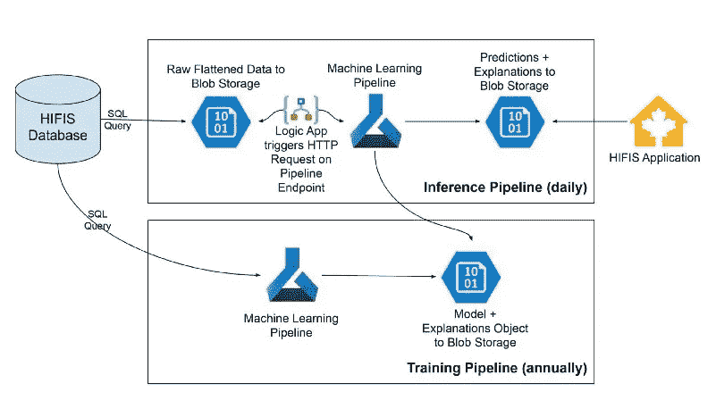

# 预测长期无家可归者的开源可解释机器学习方法

> 原文：<https://towardsdatascience.com/an-open-source-interpretable-machine-learning-approach-to-prediction-of-chronic-homelessness-8215707aa572?source=collection_archive---------16----------------------->

加拿大伦敦市中心的景色。图片由妮可·奥斯本拍摄。

## [变更数据](https://towardsdatascience.com/tagged/data-for-change)、[行业备注](https://towardsdatascience.com/tagged/notes-from-industry)

## 获得对未来 6 个月内面临长期无家可归风险的客户的可解释预测

*Blake VanBerlo 是一名数据科学家，支持伦敦市的市政人工智能应用实验室。该实验室由信息技术服务部管理。布莱克关于我们开源人工智能项目的帖子。有关其他主要城市利益相关方的联系方式，请参见下面的“联系方式”部分。*

# 摘要

加拿大伦敦市政府最近将机器学习应用于慢性无家可归问题的预测(见[论文](https://arxiv.org/abs/2009.09072)【1】及随附的[源代码](https://github.com/aildnont/HIFIS-model))。一个模型预测公民在未来 6 个月内是否处于长期无家可归的高风险中，并为每个预测获得解释。本文讨论了项目的路径，从研究到部署。

# 介绍

有人建议对慢性无家可归者进行预测性筛查，以此来标记那些可能从预防慢性无家可归的干预措施中受益的个人[2]。此外，研究表明，住房补贴、转移努力和基于社区的服务等预防性策略已被证明能有效降低未来长期无家可归的发生率[2]。人们可以想象，这些有限的支助资源中的一部分将优先用于那些面临长期无家可归最大风险的人。这就引出了一个问题:我们能可靠地识别出最有可能长期无家可归的人吗？

加拿大伦敦市政府致力于开发一个预测模型，在给定人口统计和服务使用信息的情况下，该模型可以准确估计个人在未来 6 个月内成为长期无家可归者的风险。伦敦市政人工智能应用实验室应用机器学习方法来研究这种模型。参与该项目的利益相关者包括伦敦无家可归者预防部门、城市信息技术服务部门以及来自伦敦各种无家可归者服务机构的各种利益相关者。

在本文中，我们将讨论(1)问题是如何发现的，(2)使用的数据，(3)寻找符合城市模型透明和负责任人工智能原则的有效模型的过程，(4)模型如何过渡到部署以供个案工作者使用，(5)未来工作的途径，以及(6)市政当局如何自己复制这项工作。

伦敦市中心的维多利亚公园。图片由妮可·奥斯本拍摄。

# 挑战

与利益攸关方进行了讨论，以确定该系统的具体目标。这些会谈中产生的问题陈述指导了后续的设计和部署需求。粗略地说，利益相关者想要预测一个客户(定义为获得无家可归者服务的个人)在未来是否有长期无家可归的风险。如果存在可靠的此类估计，个案工作者可以为该客户分配更多的无家可归预防资源(例如，住房补贴、负担得起的住房、个案管理)。

形式上的挑战是:给定一个人的人口统计和无家可归者服务利用记录，预测他们是否会在 6 个月后处于长期无家可归的状态。

> 如果在过去的一年中，一个客户至少有 180 天在无家可归者收容所度过了至少 15 分钟，那么他就被认为是长期无家可归者。

这个长期无家可归的定义改编自加拿大政府的无家可归战略指令[3]。然后基于该定义制定了二元预测任务。*积极*类的客户在预测日期后 6 个月符合慢性无家可归的定义，而*消极*类的客户则不符合。

分类任务有多种量化分类器性能的指标。我们检查的指标包括准确度、精确度、召回率、F1 分数和受试者操作曲线下面积(AUC)。利益相关者坚持认为召回是最重要的衡量标准。在我们的问题中， *recall* 指的是模型正确识别的实际上成为长期无家可归者的客户比例。*另一方面，*Precision 是模型确定为长期无家可归者的客户中实际上成为长期无家可归者的比例。理想情况下，分类器将最大限度地提高精确度和召回率；然而，这两者之间有一个权衡。给定选项，利益相关者更喜欢模型实现高召回，因为高召回最小化了假阴性预测的机会。错误地不对最终成为长期无家可归者的客户实施预防策略比错误地将预防资源分配给可能不需要它们的人要付出更高的代价(社会和经济代价)。值得注意的是，这种关系不能走极端，这意味着最小化假阴性是目标，然而过度服务假阳性的成本不能太高。这导致无家可归者预防部门使用修改的 F1 分数(考虑召回率和精确度)来确定生产的最佳模型性能。

# 数据和可行性

## HIFIS 数据库

该项目的主要促成因素之一是现有数据库的可用性，该数据库包含有关全市无家可归者服务客户的人口统计和服务使用信息。伦敦是加拿大众多使用无家可归者个人和家庭信息系统(HIFIS)应用程序来管理向获得无家可归者服务的客户提供服务的城市之一。事实上，信息技术服务司的 HIFIS 数据库管理员最初想知道储存在 HIFIS 数据库中的信息是否可以用来预测长期无家可归的情况。此外，利用这些数据的可行性首先依赖于强大的数据治理基础。五年前，伦敦的 20 多个无家可归者服务组织通过强大的数据治理、隐私、同意和信息安全实践，将他们的数据整合到一个数据库架构下。这个丰富且维护良好的数据源是这个项目成功背后的核心促成因素。

在与伦敦的无家可归者服务机构互动时，如果客户同意收集，将为新客户收集人口统计和其他背景信息。向客户提供各种服务，如住宿、食物银行服务、个案管理、住房补贴、住房支助和个人物品储存。每当客户端访问这些服务时，都会在数据库中创建记录来捕获交互。

## 隐私和信息安全

在这一点上，谈论隐私、信息安全和负责任的人工智能很重要。该模型的基础数据包括来自伦敦最脆弱人群之一的敏感的个人身份信息。因此，我们竭尽全力保护数据和系统的隐私和信息安全。一些措施的例子如下:

*   **明确同意:**数据收集程序和基础数据库是明确同意驱动的数据库，这意味着在数据收集之前，任何个人都给予明确同意。
*   **数据治理:**所有使用 HIFIS 的组织都签署了数据共享协议，以便能够以非身份格式将这些信息用于这些目的。
*   **去除身份:**即使在项目的最早原型和设计阶段提取的所有数据都会被去除身份，以保护系统中的个人信息。
*   **隐私设计:**模型给出的风险预测与客户 ID 相关联，然后再映射回一个名字。这种重新识别过程只发生在 HIFIS 应用程序/数据库中，只允许那些已经访问过该识别数据的人查看命名的预测。这种一致的访问权限管理对于保护个人隐私和信息安全至关重要。
*   **安全性:**利用企业网络和应用安全的最佳实践来保护数据库以及生产中的机器学习管道。
*   **系统隔离:**机器学习管道只能访问去识别数据，这意味着任何正在进行的维护、模型的重新训练和模型性能的监控都不能提供对识别数据的任何访问。

## 负责任的 AI

上面提到的隐私和信息安全措施对于像这样的机器学习系统的运行至关重要。然而，在部署和维护负责任的人工智能系统时，还有其他考虑因素。通过与我们的隐私官和法律服务团队合作，我们决定将加拿大国库委员会秘书处关于自动决策的[指令](https://www.tbs-sct.gc.ca/pol/doc-eng.aspx?id=32592) [4】应用于该系统，尽管该系统是市政府实施的。该系统通过[算法影响评估(AIA)工具](https://www.canada.ca/en/government/system/digital-government/digital-government-innovations/responsible-use-ai/algorithmic-impact-assessment.html)运行，以确定系统的影响水平，并确定纳入系统的风险缓解措施。分析的结果是，该系统收到了 AIA 的 2 级调查结果，因此我们实施了以下风险缓解措施:

*   **同行评审:**我们让第三方数据科学供应商评审模型、部署架构和安全架构，以确保其符合或超过最佳实践。此外，我们向 Elsevier Engineering Applications of Artificial Intelligence 提交了一篇学术论文供同行评审([发表于 2021 年 4 月](https://www.sciencedirect.com/science/article/abs/pii/S0952197621000907))，预印本可供评审( [arXiv 预印本链接](https://arxiv.org/pdf/2009.09072.pdf))。
*   **通知:**关于该系统存在的通知和关于运行中的模型的详细文档可以在我们的公共代码库( [GitHub 链接](https://github.com/aildnont/HIFIS-model))上开源获得。该模型目前处于实施规划阶段，浅显易懂的语言解释将成为培训和持续实施的一部分。
*   **人在回路中决策:**尽管 ADS 指令中的 2 级系统不需要人在回路中，但考虑到本项目的敏感性，人们决定这只能是决策辅助/协助，人将始终处于回路中。
*   **解释:**我们利用局部可解释的模型不可知解释算法(LIME)来为机器学习系统生成的每个预测生成人类可解释的解释(下文对此有更多介绍)。这使得用户能够理解系统为什么做出这样的决定，建立对系统的信任，并监控系统的非预期偏差。
*   **测试:**在生产之前，通过使用来自 LIME 算法的解释，我们能够标记出系统中是否有意外偏差，并使我们能够移除或修复任何不公平地影响结果或导致系统预测有问题的功能。
*   **监控:**我们的支持模型有一个熟练的数据科学家来监控生产系统的性能指标。预测是每天生成的(与按需生成相反)。除此之外，在发布之前，我们进行了分析，发现只有当模型的训练数据超过大约 1.5 年时，性能指标才开始受到影响(即模型衰退)。因此，我们在支持模型中构建了机器学习模型，在将新训练的模型投入生产之前，该模型将接受年度再培训，并由业务部门签署绩效指标。
*   **培训:**通过预印文章，以及上面链接的 GitHub repo 中的模型文档，我们能够提供关于模型功能的全面文档。实践标准和业务级别的未来实现也将被记录，以便根据模型做出明智的决策。
*   **审计:**我们在系统中建立了一个记录，记录了生产系统曾经做出的所有历史预测，这些预测映射到系统的哪个版本做出了这些预测，这样就可以对所有决策进行审计。
*   **同意:**我们在系统中实现了一个功能，以确保如果客户撤回对其数据进行处理的同意，他们的信息将不再被机器学习系统处理。如果在数据库级别撤销了明确的同意，这将自动发生，并且如果需要的话，可以在逐个客户端的基础上人工完成，也可以仅针对系统的机器学习方面来完成。这不是 AIA 的要求，而是我们在分析相关立法时建议的。例如，在欧洲联盟的 GDPRs 中，个人有权通过自动决策系统限制处理。
*   **利益相关者的参与和监督:**在整个项目中，不仅与伦敦金融城的无家可归者预防部门，还与更广泛的利益相关者机构伦敦无家可归者预防网络(LHPN)进行了多次对话，设置了许多检查点和审批关口。LHPN 是一个包括所有伦敦收容所负责人和有生活经验的个人的机构，负责监督项目并继续指导实施。上述大部分措施既是自上而下负责任的 AI 立法审查所要求的，也是自下而上的利益主体参与 LHPN 所要求的，这让我们相信我们正在采取正确的方法。

## 时间序列公式

到目前为止，我们已经决定预测模型的功能可以包括人口统计和总服务使用情况(例如，使用服务的总天数或次数)。因此，在项目的第一阶段，我们考虑了为客户创建预测的模型，给出了他们的人口统计属性和当前服务使用总量。此后，我们将这些特征统称为*静态特征。*静态特征可以进一步分解为*数字特征*(如*)。*年龄】、*单值分类变量*(如公民身份)、*多值分类特征*(如健康问题)。

由于服务使用记录与一个日期相关联，我们假设，以一种捕获服务使用的时间分布密度的方式来重构模型输入可能是有益的。其原因是这样一个事实，即一个在过去几年中可能大量使用服务，但目前不是长期无家可归且住房已经稳定的客户，对于该模型来说，其静态特征与过去 6 个月内在收容所停留的人相同；这更预示着高风险个体。因此，我们决定在不同的日期为每个客户创建多个记录。这些示例将包括前面提到的静态特征和最近几个月每种服务类型的总服务使用量。因此，我们为特定的 30 天时间步长内的总服务使用量创建了特征，包括到示例日期为止的最后 6 个时间步长(即最后 6 个月)(针对每种服务类型)。即，给出本月、上个月、2 个月前等与每个服务的交互次数的一组特征。我们将这些时序服务使用特征称为*动态特征。*

单个时间序列示例中的特征分解。图片作者。

作为研究的一部分，我们比较了在仅包含静态特征(即每个客户 1 条记录)的数据集上训练的模型和在静态和动态特征(即每个客户不同日期的多条记录)的数据集上训练的模型。

# 模型搜索

## 可解释标准

自动算法工具在决策支持中的使用越来越多，这引起了人们对模型预测的不透明性和偏差传播可能性的关注。如上所述，在利益相关者参与时，部署模型所做的任何预测都要得到利益相关者满意的解释，这被认为是一项关键任务要求。

## 候选模型

我们在研究中考虑了各种潜在的建模技术。候选建模技术如下:

*   逻辑回归
*   随机森林
*   XGBoost
*   多层感知器
*   混合递归神经网络+多层感知器

所有上述模型类型都使用纯静态数据集和包含静态和动态特征的数据集进行训练，只有混合模型除外，我们将其缩写为“HIFIS-RNN-MLP”。论文中列出了每个模型使用的特定超参数，以及 HIFIS-RNN-MLP 的精确示意图[1]。

为了比较这些模型，根据数据集的类型进行了交叉验证。对于纯静态数据集，应用传统的 k 重交叉验证，其中 *k=10* 。对于时间序列数据集，应用了嵌套交叉验证方法(使用 10 倍)。性能指标记录为所有折叠的平均值。下图描述了这种时间序列交叉验证策略。

嵌套交叉验证策略中 fold *k 的训练、验证和测试集。验证集和测试集包含可用于 fold k. Image by author 的最新记录。*

在我们的实验中测试的模型架构不是计算密集型的，只需要几分钟的训练。

## 表演

下表总结了每个候选模型的性能。

候选模型的所有交叉验证的平均测试集性能的比较。使用分类阈值 0.5 计算精确度、召回率和 F1 值。图片作者。

上表中有很多内容。乍一看，似乎没有一种型号是明显的赢家。然而，显而易见的是，在时间序列数据集(包含静态和动态特征)上训练的模型往往比仅在静态特征上训练的模型表现更好。这将搜索范围缩小到在时间序列数据集上训练的模型。

回顾无家可归预防的主要目标是最大限度地回忆。虽然多层感知器(MLP)拥有最高的召回率(96%)，但它的精度是在时间序列数据集上训练的模型中最低的。无家可归者预防组织不希望以牺牲精确性为代价来选择一个召回率稍高的模型。在召回率次高的两个模型(HIFIS-RNN-MLP 和逻辑回归)中，HIFIS-RNN-MLP 因其更高的精确度最终被选中。其他城市可能会有不同的选择。

请注意，逻辑回归是列表中唯一内在可解释的模型，其余的都是“黑盒”模型。如果不是 LIME 提供了令人满意的解释，由于前面概述的透明度标准，可能会选择逻辑回归。

## 可解释性

为了满足透明性标准，应用了一种称为*局部可解释模型不可知解释*的可解释性算法【5】。LIME 是*模型不可知的，*意味着它可以被应用于产生任何类型的黑盒模型的解释。

LIME 确定了对模型预测贡献最大的示例特征。对于每个特征值，LIME 输出一个权重列表。正权重表示该特征有助于正面预测(即长期无家可归)，负权重表示该特征有助于负面预测(即不是长期无家可归)。权重的大小意味着指示贡献有多强。下图显示了数据集中匿名示例的时间预测权重。

一个简单的解释。绿色条和红色条分别表示某个特征有助于正面预测或负面预测。在这个例子中，客户在过去 30 天的时间里至少在避难所呆了 1 天的事实为长期无家可归的积极预测提供了强有力的支持。

上面的例子摘自论文，在论文中有更详细的描述[1]。当个案工作者为客户查看模型预测时，他们也会收到类似上图的解释。利益相关者认为 LIME 的解释对于理解为什么模型对特定客户做出预测是有价值的。

LIME 的另一个好处是，它提供了一种生成模型功能的全局(和近似)概要的方法。使用 LIME paper [5]中概述的*子模型选择*方法，我们为整个模型生成了一个全局解释，如下所示。

总结整个模型功能的简要说明。显示 30 个最有贡献的特征值。图片作者。

在全局解释中，我们首先注意到，最能预测 6 个月内长期无家可归者的特征是，在最近 30 天的时间步长内至少有 1 天住在收容所。第二个影响最大的特性是在第二个最近的 30 天时间步长中对客户端进行的 SPDAT 评估的数量。SPDAT(即服务优先决策辅助工具)是一种常用的无家可归者筛查工具，在全球多个司法辖区使用[6]。其他一些有助于预测长期无家可归者的有趣特征包括高龄、5 年前去过食物银行，以及从未接受过住房补贴。相反，一些有趣的特征与长期无家可归的预测相悖，包括年轻和在最近的时间步骤中没有接受 SPDAT。利益相关者认为这一数字非常有助于考虑哪些因素导致了伦敦无家可归人口的长期无家可归。特别有趣的是，大多数最有影响力的特性是时间序列服务使用特性。

顺便说一句，计算时间比获得预测时间长得多。原因是，LIME 在生成解释时使用该模型对虚构的相近示例进行了多次预测。更多信息请参考 LIME [论文](https://arxiv.org/abs/1602.04938)。

加拿大伦敦市中心的考文特花园市场。图片由妮可·奥斯本拍摄。

# 部署和支持

一旦 HIFIS-RNN-MLP 被确定为首选模型，其性能指标得到无家可归者预防组织的批准，人们就开始努力部署该模型，供伦敦收容所的个案工作者实时使用。该模型在所有可用数据上被再次训练，并被保存用于部署。

## 云架构

微软 Azure 被选为云计算服务，以促进模型部署。部署功能被分成两个主要的工作流:模型再训练和模型预测(即“推理”)。 [Azure ML](https://azure.microsoft.com/en-ca/services/machine-learning/) 提供了开发机器学习“管道”来自动化这一工作流程的能力。每个管道都由一系列顺序执行的明确定义的步骤组成。管道产生的原始数据、预处理数据和工件存储在 [Azure Blob 存储器](https://azure.microsoft.com/en-us/services/storage/blobs/)中。每天都会自动运行一个 SQL 查询来从 HIFIS 数据库中检索所有客户端数据，该数据库被展平并作为 CSV 文件保存在 Blob 存储中。

训练管道训练新模型并产生全局解释(通过石灰子模型选择)。它将每年举办一次。它由以下步骤组成:

1.  预处理原始数据集中的所有数据，创建由静态和动态要素组成的时间序列数据集。
2.  在测试集上训练模型并保存性能指标。
3.  运行石灰子模块选择以获得全局解释。
4.  将此次运行中生成的所有工件保存到一个文件夹中。

推理管道为当前日期的数据集中所有同意的客户端生成预测。它每天运行。其步骤是:

1.  预处理原始数据集中最近的记录，在当前日期为每个客户生成一个时间序列示例。
2.  获得每个例子的预测和相应的时间解释。

PowerBI 仪表板会消耗最新的预测，使它们可以作为报告提供给个案工作者。为了确保每天为所有客户端做出预测，一个 [Azure Logic 应用](https://azure.microsoft.com/en-ca/services/logic-apps/)在每天的同一时间向 REST 端点发出一个经过身份验证的 HTTP POST 请求，该请求启动推理管道的执行。

描述模型部署云架构的示意图。图片作者。

## 支持和维护

利用一家精通数据科学和 Azure 云服务的供应商开发了一个支持模型，为管道提供支持和维护。他们的职责包括:

*   确保推理管道每天无误运行
*   调查和解决管道问题
*   在绩效指标和全球解释获得批准后，适当运行培训管道并替换当前模型

# 后续步骤

已经确定了未来工作的多个可能方向。首先，有必要最终量化我们模型的影响。到目前为止，有一个收容所已经是该系统的早期采用者。当决定在预防性资源分配中优先考虑哪些客户时，个案工作者正在考虑模型的预测和解释。可以通过检查访问该庇护所的客户的结果数据来验证该模型的效用。如果这样一项研究表明，良好的客户结果更有可能在引入模型后，它将作为证明模型使用的部分证据。

如果这种方法可以应用于其他城市的数据，就有可能对其进行外部验证。任何使用 HIFIS 数据库的市政当局都是这种研究的理想候选人，因为他们可以利用我们的开源代码更容易地训练他们自己的模型。来自另一个城市的数据集可以像在伦敦一样进行预处理，然后进行交叉验证。可比的性能指标将增加对这种方法的信心。请注意，伦敦的训练模型不能直接应用于为来自其他城市的客户做出预测，因为数据集中存在特定于地区的特征(例如客户住过的避难所、服务提供的类型、行为标志)，并且出于信息安全原因，我们的开源存储库不包括训练模型参数。除此之外，伦敦的人口统计数据肯定不同于其他城市，因此该模型可能会偏向伦敦人口。

# 我的城市如何使用这个？

如果你有兴趣在自己的城市尝试这种预测长期无家可归者的方法，这里有一些关于如何开始的建议。

为了效仿伦敦金融城采取的方法，您所在的城市需要拥有一定的员工和技术资源，包括:

*   IT 经理:管理和支持参与项目的所有员工；最好熟悉数据科学基础知识
*   *数据科学家:*领导研发工作；应具备数据科学专业知识和经验；如果设想进行云部署，最好有云服务经验
*   *数据库经理:*促进数据库支持，并告知数据科学团队数据库中包含的潜在功能；并协助处理数据争论
*   *无家可归者服务经理:*在技术团队和最终将使用模型预测的工作人员之间牵线搭桥；对城市中无家可归者的情况和需要参与的利益相关者有深刻的理解

如果您所在的城市是 HIFIS 应用程序的用户，您可能会受益于伦敦金融城为此项目发布的代码，该代码可通过[公共 GitHub 资源库](https://github.com/aildnont/HIFIS-model)获得。除了用于训练、预测和可解释性的代码之外，存储库还包括 HIFIS SQL 查询和将原始查询结果转换为预处理数据集的代码。如果您的城市使用不同的无家可归者信息管理系统，您仍然可以遵循我们论文中概述的方法，但是您必须开发自己的预处理功能。

请务必让您的数据科学团队阅读我们的[论文](https://arxiv.org/abs/2009.09072) [1]，因为它对我们的方法进行了比本文更深入的研究。

# 接触

**马特·罗斯**
伦敦市人工智能
信息技术服务
经理

**Jonathan Rivard**
无家可归预防经理
住房、社会服务& Dearness 之家
伦敦金融城
jrivard@london.ca

**Blake van berlo**blake@vanberloconsulting.com
数据科学家
伦敦金融城市政人工智能应用实验室

加拿大伦敦的标志。图片由妮可·奥斯本拍摄。

# 参考

[1] B. VanBerlo，M. A. S. Ross，J. Rivard 和 R. Booker，[预测长期无家可归现象的可解释机器学习方法](https://arxiv.org/abs/2009.09072) (2020 年)，arXiv

[2] M. Shinn 和 R. Cohen，无家可归预防:[文献综述](http://www.evidenceonhomelessness.com/wp-content/uploads/2019/02/Homelessness_Prevention_Literature_Synthesis.pdf) (2019)，无家可归问题循证解决方案中心。

【3】[“到达家:加拿大无家可归战略指令](https://www.canada.ca/en/employment-social-development/programs/homelessness/directives.html) (2020)，加拿大政府。

[4] [自动化决策指令](https://www.tbs-sct.gc.ca/pol/doc-eng.aspx?id=32592) (2019)，加拿大政府。

[5] M. T .里贝罗，s .辛格和 C. Guestrin，[“我为什么要相信你？”解释任何分类器的预测](https://arxiv.org/abs/1602.04938) (2016)，arXiv

[6]*(2021)，伴侣结束无家可归*