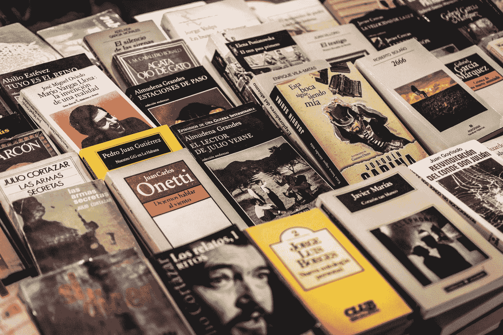

# 开放式人工智能模型学习总结书籍

> 原文：<https://towardsdatascience.com/an-openai-model-learns-to-summarize-books-91b2ec6480f1?source=collection_archive---------16----------------------->

## 这些机器学习模型有什么危害？

照片由[张成浩](https://unsplash.com/@seonghojang95?utm_source=medium&utm_medium=referral)在 [Unsplash](https://unsplash.com?utm_source=medium&utm_medium=referral) 上拍摄

M 任何大型科技公司都在竞相开发通用人工智能(AI)——让他们的模型接近并解决我们给他们的任何问题，无论多么耗时或具有挑战性。这被称为对准问题。

为了测试和扩展一个潜在的解决方案，OpenAI 团队最近训练了一个人工智能模型来递归地总结书籍。通过 [GPT-3](https://openai.com/blog/gpt-3-apps/) 使用自然语言处理可以让你得到任何长度的书的要点。

根据 OpenAI 团队的说法，该模型“在 5%的时间里阅读了该书的人获得了 6/7 的评分(类似于普通人写的摘要)，在 15%的时间里获得了 5/7 的评分。”

使用递归任务分解，每个长文本被分解成越来越小的片段。然后对这些小片段或章节进行总结，然后这些章节总结本身也可以进行总结。然后，人们可以对这些评论提供反馈，以进一步改进模型。

人工智能驱动的摘要是许多未来应用的一个小测试案例，在这些应用中，有监督的机器学习可以扩展到许多困难的任务。

但显然存在一些限制，因为这些模型只能在 5%的时间内达到人类水平的精度。分解方法也可能会遗漏一本书各部分之间的重要联系。而源代码和训练集将不会公开(讽刺的是，鉴于开放的 AI 名称)。

# 有什么坏处呢

据 VentureBeat 报道，谷歌、微软和脸书都在开发类似的工具向用户提供文本摘要。虽然一些个人使用它来与人工智能合作和共同撰写小说，但它也可能导致更多的新闻聚合。谷歌、脸书和一些其他公司现在是互联网其余部分的守门人和仲裁者。

## 新闻与知识的贬值

为了获得广告收入，[新闻公司](https://www.nytimes.com/2019/10/17/opinion/tech-monopoly-democracy-journalism.html)需要根据算法调整他们的文章，确保人们会点击。为了节省成本，公司已经在使用[自动化系统](https://www.forbes.com/sites/cognitiveworld/2019/08/23/ai-making-waves-in-news-and-journalism/?sh=477e04a57748)来收集和组织内容，或者建议头条新闻。这是记者富兰克林·福尔在他的著作《没有头脑的世界:大科技的生存威胁》中的部分论点

> “杂志和报纸过去常常认为自己是某种连贯的东西——一个问题、一个版本、一个机构。不是作为每天在脸书、推特和谷歌上被贩卖的几十个独立作品的出版商。”

即使是有声望的媒体也需要生成*可点击的*故事来生存，并在社交媒体上获得吸引力。新闻正在向数字模式转变，年轻人更有可能通过谷歌或社交媒体获得在线新闻。在最近的一项调查中，42%的 18-29 岁的美国人回答说他们最常从社交媒体上获得新闻。

这些人工智能算法有可能成为总结一天中大量新闻的首选方式，这种风险是合理的。毕竟，这些模型可以被训练成包括一个可点击的标题和搜索引擎优化关键词。虽然这也可能为记者腾出时间从事更激动人心的项目，但这些项目需要更直接的监督和调查。

毕竟，许多潜在的自然语言处理模型是有偏见的，大规模实施这些总结算法可能会有意想不到的伤害。还有一些人担心，新闻采集过程的自动化可能会进一步损害媒体和新闻业的[价值](https://omnisperience.com/2020/12/16/if-tech-journalists-are-an-endangered-species-are-prs-doomed-to-be-dodo-wranglers/)。

## 独家授权强大的工具

还有一个问题是[微软拥有 GPT-3](https://blogs.microsoft.com/blog/2020/09/22/microsoft-teams-up-with-openai-to-exclusively-license-gpt-3-language-model/) 的独家许可，垄断了本可以是开源工具的东西。当一家大公司实现这种垄断时，其他行业也开始依赖它。

以亚马逊为例，它推出了统一价格为 9.99 美元的电子书。然而，阿歇特图书集团进入了一场合同纠纷，因为他们不想随意降低他们所有电子书的成本。作为回应，亚马逊阻止顾客预购任何阿歇特书，损失了大量利润。

亚马逊可以利用这种不可思议的力量，因为他们已经有效地压制了所有的竞争，让许多出版商依赖他们来销售他们的产品。微软将能够通过其独家许可和它认为合适的算法使用来发挥类似的力量。

## GPT-3 的问题

许多研究人员对像 GTP 3 这样的自然语言处理算法提出了合理的批评，指出它们倾向于[种族主义和性别歧视](https://nationalfile.com/groundbreaking-language-model-ai-gpt-3-is-already-racist-sexist-and-antisemitic/)。任何通用的人工智能模型，即使是那些用于总结书籍和信息的模型，在投入使用之前都需要仔细审核。

> “我担心人工智能社区的群体思维、偏狭和傲慢，”前谷歌研究员蒂姆尼特·格布鲁博士[写道](https://www.wired.com/story/google-timnit-gebru-ai-what-really-happened/)。

学习从一套精选的书中总结文章是一个小的、有针对性的目标。但是一次又一次，将类似的语言处理模型运用到互联网上被证明是有问题的。不仅 GPT-3 倾向于种族主义和性别歧视，研究人员还发现这些模特随着年龄的增长变得越来越毒。

书籍、文件和其他任何输入 GPT 3 号的东西都不会被中性编码。许多负责评估算法准确性的人也会加入他们自己的错误和偏见。虽然许多科技公司都有部门来处理这个问题，但它们并不完美。

Timnit Gebru 博士为谷歌工作，研究人工智能的伦理及其偏见。她的工作重点是大型语言模型，包括 GPT-3 和谷歌自己的算法。然而，一群高管希望她在论文通过内部审查程序并提交给会议后收回论文。

在谷歌高管认为该研究不可接受，称其过于黯淡后，她被毫不客气地解雇了。我们如何相信公司会违背自己的财务利益，对他们的技术进行限制和昂贵的修复？我们可以看到，脸书和推特上仍然充斥着反疫苗言论和错误信息。

仅仅因为我们可以用人工智能做一些事情，并不意味着我们不应该事先考虑潜在的后果。在模型被实现并用于我们的日常生活之前，所有这些都要容易得多。向一家公司独家提供这项技术开创了一个有害的先例。

正如我们一次又一次看到的那样，大型科技公司在道德监督方面并不擅长，尤其是如果这损害了它们的财务利益。虽然这项技术本身令人难以置信，但我担心这些算法可能会继续走目前有问题的道路。

*嗨！我曾经是一名研究生和记者，发表了多份科学论文*<https://scholar.google.ca/citations?user=CAQC6BEAAAAJ&hl=en>**研究神经科学和微生物组。如果你想在 Medium 上阅读更多的故事，你可以在这里用* [*会员身份订阅*](https://medium.com/@simonspichak/membership) *。你可以找到我关于媒介、大规模科学、未来主义和耐心的作品。如果你对我的写作感兴趣，你可以在这里阅读更多的*<http://linktr.ee/simonspichak>**或者在我的* [*子专栏*](http://simonspichak.substack.com/) *上注册，获得我的故事的双周刊综述。***