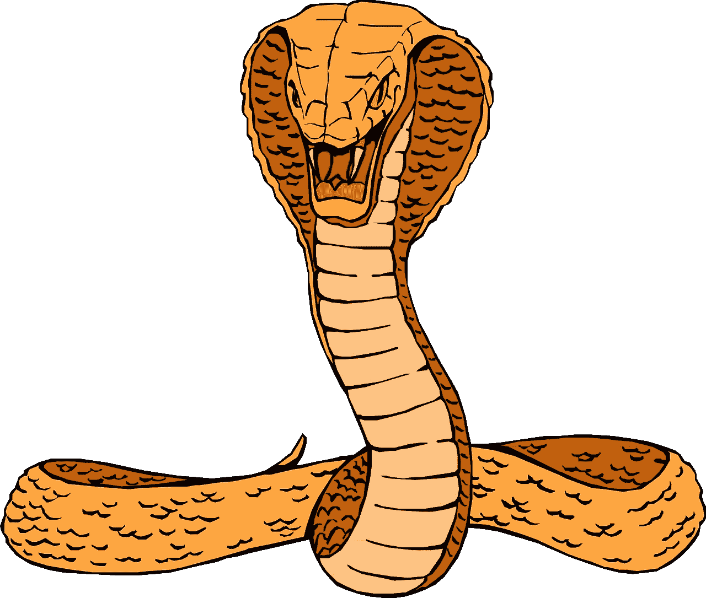
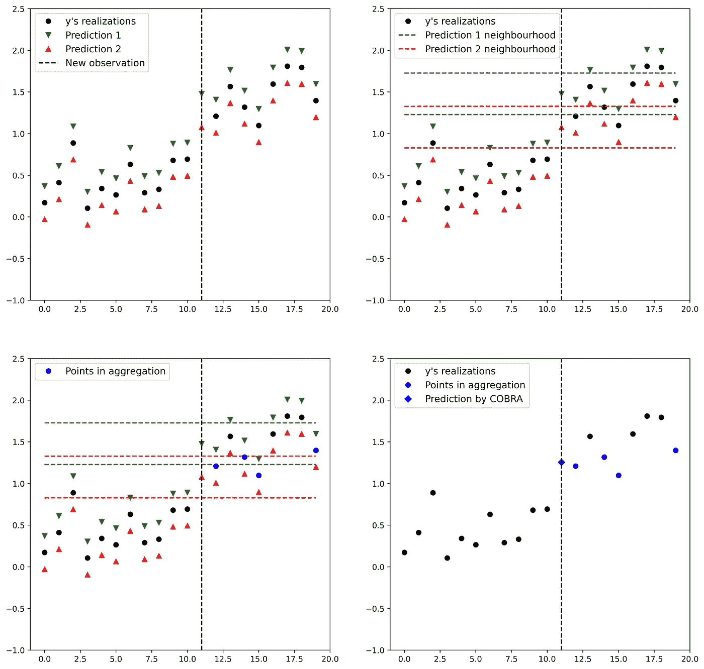
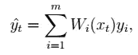
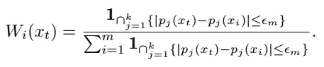

# Python 中组合回归估计量的一种新颖方法

> 原文：<https://towardsdatascience.com/an-original-method-to-combine-regression-estimators-in-python-b9247141263?source=collection_archive---------33----------------------->

## COBRA:一种非线性组合回归策略

来自 [Pixabay](https://pixabay.com/fr/vectors/diriger-serpent-orange-cobra-44803/) 的 [Clker-Free-Vector-Images](https://pixabay.com/fr/users/clker-free-vector-images-3736/) 的图像。

现在数据科学家有很多精确的机器学习算法。但是，选择最佳模型是一项复杂的任务，集成学习已经在实践中证明了它的有效性。在以前的帖子里:“[如何选择最好的模特？](/how-to-choose-the-best-model-cf74bf8015d8)"和[如何处理重叠规则？](/how-to-deal-with-overlapping-rules-16bc0446af66)“我已经提出了专家的聚合理论。一种应该更多地用于集成学习而不是简单平均的理论。在这里，我想把重点放在 COBRA 方法上，在[1]中提出。这种方法对于估计量的组合有一种非常不同的和新颖的方法。*为了简单起见，我不加区分地使用术语估计者、预测模型和专家。事实上，在回归设置中，回归函数的估计量可以用作预测模型，或者它可以用作对每个新观察值进行预测的专家。*

首先，我回顾了专家聚集理论的主要框架。我们有一组专家，他们在每一次 *t* 给我们一个目标 *yₜ.值的预测这个想法是聚集 k 位专家的预测来产生一个聚集预测ŷₜ.*

# COBRA *(组合回归备选)。*

## 用手解释。

通常，在专家聚集理论中，我们使用专家预测的凸组合来做出 *ŷ.*但是眼镜蛇却有着截然不同的做法。它基于与*k-最近邻*算法相似的思想。每次 *t* 我们都有一个新的观测值 *xₜ* ，我们计算 *K* 专家预测*{p₁(xₜ】**p₂(xₜ】*，…*pₖ(xₜ)}*。然后，想法是平均实现 *y* ，**未使用来生成专家**，这些专家在 *{p₁(xₜ)* ， *p₂(xₜ)* ，…， *pₖ(xₜ)}* 的相同邻域(在欧几里德意义上)具有预测。在这些邻域中搜索实现的步骤被称为*共识步骤*。下面的例子将用来说明这个概念。

两个预测因子的 COBRA 聚合。图片来自作者。

在这个例子中，我们有一个横坐标表示的特征 *x ∈ R* 。 *y* 的实现标记为黑色圆圈。我们有两个专家:第一个专家给出红色预测，第二个给出绿色预测。对于新的观测值 *x = 11* ，我们有预测值 *p ₜ* 和 *p ₜ* 。对于每个预测，形成一个邻域，用彩色虚线表示。然后，对邻域中所有预测的所有实现(标记为蓝色圆圈)进行平均，以计算 *ŷₜ* (蓝色菱形)。

## 数学解释。

形式上，COBRA 估计量如下。设 *Dₙ* 为随机变量对*(****x****，y)的 *n* 个独立同分布观测值的一个样本。*样本分为两个独立的样本， *Dₗ* 和 *D* ₘ.然后， *Dₗ* 用于生成一组专家 *{p* ₁， *p* ₂、…*pₖ}*和 *D* ₘ用于计算 *ŷₜ* 、*t41】的组合预测值，用于一次新的观测 *xₜ* 。我们有以下公式*

其中随机重量 *Wᵢ* 采取的形式

*ϵₘ* 是平滑参数。ϵₘ*越大*，这个过程就越宽容。反之，如果 *ϵₘ* 太小，许多专家就被抛弃。因此，其校准是至关重要的一步。为了克服这一步，作者在[1]的第三部分提出了一种数据相关校准。

这些文字表达式表明，COBRA 与其他常用汇总方法的主要区别之一是，COBRA 相对于专家 *{p* ₁、 *p* ₂、…、 *pₖ}.来说是一种非线性方法*否则，从理论的角度来看，COBRA 也满足一个 oracle 界，该界表明，集合预测器的累积损失以专家组的最小累积损失为上界，直到一个向零衰减的残差项。

# Pycobra 图书馆

Pycobra 是在[2]中引入的 Python 开源库。这个库不仅仅是 COBRA 聚合的一个实现。即便如此，用一种叫做 Python 的语言开发一种叫做 COBRA 的算法这一简单事实已经足够了。该库还包括[3]中详述的 EWA 算法(指数加权聚合)，以及受[4]启发的用于分类设置的 COBRA 版本 *ClassifierCobra* 。这个包还包括一些可视化工具来衡量专家的表现。此外，一类*诊断*允许比较组成专家的不同组合和数据分割，以及其他基本参数。它允许更好的参数分析。最后，这个库可以在 GitHub [这里](https://github.com/bhargavvader/pycobra)找到。

# 结论

COBRA 是一种新颖的非线性集成学习方法，具有理论保证。第一篇论文的主要作者仍在致力于开发一个更好的版本，正如最近介绍内核版本的论文所示[5]。此外，该算法在开源 Python 库中可用，因此没有理由不在您的下一个数据科学项目或 Kaggle 挑战赛中尝试一下。

# 关于我们

[Advestis](https://www.advestis.com/) 是一家欧洲合同研究组织(CRO ),对统计学和可解释的机器学习技术有着深刻的理解和实践。Advestis 的专长包括复杂系统的建模和时间现象的预测分析。

*领英*:[https://www.linkedin.com/company/advestis/](https://www.linkedin.com/company/advestis/)

# 参考

[1] G.Biau，A.Fischer，B.Guedj & J.D.Malley [COBRA:一种组合回归策略](https://www.sciencedirect.com/science/article/pii/S0047259X15000950)。*多元分析杂志*146(2016):18–28。

[2] B.Guedj 和 B.Srinivasa Desikan [Pycobra:用于集成学习和可视化的 python 工具箱](https://www.jmlr.org/papers/volume18/17-228/17-228.pdf)。*机器学习研究杂志*18.190(2018):1–5。

[3] A. S.Dalalyan 和 A.B.Tsybakov [通过指数加权和夏普甲骨文不等式进行聚合](https://citeseerx.ist.psu.edu/viewdoc/download?doi=10.1.1.106.9082&rep=rep1&type=pdf)。*计算学习理论国际会议*(2007):97–111。

[4] M.Mojirsheibani [通过离散化组合分类器](https://www.tandfonline.com/doi/abs/10.1080/01621459.1999.10474154)。*美国统计协会杂志* *94。446 (1999 年):600–609。*

[5] B.Guedj 和 B . s . desikan .[Python 中基于内核的集成学习](https://www.mdpi.com/2078-2489/11/2/63)。*信息* 11，2 号(2020): 63。