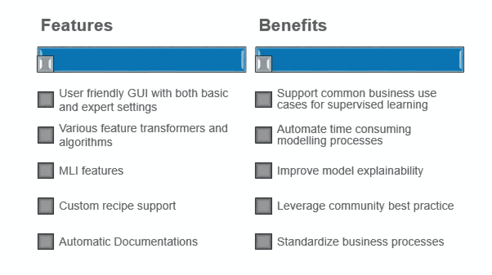
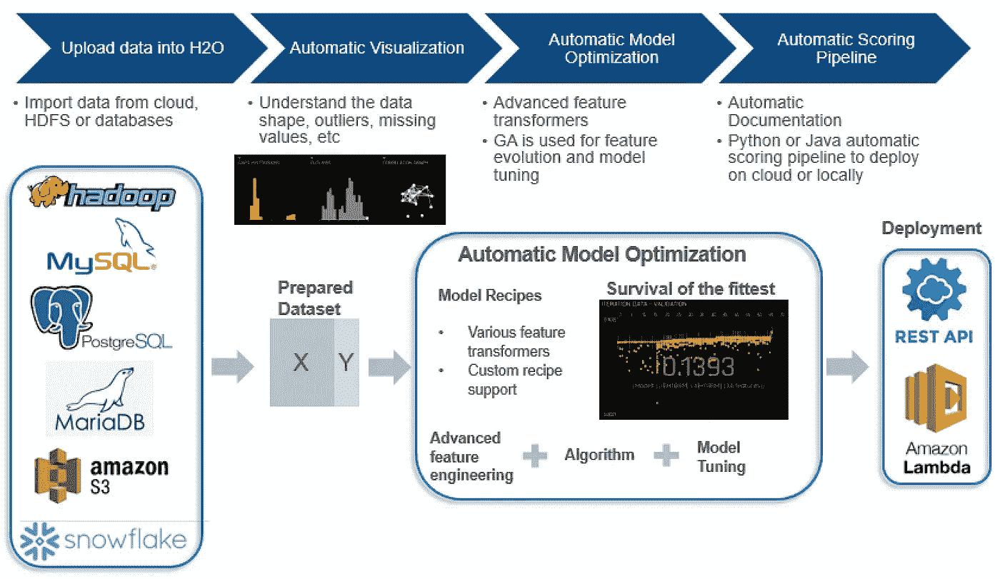
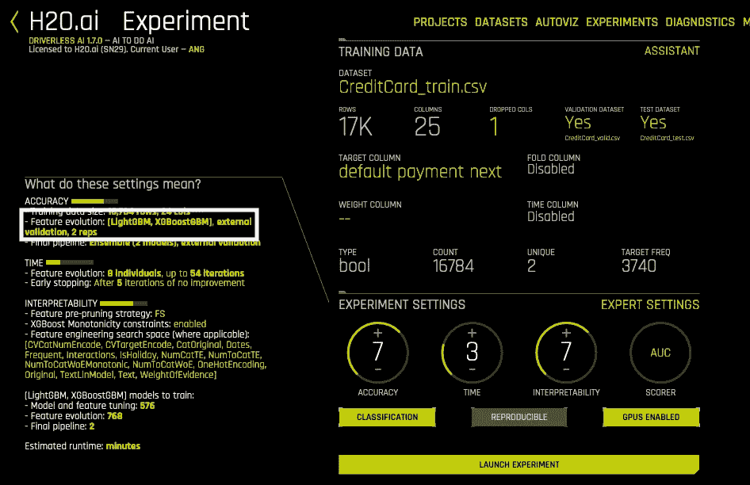
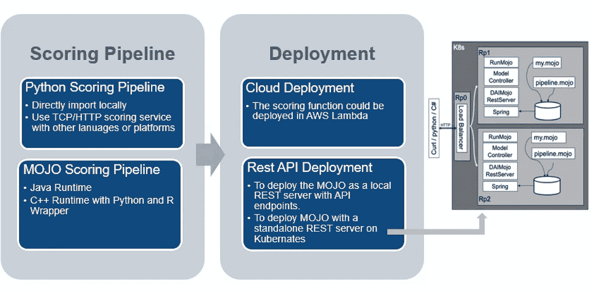

# 你应该选择 H2O 无人驾驶人工智能作为你的建模方案吗？

> 原文：<https://towardsdatascience.com/an-overview-for-h2o-driverless-ai-ee1a4502f7e7?source=collection_archive---------29----------------------->

## 对 DAI 主要功能的全面概述，以及我对此 AutoML 工具的评论和建议

阿瑟尼·托古列夫在 [Unsplash](https://unsplash.com/s/photos/machine-learning?utm_source=unsplash&utm_medium=referral&utm_content=creditCopyText) 上的照片

自动机器学习(AutoML)已经成为当今数据科学领域越来越热门的话题。许多人会对“自动构建模型”的概念着迷，在这种情况下，人们可以简单地将数据输入某个 AutoML 工具包，然后在几分钟内准备好 ML 模型进行部署。—但事实是这样吗？带着这个问题，我开始研究市场上可用的 AutoML 解决方案。

AutoML 领域有相当多的参与者，包括 Google 和 IBM 等大牌公司，以及各种正在提供其独特的 Auto ML 解决方案的初创公司。

在所有参与者中， [H2O.ai](https://www.h2o.ai/) 和 [DataRobot](https://www.datarobot.com/sg/) 是其中最受欢迎的，因为它们的解决方案非常成熟，并且能够灵活地与客户现有的数据生态系统集成。

在这篇文章中，我对来自 H2O.ai 的 AutoML 解决方案进行了初步研究，名为无人驾驶 ai(戴)，我很乐意分享我在这一过程中的一些学习。

# 戴的主要特征

H2O 戴提供了几个给用户带来好处的关键特性。

**1。用户友好的图形用户界面**

H2O 戴有一个非常用户友好的图形用户界面与基本和专家设置，使其既适用于一般的商业用户和有经验的数据科学家。

**2。各种特征转换器和 ML 算法支持**

H2O 戴支持各种特征转换器和 ML 算法。最重要的是，特征选择和模型超参数调整过程都是在流水线中自动完成的。

**3。MLI(机器学习可解释性)功能**

随着对可解释人工智能需求的增加，H2O 提供的 MLI 函数在某些用例中可能会有所帮助。H2O 戴提供了几个选项来增加复杂模型的透明度和问责制，包括留一个协变量(LOCO)局部特征重要性，部分依赖图，决策树代理模型等。关于 MLI 的更多细节，你可以参考[本文档](https://www.h2o.ai/wp-content/uploads/2017/09/MLI.pdf)。

**4。自定义配方支持**

没有一个工具可以涵盖所有潜在的用例，因此定制的灵活性很重要。启用自定义配方功能后，用户可以自由地将自定义算法或计分器代码脚本上传到 H2O 戴，用于模型训练。

**5。自动文档**

对于严格监管环境下的模型应用而言，这是一个理想的特性，通常必须详细记录特性选择、参数调整步骤。有了 Auto-doc 功能，一些信息可以被自动捕获，从而为以后的文档工作节省了大量时间。

戴的特色和优点(图片由作者提供)

# 戴造型工作流程

H2O 戴的一般工作流程类似于常规的模型建立过程。下图显示了整体工作流程:

戴造型工作流程(图片由作者提供)

**1。将数据导入 H2O** :

首先，用户需要将数据导入到戴。数据导入实际上有很多选择，包括像亚马逊 S3 这样的云数据源，MySQL 和 MariaDB 这样的关系数据库连接，以及像 HDFS 这样的分布式文件系统。

另一方面，在将数据导入 H2O 之前，一定程度的特征工程工作可能仍然是必要的。虽然在进入建模步骤之前，戴会应用一些高级数据清理操作，但是做一些健全性检查仍然是有价值的。例如，您可能希望基于业务理解删除某些特性，或者您希望在将数据输入到 DAI 之前自己进行上采样或下采样，等等。

**2。数据可视化**:

将数据上传到 H2O 戴后，有几个选项可以帮助用户了解数据，包括自动可视化、数据汇总(每个要素的最小值、最大值、缺失值等指标)。这个特性也可以作为健全性检查

步骤来确认是否有丢失值百分比很高的要素，或者某些要素是否彼此高度相关。

**3。自动模型优化**:

在这一阶段，戴将基于实验设置(稍后有更多细节)对特征、特征变换器和 ML 模型的不同组合运行遗传算法，并最终记录下最佳执行模型。

**4。模型文档和部署**:

在戴完成建模过程后，将生成模型文档来记录关键的建模步骤。在模型部署方面，H2O 可以用 Java 和 Python 自动生成评分管道，部署在 REST API 框架下。也有将模型直接部署到云平台的选项，比如 Amazon Lambda。

# H2O 实验配置

在戴建立良好模型的关键步骤之一是在实验配置页面下进行适当的选择。如下图所示，用户需要输入一些参数，包括训练/测试数据选择、目标变量选择等。在配置页面中有三个主要的调节旋钮，它们将在很大程度上决定最终模型是什么样的，它们是准确性、时间和可解释性。对于每个旋钮，用户可以从 1 到 10 中选择其值。

戴配置页面(图片来自[和](https://s3.amazonaws.com/artifacts.h2o.ai/releases/ai/h2o/dai/rel-1.7.1-36/docs/userguide/custom-recipes-h2o-3-algos.html))

## 1.精确度:

调整精度旋钮值时，戴表演《进化》和《合奏》的方式也会随之调整。对于低精度值，用户通常期望单个模型作为最终输出，而对于较高精度，每个独立模型将独立发展，然后成为最终集合模型的一部分。与此同时，戴也将使用更高数量的折叠验证，以获得更好的模型概括。

## 2.时间:

顾名思义，它用于配置用户给戴运行优化的时间。为时间旋钮配置更高的值，将进行更多的训练和验证迭代。

## **3。可解释性**

可解释性将在很大程度上决定最终模型的复杂性。在配置了较高的可解释性值的情况下，最终模型倾向于具有较低的级别或不进行集成，并且倾向于使用更基本的特征变换器和 ML 模型。

关于如何改变每个旋钮值的更多细节，你可以参考官方文件[这里](https://docs.h2o.ai/driverless-ai/latest-stable/docs/userguide/experiment-settings.html)。需要注意的一点是，三个旋钮值并不是严格相互独立的。例如，准确性和可解释性旋钮值将决定最终模型中的整体效果。因此，这里没有关于如何选择最佳旋钮值的金科玉律——最有可能的是这里预期的一些尝试和错误。幸运的是，H2O 通过给出一个预览部分让这一步对用户来说更加直观(如前面的图表所示，“这些设置是什么意思？”在左手边)它将为用户提供一个更高层次的概述，当改变每个旋钮值时，最终模型中会出现什么。

## 4.专家设置

如果你想在使用什么特征转换器，或者为最终模型选择什么评分器方面有更多的灵活性，戴在“专家设置”页面下提供了选项。在这个页面中，用户可以更加定制地选择包含哪些特性的 transformers，使用哪些 ML 模型，甚至加载一些预先训练好的神经网络模型来完成 NLP 相关的任务。简而言之，如果用户以前在模型构建方面有一些经验，专家设置可能会更有用。

# 戴模型部署

获得模型后，下一步就是部署并在生产中投入使用。H2O 戴确实可以选择导出 Python 和 MOJO(优化的模型对象)形式的评分管道。

python 评分管道是 ML 模型的一个更直接的扩展，您可以选择在本地部署它以进行测试，也可以为其他语言和平台使用 TCP/HTTP 评分服务。

MOJO 评分管道利用了 MOJO，这是 POJO 的 H2O 优化版本。当处理更大的数据集和更复杂的模型时，MOJO 对象通常消耗更小的磁盘空间，具有更好的速度性能。可以在 Java 程序中自然使用，但用户也可以使用 R/Python 调用 MOJO 对象进行预测。

有了评分管道，就有了在云中部署模型的选项(AWS Lambda 是 H2O 推荐的选项)，但更受欢迎的选项可能是使用 MOJO 部署 REST API。然而，可能仍然需要一些人工日来将模型集成到生产中——因此在某种意义上，模型部署部分还没有被戴完全自动化。

H2O 戴模型部署选项(图片由作者提供)

# 需要注意的事项

我曾经尝试用戴建立模型，并将其性能与手工建立的模型进行比较。一般来说，如果配置得当，H2O 戴在大多数使用案例中即使不能获得更好的性能，也能获得与之相当的性能。事实上，H2O 戴包括各种 ML 模型、特征转换器，并且可以运行通过特征、模型和超参数的如此多的不同组合，并且集合最佳执行模型以进一步提高模型分数。因此，从统计上看，在大多数情况下，戴确实显示出获得更好预测分数的优势。

话虽如此，但在考虑使用这个 AutoML 工具包进行生产时，仍有一些地方需要注意。仅举几个例子:

**1。注意那些不自动化的事情**:

虽然戴已经很好地自动化了许多耗时的建模过程，但仍有一些事情需要用户手动处理。

一个例子可能是特征工程部分，尽管在 H2O 有相当多的特征转换器，它们可能不会恰好覆盖你所需要的。因此，我相信类似于建立常规模型，

数据清理和特征工程仍然是重要的步骤，甚至与 H2O 戴。

**2。当业务理解和可解释性很重要时**:

当戴在内部进行计算时，优化纯粹是通过统计地改进得分函数来驱动的。可能会有这样的情况，一个特性转换器得到应用，并导致模型分数的整体提高，但是从业务角度来看，这可能没有多大意义。

例如，戴可能会选择对代表过去三个月客户交易计数的变量应用对数转换—从业务角度来看，该功能有意义吗？这个问题没有严格的正确或错误的答案，但是必须与相关的涉众保持一致，特别是对于那些通常对“自动过程”更加保守的模型评审者。

**3。生产仍需额外努力**:

模型部署和监控是 ML 建模生命周期中的另一个关键部分。正如我们前面提到的，虽然 H2O 戴可以自动生成评分管道，但仍有一些集成

在将它投入生产之前需要做的工作，比如使用评分管道设置 REST API，与本地数据库建立数据连接，设置跟踪系统以定期监控模型性能，等等。目前，所有这些步骤仍需要在戴以外的地方进行规划和测试。

话虽如此，戴却是一路快速进化。如果给一些时间，上述一些问题能够得到解决或显著改善，我不会感到惊讶。

# 有用的参考资料

[戴官网](http://docs.h2o.ai/h2o/latest-stable/h2o-docs/index.html)是一个很好的入门工具。如果你想在购买许可证前亲自体验戴，一旦你注册，还提供 21 天的免费试用。

另一个对我帮助很大的文档是[戴文档](http://docs.h2o.ai/driverless-ai/latest-stable/docs/userguide/UsingDriverlessAI.pdf)的 PDF 版本。它包含或多或少与在线用户手册相似的内容，但我觉得它在如何更系统地理解和学习 H2O 方面给出了一个更结构化的观点。

我希望这篇文章可以帮助那些对戴作为潜在的 AutoML 解决方案感兴趣的人。感谢阅读！