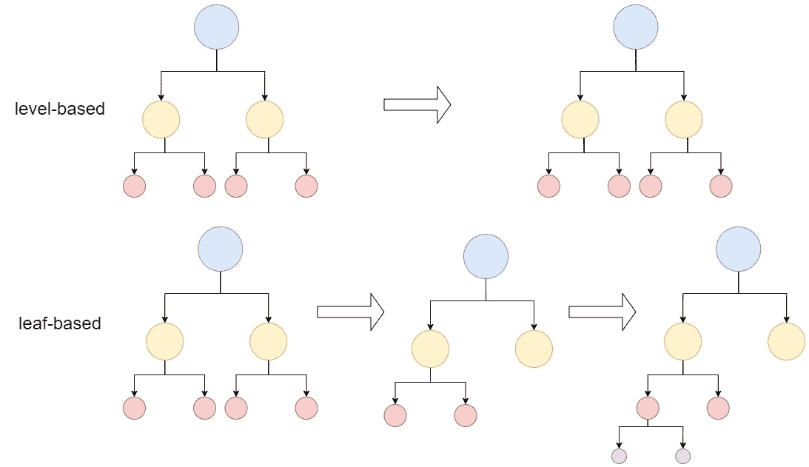
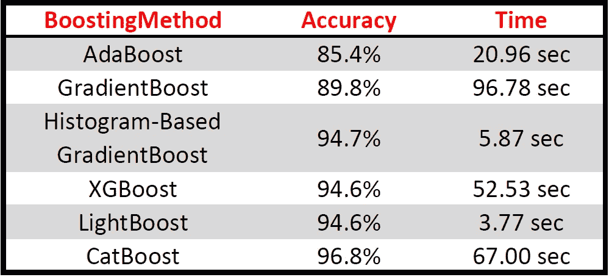

# 增强方法概述:CatBoost、XGBoost、AdaBoost、LightBoost、基于直方图的梯度增强

> 原文：<https://towardsdatascience.com/an-overview-of-boosting-methods-catboost-xgboost-adaboost-lightboost-histogram-based-gradient-407447633ac1?source=collection_archive---------22----------------------->

## 用 python 实现在一个视图中编译所有 boosting 方法

```
***Table of Contents*****1\. Introduction
2\. AdaBoost
3\. Gradient Boost
3.1\. XGBoost
3.2\. Histogram-Based Gradient Boost
3.3\. LightBoost
3.4\. CatBoost
4\. Summary**
```


扎克·赖纳在 [Unsplash](https://unsplash.com?utm_source=medium&utm_medium=referral) 上的照片

# 1.介绍

在集成学习中，目标是用多种学习算法最成功地训练模型。在集成学习之一 Bagging 方法中，多个模型被并行应用于同一数据集的不同子样本。Boosting 是另一种方法，在实践中经常使用，它按顺序而不是并行建立，旨在训练算法和训练模型。弱算法训练模型，然后根据训练结果重新组织模型，使模型更容易学习。然后，这个修改后的模型被发送到下一个算法，第二个算法比第一个算法更容易学习。本文包含不同的增强方法，从不同的角度解释了这种顺序方法。

# **2。AdaBoost**

自适应增强(Adaboost)是一种广泛使用的基于决策树桩*的增强方法(决策树桩:分配阈值，根据阈值进行预测。)*。但是这种方法在 Adaboost 中并不是盲目重复的。构建了多种算法，这些算法依次更新它们的权重，并在做出最准确的估计时扮演单独的角色。在每个算法中计算错误率。权重被更新，因此被引用到第二算法。第二种算法对模型进行分类，像第一种模型一样更新权重，并将其转移到第三种算法。这些过程一直持续到 n 个估计量或达到误差=0。在此过程中，该算法使分类更容易和更成功，因为权重由前一算法更新并发送到另一算法。让我们用一个例子来解释这个复杂的顺序算法过程:

假设有两个标签，*红色*和*蓝色*。第一种算法(弱分类器 1)分离标签，结果是 2 个蓝色样本和 1 个红色样本被错误分类。**增加这些错误分类的权重**，之后降低正确分类的权重，发送到下一个模型学习。与以前的算法相比，新模型学习起来更容易，在新模型中，以前的模型错误分类的样本具有增加的偏差，而正确分类的样本具有减少的偏差。在接下来的步骤中重复相同的过程。总之，强分类是在弱分类的配合下发生的。因为它用于分类，所以也可以通过导入 *AdaBoostRegressor* 用于回归。

**超参数**

所有超参数均可在 sklearn [网站](https://scikit-learn.org/stable/modules/generated/sklearn.ensemble.AdaBoostClassifier.html)上获得。总结一下:

*   ***base _ estimators:***一种顺序改进的算法(默认为决策树分类器)
*   ***n _ estimators:***确定上述过程将采取的最大步骤数。(默认值=50)
*   ***学习 _ 速率:*** 决定了权重的变化量。如果选择过小，n_estimators 值必须很高。如果选择得太大，它可能永远达不到最佳值。(默认值=1)

导入了将用于所有方法的数据集，现在让我们实现 Adaboost:

# 3.梯度增强

Adaboost 通过用决策树桩(1 个节点分成 2 片叶子)更新权重来改进自己。梯度增强，另一种顺序方法，通过创建 8 到 32 片叶子来优化损失，这意味着树在梯度增强中更大*(损失:记住线性模型中的残差。(y_test-y_prediction)给出残差，每个数据点的平方和给出损失。为什么应用正方形？因为我们寻找的值是预测与实际结果的偏差。负值被平方，因为它们将使损失值变小，即使它偏离)*。简而言之，通过使残差值更接近 0，残差值被转移到下一个算法，从而最小化损失值。

与 Adaboost 一样，梯度增强可通过导入 *GradientBoostRegressor* 用于回归。

```
OUT[0.22686585533221332,0.20713350861706786,0.1900682640534445,
 0.1761959477525979,0.16430532532798403,0.1540494010479854,
 0.14517117541343785,0.1375952312491854,0.130929810958826,
 0.12499605002264891,0.1193395594019215,0.11477096339545599,
 0.11067921343289967,0.10692446632551068,...................
 ...........................................................
 0.05488031632425609,0.05484366975329703,0.05480676108875857,
 0.054808073418709524,0.054740333154284,0.05460221966859833,
 0.05456647041868937,0.054489873127848434,0.054376259548495065,
 0.0542407250628274]
```

查看 Error_list，可以看到每一步损失值都在变小。[从 0.22 开始，到 0.05 结束]

## 3.1.XGBoost

XGBoost(代表极端梯度增强)最初是由陈天琦在 2014 年开发的，在梯度增强之前速度快得多，因此它是首选的增强方法。由于它包含超参数，可以进行许多调整，如正则化超参数，以防止过度拟合。

**超参数**

*   ***learning _ rate&eta:***乘以权重值使用。其目的是通过安排特征权重使过程更保守。默认值=0.3，通常使用 0.01–0.3。
*   ***max_depth:*** 树的最大深度。如果该值增加，模型可能会过度拟合。默认值=6 且仅当`growing_policy=lossguide`、`max_value=0`时。请查看增长政策。
*   ***n _ estimators:***集合树的数量
*   ***alpha:*** L1 正则化在权重上。鼓励小重量。默认值=1。
*   ***gamma:*** 正则化复杂度的超参数之一，在一片叶子中发生分裂所必需的最小损失。默认值=0，较大的灰度系数使模型更加保守。
*   ***λ:***L2 正则化在权数上。鼓励小重量。默认值=1。
*   ***子样本:*** 将训练多少个数据样本？默认值=1 表示 100%百分比，如果设置为 0.5，则随机选择 50%的数据。
*   ***col sample _ bytree:***构造每棵树时列的子采样比。默认值=1。对于每个构建的树，进行一次子采样。
*   ***col sample _ by level:***每个级别的列的子样本比率。默认值=1。对于树中达到的每个新的深度级别，进行一次子采样。从为当前树选择的列集中对列进行子采样。
*   ***col sample _ node:***每个节点列的子样比率。每次评估新的分割时，进行一次子采样。从为当前级别选择的列集中对列进行子采样。
*   ***min _ child _ weight:***用于控制过拟合。过高的值会导致拟合不足。默认值=1。
*   ***grow_policy:*** 控制新节点添加到树中的方式。在 LGBM 发布后，它被添加到 XGBoost 中。由于 LGBM 的高速度(由于 wise-leaf)，它被添加到 XGBoost 与 wise-leaf 的工作中。为了激活它，`grow_policy=lossguide`，默认=depthwise
*   ***目标:*** 指定学习任务。*‘regsquarederror’*:平方损失回归；*‘reg logist’*:logistic regression 等。
*   ***eval _ metric:***test _ data(validation _ data)的评估度量。*‘RMSE’*:均方根误差；*‘Mae’*:平均绝对误差，*‘mape’*:平均绝对百分比误差。

更可在此 [**链接**](https://xgboost.readthedocs.io/en/latest/parameter.html) **。**

## 3.2.基于直方图的梯度增强

用宁滨(离散化)对数据进行分组，这是一种数据预处理方法，这里</an-overview-of-data-preprocessing-features-enrichment-automatic-feature-selection-60b0c12d75ad>****已经解释过了。**例如，当给定‘年龄’列时，将这些数据分为 30–40、40–50、50–60 三组，然后将其转换为数值数据，这是一种非常有效的方法。当这种宁滨方法适用于决策树时，通过减少特征的数量，它加快了算法的速度。这种方法也可以通过用直方图对树进行分组而在每个树的构造中用作集成。scikit 学习库提供的方法:**

## **3.3.光增强**

**LGBM(代表轻度梯度增强机器)最初由微软在 2017 年发布，是用户首选的另一种梯度增强方法，并且是基于决策树的。与其他方法的关键区别在于，它基于树叶对树进行拆分，即可以检测和停止点拍所需的单元(记住:其他的是基于深度或基于级别的)。由于 LGBM 是基于叶子的，如图 2 所示，LGBM 是一种非常有效的方法，可以减少误差，从而提高精度和速度。您可以使用特殊算法拆分分类数据，但是必须输入一个整数值，如 index，而不是列的字符串名称。**

****

**图二。基于层与基于叶，按作者排序的图像**

## **3.4.CatBoost**

**CatBoost 是 Yandex 在 2017 年开发的。由于它通过一次热编码将所有分类特征转换为数字，因此其名称来自于**Cat**egorical**Boost**ing。应该输入索引值，而不是 but 列的字符串名称。它还处理缺失的数值。它也比 XGBoost 快得多。与其他增强方法不同，Catboost 与**对称树**不同，后者在每一层的节点中使用相同的分裂。**

**XGBoost 和 LGBM 计算每个数据点的残差，并将模型训练为具有残差目标值。它重复这个迭代次数，从而训练和降低残余误差，达到目标。由于这种方法应用于每个数据点，它可能在泛化方面较弱，并导致过拟合。**

**Catboost 还计算每个数据点的残差，并对用其他数据训练的模型执行此操作。以这种方式，为每个数据点获得不同的残差数据。将这些数据作为目标进行评估，并根据迭代次数训练通用模型。由于许多模型将通过定义来实现，这种计算复杂性看起来真的很昂贵，并且花费太多时间。但是在有序升压的情况下，它在更短的时间内完成。**有序提升**，而不是从第(n+1)个数据点计算的残差开始。就是指数据点的残差。为了计算第(n+2)个数据点，应用第(n+1)个数据点，等等。**

****超参数****

*   *****l2_leaf_reg:*** L2 代价函数的正则化项。**
*   *****学习 _ 速率:*** 渐变步长。在过度拟合的情况下降低学习率。**
*   *****深度:*** 树的深度，大多用在 6-10 之间。**
*   *****one _ hot _ max _ size:***用小于或等于给定参数值的几个不同值对所有分类特征进行 one-hot 编码**
*   *****grow_policy:*** 决定建筑类型的树。可以使用 SymmetricTree、Depthwise 或 Lossguide。**

# **4.摘要**

**在这篇文章中，boosting 方法是通过决策树来实现的，但是通过改变相关的超参数，可以很容易地实现其他机器学习模型。此外，所有 boosting 方法都应用了基本版本(未调整任何超参数)来比较 boosting 方法的性能，上面应用的代码列表如下:**

****

**增强方法的比较，图片由作者提供**

> **在以后的文章中，我们将通过优化超参数来更深入地探讨每种提升方法。**

# **参考**

*   **[https://stack overflow . com/questions/50087526/catboost 算法中对称树背后的直觉是什么](https://stackoverflow.com/questions/50087526/what-is-the-intuition-behind-symmetric-trees-in-catboost-algorithm)**
*   **[https://catboost . ai/docs/concepts/python-reference _ parameters-list . html](https://catboost.ai/docs/concepts/python-reference_parameters-list.html)**
*   **[https://csiss.org/SPACE/workshops/2004/SAC/files/fisher.pdf](https://csiss.org/SPACE/workshops/2004/SAC/files/fisher.pdf)**
*   **【https://xgboost.readthedocs.io/en/latest/parameter.html 号**

## **回到指引点击[这里](https://ibrahimkovan.medium.com/machine-learning-guideline-959da5c6f73d)。**

**<https://ibrahimkovan.medium.com/machine-learning-guideline-959da5c6f73d> **