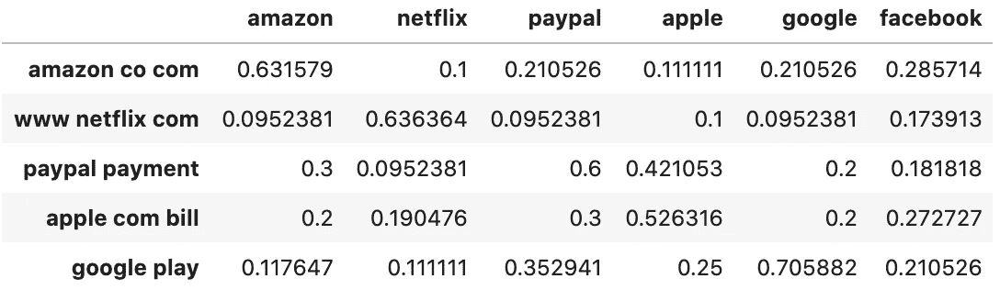
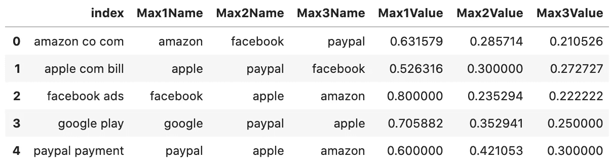
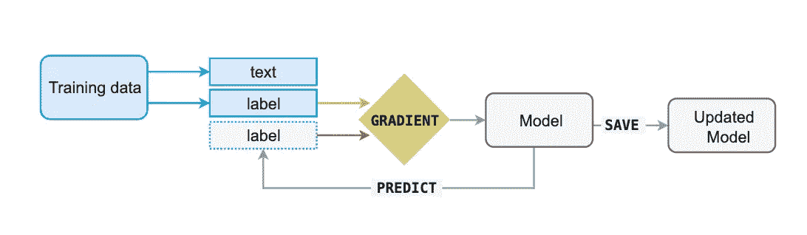
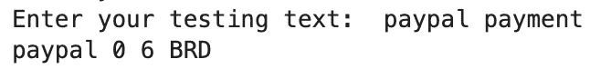
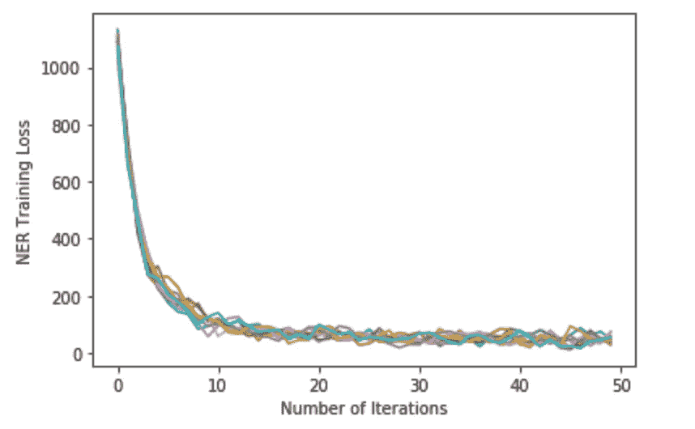
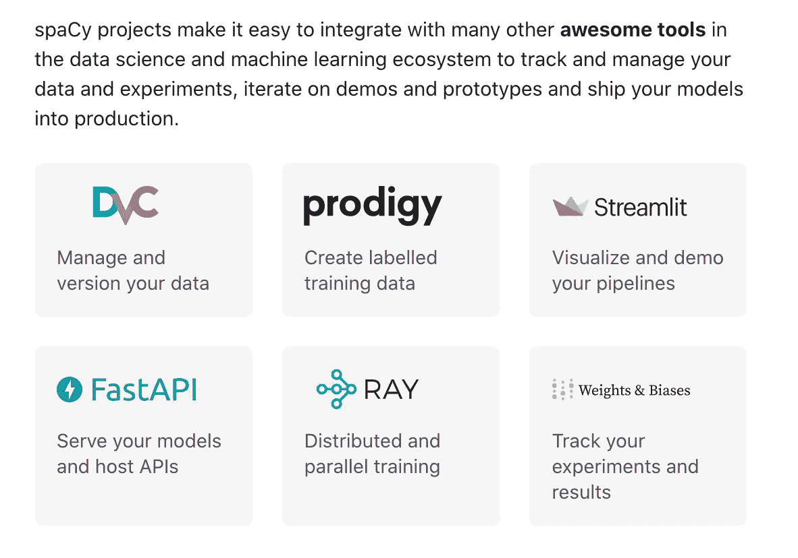
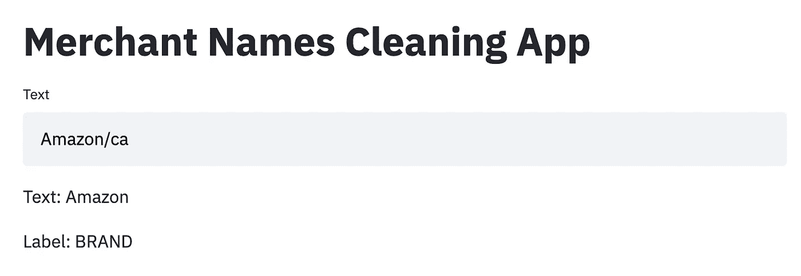

# 使用 SequenceMatcher 和 spaCy 构建商家名称清理引擎概述

> 原文：<https://towardsdatascience.com/an-overview-of-building-a-merchant-name-cleaning-engine-with-sequencematcher-and-spacy-9d8138b9aace?source=collection_archive---------10----------------------->


照片由[米科拉·马赫莱](https://unsplash.com/@ko1unb?utm_source=medium&utm_medium=referral)在 [Unsplash](https://unsplash.com?utm_source=medium&utm_medium=referral) 上拍摄

# 问题陈述

商家名称清理可能是一个相当具有挑战性的问题。由于不同的银行提供不同质量的交易数据，没有一个非常成熟的方法来清理数据。通常，商家名称清理可以被分类为**命名实体识别** (NER)任务，并且以与实体提取问题类似的方式来解决。

对于一家金融科技公司来说，商户名称清理步骤非常重要，因为开发人员需要利用这些从原始混乱的交易数据中清理出来的商户名称来生成正确的**交易分类**，以便在管理个人金融方面提供更好的客户体验。

我发现这个话题非常有趣，我已经搜索了几个星期的资源，用我自己的基本解决方案写了这个概述。因此，我希望我对这个话题的一些想法能够对读者有所帮助，以更好地解决这个商家名称清理问题。

如果你正在寻找更多关于这个主题的阅读资料，欢迎你查看本文末尾的参考书目**。**

# 工程计划

对于一个基本的商家名称清洗引擎，我计划将其分为三层:

*   第一层:删除特殊字符和数字，并转换大小写。
*   第二层:根据相似性得分返回名称匹配。
*   第三层:训练一个空间模型来检测模式和清理输入。

这个项目的工具包包括 python 中的**正则表达式**运算、**FuzzyWuzzy/sequence matcher***(库)以及 spaCy 模型算法中的一些知识。*

*随着阅读的进行，我也会分享一些我觉得有帮助的相关阅读。*

# *第一层:预处理步骤*

## *删除特殊字符和数字:*

*删除所有特殊字符和数字将是该项目的第一步。这很有用，因为当我们试图查找商家名称匹配和计算相似性分数时，特殊字符和数字通常会增加复杂性。完全删除所有特殊字符和数字可能有点激进。但是，考虑到有数千个原始商家名称的数据集，您可能会发现大多数特殊字符和数字都可以删除，而不会影响商家名称中的任何关键字。*

*借助 Python [**Re**](https://docs.python.org/3/library/re.html) 库，可以高效地完成特殊字符和数字的删除。一些必备知识是 Python 中的[**正则表达式**](https://github.com/python/cpython/blob/3.9/Lib/re.py) 。*

*[](https://medium.com/better-programming/introduction-to-regex-8c18abdd4f70) [## 正则表达式简介

### 使用 Python 逐步介绍正则表达式

medium.com](https://medium.com/better-programming/introduction-to-regex-8c18abdd4f70)  [## Python 正则表达式

### 正则表达式可以被认为是指定文本模式的小型语言

medium.com](https://medium.com/@devopslearning/python-regular-expression-8ee28d35f3a7) 

## 案例转换

通过成功完成上述步骤，您现在拥有了一个仅包含字母的商家名称数据集。但是，您可能仍然会发现一些商家名称的大小写不同，例如“amazon”、“Amazon”或“AMAZON”。要转换案例，可以在以下文章中找到一些有用的字符串函数:

[](/useful-string-functions-that-few-people-use-in-python-5a071fb0cbd1) [## Python 中很少有人使用的有用的字符串函数

### 如果 Python 提供的话就不要重新发明轮子了！

towardsdatascience.com](/useful-string-functions-that-few-people-use-in-python-5a071fb0cbd1) 

# 第二层:计算相似性得分表

对于这一层，我们的主要目标是计算一个相似性得分表，并返回具有前 3 个最大相似性得分的匹配名称。这是一个有用的方法来清理商家名称，假设你已经有一个匹配的名称目录，并且原始输入不是杂乱的。

## 相似性度量

FuzzyWuzzy 是一个 Python 库，它使用 [**Levenshtein 距离**](https://en.wikipedia.org/wiki/Levenshtein_distance) 来计算一个简单易用的包中序列之间的差异。

[](https://github.com/seatgeek/fuzzywuzzy) [## seatgeek/fuzzywuzzy

### 像老板一样的模糊字符串匹配。它使用 Levenshtein 距离来计算序列间的差异

github.com](https://github.com/seatgeek/fuzzywuzzy) 

使用 FuzzyWuzzy 的一些实例如下:

*   简单比率

```
>>> fuzz.ratio("this is a test", "this is a test!")
    97
```

*   部分比率

```
>>> fuzz.partial_ratio("this is a test", "this is a test!")
    100
```

*   令牌排序比率

```
>>> fuzz.ratio("fuzzy wuzzy was a bear", "wuzzy fuzzy was a bear")
    91
>>> fuzz.token_sort_ratio("fuzzy wuzzy was a bear", "wuzzy fuzzy was a bear")
    100
```

*   令牌集比率

```
>>> fuzz.token_sort_ratio("fuzzy was a bear", "fuzzy fuzzy was a bear")
    84
>>> fuzz.token_set_ratio("fuzzy was a bear", "fuzzy fuzzy was a bear")
    100
```

[](/natural-language-processing-for-fuzzy-string-matching-with-python-6632b7824c49) [## 用 Python 实现模糊字符串匹配的自然语言处理

### 在计算机科学中，模糊字符串匹配是一种寻找与模式近似匹配的字符串的技术…

towardsdatascience.com](/natural-language-processing-for-fuzzy-string-matching-with-python-6632b7824c49) [](/string-matching-with-fuzzywuzzy-e982c61f8a84) [## 用 FuzzyWuzzy 进行字符串匹配

### 本教程将介绍如何通过相似性来匹配字符串。FuzzyWuzzy 可以节省你大量的时间…

towardsdatascience.com](/string-matching-with-fuzzywuzzy-e982c61f8a84) 

或者，[**sequence matcher**](https://github.com/python/cpython/blob/master/Lib/difflib.py)也是一个常用于计算输入之间相似性的伟大工具。

> 基本思想是找到不包含“垃圾”元素的最长连续匹配子序列。然后，相同的思想被递归地应用于匹配子序列的左边和右边的序列片段。这不会产生最少的编辑序列，但会产生对人们来说“看起来正确”的匹配。

```
>>> s = SequenceMatcher(lambda x: x == " ", 
"private Thread currentThread;", 
"private volatile Thread currentThread;")  

>>> .ratio() returns a float in [0, 1], measuring the "similarity" of the sequences.  As a rule of thumb, a .ratio() value over 0.6 means the sequences are close matches>>> print(round(s.ratio(), 3))    
0.866
```

[](/sequencematcher-in-python-6b1e6f3915fc) [## Python 中的序列匹配器

### 一个人性化的最长连续无垃圾序列比较器

towardsdatascience.com](/sequencematcher-in-python-6b1e6f3915fc) 

## 定制相似性函数&计算相似性表

对我来说，我选择 SequenceMatcher 作为评价相似性的度量。如果您选择 FuzzyWuzzy 库，过程将是相似的。

```
# define a function to calculate similarity between input sequences
def similarity_map(word1, word2):

    seq = difflib.SequenceMatcher(None,word1,word2) d = seq.ratio()

    return d
```

上面的定制函数将两个序列作为输入，并返回相似性得分的比值。

为了进一步计算相似性得分表，我制作了一个数据集，它将原始的商家名称作为行索引，将经过清理的商家名称目录作为列名。通过运行下面的代码单元格，它将为每对行索引和列名生成一个相似性得分表。

```
# prepare a sample dataset
df = pd.DataFrame(data, 
index =['amazon co com', 'www netflix com', 'paypal payment', 'apple com bill', 'google play', 'facebook ads'],
columns = ['amazon', 'netflix', 'paypal', 'apple', 'google', 'facebook']) 

# print the data 
dffrom tqdm import tqdmfor i in tqdm(range(6)):
    for j in range(6):
        df.loc[df.index[i], df.columns[j]] = similarity_map(str(df.index[i]), str(df.columns[j]))

df.head()
```

一旦您运行完上面的单元格，您应该有一个相似性得分表，如下所示:



相似性得分表

## 返回最佳匹配

基于上表，我们可以通过返回每行具有前 3 个最高相似性得分的商家名称来进一步分析洞察力。

编写一个函数***top*** ，该函数将上述数据集作为输入，并返回一个包含前 3 名姓名及其相似性得分的数据集。

```
similarity = df.reset_index()
similarity.head()def top(x):
    x.set_index('index', inplace=True)
    df = pd.DataFrame({'Max1Name':[],'Max2Name':[],'Max3Name':[],'Max1Value':[],'Max2Value':[],'Max3Value':[]})
    df.index.name='index'
    df.loc[x.index.values[0],['Max1Name', 'Max2Name', 'Max3Name']] = x.sum().nlargest(3).index.tolist()
    df.loc[x.index.values[0],['Max1Value', 'Max2Value', 'Max3Value']] = x.sum().nlargest(3).values
    return dftest = similarity.groupby('index').apply(top).reset_index(level=1, drop=True).reset_index()
test.head()
```

[](https://stackoverflow.com/questions/29919306/find-the-column-name-which-has-the-maximum-value-for-each-row) [## 查找每行中具有最大值的列名

### 感谢贡献一个堆栈溢出的答案！请务必回答问题。提供详细信息并分享…

stackoverflow.com](https://stackoverflow.com/questions/29919306/find-the-column-name-which-has-the-maximum-value-for-each-row) [](https://stackoverflow.com/questions/37494844/find-the-column-names-which-have-top-3-largest-values-for-each-row) [## 查找每行前 3 个最大值的列名

### 例如，数据看起来像这样:df={'a1':[5，6，3，2，5]，' a2':[23，43，56，2，6]，' a3':[4，2，3，6，7]…

stackoverflow.com](https://stackoverflow.com/questions/37494844/find-the-column-names-which-have-top-3-largest-values-for-each-row) 

通过成功实现上述代码单元，您应该得到如下所示的返回数据集:



每行前 3 个最相似的匹配项

尽管这只是对一个样本数据集的测试，但是如果我们有非杂乱的输入以及一个经过清理的商家名称目录，我们仍然会发现这种方法很有用。

然而，这种方法对于更复杂的商家输入可能表现不好。例如，booking.com 多伦多上一个名为 *paypal *卡支付的商家可能会返回一个关于 paypal 或 Booking *的低相似性分数(小于 0.5)。**

在这种情况下，需要更先进的方法来检测我们想要的“真实”商家名称的位置。

# 第 3 层:用 spaCy 清理商户名称

通过完成前两层，我们能够通过简单地返回相似性得分表来解决一些商家名称清理问题，例如拼写错误、大小写不同、缺少字符/空格，甚至一些非杂乱的商家输入。

然而，我们实际上仍处于使用基于**规则的**清理引擎的阶段，这意味着迄今为止我们仍未从数据中学习。此外，即使通过使用典型的机器学习模型，训练阶段仍然需要大量的时间来执行特征工程以创建更多的信息特征。

> …潜在的交易级信息特征，如金额和类别，同时还生成单词级自然语言特征，如标签内的单词位置(如第一、第二)、单词长度、元音比例、辅音和字母数字字符等。
> 
> [**CleanMachine:钱包的金融交易标签翻译。艾**](https://medium.com/@liverence/cleanmachine-financial-transaction-label-translation-for-wallet-ai-5cc379c8f523)

因此，我研究了如何使用深度学习模型来创建清洁引擎。使用深度学习模型的优势在于，我们能够“跳过”特征工程步骤，让模型本身从输入中检测任何有见地的模式。

## 空间介绍

一个免费的短期空间课程可以找到如下:

[](https://course.spacy.io/en) [## 带空间的高级自然语言处理免费在线课程

### spaCy 是一个用于工业级自然语言处理的现代 Python 库。在这个自由和互动的…

course.spacy.io](https://course.spacy.io/en) 

根据 [**空间指南**](https://spacy.io/usage/training#section-basics) :

**spaCy** 是 Python 和 Cython 中高级**自然语言处理**的库。它建立在最新研究的基础上，从第一天起就被设计用于真正的产品。spaCy 自带预训练的**统计模型**和**词向量**，目前支持 **60+语言**的标记化。

它具有最先进的速度、**卷积神经网络**模型，用于标记、解析和**命名实体识别**以及轻松的深度学习集成。这是在麻省理工学院许可下发布的商业开源软件。

[](https://github.com/explosion/spaCy) [## 爆炸/空间

### spaCy 是 Python 和 Cython 中的高级自然语言处理库。它建立在最新的……

github.com](https://github.com/explosion/spaCy) 

由于商家名称清洗问题可以归入**命名实体识别** (NER)的主题下，我相信通过输入一组**有代表性的**输入数据，spaCy 模型会有很好的表现。

## 训练空间的统计模型



[https://spacy.io/usage/training#section-basics](https://spacy.io/usage/training#section-basics)

为了训练一个空间模型，我们不仅仅希望它记住我们的例子——我们希望它提出一个理论，这个理论可以**推广到其他例子**。

因此，训练数据应该总是代表我们想要处理的数据。对于我们的项目，我们可能希望从不同类型的商家名称中选择训练数据。最终，我们的培训数据将采用如下实体列表的形式:

```
TRAIN_DATA = 
[
('Amazon co ca', {'entities': [(0, 6, 'BRD')]}),
('AMZNMKTPLACE AMAZON CO', {'entities': [(13, 19, 'BRD')]}),
('APPLE COM BILL', {'entities': [(0, 5, 'BRD')]}),
('BOOKING COM New York City', {'entities': [(0, 7, 'BRD')]}),
('STARBUCKS Vancouver', {'entities': [(0, 9, 'BRD')]}),
('Uber BV', {'entities': [(0, 4, 'BRD')]}),
('Hotel on Booking com Toronto', {'entities': [(9, 16, 'BRD')]}),
('UBER com', {'entities': [(0, 4, 'BRD')]}),
('Netflix com', {'entities': [(0, 7, 'BRD')]})]
]
```

我选择的训练数据只是一个样本。该模型可以接受更复杂的输入。但是，注释一长串商家名称可能会有点无聊。我想推荐另一个数据标注工具 [***UBIAI***](https://ubiai.tools/Docs) 来完成这个任务，因为它支持 spaCy 格式甚至亚马逊理解格式的输出。

 [## 易于使用的文本注释工具|上传文档，开始注释，并创建高级 NLP…

### 易于使用的文本注释工具|上传 PDF、CSV、Docx、html 或 ZIP 格式的文档，开始注释，并创建…

ubiai.tools](https://ubiai.tools/) [](https://medium.com/@walidamamou/how-to-automate-job-searches-using-named-entity-recognition-part-1-16c150acafa0) [## 如何使用命名实体识别自动搜索工作—第 1 部分

### 找工作的简单有效的方法

medium.com](https://medium.com/@walidamamou/how-to-automate-job-searches-using-named-entity-recognition-part-1-16c150acafa0) [](https://medium.com/swlh/building-a-job-entity-recognizer-using-amazon-comprehend-5dd2c33faa82) [## 使用 Amazon understand 构建作业实体识别器

### 介绍

medium.com](https://medium.com/swlh/building-a-job-entity-recognizer-using-amazon-comprehend-5dd2c33faa82) 

可能需要一些如何选择代表**数据输入的经验。随着你练习得越来越多，观察空间模型学习的方式，你会越来越清楚“代表”可能意味着“不同的位置”。这就是为什么我们需要在输入数据中提供一个实体 start & end 索引的原因，因为它可以帮助模型从不同的上下文中学习模式。**

如果模型经常被训练为第一个单词的位置是商家名称(Amazon ca)，那么它倾向于认为商家名称只位于输入的开头。这可能会导致偏见，并导致对输入(如“音乐 Spotify ”)的错误预测，因为“Spotify”恰好是第二个单词。

然而，在输入中包含各种商家名称也很重要。请注意，我们不希望我们的模型仅仅记住它们。

一旦完成了对训练数据的调优，剩下的过程几乎就会自动完成。

```
import spacy
import randomdef train_spacy(data,iterations):
    TRAIN_DATA = data
    nlp = spacy.blank('en')  # create blank Language class
    # create the built-in pipeline components and add them to the pipeline
    # nlp.create_pipe works for built-ins that are registered with spaCy
    if 'ner' not in nlp.pipe_names:
        ner = nlp.create_pipe('ner')
        nlp.add_pipe(ner, last=True)# add labels
    for _, annotations in TRAIN_DATA:
         for ent in annotations.get('entities'):
            ner.add_label(ent[2])# get names of other pipes to disable them during training
    other_pipes = [pipe for pipe in nlp.pipe_names if pipe != 'ner']
    with nlp.disable_pipes(*other_pipes):  # only train NER
        optimizer = nlp.begin_training()
        for itn in range(iterations):
            print("Statring iteration " + str(itn))
            random.shuffle(TRAIN_DATA)
            losses = {}
            for text, annotations in TRAIN_DATA:
                nlp.update(
                    [text],  # batch of texts
                    [annotations],  # batch of annotations
                    drop=0.2,  # dropout - make it harder to memorise data
                    sgd=optimizer,  # callable to update weights
                    losses=losses)
            print(losses)
    return nlpprdnlp = train_spacy(TRAIN_DATA, 20)# Save our trained Model
modelfile = input("Enter your Model Name: ")
prdnlp.to_disk(modelfile)#Test your text
test_text = input("Enter your testing text: ")
doc = prdnlp(test_text)
for ent in doc.ents:
    print(ent.text, ent.start_char, ent.end_char, ent.label_)
```

上面的代码来自下面的 Medium 文章，因为我发现它非常有帮助，并启发我测试 spaCy 的一个商家名称清洗问题。

[](https://manivannan-ai.medium.com/how-to-train-ner-with-custom-training-data-using-spacy-188e0e508c6) [## 如何使用 spaCy 自定义训练数据训练 NER？

### 使用我们的自定义数据集训练空间名称实体识别(NER)

manivannan-ai.medium.com](https://manivannan-ai.medium.com/how-to-train-ner-with-custom-training-data-using-spacy-188e0e508c6) [](https://www.machinelearningplus.com/nlp/training-custom-ner-model-in-spacy/) [## 如何训练空间自动检测新实体(NER)[完全指南]

### 命名实体识别(NER)是自动识别文本中讨论的实体的过程

www.machinelearningplus.com](https://www.machinelearningplus.com/nlp/training-custom-ner-model-in-spacy/) 

## 评估空间模型

通过成功完成训练步骤，我们可以通过检查其损失值来监控模型进度。

```
Statring iteration 0
{'ner': 18.696674078702927}
Statring iteration 1
{'ner': 10.93641816265881}
Statring iteration 2
{'ner': 7.63046314753592}
Statring iteration 3
{'ner': 1.8599222962139454}
Statring iteration 4
{'ner': 0.29048295595632395}
Statring iteration 5
{'ner': 0.0009769084971516626}
```

> 然后向模型显示未标记的文本，并进行预测。因为我们知道正确的答案，所以我们可以以计算训练样本和预期输出之间的差异的**损失函数**的**误差梯度**的形式给出关于其预测的模型反馈。差异越大，梯度和模型更新就越显著。

要测试您的模型，您可以运行下面的代码单元格:

```
#Test your text
test_text = input("Enter your testing text: ")
doc = prdnlp(test_text)
for ent in doc.ents:
    print(ent.text, ent.start_char, ent.end_char, ent.label_)
```

例如，我们可以使用“paypal payment”作为输入，并测试模型是否能检测出“paypal”是正确的品牌名称。



考虑到 PayPal 没有出现在训练输入中，该模型做得非常好。

这也结束了我的项目，建立一个商业名称与空间模型清洁引擎。

# 结论

首先，感谢您花时间阅读这篇长文，我真诚地希望它对您有所帮助~

*   我首先介绍了为什么商户名称清理很重要。
*   然后，我把清洁引擎分成三层。
*   最后，对于每一层，我解释了输入和输出，以及为什么每一层都是必要的。

作为对这个挑战性问题的概述，我并不完全期望给出一个完美的解决方案。但是我相信分享我的想法和我在研究过程中发现的任何有用的读物会有所帮助。

因此，我希望你喜欢阅读这篇文章。同时，我在本文末尾添加了一个参考列表部分，以防您有兴趣了解关于这个主题的更多信息。

谢谢~

# 页（page 的缩写）s。

## 第一次更新:2021 年 2 月 5 日

对 spaCy 模型的训练结果进行了一点更新，大约有 1000 行输入数据。(1000 条注释)

我已经将模型设置为每轮训练 50 次迭代，并对其进行 10 轮训练，以查看训练损失如何变化。似乎如果我们以正确的方式预处理数据，我们应该能够通过 50 次迭代每次达到低且一致的训练损失，如下图所示:



10 轮训练，每轮 50 次迭代

## 第二次更新:2021 年 2 月 8 日

🤔但是，还有什么方法可以让我们的 spaCy 模型更具交互性呢？如果我们能把 spaCy model 和 Streamlit 集成到一个 web 界面中，会不会更加用户友好？

我受到了如下[空间文档](https://spacy.io/usage/projects)的启发:



[https://spacy.io/usage/projects](https://spacy.io/usage/projects)

似乎 spaCy 支持包括 Streamlit 在内的许多花哨的工具。因此，我决定尝试将 spaCy 和 Streamlit 整合到一个 web 应用程序中。

如果您想了解更多关于 Streamlit 的知识，下面这篇文章是一个好的开始。

[](/streamlit-and-spacy-create-an-app-to-predict-sentiment-and-word-similarities-with-minimal-domain-14085085a5d4) [## Streamlit 和 spaCy:创建一个应用程序来预测情绪和单词的相似性，最小域…

### 只需要 10 行代码！

towardsdatascience.com](/streamlit-and-spacy-create-an-app-to-predict-sentiment-and-word-similarities-with-minimal-domain-14085085a5d4) 

由于之前我们已经将空间训练函数定义为 **train_spacy** ，剩下的工作将在 10 行代码之内。这也是我认为我应该在同一篇文章下给出一个更新的原因🤗

假设我们已经准备了之前 **TRAIN_DATA 格式的输入注释列表。**

Streamlit 中的 web 应用程序界面代码如下所示:

```
import pandas as pd
import numpy as np 
import random
import spacy
import re
import warnings
import streamlit as st 
warnings.filterwarnings('ignore') # ignore warnings nlp = train_spacy(TRAIN_DATA, 50) # number of iterations set as 50# Save our trained Model 
# Once you obtained a trained model, you can switch to load a model for merchant name cleaning
modelfile = input("Enter your Model Name: ")
nlp.to_disk(modelfile)# Load our saved Model 
# Load your model to clean a user input instead of training a new model once again when there is a new input
# nlp = spacy.load(modelfile/) # path to the saved file foldertext = 'Amazon/ca' # default text input on web interfacest.title('Merchant Names Cleaning App') # web app title nameuser_input = st.text_input("Text", text) # input text placedoc = nlp(user_input) for ent in doc.ents:

    st.write('Text:', ent.text) # display model output 
    st.write('Label:', ent.label_) # display model output
```

一个成功的 web 界面应该如下所示:



使用 Streamlit 的示例 web 界面

希望你喜欢阅读！

# 引用表

[1] [从 Reddit 上清理企业名称](https://www.reddit.com/r/datascience/comments/76yu3a/cleaning_up_business_names/)

[2] [利用机器学习改进您的交易数据分类](https://blog.truelayer.com/improving-the-classification-of-your-transaction-data-with-machine-learning-c36d811e4257)

[3] [理清杂乱的银行数据](https://plaid.com/blog/making-sense-of-messy-data/)

[4] [使用 Greenplum Hadoop 标准化金融服务领域的 1 . 13 亿多家商户名称](https://www.slideshare.net/datasciencelondon/greenplum-hd-merchant-standardization)

[5] [与 FuzzyWuzzy 匹配的字符串](/string-matching-with-fuzzywuzzy-e982c61f8a84)

[6] [用 Python 进行模糊字符串匹配的自然语言处理](/natural-language-processing-for-fuzzy-string-matching-with-python-6632b7824c49)

【7】[大规模模糊姓名匹配的集成方法](https://medium.com/bcggamma/an-ensemble-approach-to-large-scale-fuzzy-name-matching-b3e3fa124e3c)

【8】[混合模糊名称匹配](/hybrid-fuzzy-name-matching-52a4ec8b749c)

[9] [CleanMachine:钱包的金融交易标签翻译。艾](https://medium.com/@liverence/cleanmachine-financial-transaction-label-translation-for-wallet-ai-5cc379c8f523)

【10】[深度学习魔法:小企业类型](/deep-learning-magic-small-business-type-8ac484d8c3bf)

[11] [使用 Pytorch 检测商户名称](https://github.com/MaxinAI/merchant_name_extraction_cnn)

[12] [对银行交易数据进行分类](https://github.com/eli-goodfriend/banking-class)

[13] [训练空间的统计模型](https://spacy.io/usage/training#_title)

[14] [如何训练 spaCy 自动检测新实体(NER)【完全指南】](https://www.machinelearningplus.com/nlp/training-custom-ner-model-in-spacy/)

[15] [使用 Amazon comprehension](https://aws.amazon.com/cn/blogs/machine-learning/build-a-custom-entity-recognizer-using-amazon-comprehend/)构建自定义实体识别器

[16] [用亚马逊 SageMaker Ground Truth 和亚马逊 comprehension 开发 NER 模型](https://aws.amazon.com/cn/blogs/machine-learning/developing-ner-models-with-amazon-sagemaker-ground-truth-and-amazon-comprehend/)

[17] [UBIAI 文档](https://ubiai.tools/Docs)

[18] [如何使用命名实体识别实现工作搜索自动化—第 1 部分](https://medium.com/@walidamamou/how-to-automate-job-searches-using-named-entity-recognition-part-1-16c150acafa0)

[19] [使用 Amazon understand 构建作业实体识别器](https://medium.com/swlh/building-a-job-entity-recognizer-using-amazon-comprehend-5dd2c33faa82)

[20] [Streamlit 和 spaCy:用最少的领域知识创建一个预测情感和单词相似度的应用](/streamlit-and-spacy-create-an-app-to-predict-sentiment-and-word-similarities-with-minimal-domain-14085085a5d4)*