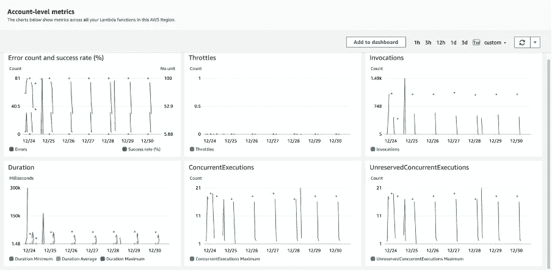
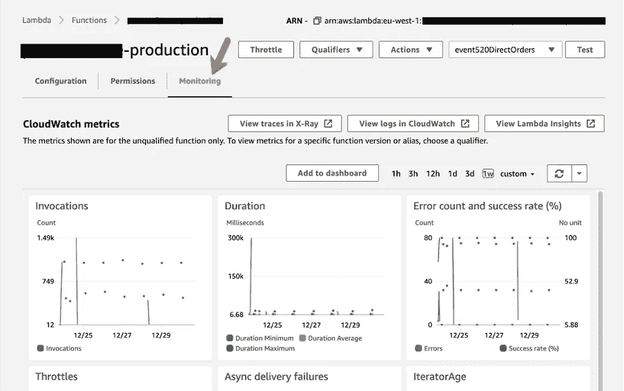
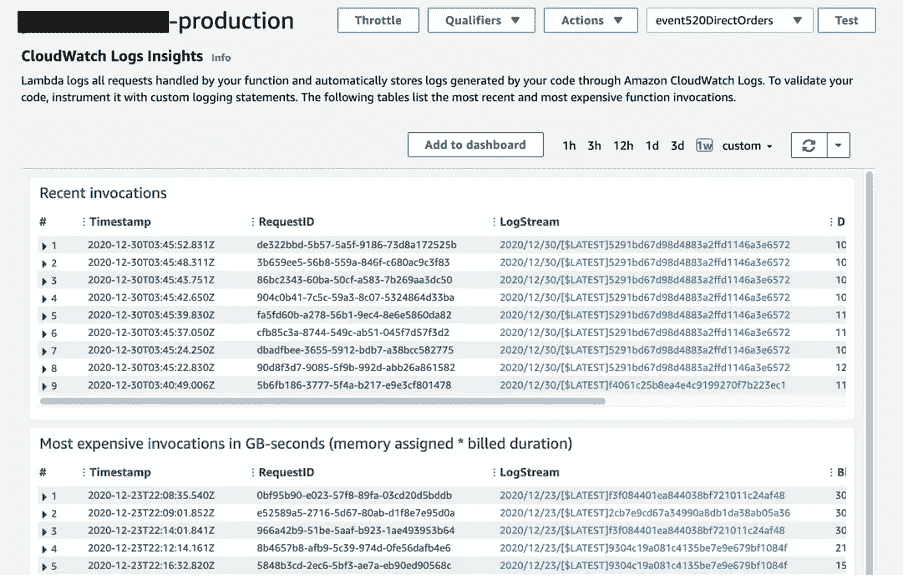

# AWS Lambda 的 CloudWatch 指标概述

> 原文：<https://towardsdatascience.com/an-overview-of-cloudwatch-metrics-for-aws-lambda-41fc1f0e773?source=collection_archive---------34----------------------->

## 了解如何监控 AWS Lambda 函数的 CloudWatch 指标

图片来自 Pexels

在本文中，我将讨论如何使用 CloudWatch 指标来执行和监控 AWS Lambda。AWS Lambda 允许您在云上运行应用程序，而无需提供任何服务器。你所需要做的就是使用你喜欢的编程语言编写你的代码，并将你的代码部署到 AWS Lambda。然后，您可以使用 AWS 提供的资源直接运行您的程序。在撰写本文时，AWS Lambda 支持用 Java、NodeJS、C#、PowerShell、Python、Ruby 和 Go 编写的程序。

# 为什么要监控 Lambda 函数

我认为这是一个很好的起点。这可能是一个问题，如果 Lambda 是无服务器的，并且部署在云中，那么我们为什么要监控它呢？这是因为 Lambda 为每次触发的执行以及执行的持续时间计费。我们将在本文后面看到更多关于 Lambda 定价的内容。但是，总有改进代码的空间或范围，以便它可以用最少的资源和尽可能短的时间有效地执行。这将帮助你作为一个开发人员成长，并且逐渐地也将有助于组织的成长，因为你实际上是在构建一个有成本效益的系统。

在云计算的新时代，事情与传统的基于服务器的架构有些不同。AWS Lambda 是无服务器的，它有一个内置的日志记录和监控系统，可以在 AWS CloudWatch 中推送结果。在运行 AWS Lambda 函数时，了解可以测量哪些指标非常重要。下面是 CloudWatch 在执行 Lambda 函数期间捕获的一些指标。

图 AWS Lambda 的帐户级别指标—云观察指标

为了查看任何 Lambda 函数的性能指标，您可以按照如下步骤操作。打开要监控的 Lambda 函数。单击顶部的 Monitoring，将会显示 CloudWatch Metrics 选项卡。在此选项卡中，您可以看到如下多个指标。

图 2 —在 CloudWatch 指标中监控 Lambda 函数的执行细节

在该选项卡中，有近七个指标受到监控。我已经讨论了下面每个指标的含义。基本上，所有指标都可以分为三个部分——调用指标、性能指标和并发指标。让我们来详细了解一下每一项。

# 调用指标

**调用** —这个指标是 lambda 函数的计费实际上所依赖的最重要的指标之一。每当 lambda 函数被触发时，Lambda 会为每次成功或失败的执行添加一个值 1。如果调用被抑制，那么它将不会在这个指标中被捕获。

**错误**—lambda 函数中可能存在错误，这可能导致 lambda 函数在执行后无法成功完成。这可能是由于 lambda 函数的代码或 lambda 运行时本身在内部引发了异常。lambda 环境引发错误的最常见原因是不正确的参数配置或由于执行时间较长而引发的超时问题。lambda 函数最多可以运行 15 分钟。

**错误** **比率** —错误率通过将错误数除以函数调用总数来计算。

**Success****Rate**—lambda 函数的成功率通过从调用中减去错误，然后除以调用总数来计算。

# 性能指标

性能指标告诉我们 lambda 函数单次执行的性能。

**持续时间** —这个指标告诉我们 lambda 执行函数所需的持续时间。这也取决于分配给 lambda 的内存量。基于内存，AWS 也将计算能力分配给 lambda，该计算能力与内存分配成比例。当您的 lambda 用完所有已分配的内存时，您可以尝试这个设置来找到一个好的基准。

**迭代器年龄** —这个度量帮助我们理解在流中收到消息和它实际被发送到函数之间的持续时间。此度量仅适用于事件源映射的 lambda 函数。lambda 函数的事件可以从各种 Amazon 服务发送，如 Simple Queue Service 或 Amazon Kinesis。

# 并发度量

在云上运行 lambda 函数为同时运行并发函数提供了额外的优势。当 lambda 函数被并行执行时，并发性指标被推送到 CloudWatch 指标中。

**并发执行** —这个指标告诉我们对于任何给定的特定 lambda 函数，同时运行的并发执行的最大数量。

# CloudWatch 日志洞察

每当执行 lambda 函数时，都会生成日志，这些日志会被存储起来，以后可以在任何时间点从 CloudWatch 查看。日志有助于我们分析 lambda 函数并排除故障，以防在函数执行过程中出现任何问题或错误。

图 3 — CloudWatch 在 lambda 函数中记录见解

CloudWatch Logs Insights 也是一个重要的部分，它为我们提供了关于 lambda 函数的每个执行的信息。这里有两个部分— *最近的调用*和*最昂贵的调用*。这些部分中提供的 CloudWatch 指标如下。

**时间戳** —这通常是函数接收到开始执行的请求时的时间戳。它以 UTC 时区存储。

**request id**—request id 是一个 UUID 字段，为 lambda 函数的每次执行自动生成。这是一个唯一的标识符，可用于标识 lambda 函数的特定执行实例。

**日志流** —日志流实际上包含了在生成 Lambda 函数期间生成的详细日志流。您可以单击每个单独的日志流，这将打开特定的日志流，您可以在其中详细查看日志。

**DurationInMS** —这个指标告诉我们 lambda 函数执行的持续时间，以毫秒为单位。

**BilledDurationInMS** —此指标是 DurationInMS 指标的四舍五入版本，用于计费目的。通常，这些值总是向上舍入到下一个更大的整数。

**MemorySetInMB** —这告诉我们在执行时我们已经分配给特定 Lambda 函数的内存。默认情况下，每个 lambda 函数都被设置为从 128 MB 内存开始。但是，根据您的应用程序的负载，建议您相应地更改它。

**MemoryUsedInMB** —这是最重要的 CloudWatch 指标之一，我个人经常使用它来了解我的应用程序消耗了多少内存。如果所有的内存集都被使用了，那么我们应该增加它，这样在执行之后还会剩下一些内存。这反过来也有助于减少执行时间。

**BilledDurationInGBSeconds**—这是一个计算指标，通过将分配的内存乘以计费持续时间来衡量。您最终将根据这一指标付费。

# 结论

在本文中，我们看到了如何捆绑应用程序并部署到 AWS Lambda。AWS Lambda 提供了一个在无服务器平台上运行应用程序的平台。这意味着您不需要维护或照顾 Lambda 使用的底层资源。然而，由于它是无服务器的，你需要监控这些功能的使用，这样你就不会被超额计费。Lambda 是基于执行次数和执行持续时间计费的。您可以使用默认提供的 CloudWatch 指标轻松监控 Lambda 函数的执行。