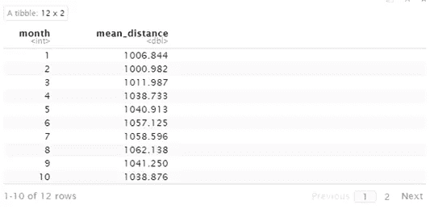

# 使用 R 中的 Tidyverse 库进行数据分析概述

> 原文：<https://towardsdatascience.com/an-overview-of-data-analysis-with-the-tidyverse-library-in-r-e94c151bf7d1?source=collection_archive---------20----------------------->


马修·施瓦茨在 [Unsplash](https://unsplash.com?utm_source=medium&utm_medium=referral) 上的照片

## 很好的学习资源，也可以用作备忘单

R 中的“tidyverse”包对于 R 中的数据分析是一个非常有用的工具，因为它几乎涵盖了分析数据集所需的一切。它是几个大图书馆的组合，使它成为一个巨大的学习图书馆。在他的文章中，我将尝试对 tidyverse 库做一个很好的概述，它提供了足够的资源来很好地执行数据分析任务，也是进一步学习的一个很好的基础。它也可以用作备忘单。

如果一个人没有多年的经验，在你面前的一页上有一个操作或数据分析想法的列表会很有用。所以，我试着在这个页面上编译了相当多的常用操作来帮助我自己和你。

tidyverse 包中包含的日常数据分析包有:

ggplot2

dplyr

tidyr

readr

满意地说

蒂布尔

stringr

forcats

除了 tibble 之外，本文触及了所有这些包。如果你不知道 tibble 是什么，它也是一种数据框架。我在这里不赘述。我在这里的所有例子中使用了简单的数据框。

> 我会从一些简单的事情开始，慢慢走向一些更复杂的任务。

开始吧！

首先导入 tidyverse 库。

```
library(tidyverse)
```

我将从 stringr 库的一些简单函数开始，这些函数是不言自明的。所以，我就不多解释了。

将字符串转换为小写:

```
x = "Happy New Year 2022"
str_to_lower(x)
```

输出:

```
[1] "happy new year 2022"
```

将字符串转换为大写:

```
str_to_upper(x)
```

输出:

```
[1] "HAPPY NEW YEAR 2022"
```

将几个字符串组合成一个字符串:

```
str_c("I ", "am ", "very ", "happy")
```

输出:

```
[1] "I am very happy"
```

获取字符串列表的子集:

这里我将列出一个字符串列表，然后只取每个字符串的前三个字母:

```
x = c("Apple", "Tears", "Romkom")
str_sub(x, 1, 3)
```

输出:

```
[1] "App" "Tea" "Rom"
```

在接下来的演示中，我将使用一个名为 flight dataset 的数据集，它是 nycflights13 库的一部分。

```
library(nycflights13)
```

库被导入。现在，您已经准备好使用飞行数据集了。飞行数据集很大。这是一个很大的数据集。所以，这里不可能显示截图。以下是数据集的列:

```
names(flights)
```

输出:

```
[1] "year"           "month"          "day"            "dep_time"      
 [5] "sched_dep_time" "dep_delay"      "arr_time"       "sched_arr_time"
[9] "arr_delay"      "carrier"        "flight"         "tailnum"       
[13] "origin"         "dest"           "air_time"       "distance"      
[17] "hour"           "minute"         "time_hour"
```

我将从将两列组合在一起的“unite”函数开始。下面的代码块将 flight 和 carrier 列合并在一起，形成一个名为“flight_carr”的新列:

```
flights %>%
  unite_(.,"flight_carr", c("flight", "carrier"))
```

以下是显示新 flight_carr 列的数据集部分:


当我们有分类数据并且需要将它们用作级别时，因子函数非常有用。对于可视化和机器学习，有必要对分类数据使用因子函数来将它们存储为级别。

在这里，我对载体列进行因子分解，并打印独特的载体:

```
carr = factor(flights$carrier)
levels(carr)
```

输出:

```
[1] "9E" "AA" "AS" "B6" "DL" "EV" "F9" "FL" "HA" "MQ" "OO" "UA" "US"
[14] "VX" "WN" "YV"
```

让我们看看每个载体的数量:

```
fct_count(carr)
```


下一个是 purr 包中的 map_dbl 函数，它采用一个统计函数并返回结果。在这里，我将采用“距离”和“sched_arr_time”列，并找出这两个列的“平均值”:

```
map_dbl(flights[, c("distance", "sched_arr_time")], ~mean(.x))
```

输出:

```
distance sched_arr_time 
1039.913       1536.380
```

GGPLOT2 是一个巨大的可视化库，也附带了 tidyverse 包。这里有一个例子:

```
ggplot(data = flights) + 
  aes(x = distance) + 
  geom_density(adjust = 1, fill = "#0c4c8a") + 
  theme_minimal()
```


我有一个关于 ggplot2 的详细教程，你可以在里面找到一系列可视化技术:

</a-collection-of-data-visualizations-in-ggplot2-3648a6ba71bc>  

我们来看看 lubridate 包的一些功能:

```
dates = c("January 18, 2020", "May 19, 2020", "July 20, 2020")
mdy(dates)
```

输出:

```
[1] "2020-01-18" "2020-05-19" "2020-07-20"
```

小时-分钟-秒数据:

```
x = c("11:03:07", "09:35:20", "09:18:32")
hms(x)
```

输出:

```
[1] "11H 3M 7S"  "9H 35M 20S" "9H 18M 32S"
```

让我们回到我们的航班数据集。航班数据集中有年、月、日数据。我们可以用它做一个日期栏，找出每个日期的航班数和平均距离。

```
flights %>% 
  group_by(date = make_date(year, month, day)) %>%
  summarise(number_of_flights = n(), mean_distance = mean(distance, na.rm = TRUE))
```


***如何取一个数据帧的子集？***

这个代码块从航班数据集中抽取了 15 行数据。

```
flights %>%
  slice_sample(n = 15)
```

以下代码块从航班数据集中抽取了 15%的数据样本:

```
flights %>%
  slice_sample(prop = 0.15)
```

***从大型数据集中选择特定的列***

这里，我从航班数据集中提取了始发地、目的地、承运人和航班列:

```
flights %>%
  select(origin, dest, carrier, flight)
```


如果从这个大的航班数据集中，我想要除 time_hour 和 tailnum 列之外的大多数列，该怎么办？

```
select(flights, -time_hour, -tailnum)
```

该代码块将选择航班数据集中除 time_hour 和 tailnum 列之外的所有列。

使用列名的一部分来选择列也很有帮助。

以下代码行选择所有以“air_”开头的列:

```
flights %>%
  select(starts_with("air_"))
```


只有一列以“air_”开头。

这些是以“延迟”结尾的列:

```
flights %>%
  select(ends_with("delay"))
```


以下各列包含“dep”部分。

```
flights %>%
  select(contains("dep"))
```


***如何根据具体条件过滤行？***

保留“dest”以“FL”开始的数据行，并过滤掉其余的数据:

```
flights %>%
  filter(dest %>% str_detect("^FL"))
```

以下是部分输出数据:


看看上面的“目的地”一栏。所有值都以“FL”开头。

这是另一个过滤函数的例子。保留 month = 2 的行，过滤其余的行。

```
filter(flights, month == 2)
```

这行代码将返回月份值为 2 的数据集。

***使用筛选并选择同一行代码中的两个***

选择距离值大于 650 的起点、目的地、距离和 arr_time 列:

```
select(filter(flights, distance > 650), origin, dest, distance, arr_time)
```


使用管道也可以做到同样的事情:

```
flights %>%
  filter(distance > 650) %>%
  select(origin, dest, distance, arr_time)
```

在下面的例子中，我从航班数据集中选择航班和距离，并在航班号为 1545 的地方取平均距离。

```
flights %>%
  select(flight, distance) %>%
  filter(flight == 1545) %>%
  summarise(avg_dist = mean(distance))
```


***使用现有列创建新列***

我正在创建两个新列 arr_time_new 和 arr_time_old，并使用 mutate 操作将 arr_time 列加上和减去 20。在此之前，我使用过滤器删除空值。

```
flights %>%
  filter(!is.na(arr_time)) %>%
  mutate(arr_time_new = arr_time + 20,
         arr_time_old = arr_time -20)
```


变异的最后一个例子。在这里，我们将长距离飞行定义为距离大于 1000，并根据该定义计算有多少次飞行是长距离的。

```
flights %>%
  mutate(long_distance = (distance >= 1000)) %>%
  count(long_distance)
```


***拉斯韦加斯到达延迟和西雅图准时到达计数:***

```
flights %>%
  mutate(dest = case_when(
    (dest == 'LAS') & arr_delay > 20 ~ "Las Vegas arriavl - Delayes",
    (dest == "SEA") & arr_delay <= 20 ~ "Seattle arrival - On time"
  )) %>%
  count(dest)
```


***替换人名并计数***

起源被表示为 EWR、LGA 和 JFK。我们将用它们的全名替换它们，计算航班数量，并按排序顺序显示它们:

```
flights %>%
  mutate(origin = str_replace_all(origin, c(
    "^EWR$" = "Newark International",
    "^LGA$" = "LaGuaria Airport",
    "^JFK$" = "John F. Kennedy International"
  ))) %>%
  count(origin)
```


***使用 Group By 函数汇总数据***

我想知道每个月所有航班的平均距离。在这种情况下，我将对 month 列使用 group_by 函数，并使用 summarise on distance 列找到平均距离:

```
flights %>%
  group_by(month)%>%
  summarize(mean_distance = mean(distance, na.rm = TRUE))
```



Group by 函数可用于多个变量，也可用于汇总函数之外的函数。

这里有一个例子。这里还使用了另一个名为“排列”的函数来获得按平均距离排序的数据集。

```
flights %>%
  filter(!is.na(distance))%>%
  group_by(year, month) %>%
  summarize(mean_distance = mean(distance),
            min_distance = min(distance)) %>%
  arrange(mean_distance)
```


看，数据集是按照平均距离升序排列的。

***计数功能***

让我们按航班号数一下航班:

```
flights %>%
  count(flight)
```


统计每个起点的航班数量，并根据航班数量进行排序:

```
flights %>%
  count(origin, sort = TRUE)
```


让我们看看每个始发地-目的地组合有多少个航班:

```
flights %>%
  count(origin, dest)
```


制作航线栏，显示起点->终点组合，并统计每条航线的航班数；

```
flights %>%
  count(flight_path = str_c(origin, "->", dest), sort = TRUE)
```


***传播功能***

为了演示传播函数，我们先准备点东西。我为每个始发地-目的地组合计算平均 dep_delay:

```
flg = flights %>%
  filter(!is.na(dep_delay)) %>%
  group_by(origin, dest) %>%
  summarize(mean_dep_delay = mean(dep_delay))flg
```


下面是 spread 的用法，其中键是原点，值是 mean_dep_delay:

```
flg %>%
  spread(key = origin, value=mean_dep_delay)
```


看起来起源是传播。该数据集中有三个原点，它们现在成为了该扩展数据集的列。此处显示了每个目的地从每个起点的平均 dep_delay。

但问题是这个输出数据集中有一些空值。我们可以使用以下代码用零填充它们:

```
flights_spread = flg %>%
  spread(origin, mean_dep_delay, fill=0)
```


请自行运行这段代码并查看结果。

***聚集功能***

使用聚集函数，我将从“EWR”列到“LGA”列的 mean_dep_delay 值中收集值:

```
flights_spread %>%
  gather(key = "origin", value = "mean_dep_delay", EWR:LGA)
```


这篇文章就这么多了！

## 结论

使用 tidyverse 包可以做更多的事情。我试图给出一个涉及不同领域很多事情的概述。希望你能用它来做一些有趣的工作。

欢迎在推特上关注我，查看我的新 YouTube 频道

## 更多阅读

</a-data-storytelling-project-with-some-advanced-visualization-in-ggplot2-fb60dfc56dde>  </a-beginners-guide-to-match-any-pattern-using-regular-expressions-in-r-fd477ce4714c>  </detailed-guide-to-multiple-linear-regression-model-assessment-and-inference-in-r-e9b183b1441>  </five-advanced-plots-in-python-matplotlib-134bfdaeeb86> 