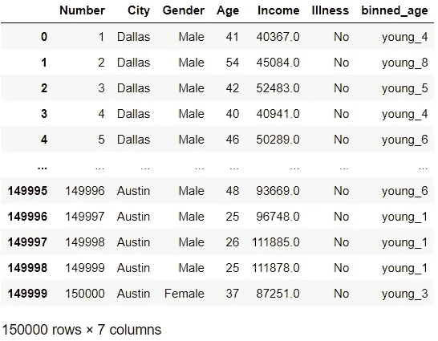
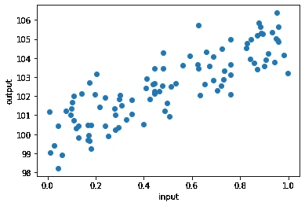
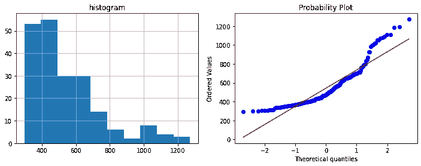
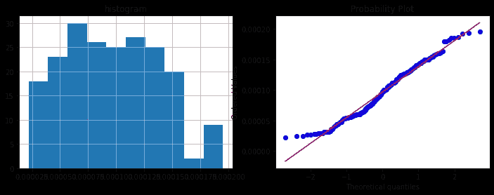

# 数据预处理概述:特征浓缩、自动特征选择

> 原文：<https://towardsdatascience.com/an-overview-of-data-preprocessing-features-enrichment-automatic-feature-selection-60b0c12d75ad?source=collection_archive---------13----------------------->

## [实践教程](https://towardsdatascience.com/tagged/hands-on-tutorials)

## 在一个视图中使用 python 实现的有用的要素工程方法

数据集应该适用于机器学习中训练的数据和算法做出的预测，以产生更成功的结果。查看数据集，可以发现有些要素比其他要素更重要，也就是说，它们对输出的影响更大。例如，当用数据集的对数值或其他数学运算(如平方根、指数运算)进行替换时，可以获得更好的结果。这里要区分的是选择适合模型和项目的数据预处理方法。这篇文章包含了不同的角度来看待数据集，以使算法更容易学习数据集。使用 python 应用程序，所有研究都变得更容易理解。

```
Table of Contents (TOC)
1\. Binning
2\. Polynomial & Interaction Features
3\. Non-Linear Transform
3.1\. Log Transform
3.2\. Square Root Transform
3.3\. Exponential Transform
3.4\. Box-cox Transform
3.5\. Reciprocal Transform
4\. Automatic Feature Selection
4.1\. Analysis of Variance (ANOVA)
4.2\. Model-Based Feature Selection
4.3\. Iterative Feature Selection
```


[塔玛拉·加克](https://unsplash.com/@tamara_photography?utm_source=medium&utm_medium=referral)在 [Unsplash](https://unsplash.com?utm_source=medium&utm_medium=referral) 上的照片

# 1.扔掉

在上一篇文章中，解释了以算法可以处理的方式对分类数据进行数字化的方法。宁滨用于将数值数据转换为分类数据，从而使模型更加灵活。考虑到数字数据，创建了由用户确定的箱数。所有数据都被填入这些范围并被重命名。现在让我们将宁滨应用于数据集中的年龄列。

```
import numpy as np
import pandas as pd
import matplotlib.pyplot as pltIN[1]
data=pd.read_csv('toy_dataset.csv')
data[['Age']].describe()
**OUT[2]**
**count 150000.000000
mean 44.950200
std 11.572486
min 25.000000
25% 35.000000
50% 45.000000
75% 55.000000
max 65.000000**IN[2]
def binnings(col, number_of_bins,labels):
    min_val = col.min()
    max_val = col.max()
    space = (max_val-min_val)/number_of_bins
    bin_borders=[]
    for i in range(number_of_bins+1):
        bin_values = min_val+space*i
        bin_borders.append(bin_values)
    bin_borderss = pd.cut(col, bins=bin_borders,labels=labels,include_lowest=True)
    return bin_borders,bin_borderss
IN[3]
labels=["young_1","young_2","young_3","young_4","young_5","young_6","young_7","young_8","young_9","young_10"]
binnings(data['Age'],10,labels)
**OUT[3]
([25.0, 29.0, 33.0, 37.0, 41.0, 45.0, 49.0, 53.0, 57.0, 61.0, 65.0],
 0         young_4
 1         young_8
 2         young_5
 3         young_4
 4         young_6
            ...   
 149995    young_6
 149996    young_1
 149997    young_1
 149998    young_1
 149999    young_3
 Name: Age, Length: 150000, dtype: category**
```

通过将数据集中的年龄范围等间隔分成 11 个部分，创建了 10 个箱。每个范围都被赋予选定的标签(young_1…..young_10)并作为列添加到数据集中。现在，如果我们想向数据集添加一个新列:

```
IN[4]
data['binned_age']= binnings(data['Age'],10,labels)
data
```



图一。OUT[4]，图片由作者提供

现在让我们看看算法精度对我们创建的数据集的影响。

```
IN[5]
x = np.random.rand(100, 1)
y = 100 + 5 * x + np.random.randn(100, 1)
plt.scatter(x,y)
plt.xlabel('input')
plt.ylabel('output')
```



图二。OUT[5]，图片由作者提供

```
IN[6] *without bin*
from sklearn.linear_model import LinearRegression
from sklearn.model_selection import train_test_split
x_train,x_test,y_train,y_test=train_test_split(x,y,test_size=0.2,random_state=2021)
lr = LinearRegression()
lr.fit(x_train,y_train)
print("score=",lr.score(x_test,y_test))
**OUT[6]
score= 0.7120200116547827**
```

现在，让我们创建条块，并用条块测试新数据集。

```
IN[7] *create bins*
bins=np.linspace(x.min()-0.01,x.max()+0.01,9)
print(bins)
datas_to_bins = np.digitize(x, bins=bins,right=False)
np.unique(datas_to_bins)
**OUT[7]
[-0.00374919  0.12264801  0.24904522  0.37544243  0.50183963  0.62823684 0.75463404  0.88103125  1.00742846]
array([1, 2, 3, 4, 5, 6, 7, 8], dtype=int64)**IN[8] *with bins*
from sklearn.preprocessing import OneHotEncoder
encoder = OneHotEncoder(sparse=False)
x_binned=encoder.fit_transform(datas_to_bins)
x_binned_train,x_binned_test,y_binned_train,y_binned_test=train_test_split(x_binned,y,test_size=0.2,random_state=2021)
lr.fit(x_binned_train,y_binned_train)
print("score=",lr.score(x_binned_test,y_binned_test))
**OUT[8]
score= 0.7433952534198586**
```

可以看出，当分成 9 个部分并分组为 8 个箱时，测试数据集中的成功率从 71 增加到 74。

> 宁滨不会影响基于树的算法，因为它们使用拆分日期来训练模型。另一方面，它对于线性模型相当有效。

# 2.多项式和交互特征

可以对数据集进行的另一项改进是添加交互要素和多项式要素。如果我们考虑上一节中创建的数据集和宁滨运算，可以创建各种数学配置来增强这一点。例如，让我们以宁滨数据为例，该数据从数值变量转换为分类变量，然后用 OneHotEncoder 转换回数值变量。我们使用宁滨对通过添加 0 和 1 之间的 100 个随机数据而创建的数据集进行了分组，现在让我们将入库数据集与正常数据集合并并创建一个新数据集，或将入库数据集与正常数据集相乘并将其添加到入库数据集，或将入库数据集划分为正常数据集并将其添加到入库数据集。让我们看看所有这些配置的线性回归和得分。

```
IN[9]
x_combined=np.hstack([x_binned,x*x_binned])
print(x_binned.shape)
print(x.shape)
print(x_combined.shape)
x_combined_train,x_combined_test,y_combined_train,y_combined_test=train_test_split(x_combined,y,test_size=0.2,random_state=2021)
lr.fit(x_combined_train,y_combined_train)
print("score=",lr.score(x_combined_test,y_combined_test))
**OUT[9]
(100, 3)
(100, 1)
(100, 6)
score= 0.7910475179261578**IN[10]
x_combined2=np.hstack([x_binned,x])
x_combined2_train,x_combined2_test,y_combined2_train,y_combined2_test=train_test_split(x_combined2,y,test_size=0.2,random_state=2021)
lr.fit(x_combined2_train,y_combined2_train)
print("score=",lr.score(x_combined2_test,y_combined2_test))
**OUT[10]
score= 0.7203969392138159**IN[11]
x_combined3=np.hstack([x_binned,x_binned/x])
x_combined3_train,x_combined3_test,y_combined3_train,y_combined3_test=train_test_split(x_combined3,y,test_size=0.2,random_state=2021)
lr.fit(x_combined3_train,y_combined3_train)
print("score=",lr.score(x_combined3_test,y_combined3_test))
**OUT[11]
score= 0.7019604516773869**
```

丰富数据集的另一种方法是使用多项式要素。通过对多项式要素列中的数据进行指定次数的幂运算来扩展数据集。例如，当在多边形特征预处理中设置 4 度时，它很容易与 sklearn 库一起使用，4 个新特征将被添加为 x，x，x，x⁴.现在，让我们通过在同一数据集中添加多项式要素来观察结果。

```
IN[12]
from sklearn.preprocessing import PolynomialFeatures
poly = PolynomialFeatures(degree=4, include_bias=False)
x_poly=poly.fit_transform(x)
poly.get_feature_names()
**OUT[12]
['x0', 'x0^2', 'x0^3', 'x0^4']**IN[13]
x_poly_train,x_poly_test,y_poly_train,y_poly_test=train_test_split(x_poly,y,test_size=0.2,random_state=2021)
lr.fit(x_poly_train,y_poly_train)
print("score=",lr.score(x_poly_test,y_poly_test))
**OUT[13]
score= 0.7459793178415801**
```

使用多项式和交互功能无法获得良好结果的原因是，数据集是随机创建的。这些方法在实际项目中经常使用，效率很高。

# 3.非线性变换

数据集中的数值呈高斯分布这一事实非常有利于模型学习和进行预测。它可以通过一些数学运算将数据集转换为高斯分布。这就像从另一个角度看同一数据集，就像在同一信号的频率分析中使用傅立叶变换一样。相同的 mat 操作应用于该列中的所有数据。现在，在我们看一下这些方法之前，让我们准备一下我们将使用的列和 qq_plot。

```
IN[14]
data=pd.read_csv('CarPrice_Assignment.csv')
data.columns
**OUT[14]
Index(['car_ID', 'symboling', 'CarName', 'fueltype', 'aspiration',
       'doornumber', 'carbody', 'drivewheel', 'enginelocation', 'wheelbase', 'carlength', 'carwidth', 'carheight', 'curbweight', 'enginetype', 'cylindernumber', 'enginesize', 'fuelsystem', 'boreratio', 'stroke','compressionratio', 'horsepower', 'peakrpm', 'citympg', 'highwaympg', 'price'],
      dtype='object')**IN[15]   *column we will use*
data['price'].describe()
**OUT[15]
count      205.000000
mean     13276.710571
std       7988.852332
min       5118.000000
25%       7788.000000
50%      10295.000000
75%      16503.000000
max      45400.000000
Name: price, dtype: float64**IN[16] *create histogram and qq plot*
import scipy.stats as stat
import pylab
def qq_plot(data,feature):
    plt.figure(figsize=(12,4))
    plt.subplot(1,2,1)
    data[feature].hist()
    plt.title('histogram')
    plt.subplot(1,2,2)
    stat.probplot(data[feature],dist='norm',plot=pylab)
    plt.show()IN[17]
qq_plot(data,'price')
```


图 3。输出[17]，直方图(左)和概率图(右)，图片由作者提供

## 3.1.对数变换

列中所有数据的对数。

```
IN[18]
data['log'] = np.log(data['price'])
qq_plot(data,'log')
OUT[18]
```


图 4。输出[18]，对数变换，直方图(左)和概率图(右)，作者图片

## 3.2.平方根变换

列中所有数据的平方根。

```
IN[19]
data['squareroot'] = data.price**(1/2)
qq_plot(data,'squareroot')
```


图 5。输出[19]，平方根变换，直方图(左)和概率图(右)，图片作者

## 3.3.指数变换

列中所有数据的用户选择的指数。

```
IN[20]
data['exp'] = data.price**(1/1.5)
qq_plot(data,'exp')
```



图 6。OUT[20]，指数变换，直方图(左)和概率图(右)，作者图片

## 3.4.Boxcox 变换

它根据等式应用于列。


Box-cox 方程，[来源](https://www.statisticshowto.com/box-cox-transformation/)

```
IN[21]
data['boxcox'],parameters = stat.boxcox(data['price'])
print(parameters)
qq_plot(data,'price')
```


图 7。OUT[21]，box-cox 变换，直方图(左)和概率图(右)，图片由作者提供

## 3.5.互易变换

列中的所有数据除以 1。

```
IN[22]
data['reciprocal'] = 1/data.price
qq_plot(data,'reciprocal')
```



图 8。OUT[22]，倒数变换，直方图(左)和概率图(右)，作者图片

# 4.自动特征选择

在上一节中，我们丰富了我们的特征并扩展了我们的数据集，但是由于这个操作将创建一个复杂的数据集，它可能会导致过度拟合。现在，让我们研究一下根据高维数据集或复杂数据集的要素重要性减少要素的方法。

## 4.1.方差分析——ANOVA

每个特征与目标的关系被单独分析，并且以用户选择的速率与目标具有较少关系的特征被排除。这种特征-目标关系是根据 p 值确定的。首先消除具有高 p 值的要素。现在让我们导入乳腺癌数据集，然后应用线性回归和决策树算法。

```
IN[22]
from sklearn.datasets import load_breast_cancer
data=load_breast_cancer()
x=data.data
y=data.targetIN[23]
from sklearn.linear_model import LinearRegression
from sklearn.model_selection import train_test_split
x_train,x_test,y_train,y_test=train_test_split(x,y,test_size=0.2,random_state=2021)
lr = LinearRegression()
lr.fit(x_train,y_train)
print("score=",lr.score(x_test,y_test))
**OUT[23]
score= 0.7494572559981934**IN[24]
from sklearn.tree import DecisionTreeRegressor
dt = DecisionTreeRegressor(random_state=42)
dt.fit(x_train, y_train)
print("score on test set: ", dt.score(x_test, y_test))
**OUT[24]
score on test set:  0.8115079365079365**
```

添加决策树回归器是为了查看特征的重要性:

```
IN[25]
print(dt.feature_importances_)
**OUT[25]
[0\.         0.01755418 0\.         0\.         0.01690402 0.00845201
 0.01173891 0\.         0\.         0.00375645 0.00725021 0.01126935
 0.00907901 0.00991574 0.00223873 0\.         0\.         0.
 0\.         0\.         0.00782594 0.0397066  0\.         0.71559469
 0\.         0\.         0.01979559 0.11891856 0\.         0\.        ]**IN[26]
np.argsort(dt.feature_importances_)
**OUT[26]
array([ 0, 25, 24, 22, 19, 18, 17, 16, 15, 28, 29,  2,  3,  8,  7, 14,  9, 10, 20,  5, 12, 13, 11,  6,  4,  1, 26, 21, 27, 23], dtype=int64)**
```

现在让我们应用方差分析:

```
IN[27]
from sklearn.feature_selection import SelectPercentile
select = SelectPercentile(percentile=30)
select.fit(x_train, y_train)
# transform training set
x_train_selected = select.transform(x_train)
print("X_train.shape: {}".format(x_train.shape))
print("X_train_selected.shape: {}".format(x_train_selected.shape))
**OUT[27]
X_train.shape: (455, 30)
X_train_selected.shape: (455, 9)**
```

百分比设置为 30，以便选择 30%的特征(9)。

具有选定特征的线性回归:

```
IN[28]
x_test_selected = select.transform(x_test)
lr.fit(x_train_selected, y_train)
print("Score with only selected features: {:.3f}".format(
lr.score(x_test_selected, y_test)))
**OUT[28]
Score with only selected features: 0.712**
```

仅用 9 个特征获得 0.712，而用 30 个特征获得 0.749。现在让我们看看 SelectPercentile 选择了哪些功能:

```
IN[29]
mask = select.get_support()
print(mask)
**OUT[29]
[ True False  True  True False False  True  True False False False False False False False False False False False False  True False  True True False False False  True False False]**
```

## 4.2.基于模型的特征选择

它一次评估所有特性，并根据它们的相互作用选择特性。它根据用户设置的阈值选择重要性较高的内容。例如，如果选择阈值=中等，则选择 50%的特征。Sklearn 中阈值的默认值是均值。

```
IN[30]
from sklearn.feature_selection import SelectFromModel
selection = SelectFromModel(LinearRegression(), threshold="median")
selection.fit(x_train, y_train)
x_train_select = selection.transform(x_train)
print("X_train.shape:",x_train.shape)
print("X_train_l1.shape:",x_train_select.shape)
**OUT[30]
X_train.shape: (455, 30)
X_train_l1.shape: (455, 15)**IN[31]
mask = select.get_support()
print(mask)
**OUT[31]
[False False False False  True  True  True  True False  True False False False False  True  True  True  True  True  True False False False False True False False  True  True  True]**
```

具有选定特征的线性回归:

```
IN[32]
x_test_select = selection.transform(x_test)
print(lr.fit(x_train_select, y_train).score(x_test_select, y_test))
**OUT[32]
0.6919232554797755**
```

## 4.3.迭代特征选择

它根据某个阈值以 2 种方式工作:第一种从 0 个特征开始，根据其重要性继续添加特征，直到达到阈值。第二个选择所有特征并逐个消除它们，直到阈值。顾名思义，*递归特征消除(RFE)* 选择所有特征，消除特征，直到指定条件。

```
IN[33]
from sklearn.feature_selection import RFE
from sklearn.linear_model import LogisticRegression
select = RFE(LogisticRegression(),
n_features_to_select=20)
select.fit(x_train, y_train)
# visualize the selected features:
mask = select.get_support()
print(mask)
**OUT[33]
[ True  True False False  True  True  True  True  True False  True  True True  True False False False False False False  True  True  True False True  True  True  True  True  True]**
```

条件设置为 20 个特征，从 30 个特征开始，一个接一个地消除特征，直到剩下 20 个特征。

```
IN[34]
x_train_rfe= select.transform(x_train)
x_test_rfe= select.transform(x_test)
lr.fit(x_train_rfe, y_train)
print("score:",lr.score(x_test_rfe, y_test))
**OUT[34]
score: 0.7140632795679898**
```

## 回到指引点击[这里](https://ibrahimkovan.medium.com/machine-learning-guideline-959da5c6f73d)。

[](https://ibrahimkovan.medium.com/machine-learning-guideline-959da5c6f73d) [## 机器学习指南

### 本文旨在准备一个机器学习数据库，以便在一个视图中显示所有的机器学习标题。这个…

ibrahimkovan.medium.com](https://ibrahimkovan.medium.com/machine-learning-guideline-959da5c6f73d)