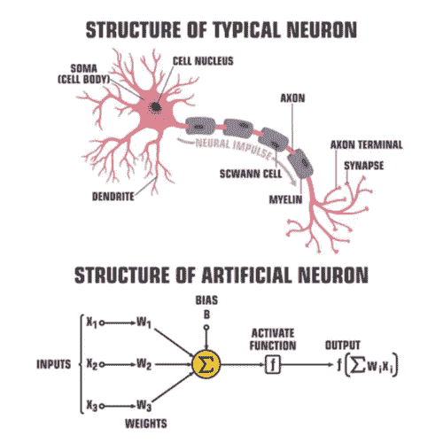
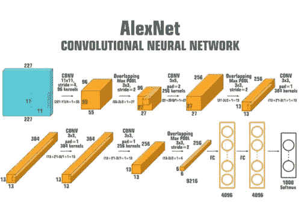

# 深度学习概述——从历史到基础

> 原文：<https://towardsdatascience.com/an-overview-of-deep-learning-from-history-to-fundamentals-f7117b2d0d37?source=collection_archive---------4----------------------->

## 世贸中心遗址

## 一本学习深度学习本质的剧本，重点是卷积神经网络


照片由[雷蒙·克拉文斯](https://unsplash.com/@raimondklavins?utm_source=medium&utm_medium=referral)在 [Unsplash](https://unsplash.com?utm_source=medium&utm_medium=referral) 拍摄

我最近为那些想成为数据科学家的人教授了一门关于机器学习 101 的迷你课程。其中一个模块是关于深度学习的。我发现许多新手对这个话题感到困惑，主要是因为它经常被教授许多复杂的内容。在这篇文章中，我的目标是描述它足够简单，但不要太简单。希望有帮助！

本文分为以下四个部分:

*   什么是神经网络？
*   什么是深度学习？
*   如何搭建一个简单的深度学习架构？
*   如何训练一个深度学习模型？

# 什么是神经网络？

神经网络是一种受生物神经网络启发的计算模型，它在人脑中处理信息。神经网络由一组按层(输入、隐藏和输出)组织的人工神经元组成。这些人工神经元由突触连接，这些突触只是加权值。

## —构建模块是什么？

人工神经元是具有特定数学运算的计算元件。一个神经元接受它的输入(布尔或实数),并在对输入应用预定义的操作后，通过激活函数将结果传递给其他神经元。激活函数是每个节点的一部分，它将线性函数转换为非线性函数。基本上，它决定了一个神经元是否应该放电。激活函数可以是不同的数学函数，例如 Step、Sigmoid 和 ReLU。



图 1:生物神经元(上)和人工神经元(下)。该图像已获得 Shutterstock 的许可。

一个普通的神经元(也称为感知器神经元)接受包括偏差在内的输入，并将其乘以相关的权重，然后将总和传递给阶跃函数。

## **—如何训练一个神经网络？**

训练神经网络是指计算(或找到)网络中的权重以最小化目标函数(或损失函数)的过程。您可以将神经网络中的权重视为多项式函数(如`ax^2+b*x+c`)中的参数，其中有两个主要区别。神经网络是具有高度和潜在非线性性能的多项式函数。在这里，*高度*意味着需要时参数的数量可以超过数百万。

有各种算法来训练神经网络，反向传播(backpropagation)是其中之一。简而言之，反向传播是一种在训练阶段使用梯度下降技术来计算神经网络中的权重的算法。在这种方法中，计算输出与期望值相比的误差，并成比例地(即，基于当前权重)反向传播以更新网络权重。网络权重基于学习速率迭代更新，直到收敛。

推荐看视频了解更多这种方法。YouTube 频道有一个描述这个话题的最好的可视化工具。

反向传播到底在做什么？—3 蓝色 1 棕色

要训练神经网络，您必须知道以下问题的答案。在开始实现一个示例项目之前，您可能不会理解它们的重要性。

*   如何初始化权重？
*   停止的标准是什么？
*   算法不收敛怎么办？
*   增加网络的复杂性有帮助吗？

**最后一件事。**如果你想了解学习率、激活函数或架构等配置参数如何影响神经网络的结果，我强烈建议查看 TensorFlow 创建的名为 Playground 的交互式演示。**太美了，太有见地了！**

<https://playground.tensorflow.org/#activation=tanh&batchSize=10&dataset=circle&regDataset=reg-plane&learningRate=0.03&regularizationRate=0&noise=0&networkShape=4,2&seed=0.24016&showTestData=false&discretize=false&percTrainData=50&x=true&y=true&xTimesY=false&xSquared=false&ySquared=false&cosX=false&sinX=false&cosY=false&sinY=false&collectStats=false&problem=classification&initZero=false&hideText=false>  

# 什么是深度学习？

深度学习是一系列基于深度神经网络(具有许多隐藏层的神经网络)的**特殊架构**的机器学习方法，这些深度神经网络可以同时进行**特征提取**和**分类**，并且只需很少的人力。这种特殊的结构比简单完全连接的神经网络中的层更高级。这些特殊的架构大多建立在一个名为“**胶囊**的概念之上。胶囊是每一层中的一组神经元，它们进行大量内部计算，并输出表示数据属性(如卷积)的压缩结果。你可以阅读更多关于卷积神经网络的内容

## —一个成功的故事:AlphaGo

[由](https://deepmind.com/research/case-studies/alphago-the-story-so-far) [Deepmind](https://deepmind.com/) 创建的 AlphaGo 项目是深度学习的成功案例之一。正如 Deepmind 所说:“AlphaGo 是第一个打败围棋世界冠军的计算机程序”。首先，我来描述一下围棋为什么特别。

围棋是人工智能瞄准的最具挑战性的经典游戏。为什么？主要是因为玩家可以选择的移动数量。按此[篇](https://www.businessinsider.com/why-google-ai-game-go-is-harder-than-chess-2016-3)、**T3 在前 2 步棋后，围棋中大概有 13 万步棋。这个数字是国际象棋中 400 种可能的走法。你可以看到 Go 中的搜索空间是无可争议的广阔。**当搜索空间极其广阔时，深度学习可能是一个不错的选择。****

深度学习是瞄准围棋的正确方法的另一个原因是植根于围棋的玩法。如果你问围棋手他们是如何决定一步棋的，他们通常会告诉你感觉很对。在这些你不能定义特征的场景中，你不能使用经典的机器学习算法。**当确定有用的特征集不可行时，深度学习可能是一个不错的选择。**

# 什么是卷积神经网络？

卷积神经网络(或 CNN)是一类深度学习架构，通常用于分析图像，如图像分类、对象检测和视频动作识别。一般来说，卷积神经网络被设计用于任何在其结构中具有某种**空间不变性**的数据，例如人脸或语音识别。空间不变性意味着，例如，图像左上角的猫耳与图像右下角的猫耳具有相同的特征。CNN 建立在下面描述的两个主要构件上。

*   **卷积** —细胞神经网络是空间不变的，因为它们建立在卷积算子之上。卷积是一种数学运算，它对两个函数(信号)的乘积进行积分，其中一个信号被翻转(如果需要)。例如，在过去，卷积运算符被用于计算两个信号之间的相关性或寻找信号中的模式。该操作符对于视觉数据中的特征提取非常有效。过去几年里，计算机视觉领域取得的许多进步，部分归功于卷积神经网络。
*   **池化**—CNN 中的另一个构件是池化层。它的功能是逐渐减小数据的空间大小，以减小网络大小和算法对输入中要素精确位置的敏感度。网络规模转化为在训练阶段必须计算的权重数量。

有时，您还需要在输入图像的边界周围添加带有`pixel_intensity=0` 的额外像素，以增加有效尺寸。这有助于在应用卷积层后保持图像大小固定。这个过程叫做**填充**。



图 2:Alex net——图片获得了 Shutterstock 的许可。

# 有哪些特殊的架构？

*   **AlexNet —** AlexNet 是卷积神经网络的成功实现，在 2012 年赢得了 ImageNet 大规模视觉识别挑战赛( [ILSVRC](https://www.image-net.org/challenges/LSVRC/index.php) )。该架构已由 Alex Krizhevsky、Ilya Sutskever、Geoffrey Hinton 在 NeurIPS 2012 上发表(图 2)。在这种架构中，输入是大小为 256×256 的 RGB 图像，这些图像被随机裁剪成大小为 224×224 的图像。该架构包含 65 万个神经元和 6000 万个参数。此外，在两个 GTX 580 3GB GPU 上训练需要 5-6 天。它由 5 个卷积层和 3 个全连接层组成。他们首次使用整流线性单元(ReLUs)作为激活函数。
*   **VGG16 —** 提高深度神经网络性能的标准方法是增加深度。VGG-16 是由牛津大学视觉几何小组的人发明的。该架构有 13 个卷积层和 3 个全连接层。他们还使用 ReLU 激活功能作为 AlexNet 的传统。与 AlexNet 相比，该网络堆叠了更多层，并使用了更小尺寸的过滤器(2×2 和 3×3)。它由 138M 参数组成。

</vgg-neural-networks-the-next-step-after-alexnet-3f91fa9ffe2c>  

*   **ResNet50 —** 随着网络深度的增加，精度会饱和，然后迅速下降，这主要是因为我们无法对其进行适当的训练。微软研究院用 ResNet50 解决了这个问题——使用跳过(或快捷方式)连接，同时构建更深层次的模型。更深的 CNN(高达 152 层)而不影响模型的泛化。这是一个好主意…

# 如何构建一个简单的深度学习架构

## **— Keras**

Keras 是一个带有 Python 接口的高级神经网络库，可以在主要的科学计算框架上运行，如 TensorFlow(由 Google 创建)或 CNTK(由微软创建)。与 Pytorch 相比，工程师通常更喜欢提供快速开发的 Keras。您可以使用下面的 Kears 找到如何建立一个类似 VGG 的卷积神经网络。要了解更多关于如何使用 Keras 建立深度学习模型的信息，可以查看原始的[文档](https://faroit.com/keras-docs/2.0.2/getting-started/sequential-model-guide/)。

```
**from** keras.models **import** Sequential
**from** keras.layers **import** Dense, Dropout, Flatten
**from** keras.layers **import** Conv2D, MaxPooling2D
**from** keras.optimizers **import** SGDmodel = **Sequential**()
model.add(**Conv2D**(32, (3, 3), **activation**='relu', **input_shape**=(100, 100, 3)))
model.add(**Conv2D**(32, (3, 3), **activation**='relu'))
model.add(**MaxPooling2D**(**pool_size**=(2, 2)))
model.add(**Dropout**(0.25))model.add(**Conv2D**(64, (3, 3), **activation**='relu'))
model.add(**Conv2D**(64, (3, 3), **activation**='relu'))
model.add(**MaxPooling2D**(**pool_size**=(2, 2)))
model.add(**Dropout**(0.25))model.add(**Flatten**())
model.add(**Dense**(256, **activation**='relu'))
model.add(**Dropout**(0.5))
model.add(**Dense**(10, **activation**='softmax'))**sgd** = **SGD**(**lr**=0.01, **decay**=1e-6, **momentum**=0.9, **nesterov**=True)
model.compile(**loss**='categorical_crossentropy', **optimizer**=sgd)model.fit(x_train, y_train, batch_size=32, epochs=10)
```

## **— PyTorch**

PyTorch 是一个基于 python 的低级神经网络库，构建于脸书科学计算框架(Torch)之上。其工作流程类似于 Python 科学计算库(Numpy)。Pytorch 具有高度可配置性，与不需要复杂架构或特殊图层操作的开发者相比，更受研究人员的欢迎。您可以在下面找到如何使用 PyTorch 构建卷积神经网络。要了解更多关于如何使用 PyTorch 构建深度学习模型的信息，可以查看原始的[文档](https://pytorch.org/tutorials/beginner/blitz/cifar10_tutorial.html)。

```
**import** torch.nn **as** nn
**import** torch.nn.functional **as** F

**class** **Net(nn.Module):**
    **def** __init__**(**self**):**
        super**().**__init__**()**
        self**.conv1** **=** **nn.Conv2d(**3**,** 6**,** 5**)**
        self**.pool** **=** **nn.MaxPool2d(**2**,** 2**)**
        self**.conv2** **=** **nn.Conv2d(**6**,** 16**,** 5**)**
        self**.fc1** **=** **nn.Linear(**16 ***** 5 ***** 5**,** 120**)**
        self**.fc2** **=** **nn.Linear(**120**,** 84**)**
        self**.fc3** **=** **nn.Linear(**84**,** 10**)**

    **def** **forward(**self**,** **x):**
        **x** **=** self**.pool(F.relu(**self**.conv1(x)))**
        **x** **=** self**.pool(F.relu(**self**.conv2(x)))**
        **x** **=** **torch.flatten(x,** 1**)** 
        **x** **=** **F.relu(**self**.fc1(x))**
        **x** **=** **F.relu(**self**.fc2(x))**
        **x** **=** self**.fc3(x)**
        **return** **x**

**net** **=** **Net()**
```

# 如何训练一个深度学习模型？

在本文中不可能解释关于训练神经网络的所有内容。在这里，我想阐明一些最重要的话题。

## —定义

如上所述，**训练**神经网络是指计算网络中的权重以最小化目标函数的过程。这是一个经典的**优化问题**，你必须**搜索**使损失函数最小化的最优权重(或参数)集。搜索方法的功效决定了训练过程的**速度**和**结果**。

> **思考的食粮—** 在机器学习算法中，我们选择一个度量(例如，准确性)来评估模型；然而，我们优化了一个不同的目标函数，并“希望”最小化它的值将改进我们关心的度量。那么，我们能做些什么来确保达到预期的要求呢？

## —实施

一般来说，要实现一个搜索方法，必须对以下问题有答案:(1)“如何确定搜索**方向？**”以及(2)“如何确定搜索**步骤**？”。

如上所述，**梯度下降**技术已被用于训练神经网络以指导搜索过程。搜索方向由**梯度算子**决定，搜索步长由超参数𝝺决定，也称为学习率。简而言之，梯度下降技术中的更新机制如下:xₘ=xₙ -𝝺* **∇** f(xₙ).经典的梯度下降技术不能简单地用于深度学习技术，在深度学习技术中通常存在大量的权重(参数)和大量的数据点。⛔

🚀**随机梯度下降** (SGD)是梯度下降技术的一种变体，对深度学习模型更有效。与使用**批**数据计算误差相反，该方法计算误差并更新训练数据集中每个数据点的**模型。SGD 的搜索速度**更快**，并且提供更**频繁的**型号更新。另一方面，每次运行的 SGD 结果**不同**，与标准技术相比，它的收敛**更慢**。**

除了只使用当前步骤的梯度来指导搜索，我们可以使用过去步骤的**梯度**知道最近的步骤更重要。这在优化上下文中被称为动量。因此，我们可以，例如，使用梯度步骤的指数平均值来进行更有效的搜索过程。查看下面的文章，了解更多关于**动量**的信息。

<https://distill.pub/2017/momentum/>  

## SGD 不管用怎么办？

我们有其他技术来解决优化问题，如 **AdaGrad** 或 **Adam** (自适应矩估计)。这些方法是梯度下降优化的变体，其自适应地改变学习速率以确保具有更有效的搜索过程。简而言之，对于搜索空间中的每个**方向**以及在**时间**中的每个时刻，学习率或搜索步长可以不同。这里可以阅读更多[。如果你想学习如何在现实世界中使用这些技术，可以看看 Keras 官方](https://ruder.io/optimizing-gradient-descent/index.html)[文档](https://faroit.com/keras-docs/2.0.2/optimizers/)。

# 感谢阅读！

如果你喜欢这个帖子，想支持我…

*   *跟我上* [*中*](https://medium.com/@pedram-ataee) *！*
*   *在* [*亚马逊*](https://www.amazon.com/Pedram-Ataee/e/B08D6J3WNW) *上查看我的书！*
*   *成为* [*中的一员*](https://pedram-ataee.medium.com/membership) *！*
*   *连接上*[*Linkedin*](https://www.linkedin.com/in/pedrama/)*！*
*   *关注我* [*推特*](https://twitter.com/pedram_ataee) *！*

<https://pedram-ataee.medium.com/membership> 