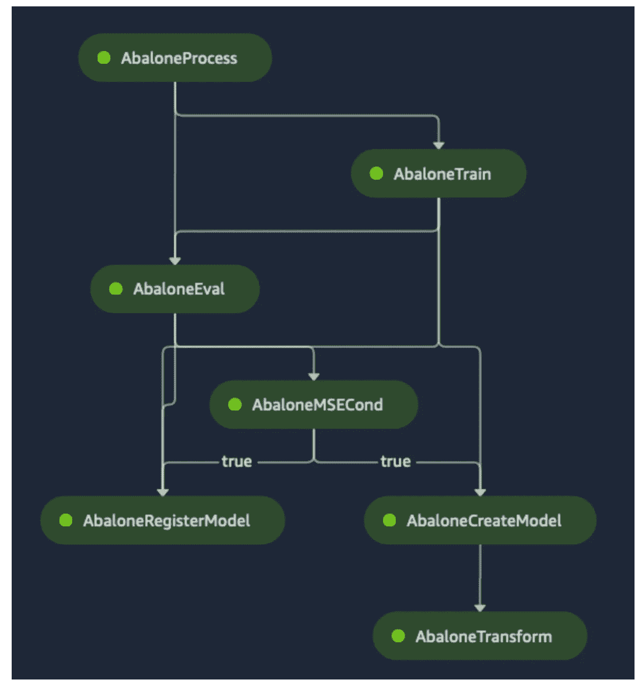

# AWS 上的 ML 概述

> 原文：<https://towardsdatascience.com/an-overview-of-ml-on-aws-d3c0ada16dac?source=collection_archive---------27----------------------->

## 从自动人工智能服务到构建定制深度学习模型的全面的 ML 产品资源集

图片来自 [Unsplash](https://unsplash.com/photos/r22qS5ejODs)

当你开始在本地笔记本或环境之外看待 ML 时，你就开始进入云计算的世界。像 AWS、Azure 和 GCP 这样的提供商正在他们各自的云中提供一套令人难以置信的 ML 服务，可以帮助你将 ML 带到生产级**规模**。更令人难以置信的是，对于所有程序员来说，ML 正在慢慢地*民主化*。随着人工智能的发展，算法背后的许多理论和知识都被抽象成了 AutoML 服务，使得没有人工智能经验的开发人员能够启动由尖端人工智能驱动的应用程序。这些 Auto-AI 服务**涵盖了不同 ML **领域**的**种类**，例如 **NLP** 、**计算机视觉**、**时间序列预测、**等等。尽管如此，仍然需要使用 TensorFlow、PyTorch、SKLearn 等框架的定制模型**。AWS 提供各种各样的服务，这些服务都属于建筑风格。在本文中，我们将探索 AWS 中这两个不同领域提供的大量服务。我还将附上这些**服务**的**所有**的**代码样本**、**文档**和其他**资源**

# 目录

## 1.基于 AutoML/API 的 ML(需要较低的 ML 理论知识)

*   [领悟](https://aws.amazon.com/comprehend/)
*   [重新认识](https://aws.amazon.com/rekognition/?blog-cards.sort-by=item.additionalFields.createdDate&blog-cards.sort-order=desc)
*   [个性化](https://aws.amazon.com/personalize/)
*   [翻译](https://aws.amazon.com/translate/)
*   [转录](https://aws.amazon.com/transcribe/)
*   [预测](https://aws.amazon.com/forecast/)
*   [其他](https://aws.amazon.com/machine-learning/ai-services/)

## 2.AWS SageMaker(更适合数据科学家/定制模型构建)

*   [简介](https://aws.amazon.com/sagemaker/)
*   [管道](https://aws.amazon.com/sagemaker/pipelines/)
*   [亚马逊算法](https://docs.aws.amazon.com/sagemaker/latest/dg/algos.html)
*   [SageMaker 上的定制型号](https://docs.aws.amazon.com/sagemaker/latest/dg/docker-containers.html)

## 3.结论

# 1.基于自动人工智能/API 的 ML(需要较低的 ML 理论知识)

以下服务属于基于 AWS ML API 的服务。在这里，您不必像我们传统的做法那样构建定制的 ML 模型，而是可以通过一个 [**AWS SDK**](https://aws.amazon.com/tools/) 如[**bot O3**](https://boto3.amazonaws.com/v1/documentation/api/latest/index.html)(Python SDK)以编程方式**访问**这些服务，以调用这些**高级 API 的**，并将它们集成到您的应用程序中。

## 包含

理解是亚马逊的主要自然语言处理服务，它自动化了许多流行的自然语言处理任务，如情感分析、命名实体识别和主题建模。understand 还在[自定义分类](https://docs.aws.amazon.com/comprehend/latest/dg/auto-ml.html)中增加了另一层，您可以通过 ML powering understand 提供数据来训练自定义模型。[理解医疗](https://docs.aws.amazon.com/comprehend/latest/dg/comprehend-med.html)是理解的扩展，但是是为处理临床文本而定制的，例如医生笔记和测试结果。

资源:

*   [Boto3 文档](https://boto3.amazonaws.com/v1/documentation/api/latest/reference/services/comprehend.html)
*   [情感分析&实体提取示例](/sentiment-analysis-entity-extraction-with-aws-comprehend-618a7bec60b8)
*   [医学 NER 的例子](/medical-ner-with-aws-comprehend-3f27db0a8255)
*   [Python 代码示例](https://docs.aws.amazon.com/code-samples/latest/catalog/code-catalog-python-example_code-comprehend.html)

## 重新认识

Rekognition 是亚马逊的主要自动计算机视觉服务。Rekognition 具有多种任务功能，例如:人脸检测、文本检测、自定义标签等。[定制标签](https://docs.aws.amazon.com/rekognition/latest/customlabels-dg/what-is.html)特别允许您为您正在尝试识别的特定用例/对象或项目提供/训练定制数据集。

**资源**:

*   [Boto3 文档](https://boto3.amazonaws.com/v1/documentation/api/latest/reference/services/rekognition.html)
*   [带认知的情感检测](/building-an-emotion-detection-application-54697de9ae01)
*   [Python 代码示例](https://docs.aws.amazon.com/code-samples/latest/catalog/code-catalog-python-example_code-rekognition.html)

## 使个性化

亚马逊个性化帮助用户建立实时**个性化推荐**。个性化使您可以带来一个自定义数据集，您可以像传统方式一样对其进行预处理和处理。您以个性化可以理解的特定格式提供模式和数据，它创建一个**配方**:个性化算法，提供基于常见用例的训练模型。创建配方后，Personalize 会创建一个**解决方案**，让您定制培训。在此之后部署您的个性化模型，您使用该解决方案创建一个称为个性化**活动**的东西，用于实时推荐。这些步骤被清晰地抽象出来，在构建模型之前，理解个性化的一般流程和术语是非常重要的。

**资源**:

*   [Boto3 文档](https://boto3.amazonaws.com/v1/documentation/api/latest/reference/services/personalize.html)
*   [配方、解决方案、活动说明](https://docs.aws.amazon.com/personalize/latest/dg/working-with-predefined-recipes.html)
*   [Python 代码示例](https://github.com/aws-samples/amazon-personalize-samples)

## 翻译

亚马逊翻译是一款支持 71 种语言进行**翻译**的神经机器翻译工具。翻译还支持基于您的用例的[实时](https://docs.aws.amazon.com/translate/latest/dg/sync.html)和[批量翻译](https://docs.aws.amazon.com/translate/latest/dg/async.html)。Translate 的另一个巧妙之处是可以附加的自定义术语。如果您需要翻译硬编码的特定单词或实体，您可以将它们插入一个自定义词典(例如:csv 文件), Translate 会将其添加到模型翻译中。

**资源**:

*   [Boto3 文档](https://boto3.amazonaws.com/v1/documentation/api/latest/reference/services/translate.html)
*   [Python 代码示例](https://docs.aws.amazon.com/translate/latest/dg/examples-python.html)

## 转录

Amazon Transcribe 使用自动语音识别(ASR)为他们的应用程序添加了语音到文本的功能。转录支持[异步](https://docs.aws.amazon.com/transcribe/latest/dg/batch-med-transcription.html)和[实时](https://docs.aws.amazon.com/transcribe/latest/dg/streaming.html)转录。与“理解”类似，还有一个被称为[亚马逊转录医疗](https://docs.aws.amazon.com/transcribe/latest/dg/what-is-transcribe-med.html)的医疗扩展。转录医学符合 HIPAA 标准，您可以通过提供[自定义医学词汇](https://docs.aws.amazon.com/transcribe/latest/dg/vocabulary-med.html)来提高转录准确性。

资源:

*   [Boto3 文档](https://boto3.amazonaws.com/v1/documentation/api/latest/reference/services/transcribe.html)
*   [实时流示例(Java)](https://github.com/aws-samples/aws-transcribe-streaming-example-java)
*   [Python 代码示例](https://docs.aws.amazon.com/code-samples/latest/catalog/code-catalog-python-example_code-transcribe.html)

## 预报

Amazon Forecast 使用 ML 来处理**时间序列**数据和其他功能来建立预测模型。您可以将任何历史数据与您拥有的其他相关数据集结合起来，并上传到 Forecast，Forecast 将自动分析这些数据以识别重要的属性，并选择合适的[预测算法](https://docs.aws.amazon.com/forecast/latest/dg/aws-forecast-choosing-recipes.html)(也可以由您选择)，它可以为您创建预测文件以集成到您的应用程序中。为了比较预测提供的算法，请点击这里查看文档。

**资源**:

*   [Boto3 文档](https://boto3.amazonaws.com/v1/documentation/api/latest/reference/services/forecast.html)
*   [Python 代码示例](https://docs.aws.amazon.com/forecast/latest/dg/getting-started-python.html)

## 其他人

总结一下自动人工智能的部分，有很多其他的自动人工智能服务，你也可以在你的空闲时间探索。我已经列出了 AWS 的一些其他产品以及它们的基本功能。

*   [Amazon Textract](https://aws.amazon.com/textract/) :处理基于大量文本的文档数据以提取洞察力(例如:OCR)
*   [亚马逊肯德拉](https://aws.amazon.com/kendra/):搜索服务
*   [亚马逊波利](https://aws.amazon.com/polly/):文本到语音服务
*   [亚马逊 Lex](https://aws.amazon.com/lex/) :聊天机器人服务(对话界面)
*   [其他服务](https://aws.amazon.com/machine-learning/ai-services/)

# 2.AWS SageMaker

## 介绍

SageMaker 是一个覆盖整个 ML 生命周期的巨大服务，所以在未来我会看到更多的文章和资源来深入研究它的每一个功能。在这篇文章中，我们将探索它对构建 **ML 管道**的特性的介绍，它涵盖了 SageMaker 的 **MLOps** 部分。我们将介绍**提供的内置算法**/模型，以及关于如何将**定制模型**引入框架(如 TensorFlow)的资源，涉及 SageMaker 的培训/托管部分。 **SageMaker** 在**核心**上工作的方式是通过 [**笔记本实例**](https://docs.aws.amazon.com/sagemaker/latest/dg/nbi.html) ，它们是**计算实例**，让你在实例上的传统 **Jupyter 笔记本/实验室**设置中构建、训练和部署 ML 模型。

## SageMaker 管道公司

ML 生命周期的很大一部分是创建和自动化端到端的管道。SageMaker Pipelines 是一个 **CI/CD 服务**，帮助创建和**自动化 ML 工作流程**从预处理到培训等等。在 Pipelines 中，您可以使用 [SageMaker Python SDK](https://sagemaker.readthedocs.io/en/stable/workflows/pipelines/sagemaker.workflow.pipelines.html) 来定义您的工作流，以定义各个步骤。下面显示了一个来自管道示例的示例工作流。

管道示例工作流程(截图来自[文档](https://docs.aws.amazon.com/sagemaker/latest/dg/define-pipeline.html)

在 Pipeline 中，您可以与各种其他 SageMaker 功能进行交互，例如[功能存储](https://aws.amazon.com/sagemaker/feature-store/)、[模型注册](https://docs.aws.amazon.com/sagemaker/latest/dg/model-registry.html)、培训和部署，从而帮助您完成 ML 端到端生命周期。

资源:

*   [管道车间](https://sagemaker-immersionday.workshop.aws/lab6.html)
*   [管道示例](https://github.com/aws/amazon-sagemaker-examples/tree/master/sagemaker-pipelines)
*   [使用 Python SDK 的 SageMaker 管道](https://sagemaker.readthedocs.io/en/stable/workflows/pipelines/sagemaker.workflow.pipelines.html)

## 亚马逊算法

对于实际的模型训练和部署，SageMaker 提供了一套自己开发的内置算法。这些内置算法虽然类似于我们讨论的 Auto-AI 服务，但为我们添加预处理代码或在您正在构建的整体模型中引入更多库/包提供了**更多的灵活性**。关于这些内置算法或您带来的任何自定义算法，需要注意的一个关键特性是，SageMaker 上的**所有东西都是通过 **Docker** 容器化的** **。为了**访问**这些内置算法，你需要**提取它们的图像**，如果是定制模型，你需要提供一个 Docker 图像。对于参考资料，我附上了内置算法及其功能的列表，以及 SageMaker 上的容器入门，以了解不同的部署选项。**

**资源**

*   [内置算法](https://docs.aws.amazon.com/sagemaker/latest/dg/algos.html)
*   [带 SageMaker 的码头工人](https://docs.aws.amazon.com/sagemaker/latest/dg/docker-containers.html)

## SageMaker 上的定制模型

SageMaker 提供的最大灵活性是**在你选择的**框架** **中带来你自己的模型/容器**。SageMaker 提供了内置的 Docker 图像，您可以为 TensorFlow、PyTorch 和 SkLearn 等流行的框架提取这些图像。您可以通过提供自己的定制训练/推理模型代码来构建这些图像。这种方法被称为*自带模型/脚本模式*。为了获得训练/推理的最大灵活性，有一种称为*自带容器* 的东西，如果您正在使用 AWS 不提供的框架，您可以在其中提供一个定制的 Docker 容器，其中包含您的模型的所有依赖项。SageMaker 中有各种不同的培训/托管选项，您可以根据自己的计算/模型需求进行选择。**

资源:

*   [脚本模式](https://aws.amazon.com/blogs/machine-learning/bring-your-own-model-with-amazon-sagemaker-script-mode/)
*   [脚本模式样本](https://github.com/aws-samples/amazon-sagemaker-script-mode)
*   [自带容器](https://sagemaker-examples.readthedocs.io/en/latest/training/bring_your_own_container.html)
*   [SageMaker 上的自定义 TensorFlow2 示例](/training-and-deploying-custom-tensorflow-models-with-aws-sagemaker-72027722ad76)

# 结论

本文概述了 AWS 提供的一些 ML 功能。每个服务都有自己的大量资源和主题来帮助优化和构建令人难以置信的 ML 应用程序。您可以将其中许多与其他 AWS 服务结合使用，以复杂的方式解决极其复杂的问题。

我希望这篇文章对 AWS 必须提供的 ML 功能/服务的介绍和概述有所帮助。我计划在未来撰写并提供更多关于这些服务和 SageMaker 功能的深入/具体的例子，所以请确保继续关注[媒体](https://ram-vegiraju.medium.com/)以跟上我的工作。如果你对 ML & AWS 感兴趣，请随时在评论中留下任何反馈或通过 [Linkedln](https://www.linkedin.com/in/ram-vegiraju-81272b162/) 与我联系。感谢您的阅读！