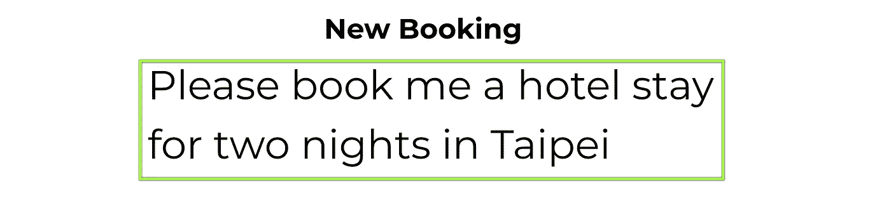

# 自然语言处理应用综述

> 原文：<https://towardsdatascience.com/an-overview-of-natural-language-processing-caa471819e06?source=collection_archive---------52----------------------->

## 用深度学习处理文本的实用方法，已解释

自然语言处理(NLP)是人工智能的一个分支，包括一个广泛的软件领域，旨在推理和处理文本数据。NLP 技术正在快速发展，很难找出哪种 NLP 技术对行业影响最大。

在本帖中，我们将介绍和讨论自然语言处理技术，这种技术已经在现实生活中广泛采用和使用。

让我们开始吧。

# 自然语言处理简史

自然语言处理领域可以追溯到艾伦·图灵(Alan Turing)和图灵测试——能够如此有效地教会计算机用自然语言对话，以至于它会被误认为是人类吗？因此，NLP(以及计算机视觉)是现代人工智能研究的核心。

# 基于规则的自然语言处理

NLP 经历了两个不同的阶段。第一种通常被称为“优秀的老式人工智能”，其中算法被编写为使用逻辑规则解析语言。这些技术导致了 80 年代、90 年代和 2000 年代的一系列 NLP 技术，包括知识库、基于规则的推理机和语法分析器。

# 机器学习

最近，机器学习技术在 NLP 中的引入导致了新技术的寒武纪大爆发，其中使用大型训练语料库来监督深度学习模型，以创建围绕语言的灵活算法。本文将关注自然语言处理中的机器学习方法，包括:

*   文本分类
*   槽提取
*   对话系统
*   文本翻译

可以构建不属于这些更完善的技术的自定义 NLP 模型，但是考虑您的任务是否适合这些类别之一或者这些 NLP 技术的集合总是有用的，因为这将允许您为您的项目利用大量开源工作。

# 文本分类

自然语言处理中的许多任务归结为对文本进行分类的任务。在文本分类中，给机器学习算法一个类别选择，它可以放置一段给定的文本。

# 文本分类示例

一个示例文本分类预测

例如，如果我们正在训练一个机器人来对旅行社的用户请求进行分类，我们可以让机器人将短语“请为我在台北预订两晚的酒店住宿”放入“新预订”类别中。文本分类算法的任务是决定该分类优于其他可能的类别。

# 文本分类训练

为了训练一个文本分类器，你需要收集一个相似例子的数据集来展示你的机器学习算法。这个数据集将通过一个训练循环，反复通知模型它应该做出的决定。

# 文本分类知识库

我们最喜欢的文本分类库包括:

*   用于分类的文本转换器的高级实现。
*   [fastai.text](https://docs.fast.ai/tutorial.text.html) — fastai 很好地实现了各种文本分类器。

# 槽提取

自然语言处理问题的另一个大子集属于槽提取(也称为信息提取或槽填充)的管辖范围。Slot extraction 查看一个句子并提取相关的信息，将它们传递到 Slot 类别中。

# 插槽提取示例

示例时隙提取预测

例如，在我们的 travel agent bot 示例中，我们可能需要文本分类所提供的额外信息，并且我们可能希望训练一个槽提取模型来提取相关细节以完成用户的请求，而不是必须通过算法来请求额外信息。

# 插槽提取训练

为了训练槽提取模型，您将需要收集训练数据集，就像分类一样。在这个数据集中，要提取的句子中的跨度应该突出显示，并用它们特定的槽标签进行标记。

# 插槽提取存储库

我们最喜欢的一些槽提取库包括:

*   [JointBert](https://github.com/monologg/JointBERT) —一个使用 Bert 进行插槽提取的非常好的实现
*   [LSOIE](https://github.com/Jacobsolawetz/large-scale-oie) —用于开放插槽提取的开放信息提取报告

# 对话系统

对话系统位于分类和填充槽的交叉点。在对话系统中，用户输入通过一个分类模型被分组为“意图”,然后通过一个槽填充模型进行调查，以寻找与用户请求相关的信息。对话系统可以在同一个模型中进行多次对话。

对话系统资源

你可以使用像 JointBert 这样的开源技术，或者使用 Rasa 或 Google 的 DialogueFlow 这样的聊天机器人服务来构建自己的对话系统。

# 文本翻译

文本翻译是 NLP 技术产生重大影响的另一个领域。文本翻译接受一种语言的文本输入，并依次预测目标语言的翻译序列。

文本翻译的一个例子

在我们的酒店预订示例中，我们可能希望将文本翻译成给定的目标语言，比如西班牙语。

与文本分类和槽填充不同，文本翻译不太具有可定制性，通常您将使用现成的模型，该模型已经过培训，可以在您选择的语言之间进行翻译。

# 结论

从事涉及自然语言处理的项目是一个令人兴奋的时刻，因为由机器学习驱动的自然语言处理技术正在迅速发展，并在行业中产生真正的影响。

在这篇文章中，我们回顾了自然语言处理中常用的一些关键技术，包括文本分类、槽提取、对话系统和文本翻译。

一如既往，快乐训练！

*原载于 2021 年 1 月 6 日*[*https://blog . apex advisors . ai*](https://blog.apexadvisors.ai/overview-of-natural-language-processing/)*。*