# 用 5 分钟概述熊猫系列

> 原文：<https://towardsdatascience.com/an-overview-of-pandas-series-in-5-minutes-eb0186831e53?source=collection_archive---------39----------------------->

## Python 熊猫教程—第 1 部分

## 掌握数据科学家最流行的 Python 数据结构之一


图一。还有什么图标可以更好地代表熊猫的数据帧？(照片由[弗莱彻·普莱德](https://unsplash.com/@fletcher_pride?utm_source=medium&utm_medium=referral)在 [Unsplash](https://unsplash.com?utm_source=medium&utm_medium=referral) 上拍摄)

熊猫是我们一直认为理所当然的图书馆之一。当我们从事数据项目时，我们总是专注于使用最新、最酷的深度学习框架(如 TensorFlow 或 PyTorch)来构建最佳模型。Pandas 是我们每次都不可避免地在预处理中使用的库，并且很快就忘记了它。嗯，熊猫的力量恰恰来源于此:它的方便。在本帖中，我们将介绍我们在 pandas 库中看到的主要数据结构之一:`Series`

> 让我们简单介绍一下

# 熊猫是什么？

Pandas 是一个 Python 库，它提供了灵活且富于表现力的数据结构，适合执行快速数学运算。它是一个全面易用的数据分析库，旨在成为领先的开源语言中立的数据分析工具。你没听错:Pandas 开发团队的目标是将其功能扩展到 Python 之外。

由于 Pandas 扩展了 NumPy 的功能，并且是在 NumPy 的基础上构建的，所以它几乎是作为 NumPy 的扩展来运行的。Pandas 还提供了几种数据可视化方法，这对于从数据集中获得洞察力非常有用。在进入高级部分之前，在这篇文章中，我们将只关注两个主要对象类型中的第一个:熊猫系列对象。

# 熊猫系列

一维序列和二维数据帧是 pandas 中的两种主要数据结构。尽管您可以创建更高维度的数据帧，但熊猫数据帧对象通常是二维的。另一方面，熊猫系列总是一维的。以下是系列对象的基本可视化:

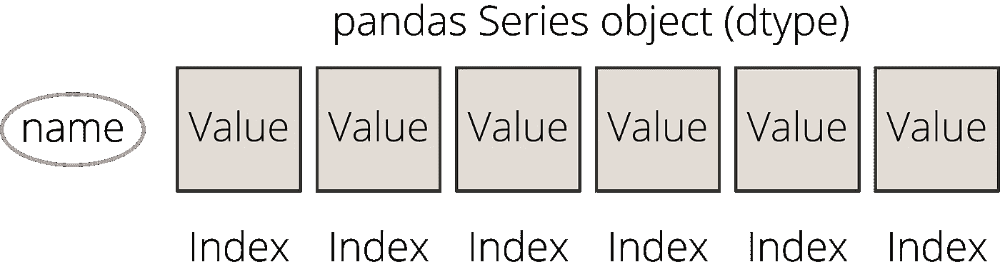

图二。熊猫系列物品的可视化

# 进口熊猫

因为我们将在这篇文章中编码，所以请确保用下面的代码行导入 Pandas 库(*也请导入 NumPy 库*):

```
import pandas as pd
import numpy as np
```

# 熊猫系列

Series 是一维数组，能够保存任何数据类型，如整数、字符串、NumPy 对象和其他 Python 对象。它们也被标记，这是相对于 NumPy 数组的一个扩展。这些标签在熊猫 API 中被称为`index`。

## 创建系列对象

创作一个熊猫系列相当容易。你可以使用主熊猫 API 中的`pandas.Series()`函数，并将你想要转换的数据传递给熊猫系列对象，如下所示:

```
# The data and index variables must be defined # see below
s = pd.Series(data, index=index)
```

好吧，你能传递的数据可以很不一样。可以传递的一些合适的数据类型有:

*   一只熊猫`dict`或`list`；
*   Numpy 数组；
*   像单个整数一样的标量值；
*   甚至是一串。

为了充分利用这个系列，最好传递一个带有索引值的类似列表的对象。然而，正如你在上面看到的，熊猫 API 在创建一个系列对象时非常灵活。以下是熊猫系列对象的一个示例:

```
data = [1,2,3,4,5]
index = ["a","b","c","d","e"]s = pd.Series(data=data, index=index, name='series 1')
print(s)
```

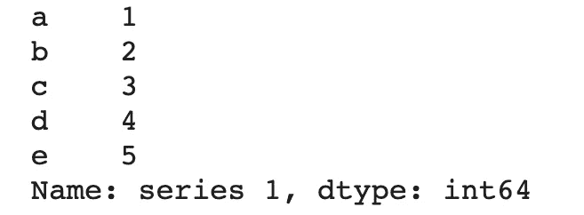

图 3。由 1 到 5 的数字组成的 Series 对象示例(作者提供的数字)

## 属性

一旦创建了`Series`对象，就可以使用属性来查看关于系列对象的信息:

```
print("Index:", s.index)
print("Values:", s.values)
print("Data Type:", s.dtype)
print("Name of the Series:", s.name)
print("Length of the Series", len(s))
print("Descriptive statistics about the Series\n", s.describe())
print("Shape of the Series", s.shape)
```


图 4。可通过系列对象属性查看的信息(按作者分类)

您也可以使用`Series.rename()`功能重命名系列对象:

```
s = s.rename(“new name”)
print(“Name of the Series:”, s.name)
```

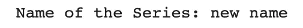

图 5。重命名系列对象(作者图)

## 随机访问值和设置新值

series 对象的行为类似于 dictionary 对象；因此，也可以通过索引标签访问随机值。此外，您还可以将索引值用作属性:

```
# Access a random value like in dictionary objects
print("The val. at 'a' is", s['a'])# Use index values as an attribute
print("The val. at 'b' is", s.b)# get() function for random access
print("The val. at 'c' is", s.get("c"))# get() function for missing valuesprint("The val. at 'f'", s.get("f", "does not exist"))
```

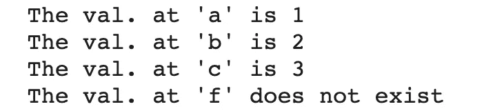

图 6。随机访问系列对象值(图由作者提供)

此外，您可以使用我们用于 list 对象和 NumPy 数组的相同方法来访问 Series 对象的切片:

```
print('The first two elements of the Series object are:\n', s[:2])
```

但是，这还不是全部！pandas API 还提供特定的属性来访问特定的值。我们有四个具体选项:`Series.at`、`Series.iat`、`Series.loc`和`Series.iloc`。简而言之，下面是它们在一个句子中的作用:

*   `**Series.iat**` →使用索引位置访问单个值；
*   `**Series.at**` →使用索引名称访问单个值；
*   `**Series.loc**` →按索引名访问一组值(一个切片)。
*   `**Series.iloc**` →通过索引位置访问一组值(切片)。

因此，`Series.loc`和`Series.iloc` 属性也可以用于一组值，而`Series.at`和`Series.iat`属性用于单值访问。

让我们用一个例子来看看它们:

```
print(‘Output of s.at[“a”]’)
print(s.at[“a”])print(‘Output of s.loc[“a”:”b”]’)
print(s.loc[“a”:”b”])print(‘Output of s.iat[0]’)
print(s.iat[0])print(‘Output of s.iloc[0:2]’)
print(s.iloc[0:2])
```

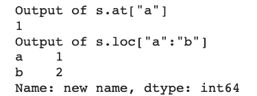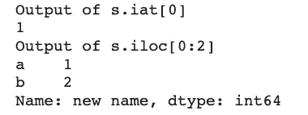

图 7 和图 8。访问系列对象的切片和单个值(作者图)

最后，我们可以使用所有这些属性为给定的片或单个元素设置新值，如下所示:

```
print(“Before\n”, s)# Setting values by label:
s.at[“a”] = 100# Setting values by position
s.iat[3] = 500# Setting by assigning with a list object:
s.loc[“b”:”c”] = [33, 44]# Setting by assigning with a NumPy array:
s.iloc[4:5] = np.array([111])print(“After\n”, print(s))
```

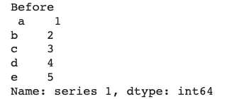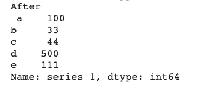

图 9 和图 10。为系列对象设置新值之前和之后(作者提供的图表)

## 矢量化运算

对序列执行矢量化运算也非常容易，几乎与对整数值执行操作一样容易。以下是我们进行加法、除法和指数运算的一些例子:

```
s + 3
s / 5
s * s
```

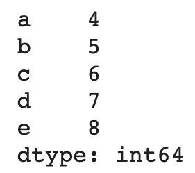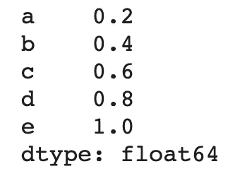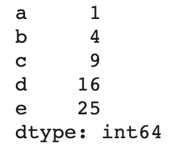

图 11。加法运算(图由作者提供)|图 12。除法运算(作者图)|图 13。指数运算(图由作者提供)

但是，你并不局限于这些基本操作。您可以使用`Series.apply()`函数来传递自定义函数或 lambda 函数。例如，我们可以用下面的代码将 Series 对象的值乘以 2:

```
s.apply(lambda x: x* 2)
```

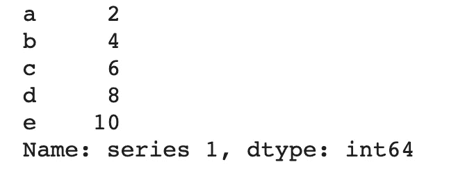

图 14。Lambda 函数在系列对象中的应用(作者提供的图片)

由于这是一个介绍性的帖子，我将在这里完成它。现在你对熊猫系列物品有了更多的了解。在下一篇文章中，我们将深入研究 DataFrame 对象，这种二维数据结构对于数据科学任务非常有用。

# 订阅邮件列表获取完整代码

如果你喜欢这篇文章，想在 Google Colab 上获得我的教程文章的代码，并尽早获得我的最新内容，考虑[订阅:✉️的邮件列表](http://eepurl.com/hd6Xfv)

> [*订阅现在*](http://eepurl.com/hd6Xfv)

如果你对深度学习感兴趣，也可以看看我的人工智能内容指南:

<https://oyalcin.medium.com/a-guide-to-my-content-on-artificial-intelligence-c70c9b4a3b17>  

既然您正在阅读这篇文章，我相信我们有着相似的兴趣，并且现在/将来会从事相似的行业。那么我们就通过[*Linkedin*](https://linkedin.com/in/orhangaziyalcin/)*来连线吧！请不要犹豫发送联系请求！*[*Orhan g . Yal n—Linkedin*](https://linkedin.com/in/orhangaziyalcin/)