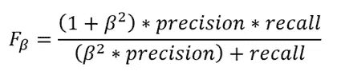

# Python 中机器学习(分类)算法的性能评价指标综述

> 原文：<https://towardsdatascience.com/an-overview-of-performance-evaluation-metrics-of-machine-learning-classification-algorithms-7a95783a762f?source=collection_archive---------19----------------------->


由 [Unsplash](https://unsplash.com?utm_source=medium&utm_medium=referral) 上的科坦·拉杰普特[拍摄的照片](https://unsplash.com/@ketan_rajput?utm_source=medium&utm_medium=referral)

## 使用 Python 函数开发分类模型并计算所有流行的性能评估指标

在我看来，性能评估是机器学习中最重要的部分。因为机器学习本身已经变得相当容易，因为有了所有的库和包。任何人都可以在不太了解幕后发生的事情的情况下开发机器学习。那么绩效评估可能是一个挑战。你如何评价那个机器学习模型的性能？

像 Weka 这样的软件会在你建立模型的时候自动提供大量的性能评估参数。但是在 sklearn 或 R packages 等其他工具中，性能评估参数不会随模型自动提供。您必须选择评估模型性能的参数。

因此，我决定撰写这篇文章，总结分类模型的所有流行的性能评估指标。所以，它为你节省了一些时间。

在本文中，我将尝试使用公式、简单的解释以及使用实际示例的计算来简要解释分类模型的性能评估度量。我不会深入探究它们，因为这是一个概述或备忘单。

我们需要一个机器学习模型，在这个模型上我们将尝试所有的性能评估指标。因此，首先，我们将开发一个模型，然后逐个研究绩效评估指标。

这篇文章表现:

1.  特征的选择
2.  模型开发
3.  绩效评估方法

我将使用这个关于关节炎的数据集。该数据集包含其他参数，我们将使用这些参数来预测一个人是否患有关节炎。请随意从以下链接下载数据集:

<https://github.com/rashida048/Machine-Learning-BU/blob/main/arthritis.csv>  

让我们把重点放在模型开发上。但在此之前，我们需要选择功能。

## 特征选择

以下是该项目的数据集:

```
import pandas as pd
import numpy as npdf = pd.read_csv('arthritis.csv')
```

这个数据框太大了，我无法在这里显示截图。它总共有 108 列。这些是列:

```
df.columns
```

输出:

```
Index(['x.aidtst3', 'employ1', 'income2', 'weight2', 'height3', 'children', 'veteran3', 'blind', 'renthom1', 'sex1',
       ...
'x.denvst3', 'x.prace1', 'x.mrace1', 'x.exteth3', 'x.asthms1',
'x.michd', 'x.ltasth1', 'x.casthm1', 'x.state', 'havarth3'],
dtype='object', length=108)
```

最后一列“havarth3”是我们希望使用分类器预测的目标变量。这一栏告诉我们一个人是否有关节炎。它有两个价值。值 1 表示该人患有关节炎，值 2 表示该人没有关节炎。

其余的特征是输入参数。

```
X= df.drop(columns=["havarth3"])
y= df['havarth3']
```

使用 scikit-learn 库中的 train_test_split 方法，将数据集拆分为训练集和测试集:

```
from sklearn.model_selection import train_test_split
x_train, x_test, y_train, y_test = train_test_split(X, y, test_size=0.34, random_state = 35)
```

我们现在有了培训和测试集。但是我们需要所有的 108 个训练特征吗？也许不是。

我使用 sklearn 库中可用的 SelectKBest 函数从中选择了 9 个特性。

> 我没有随意选择 9 这个数字。我检查了不同的其他功能选择方法，并尝试了不同的数字，即使使用这种功能选择方法，最终选择了数字 9。

请随时查看我关于特性选择的文章。我在最后提供了链接。

```
from sklearn.feature_selection import SelectKBest
from sklearn.feature_selection import f_classifuni = SelectKBest(score_func = f_classif, k = 9)
fit = uni.fit(X, y)reduced_training = fit.transform(x_train)
reduced_test = uni.transform(x_test)
```

这些是通过上述特征选择方法选择的列:

```
x_train.columns[fit.get_support(indices=True)].tolist()
```

输出:

```
['employ1',
 'rmvteth4',
 'genhlth',
 'x.age.g',
 'x.age80',
 'x.ageg5yr',
 'x.age65yr',
 'x.phys14d',
 'x.hcvu651']
```

这 9 个特征将用于分类器。

## 模型开发

有这么多可用的分类器。我在这里选择一个随机的森林分类器。如果您使用 sklearn 库，这相当简单。只需导入分类器，传递超参数并使训练数据适合它。

```
from sklearn.ensemble import RandomForestClassifierclf = RandomForestClassifier(max_depth=6, random_state=0).fit(reduced_training, y_train)
```

分类器完成了！现在我们将转向我们做这一切的主要目的。那就是学习所有的绩效评估指标。

## 机器学习的性能评估指标

> **精度**

任何人都很容易想到的第一个是准确率。对于这个特定的项目，我们想知道准确预测了多少有关节炎和没有关节炎的人。让我们先检查一下训练集。

```
clf.score(reduced_test, y_test)
```

输出:

```
0.7417447018235584
```

是 74.17%。还不错！我们保留测试集来测试模型。让我们来测试一下:

```
clf.score(reduced_training, y_train)
```

输出:

```
0.7466666666666667
```

74.67%的训练集和测试集的准确率非常接近。所以这里不存在过度拟合的问题。

> **困惑 _ 矩阵**

很多时候我们需要处理非常敏感的数据。例如，如果我们正在处理一个诊断癌症患者的数据集。正确诊断非常重要。

请记住，在这些情况下，准确性度量可能具有欺骗性。因为数据集可能会非常倾斜。也许 98%或更多的数据是负面的。意味着 98%或更多的情况下，患者没有癌症并且是阴性的。只有少量的数据是肯定的。在这种情况下，如果我们的分类器准确率是 98%，这意味着什么？

这可能意味着它只能正确分类癌症阴性患者，而不能诊断任何癌症阳性患者。但准确率仍高达 98%。但是在这种情况下分类器有效吗？一点也不。

因此，知道正确分类的癌症阳性患者的百分比和正确分类的癌症阴性患者的百分比是重要的。

混淆矩阵是一个由四个数字组成的 2x2 矩阵，将结果细分为真阳性、假阳性、真阴性和假阴性。定义如下:

**真阳性**:真阳性是被正确预测为阳性的阳性数据的数量。

**假阳性**:假阳性显示实际上是阴性的数据量，但分类器将其归类为阳性。

**真阴性:**被正确预测为阴性的阴性数据的数量。

**假阴性:**假阴性是被分类器错误地预测为阴性的阳性数据的数量。

您可以比较实际标签和预测标签来找出所有这些。但是这里我将导入并使用 confuion_matrix 函数。

下面是使用混淆矩阵函数的函数，并使用字典将输出标记为 tp(真阳性)、“fp”(假阳性)、fn(假阴性)和“tn”(真阴性)。

```
def confusion_matrix_score(clf, X, y):
    y_pred = clf.predict(X)
    cm = confusion_matrix(y, y_pred)
    return {'tp': cm[0, 0], 'fn': cm[0, 1],
            'fp': cm[1, 0], 'tn': cm[1, 1]}
```

接下来，只需导入混淆矩阵函数并使用上面的函数:

```
from sklearn.metrics import confusion_matrix
cm = confusion_matrix_score(clf, reduced_test, y_test)
cm
```

输出:

```
{'tp': 692, 'fn': 651, 'fp': 397, 'tn': 2318}
```

这四个参数将用于查找其他几个绩效评估指标。

> **真阳性率(TPR)和假阳性率(FPR)**

真阳性率是真阳性(TP)除以总阳性(P)。如果我们看混淆矩阵，真正已经在那里了。但是总的积极因素是什么呢？总阳性是真阳性和假阴性的总和。

真阳性率(TPR) =真阳性/(真阳性+假阴性)

> 真实阳性率也称为敏感度。

同样，假阳性率是假阳性除以假阳性和真阴性之和。

假阳性率(FPR) =假阳性/(假阳性+真阴性)

TPR 和 FPR 都是非常重要的指标。如果我们看这个项目，我们可以发现有多少关节炎的人被正确检测出来，有多少没有关节炎的人被错误地检测为关节炎患者。为了计算它们，让我们从上面计算的混淆矩阵‘cm’中提取 tn、fp、fn 和 tp。

```
tn, fp, fn, tp = cm['tn'], cm['fp'], cm['fn'], cm['tp']tpr = tn/(tn+fn)
fpr = fn/(fn+tp)(tpr, fpr)
```

输出:

```
(0.7807342539575615, 0.4847356664184661)
```

真阳性率为 78.07%，假阳性率为 48.47%。

> **ROC 曲线和曲线下面积(AUC)**

ROC 曲线(受试者工作特征曲线)显示了真阳性率(TPR)和假阳性率(FPR)之间的权衡。针对不同的阈值计算 TRP 和 FPR。然后将这一系列的 TPR 和 FPR 绘制成 ROC 曲线。如果曲线下面积(AUC)更接近 1，则认为该模型是有技巧的。

所以，这里是如何找到 ROC 曲线和曲线下的面积

```
from sklearn import metrics
metrics.plot_roc_curve(clf, reduced_test, y_test)
```


该图显示曲线下面积(AUC)为 0.8。

> **精度和校准**

如果我们考虑这个项目，precision 将计算分类器正确预测关节炎患者的比例。这个公式可以写成:


从公式中可以看出，精度越高意味着真阳性越高，假阳性越低。

另一方面，回忆代表所有关节炎患者中被检测为关节炎患者的比例。如果你是第一次看到这个，这个定义可能看起来很混乱。公式如下:


所以，更高的回忆意味着更高的真阳性和更低的假阴性。回忆也叫敏感。

让我们计算一下精度和回忆:

```
precision = tn/(tn+fn)
recall = tn/(tn+fp)(precision, recall)
```

输出:

```
(0.7807342539575615, 0.8537753222836095)
```

> f 分数

如您所见，精确度意味着更低的误报率，召回意味着更低的误报率。当你将要优化一个机器学习模型的时候，你需要选择你想往哪个方向走:更低的误报率还是更低的漏报率？这取决于项目要求。

F1 分数是精确度和召回率的调和平均值。该公式如下所示:


注意公式。当精确度和召回率都达到完美时，f 值为 1。

f 分数的一个更通用的公式是:



当精确度或召回率需要比另一个更重要时，使用这个公式。β的三个常用值是 1、2 或 0.5。当精度和召回权重相同时使用 1，当召回权重高于精度时使用 2，当召回权重低于精度时使用 0.5。

在本次演示中，我将使用 1 和 2 的β值，并计算 f 1 和 f2 值:

```
f1_score = 2*precision*recall/(precision + recall)
f2_score = 5*precision*recall/(4*precision + recall)
(f1_score, f2_score)
```

输出:

```
(0.8156228008444757, 0.8380938607274568)
```

> **精确召回曲线**

精确-召回曲线显示了精确和召回之间的权衡。精确度-召回率曲线下的高区域意味着高精确度和高召回率。为此，使用不同的阈值来计算精确度和召回率。

但是没问题。我们不必手动计算不同阈值的精度和召回率。我们可以简单地使用 sklearn 库中可用的函数，该函数将为我们提供曲线以及曲线下的面积。

```
from sklearn.metrics import auc, plot_precision_recall_curve
plot_precision_recall_curve(clf, reduced_test, y_test)
```

输出:


曲线显示平均精度(AP)为 0.89。

这是中国曲线下的面积:

```
auc(recall, precision)
```

输出:

```
0.6555667752074759
```

> **马修斯相关系数**

MCC 是二进制分类的另一个很好的性能评估指标。它考虑了真阳性、假阳性和假阴性。它返回一个介于-1 和 1 之间的值。值 1 表示完美的分类器，0 表示不比随机猜测好，而-1 表示原始标签和预测标签之间完全不一致。公式如下:


使用 python 对本项目进行计算:

```
mcc = (tn*tp - fn*fp)/np.sqrt((tn+fn)*(tn+fp)*(tp+fn)*(tp+fp))
mcc
```

输出:

```
0.3919014959349731
```

也可以使用以下函数进行计算，该函数将预测 y 和原始 y 作为参数:

```
**from ** **sklearn.metrics ** **import** matthews_corrcoef 
matthews_corrcoef (y_test, y_pred)
```

输出:

```
0.3919014959349731
```

## 结论

所有指标都显示为二进制分类设置。但是相同的度量也可以用于多类分类问题。这种方法被称为一对一。说，你在计算精度。您将其中一个类设置为正类，将其余的类设置为负类。这样问题就变成二元的了。

希望这个关于绩效评估的讨论有所帮助。请随时在 Twitter 上关注我。

## 更多阅读

</four-popular-feature-selection-methods-for-efficient-machine-learning-in-python-fdd34762efdb>  </stochastic-gradient-descent-explanation-and-complete-implementation-from-scratch-a2c6a02f28bd>  </exploratory-data-analysis-of-text-data-including-visualization-and-sentiment-analysis-e46dda3dd260> [## 文本数据的探索性数据分析，包括可视化和情感分析

towardsdatascience.com](/exploratory-data-analysis-of-text-data-including-visualization-and-sentiment-analysis-e46dda3dd260) </an-ultimate-cheatsheet-of-data-visualization-in-seaborn-be8ed13a3697>  <https://pub.towardsai.net/dissecting-1-way-anova-and-ancova-with-examples-in-r-a3a7da83d742>  </detailed-guide-to-multiple-linear-regression-model-assessment-and-inference-in-r-146845067aa3> 