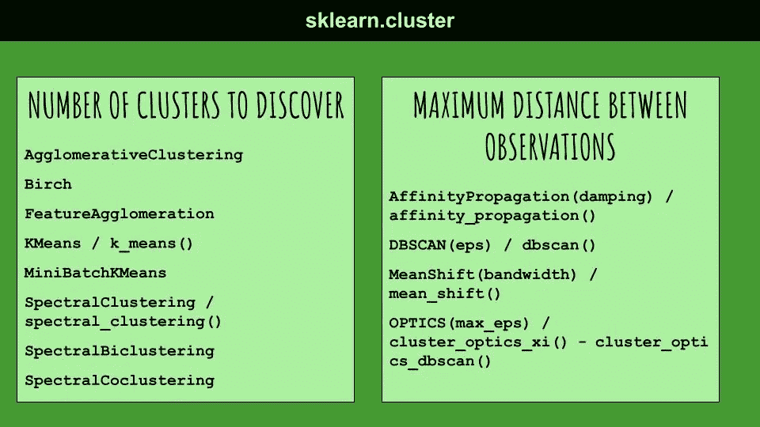

# scikit-learn 集群包概述

> 原文：<https://towardsdatascience.com/an-overview-of-the-scikit-learn-clustering-package-d39a0499814?source=collection_archive---------23----------------------->

## 机器学习

## scikit-learn 系列的第二集，解释了用于机器学习的著名 Python 库



作者图片

聚类是一种无监督的机器学习技术，其中既没有训练集，也没有预定义的类。当有许多记录时使用聚类，这些记录应该根据相似性标准(如距离)进行分组。

**聚类算法将数据集作为输入，并返回标签列表作为输出，这些标签对应于相关的聚类。**

聚类分析是一个迭代过程，其中，在每一步，当前迭代被评估，并被用于反馈到下一次迭代中对算法的改变，直到获得期望的结果。

scikit-learn 库提供了一个名为`[sklearn.cluster](https://scikit-learn.org/stable/modules/classes.html#module-sklearn.cluster)`的子包，它提供了最常见的聚类算法。

在这篇文章中，我描述了:

*   `sklearn.cluster`提供的类和功能
*   调谐参数
*   聚类算法的评价指标

# 1 类和功能

`sklearn.cluster`子包定义了两种应用聚类算法的方式:类和函数。

## 1.1 类别

在类策略中，您应该通过指定类参数来创建所需聚类类算法的实例。然后用数据拟合算法，最后，可以使用拟合的模型来预测分类:

```
**from** **sklearn.cluster** **import** AffinityPropagationmodel = AffinityPropagation()
model.fit(X)
labels = model.predict(X)
```

## 1.2 功能

除了类定义之外，Scikit-learn 还提供了执行模型拟合的函数。关于类，当只有一个数据集时，可以使用函数，该数据集必须在一个点上只分析一次。

在这种情况下，调用函数就足够了，以便获得集群化的数据:

```
**from** **sklearn.cluster** **import** affinity_propagationresult = affinity_propagatiom(X)
```

# 2 个调谐参数

根据要调整的主要参数，聚类算法可以分为两大类:

*   要在数据中发现的聚类数
*   观测值之间的最小距离。

## 2.1 要发现的集群数量

通常，在这组聚类算法中，**你至少要调优最大数量的聚类才能找到**。在`scikit-learn`中，通常这个参数被称为`n_clusters`。

`sklearn.cluster`包提供了以下属于该类别的聚类算法(为每个提供的算法显示了类和函数):

*   `[**AgglomerativeClustering**](https://scikit-learn.org/stable/modules/generated/sklearn.cluster.AgglomerativeClustering.html#sklearn.cluster.AgglomerativeClustering)`
*   `[**Birch**](https://scikit-learn.org/stable/modules/generated/sklearn.cluster.Birch.html#sklearn.cluster.Birch)`
*   `[**FeatureAgglomeration**](https://scikit-learn.org/stable/modules/generated/sklearn.cluster.FeatureAgglomeration.html#sklearn.cluster.FeatureAgglomeration)`
*   `[**KMeans**](https://scikit-learn.org/stable/modules/generated/sklearn.cluster.KMeans.html#sklearn.cluster.KMeans)`**/**
*   `[**MiniBatchKMeans**](https://scikit-learn.org/stable/modules/generated/sklearn.cluster.MiniBatchKMeans.html#sklearn.cluster.MiniBatchKMeans)`
*   `[**SpectralClustering**](https://scikit-learn.org/stable/modules/generated/sklearn.cluster.SpectralClustering.html#sklearn.cluster.SpectralClustering)`**/**
*   `[**SpectralBiclustering**](https://scikit-learn.org/stable/modules/generated/sklearn.cluster.SpectralBiclustering.html#sklearn.cluster.SpectralBiclustering)`
*   `[**SpectralCoclustering**](https://scikit-learn.org/stable/modules/generated/sklearn.cluster.SpectralCoclustering.html#sklearn.cluster.SpectralCoclustering)`

对于这类算法，主要的问题是找到最佳的聚类数。可以使用不同的方法，例如**弯头法。**

在肘形法中，计算并绘制出数量不断增加的聚类的*平方和*(例如从 1 到 20)。最佳的聚类数对应于斜率像弯头一样变化的点。

存在许多其他技术来计算最佳聚类数。 [Matt.0](https://medium.com/u/459e62b88a2a?source=post_page-----d39a0499814--------------------------------) 在他的一篇非常有趣的文章中阐述了它们，这篇文章名为[选择最佳聚类数的 10 个技巧](/10-tips-for-choosing-the-optimal-number-of-clusters-277e93d72d92)。

## 2.2 观测值之间的最小距离

在这类聚类算法中，最重要的调整参数是**距离。**在 scikit-learn 中，与距离相关的参数名称取决于算法。因此，我建议阅读与所选算法相关的文档，以发现距离参数的确切名称。

`sklearn.cluster`包提供了以下属于这个类别的聚类算法(括号中是距离参数的名称):

*   `[**AffinityPropagation**](https://scikit-learn.org/stable/modules/generated/sklearn.cluster.AffinityPropagation.html#sklearn.cluster.AffinityPropagation)**(damping)**`**/**
*   `[**DBSCAN**](https://scikit-learn.org/stable/modules/generated/sklearn.cluster.DBSCAN.html#sklearn.cluster.DBSCAN)**(eps)**`**/**
*   `[**MeanShift**](https://scikit-learn.org/stable/modules/generated/sklearn.cluster.MeanShift.html#sklearn.cluster.MeanShift)**(bandwidth)**` **/** `**mean_shift()**`
*   `[**OPTICS**](https://scikit-learn.org/stable/modules/generated/sklearn.cluster.OPTICS.html#sklearn.cluster.OPTICS)**(max_eps)**`**/**`**cluster_optics_xi()**`**——**`**cluster_optics_dbscan()**`

这类聚类算法的主要挑战是找到最佳距离值。一种可能的解决方案是用不同的距离值测试算法，并选择与最佳性能相关联的值。

# 3 项评估指标

`[sklearn.metrics.cluster](https://scikit-learn.org/stable/modules/classes.html#module-sklearn.metrics.cluster)`子包包含了用于评估聚类分析的指标。

评估聚类算法的性能并不是一件容易的事情，因为**它应该验证每条记录都被分配了正确的聚类** r，即每条记录与属于其聚类的记录的相似度要比与属于其他聚类的记录的相似度高得多。

关于集群评估的更多细节可以在[这篇有趣的文章](https://www.sciencedirect.com/topics/computer-science/clustering-quality)中找到。

有两种评价:

*   基于监督的评估
*   基于无监督的评估

## 3.1 基于监督的评估

基于监督的方法(也称为**外在方法**)利用**基础事实**来执行评估。其思想是将基本事实与聚类算法的结果进行比较，以计算得分。

Scikit-learn 提供以下基于监督的方法:

*   `[**adjusted_mutual_info_score**](https://scikit-learn.org/stable/modules/generated/sklearn.metrics.adjusted_mutual_info_score.html#sklearn.metrics.adjusted_mutual_info_score)`
*   `[**adjusted_rand_score**](https://scikit-learn.org/stable/modules/generated/sklearn.metrics.adjusted_rand_score.html#sklearn.metrics.adjusted_rand_score)`
*   `[**completeness_score**](https://scikit-learn.org/stable/modules/generated/sklearn.metrics.completeness_score.html#sklearn.metrics.completeness_score)`
*   `[**fowlkes_mallows_score**](https://scikit-learn.org/stable/modules/generated/sklearn.metrics.fowlkes_mallows_score.html#sklearn.metrics.fowlkes_mallows_score)`
*   `[**homogeneity_score**](https://scikit-learn.org/stable/modules/generated/sklearn.metrics.homogeneity_score.html#sklearn.metrics.homogeneity_score)`
*   `[**mutual_info_score**](https://scikit-learn.org/stable/modules/generated/sklearn.metrics.mutual_info_score.html#sklearn.metrics.mutual_info_score)`
*   `[**normalized_mutual_info_score**](https://scikit-learn.org/stable/modules/generated/sklearn.metrics.normalized_mutual_info_score.html#sklearn.metrics.normalized_mutual_info_score)`
*   `[**rand_score**](https://scikit-learn.org/stable/modules/generated/sklearn.metrics.rand_score.html#sklearn.metrics.rand_score)`

对于所有前面的函数，您应该至少提供两个参数:`labels_true`(地面真实类标签)和`labels_pred`(要评估的聚类标签)。

## 3.2 基于无监督的评估

基于非监督的方法(也称为内在方法)通过分析分类的分离程度和分类的紧密程度来评估聚类算法。

Scikit-learn 为聚类评估提供了以下固有方法:

*   `[**calinski_harabasz_score**](https://scikit-learn.org/stable/modules/generated/sklearn.metrics.calinski_harabasz_score.html#sklearn.metrics.calinski_harabasz_score)`
*   `[**davies_bouldin_score**](https://scikit-learn.org/stable/modules/generated/sklearn.metrics.davies_bouldin_score.html#sklearn.metrics.davies_bouldin_score)`
*   `[**silhouette_score**](https://scikit-learn.org/stable/modules/generated/sklearn.metrics.silhouette_score.html#sklearn.metrics.silhouette_score)`
*   `[**v_measure_score**](https://scikit-learn.org/stable/modules/generated/sklearn.metrics.v_measure_score.html#sklearn.metrics.v_measure_score)`

这类函数至少接受两个参数作为输入:`X`(样本之间成对距离的数组)和`labels`(每个样本的标签值)。

# 摘要

在本文中，我描述了由 Scikit-learn 库提供的 sklearn.cluster 子包，以及用于评估集群算法质量的评估指标。

有关集群的更多信息，您可以阅读 [Scikit-learn 官方文档](https://scikit-learn.org/stable/modules/clustering.html#clustering)。

如果你想发现 Scikit-learn 提供的其他类和函数，你可以[关注我](https://alod83.medium.com/)、[订阅我的邮件列表](https://alod83.medium.com/subscribe)，敬请关注。

如果你已经走了这么远来阅读，对我来说今天已经很多了。谢谢！你可以在[这篇文章](https://alod83.medium.com/which-topics-would-you-like-to-read-c68314dc6813)里读到更多关于我的内容。

# 相关文章

[](/an-overview-of-the-scikit-learn-library-episode-1-preprocessing-9b17ab4dde4f) [## Scikit-learn 库概述—第 1 集预处理

### 著名的用于机器学习的 Python 库的剧集中的描述。第一集讲的是…

towardsdatascience.com](/an-overview-of-the-scikit-learn-library-episode-1-preprocessing-9b17ab4dde4f) [](/how-to-improve-the-performance-of-a-supervised-machine-learning-algorithm-c9f9f2705a5c) [## 如何提高(监督)机器学习算法的性能

### 如今，每个数据科学家都能够编写代码来训练机器学习算法:加载一个代码就足够了

towardsdatascience.com](/how-to-improve-the-performance-of-a-supervised-machine-learning-algorithm-c9f9f2705a5c) [](/how-to-balance-a-dataset-in-python-36dff9d12704) [## 如何在 Python 中平衡数据集

### 本教程属于如何提高机器学习算法的性能系列。在本教程中，我…

towardsdatascience.com](/how-to-balance-a-dataset-in-python-36dff9d12704)