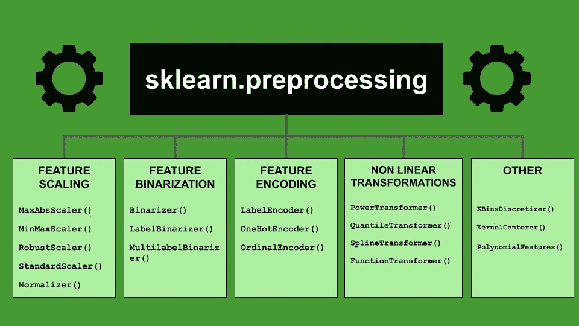

# Scikit-learn 库概述—第 1 集预处理

> 原文：<https://towardsdatascience.com/an-overview-of-the-scikit-learn-library-episode-1-preprocessing-9b17ab4dde4f?source=collection_archive---------27----------------------->

## 机器学习

## 著名的用于机器学习的 Python 库的剧集中的描述。第一集处理预处理子包。



作者图片

Scikit-learn 是一个非常流行的用于机器学习的 Python 库。最初由 David Cournapeau 于 2007 年开发，2010 年，当法国计算机科学和自动化研究所 INRIA 参与该项目时，它开始成长。2021 年 9 月，Scikit-learn 最新版本发布，即 1.0。

Scikit-learn 提供了机器学习过程中涉及的所有步骤，包括数据预处理、特征提取、模型选择、模型训练、模型评估和模型部署。

在这篇文章中，**我开始了一系列的情节，每一集都描述了 Scikit-learn** 提供的一个单独的子包。Scikit-learn 被组织成一个名为`sklearn`的主模块，这个主模块又被分成许多子模块。在本文中，我关注数据预处理。

用于数据预处理的所有类和函数都包含在子模块`sklearn.preprocessing`中，该子模块提供以下操作:

*   特征缩放
*   特征二值化
*   特征编码
*   非线性变换
*   其他的

# 1 特征缩放

特征缩放涉及数据规范化和标准化。在这篇由 [Baijayanta Roy](https://medium.com/u/583a83b12a79?source=post_page-----9b17ab4dde4f--------------------------------) 撰写的名为[关于特性缩放](/all-about-feature-scaling-bcc0ad75cb35)的有趣文章中，你可以理解规范化和标准化之间的区别。

Scikit-learn 为功能缩放提供了许多类:

*   `MaxAbsScaler()` —给定一个特征值列表，将列表中的每个值转换为 0 到 1 之间的数字。新值的计算方法是当前值除以列的最大值。
*   `MinMaxScaler()` —新值计算为当前值和最小值之差除以特征值列表的范围。
*   `RobustScaler()` —移除中间值，并根据四分位范围缩放数据。**该定标器对异常值具有鲁棒性**。
*   `StandardScaler()` —移除平均值并缩放至方差。这个定标器对应于经典的标准化过程。
*   `Normalizer()` —将每个值标准化为单位定额。

为了使用 whatever scaler，您应该首先实例化一个对象，例如:

```
scaler = StandardScaler()
```

然后你必须用所有可用的数据来拟合它:

```
scaler.fit(data)
```

最后，您可以将缩放器仅应用于感兴趣的数据(也可能包括所有数据)。数据集):

```
scaled_data = scaler.transform(subset_of_data)
```

或者，您可以用一个函数同时应用拟合和变换:

```
scaled_data = scaler.fit_transform(data)
```

你可以在我之前的文章中读到一个关于`MinMaxScaler()`和`MaxAbsScaler`的实际例子，标题是[使用 Python scikit 进行数据规范化-学习](/data-normalization-with-python-scikit-learn-e9c5640fed58)。

除了所描述的类之外，Scikit-learn 还提供了一些用于特征缩放的函数，这些函数可以直接在固定数组上使用，而无需拟合过程:

*   `maxabs_scale()`
*   `[minmax_scale](https://scikit-learn.org/stable/modules/generated/sklearn.preprocessing.minmax_scale.html#sklearn.preprocessing.minmax_scale)()`
*   `normalize()`
*   `robust_scale()`
*   `scale()`

# 2 特征二值化

特征二值化阈值数字特征获取布尔值，存储为 0 或 1。

Scikit-learn 为二进制化提供了许多类:

*   `Binarizer()` —根据阈值将特征值设置为 0 或 1。大于阈值的值设置为 1，小于或等于阈值的值设置为 0。
*   `LabelBinarizer()` —对于每个输出标签，构建一个向量，其中元素的数量等于唯一标签的数量，然后根据向量的每个元素在哪个标签中，为其分配 1 或 0。这个类与`OneHotEncoder()`非常相似，区别在于`LabelBinarizer()`用于输出类，而 OneHotEncoder 用于输入特性。更多细节，你可以在 Stackoverflow 上阅读[这个线程](https://stackoverflow.com/questions/50473381/scikit-learns-labelbinarizer-vs-onehotencoder)。
*   `MultilabelBinarizer()`—`LabelBinarizer()`的扩展，支持多标签。

类似于缩放器，二进制化器也应该首先被实例化，然后被拟合，最后被应用于数据:

```
binarizer = Binarizer()
binarizer.fit(data)
binarized_data = binarizer.transform(new_data)
```

或者:

```
binarizer = Binarizer()
data = binarizer.fit_transform(data)
```

Scikit-learn 还为二进制化提供了有用的函数，当元素数量固定时可以使用:

*   `binarize()`
*   `label_binarize()`

正如已经说过的特征缩放，请提醒保存安装的二进制化器，因为它将在模型部署期间使用。

# 3 特征编码

在模型能够被拟合和评估之前，分类特征必须被转换成数字。特征编码就是这种转换。

Scikit-learn 为特征编码提供了不同的类:

*   `LabelEncoder()` —用介于 0 和类别总数减 1 之间的值对输出标签进行编码。
*   `OneHotEncoder()`-对于每个输入分类特征，构建一个向量，其中元素的数量等于唯一标签的数量，然后根据向量的每个元素在哪个标签中，为其分配 1 或 0。
*   `OrdinalEncoder()` —每个唯一的类别值被分配一个整数值。然后，每个输入分类特征值被转换成一个数字，对应于相对类别。比如，“*苹果*”是 1，“*橘子*”是 2，“*甜瓜*”是 3。

每个编码的使用与前面的操作非常相似。因此，实例化所选的编码器，然后用分类数据对其进行拟合和转换就足够了。

# 4 非线性变换

Scikit-learn 还为非线性转换提供了一些有趣的类:

*   `PowerTransformer()` —应用幂变换使特征更像高斯。这对于建模需要数据正态性的情况很有用。
*   `QuantileTransformer()`-变换特征以遵循均匀分布或正态分布。这是通过利用分位数信息来实现的。
*   `SplineTransformer()` —基于单变量 B 样条函数生成新的特征矩阵。
*   `FunctionTransformer()` —应用自定义变换。

每个转换器必须首先被实例化，然后用数据拟合，最后通过`transform()`函数使用。

如果元素的数量是固定的，也可以直接通过以下函数进行变换，而无需任何拟合:

*   `quantile_transform()`
*   `power_transform()`

# 5 其他

`preprocessing`包还包括以下类:

*   `KBinsDiscretizer()` —将连续数据归入区间。
*   `KernelCenterer()` —将内核矩阵居中。
*   `PolynomialFeatures()` —生成一个新的特征矩阵，该矩阵包含所有次数小于或等于指定次数的特征的多项式组合。

还有一个有趣的功能:

*   `add_dummy_feature()`-用虚拟输入特征扩充数据集。

# 摘要

在本文中，我描述了 Scikit-learn `preprocessing`包的概述。许多操作和变换可应用于数据集，包括输入要素和输出类，包括要素缩放、要素二值化、要素编码、非线性变换和其他操作。要了解更多信息，你可以阅读预处理包上的官方 [Scikit-learn 文档](https://scikit-learn.org/stable/modules/classes.html#module-sklearn.preprocessing)。

如果你想发现 Scikit-learn 提供的其他类和函数，可以[关注我](https://alod83.medium.com/)，[订阅我的邮件列表](https://alod83.medium.com/subscribe)敬请关注。

如果你已经走了这么远来阅读，对我来说今天已经很多了。谢谢！你可以在[这篇文章](https://alod83.medium.com/which-topics-would-you-like-to-read-c68314dc6813)里读到更多关于我的内容。

# 你愿意支持我的研究吗？

你可以每月订阅几美元，解锁无限的文章。

# 奖金

**提醒将拟合的预处理操作保存到一个外部文件**，因为当您部署模型时，您需要将处理过程中使用的同一 scaler 应用到新数据:

```
from sklearn.externals import joblibjoblib.dump(prep, 'prep.pkl')
```

然后，要从文件中打开 scaler，您可以执行以下代码:

```
prep = joblib.load('prep.pkl')
```

# 相关文章

</machine-learning-getting-started-with-the-k-neighbours-classifier-d7e6b25f2b09>  </how-to-check-if-a-classification-model-is-overfitted-using-scikit-learn-148b6b19af8b>  </understanding-the-n-jobs-parameter-to-speedup-scikit-learn-classification-26e3d1220c28> 