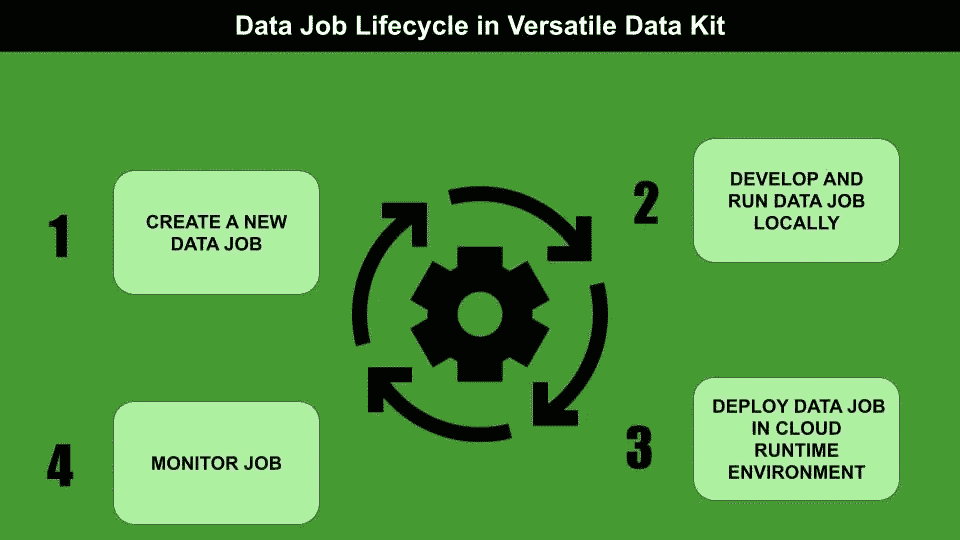
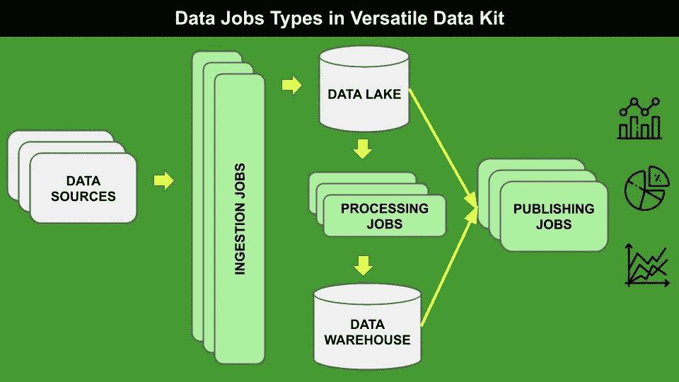
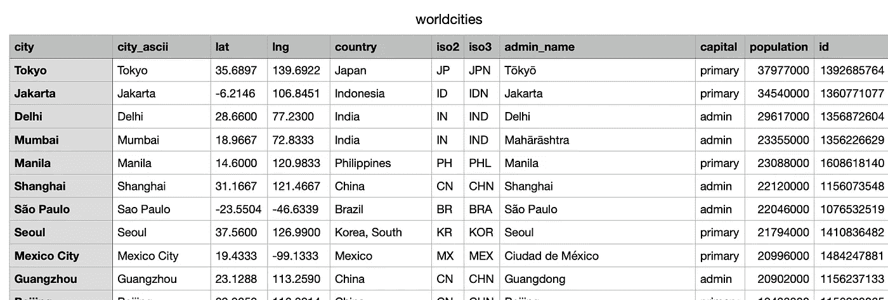
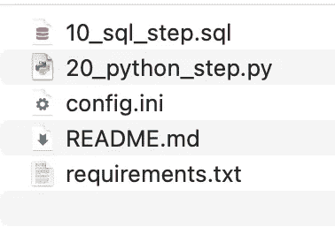

# 多功能数据工具包概述

> 原文：<https://towardsdatascience.com/an-overview-of-versatile-data-kit-a812cfb26de7?source=collection_archive---------23----------------------->

## 数据工程

## 开始使用多功能数据工具包，这是一个使数据工程师工作更高效的框架



作者图片

数据工程师的工作需要多种技能，包括构建数据管道、评估数据库、设计模式和管理模式。简而言之，**数据工程师加载、提取、操作和管理数据**。这项工作通常需要大量的技能，如果流程没有实现自动化，数据工程师就有可能犯很多错误，并在解决意外事件时浪费大量时间。

最近，我测试了一个非常有趣的框架，它方便了数据工程师的工作:由 [VMware](https://www.vmware.com/) 在 Github 上开源发布的[通用数据工具包](https://github.com/vmware/versatile-data-kit)。

多功能数据工具包允许数据工程师半自动执行任务。实际上，他们只需要关注数据和框架的一般配置，比如数据库设置和 cron 任务调度，而不用担心手动部署、版本控制和类似的事情。

换句话说，**多功能数据套件简化了数据工程师的生活，因为它允许以简单快速的方式管理数据，以及快速处理意外事件。**

数据工程师只需三个步骤就可以构建完整的数据处理工作负载(**数据作业**，在通用数据工具包语言中):

*   摄取数据
*   过程数据
*   发布数据

在本文中，我给出了通用数据工具包的概述，以及一个实际的用例，展示了它的潜力。欲了解更多信息，您可以阅读[多功能数据套件完整文档](https://github.com/vmware/versatile-data-kit/wiki/Introduction)。

# 1 概述

通用数据工具包是一个框架，使数据工程师能够开发、部署、运行和管理数据作业。**一个数据作业就是数据处理工作量。**

多功能数据套件由两个主要组件组成:

*   一个**数据 SDK，**提供了所有用于数据提取、转换和加载的工具，以及一个插件框架，允许根据数据应用的特定需求扩展框架。
*   一个**控制服务**，它允许在 [Kubernetes 运行时环境](https://kubernetes.io/)中创建、部署、管理和执行数据作业。

多功能数据工具包管理三种类型的数据作业，如下图中的浅绿色所示:



作者图片

## 1.1 摄入工作

摄取作业包括**将不同来源的数据推送到数据湖，这是原始数据的基本容器**。数据可能以不同的格式提供，如 CSV、JSON、SQL 等。

摄取可以通过不同的步骤来定义，包括但不限于创建数据模式和将数据加载到表中的过程。所有这些步骤都可以通过**编写数据作业**(通常用 Python 或 SQL)或通过**插件**来指定。通用数据工具包提供了一些预打包的插件，例如用于 CSV 和 SQL 摄取，但是您可以实现自己的插件。

## 1.2 加工作业

处理作业允许从数据湖中包含的数据集创建精选数据集。通常，这些工作涉及数据操作，例如数据清理和数据聚合。产生的数据集存储在数据仓库中，这在概念上不同于数据湖，但在物理上可能与之一致。由于其高度可配置性，处理作业也可以与高级分析用例相关联。

通常处理作业是用 SQL 编写的，但是 Python 也可以用来实现这种类型的作业。

## 1.3 发布工作

发布作业包括即席查询或视图，可用于不同的目的，例如使用标准商业智能工具构建交互式仪表板，向其他应用程序发送通知或警报等。

发布作业依赖于特定的数据集，因此目前它们尚未包含在当前版本的通用数据工具包中。

# 2 用法示例

例如，我将开发一个本地数据湖，在这里我将摄取一个 CSV 文件，该文件包含[世界城市数据库](https://simplemaps.com/data/world-cities)的基本版本，包含大约 41k 个位置:



作者图片

我将遵循以下步骤:

*   多功能数据套件安装
*   数据作业创建
*   摄取作业
*   加工作业

## 2.1 多功能数据套件安装

多功能数据套件可通过`pip`轻松安装，如下所示:

```
pip install -U pip setuptools wheel
pip install quickstart-vdk
```

由于我在本地部署了所有数据作业，因此不需要安装控制服务。但是，如果您想在 Kubernetes 运行时环境上部署数据作业，您可以遵循本指南。

## 2.2 数据工作创建

一旦安装完毕，我就可以使用`vdk`命令与多功能数据工具包进行交互。我可以通过以下命令创建新的数据作业:

```
vdk create -n world-cities-vdk -t my-team
```

其中`-n`指定数据作业名称，`-t`指定团队名称。关于每个`vdk`命令的更多细节，我可以运行以下命令:

```
vdk [command-name] --help
```

例如:

```
vdk create --help
```

作为`create`命令的结果，`vdk`创建了一个新目录，其中包含一些示例文件，每个文件对应于数据作业的一个步骤。



作者图片

步骤按字母顺序执行，因此，为了便于阅读，可以从 1 开始编号。关于数据作业目录结构的更多细节，可以查看[官方文档](https://github.com/vmware/versatile-data-kit/wiki/Getting-Started)。

## 2.3 环境设置

在开始使用多功能数据工具包之前，需要进行初步配置。这是通过配置两个文件实现的:

*   `requirements.txt` —该文件包含项目中开发的库的列表，每行一个；
*   `config.ini` —该文件允许配置一些基本信息，如团队名称和 cron 运行任务。

现在，我可以配置一些环境变量，包括数据库类型(在我的例子中是 sqlite)和名称(在我的例子中是`vdk-cities.db`)。我可以直接从我的终端配置这些变量:

```
export VDK_DB_DEFAULT_TYPE=SQLITE
export VDK_INGEST_METHOD_DEFAULT=sqlite
export VDK_INGEST_TARGET_DEFAULT=vdk-cities.db
export VDK_SQLITE_FILE=vdk-cities.db
```

这个`vdk-cities.db`文件将成为我的数据湖。

## 2.4 摄入工作

我已经准备好接收数据湖中的数据。首先，我在本地下载[数据集](https://simplemaps.com/data/world-cities)，并将其放入名为`source`的目录中，该目录位于数据作业父目录中。

想法是将数据集摄取到名为`cities`的表中。这可以通过两种方式实现:

*   编写数据作业
*   使用`vdk-csv`插件。

**2.4.1 写入数据作业**

我定义了一个初步的数据作业步骤，它删除表`cities`，如果它存在的话，以确保总是有一个新版本的表:

```
DROP TABLE IF EXISTS cities;
```

我在数据作业目录中将这一步保存为`10_drop_cities_table.sql`。名称开头的`10`将确保首先执行该步骤。

现在我定义第二个数据作业步骤，它定义了表模式，数据集将被导入到这个表模式中。数据作业步骤对应于以下简单的 SQL 代码:

```
CREATE TABLE cities (city NVARCHAR,
city_ascii NVARCHAR,
lat REAL,
lng REAL,
country NVARCHAR,
iso2 NVARCHAR,
iso3 NVARCHAR,
admin_name NVARCHAR,
capital NVARCHAR,
population INTEGER,
id INTEGER
);
```

我将此步骤保存为`20_create_cities_table.sql`。

最后，我可以将数据集上传到`cities`表中。我可以编写以下 Python 脚本，它将数据集作为 Pandas dataframe 加载，将其转换为 dict，然后通过多功能数据工具包提供的`job_input.send_object_for_ingestion()`函数将 dict 的每一项发送到数据湖:

```
import logging
from vdk.api.job_input import IJobInput
import pandas as pdlog = logging.getLogger(__name__)def run(job_input: IJobInput):
   log.info(f"Starting job step {__name__}")
   df = pd.read_csv('source/worldcities.csv') df_dict = df.to_dict(orient='records')
   for row in range(0, len(df_dict)):
       job_input.send_object_for_ingestion(
          payload=df_dict[row], destination_table="cities")
```

请注意，为了将 Python 脚本识别为数据作业 Python 步骤，需要使用`run()`函数。

现在，我已经准备好运行数据作业步骤了。我移动到数据作业父目录，并运行以下命令:

```
vdk run world-cities-vdk
```

数据库`vdk-cities.db`在当前目录中创建，并使用`cities`表填充。我可以通过`vdk query`命令或传统的`sqlite`命令查询数据库:

```
vdk sqlite-query -q 'SELECT * FROM cities'
```

**2.4.2 使用** `**vdk-csv**` **插件**

将数据集加载到数据湖的另一种方法是使用插件。在我的例子中，我将使用`vdk-csv`插件。我可以通过`pip`轻松安装:

```
pip install quickstart-vdk vdk-csv
```

然后，我可以通过以下命令接收数据集:

```
vdk ingest-csv -f source/worldcities.csv -t cities
```

## 2.5 加工作业

作为一项处理工作，我创建了一个只包含美国城市的`cities`表的视图。为此，我定义了两个处理作业:

*   删除视图(如果存在)
*   创建视图并将其保存在默认的数据湖中。

首先，我编写了另一个数据作业步骤，名为`40_drop_usa_cities_view.sql`:

```
DROP VIEW IF EXISTS usa_cities;
```

然后我创建了另一个数据作业步骤，它创建了视图:

```
CREATE VIEW usa_cities
AS
  SELECT *
  FROM cities
  WHERE country = 'United States';
```

我又运行了一遍所有的数据作业:

```
vdk run world-cities-vdk
```

视图被添加到数据湖中。

# 摘要

在这篇文章中，我描述了通用数据工具包的概述，这是一个非常强大的框架，允许以有效的方式管理数据。

此外，我还展示了该框架的一个初始用例，包括数据作业接收和处理。有关更多详细信息，您可以阅读通用数据工具包[用户指南](https://github.com/vmware/versatile-data-kit/wiki/User-Guide#overview)。

本教程的完整代码可以从我的 Github 资源库下载。

对于多功能数据工具包的问题或疑问，你可以直接加入他们的[公共 slack 工作区](https://join.slack.com/t/versatiledata-rgg2437/shared_invite/zt-tvnl62c3-qP0EUYJZJxb6Ws_eQWyDtQ)或[他们的邮件列表](mailto:join-versatiledatakit@groups.vmware.com?subject=Invite%20me%20to%20the%20VDK%20mailing%20list)或[在 Twitter 上关注他们](https://twitter.com/intent/follow?screen_name=VDKProject)。

如果你读到这里，对我来说，今天已经很多了。谢谢！你可以在[这篇文章](https://alod83.medium.com/which-topics-would-you-like-to-read-c68314dc6813)中读到更多关于我的内容。

# 你愿意支持我的研究吗？

你可以每月订阅几美元，并解锁无限的文章。

# 相关文章

</automatic-update-of-django-models-from-a-google-spreadsheet-7c6d4f30e3ca>  </building-a-fast-web-interface-in-django-for-data-entry-62f24947ef23>  </relational-vs-non-relational-databases-f2ac792482e3>  

***免责声明*** *:此文非赞助文章。我与通用数据工具包或其作者没有任何关系。这篇文章展示了该工具包的一个公正的概述，旨在让更多的人可以使用数据科学工具。*