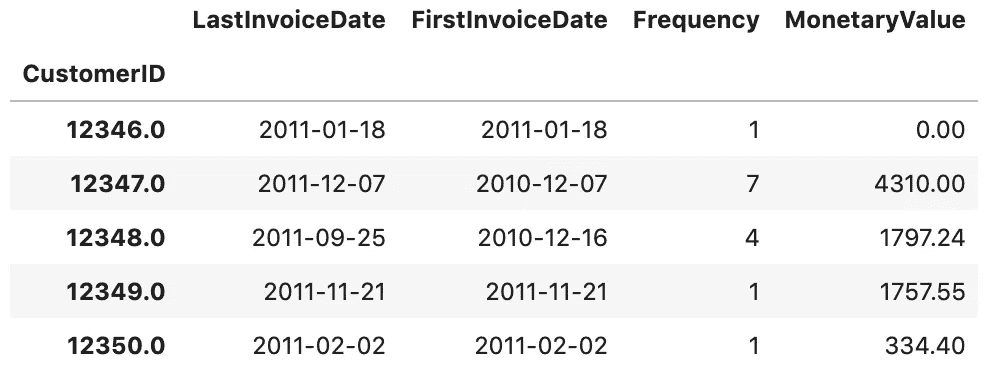
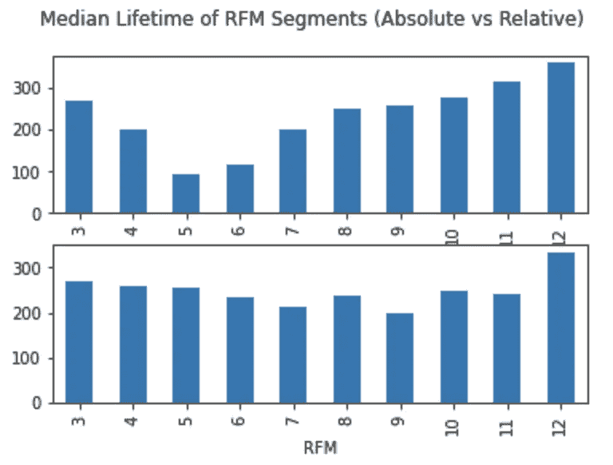
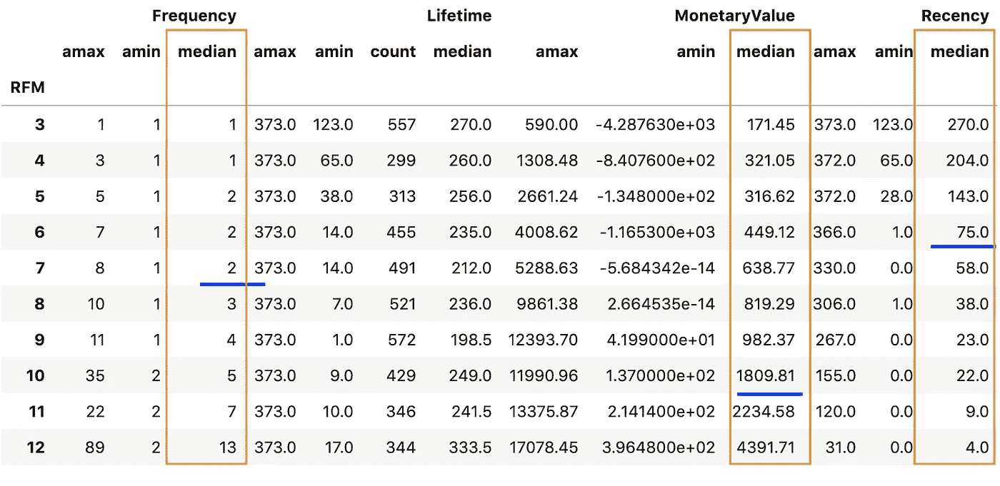
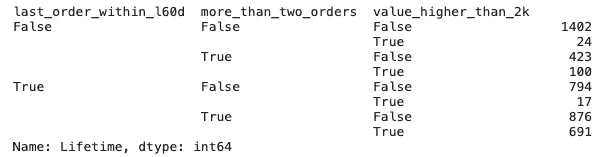
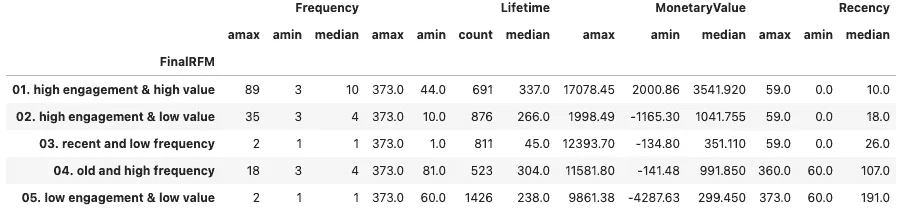

# 用 Python 进行 RFM 分析

> 原文：<https://towardsdatascience.com/an-rfm-customer-segmentation-with-python-cf7be647733d?source=collection_archive---------3----------------------->

## 以及如何从 it 中快速释放洞察力和商业价值


Dilyara Garifullina 在 [Unsplash](https://unsplash.com/s/photos/pie-chart?utm_source=unsplash&utm_medium=referral&utm_content=creditCopyText) 上拍摄的照片

是时候重温一下我的 Python 技能了！👩🏻‍💻

本周，我想走技术路线，分享一个最近使用 [RFM 框架](https://en.wikipedia.org/wiki/RFM_(market_research))的 Python 练习。这是一种通过三个方面来确定客户价值的方法:

*   最近:用户最后一次采取行动(例如登录、下订单)是什么时候？
*   频率:用户采取这个动作多少次？
*   货币价值:这个用户一生的货币价值总和是多少？

我的工作受到了同一个数据集上许多有用帖子的极大启发，比如[这个](/recency-frequency-monetary-model-with-python-and-how-sephora-uses-it-to-optimize-their-google-d6a0707c5f17)。在这篇文章中，我想分享我的 [RFM 细分分析](https://www.kaggle.com/yaowenling/rfm-customer-segmentation)，并重点关注我发现的一些有用的提示，以快速从模型输出中带来商业价值。

*   将绝对最近值、频率值和货币值转换为相对值，以减少与实际客户生命周期相关的偏差。
*   生成简单、启发式的业务逻辑，以快速的方式交付业务价值。
*   将这些细分市场与其他数据集结合起来，以更深入地了解您的客户群。

# 数据集描述和问题陈述

在我们深入细节之前，我想快速浏览一下我们的数据集是什么样子，以及我们的目标是解决什么问题。

我们的原始数据是包含以下字段的交易记录表:

```
<class 'pandas.core.frame.DataFrame'>
Int64Index: 406829 entries, 0 to 541908
Data columns (total 8 columns):
 #   Column       Non-Null Count   Dtype  
---  ------       --------------   -----  
 0   InvoiceNo    406829 non-null  object 
 1   StockCode    406829 non-null  object 
 2   Description  406829 non-null  object 
 3   Quantity     406829 non-null  int64  
 4   InvoiceDate  406829 non-null  object 
 5   UnitPrice    406829 non-null  float64
 6   CustomerID   406829 non-null  float64
 7   Country      406829 non-null  object 
dtypes: float64(2), int64(1), object(5)
memory usage: 27.9+ MB
```

通常，我们会在客户层面上汇总数据。



作者图片

我们希望将 RFM 框架应用于该聚合数据集，并回答以下问题:

1.  新近性、频率和货币价值之间有关联吗？
2.  我们应该如何定义我们最有价值的客户(MVC)？我们的客户中有百分之多少是最有价值的客户？
3.  我们是否能够创造独特的细分市场并据此设计 CRM 活动来提高客户参与度和/或盈利能力？

# 将绝对值转换为相对值，以减少客户寿命的偏差。

我在许多教程中注意到的一点是，计算中使用了绝对数字。换句话说，我们有以下内容:

*   最近=最近一次操作和今天之间的时间间隔
*   频率=从用户注册日期到今天的操作次数
*   货币价值=用户一生中的总收入

在这一步之后，一个典型的方法是通过基于每个单独列的四分位数创建存储桶来计算最近/频率/货币得分。例如，在“频率”列上，我们执行以下操作:

```
customer_data["FrequencyScore"] = pd.cut(customer_data["Frequency"], 
                                       bins=[-1, 
                                         np.percentile(customer_data["Frequency"], 25), 
                                             np.percentile(customer_data["Frequency"], 50), 
                                             np.percentile(customer_data["Frequency"], 75), 
                                             customer_data["Frequency"].max()], 
                                       labels=[1, 2, 3, 4]).astype("int")
```

请注意，对于最近得分，我们需要给出相反的标签，因为客户越活跃，最近值就越低。:)

一旦我们获得了每个维度的分数，我们就可以通过将这三个分数相加来计算 RFM 的总分数。总体 RFM 得分越高(从 3 到 12)，客户越有价值。

```
customer_data["RFM"] = customer_data["RecencyScore"] + customer_data["FrequencyScore"] + customer_data["MonetaryScore"]
```

这种方法很容易实现，但它容易与实际的客户生命周期产生偏差。例如，与过去 6 个月内注册的客户相比，12 个月前注册的客户自然具有更低的新近度(假设用户参与度在整个生命周期内普遍下降)、更高的频率和更高的货币价值(假设在用户活动和货币化方面同类)。因此，签约 12 个月的客户的 RFM 分数可能被高估了。

为了解释这种偏差，在计算个人得分之前，我会先将最近发生的事、发生的频率和货币价值标准化。例如，我会做相对频率=最近/一生。

```
customer_data["RelFrequency"] = customer_data["Frequency"] / customer_data["Lifetime"]
```

然后我会根据相对频率计算频率得分:

```
customer_data["FrequencyScore"] = pd.cut(customer_data["RelFrequency"], 
                                       bins=[-1, 
                                             np.percentile(customer_data["RelFrequency"], 25), 
                                             np.percentile(customer_data["RelFrequency"], 50), 
                                             np.percentile(customer_data["RelFrequency"], 75), 
                                             customer_data["RelFrequency"].max()], 
                                       labels=[1, 2, 3, 4]).astype("int")
```

在我的笔记本上，你可以找到使用绝对值的`rfm_abs`RFM 分割和使用相对值的`rfm_rel`。在这里，我只附上在这两种方法下每个 RFM 细分市场的中值客户生命周期。正如我们所看到的，使用绝对值的 RFM 细分市场的客户生命周期有较大的差异，而使用相对值的 RFM 细分市场的客户生命周期相当稳定。更具体地说，对于第一种方法，我们看到那些 RFM 分数为 5 和 6(因此处于活动的下限)的人具有明显更短的寿命(因此是更近期的客户)。这种方法似乎“惩罚”了最近的客户，因为他们的频率和金额较低。

另一方面，**我们的方法设法减少了 RFM 细分中与客户寿命相关的偏差！**



作者图片

# 生成简单、启发式的业务逻辑，以快速的方式交付业务价值。

到目前为止一切顺利！

许多教程都以生成 RFM 分段标签(3–12)结束，包含以下汇总统计数据:



RFM 分割结果

这张表回答了我们的前两个问题:

1.  在最近、频率和货币价值之间确实存在正相关关系。
2.  我们的 MVC 是那些总 RFM 分数为 11 和 12 的人，即他们平均有 7 次以上的交易，在其一生中产生超过 2K 的交易，并且他们的最后一次交易是在过去 2 周内。这类客户约占我们总客户群的 16%。

然而，在现实生活中，这种输出可能不足以快速创造商业价值。一方面，我们得到的桶彼此差别不大，我们有机会合并一些部分。另一方面，逻辑本身相当复杂-如果我们想要严格遵循逻辑，我们需要将笔记本电脑部署到生产中，这需要大量的工程工作，并且产生大量商业价值的不确定性很高。

我们想快速行动。因此，我想根据上面的 RFM 分割结果生成一些简单的启发式逻辑，并将它们应用到生产中进行分析和操作。请注意，没有完美的逻辑——这里我只分享一组我认为最有区别的标准。

```
customer_data["last_order_within_l60d"] = customer_data["Recency"]<60 # Had transactions in the last 60 dayscustomer_data["more_than_two_orders"] = customer_data["Frequency"]>2 # Logged in more than twicecustomer_data["value_higher_than_2k"] = customer_data["MonetaryValue"]>2000 # Sum of value higher than 2Kcustomer_data.groupby(["last_order_within_l60d", "more_than_two_orders", "value_higher_than_2k"]).count()["Lifetime"]
```



作者图片

基于上面的分支，我定义了五个最终段(在括号中，您可以找到段的大小):

1.  **高参与度&高价值** (523)是最近 2 个月有最后一笔交易，成交 2 笔以上，平均贡献 2K 以上的人。
2.  **高参与度&低值** (876)是和 Group1 一样活跃，但贡献不到 2K 的人。
3.  **近期活动&低频** (811)是指最近 2 个月内有最后一笔交易但交易不超过 2 笔的人。这些客户的货币价值也较低。显然，这个群体中的大多数客户是最近获得的客户(他们的平均寿命只有 45 天)。
4.  **【老】活动&高频** (523)是最近 2 个月没有任何交易的人。然而，他们平均有 2 笔以上的交易。这些客户在旅程开始时非常活跃，但最近不那么活跃了。我们需要想办法让他们重新参与进来。
5.  **低参与度&低值** (1426)是最近 2 个月没有任何交易，交易不超过 2 笔，贡献收入最低的人。



作者图片

# 与其他数据集结合，释放更多洞察力和价值。

基于我们在上面获得的知识，有许多使用案例。这里我想详细阐述一下我在工作中用过的两个用例。

一种方法是将这个客户价值分数作为一个新的维度附加到 BI 数据集(用户资料、跟踪事件、购买记录等)。结合现有的指标和仪表板，这可以帮助您回答以下问题:

*   我们的 MVC 的社会经济特征(收入、职业等)和人口统计学特征(年龄、性别、婚姻状况等)是什么？这为我们如何瞄准并获得更多这样的客户提供了启示。
*   与其他群体相比，我们的 MVC 有明显不同的用户旅程吗？我们如何优化 MVC 的旅程体验？
*   与其他集团相比，我们的 MVC 是否拥有重要的市场份额？这可能会给我们一些启发，以改善对他们的推荐。

另一个用例是将此标签发送到 CRM 工具，并将其用于定制的互动交流。以我上面生成的最终细分为例:对于第 2 组**高参与度&低价值**和第 3 组**近期活动&低频率**，我们应该通过个性化推荐关注货币化(例如订单数量、平均订单价值)，而对于第 4 组**老活动&高频率**，我们应该尝试重新吸引他们，并让他们回到我们的网站/应用程序。结合其他数据集的特征，我们能够设计有针对性的内容和媒体，以接触到个人客户并最大限度地提高转化率。

就是这样。让我知道你的想法和反馈！