# 熊猫数据可视化的终极备忘单

> 原文：<https://towardsdatascience.com/an-ultimate-cheat-sheet-for-data-visualization-in-pandas-f7bc239c9937?source=collection_archive---------15----------------------->


照片由[马克俯身](https://unsplash.com/@markstoop?utm_source=medium&utm_medium=referral)在 [Unsplash](https://unsplash.com?utm_source=medium&utm_medium=referral)

## 熊猫所有基本类型的可视化，以及一些非常有用和省时的高级可视化

我们使用 python 的 pandas 库主要是为了在数据分析中进行数据操作。但是我们也可以用熊猫来进行数据可视化。您甚至不需要为此导入 Matplotlib 库。Pandas 本身可以在后台使用 Matplotlib，为你渲染可视化。使用一个数据帧或一系列数据可以很容易地绘制图表。熊猫使用比 Matplotlib 更高级的 API。因此，它可以使用更少的代码行来绘制图表。

> 我将从使用随机数据的非常基本的图开始，然后转向使用真实数据集的更高级的图。

在本教程中，我将使用 Jupyter 笔记本环境。如果你没有安装，你可以简单地使用谷歌 Colab 笔记本电脑。你甚至不用在上面装熊猫。它已经为我们安装好了。

> 如果你想安装一台 Jupyter 笔记本，这也是一个好主意。请继续安装 [anaconda 包](https://www.anaconda.com/products/individual)。

对于数据科学家来说，这是一个非常棒的软件包，而且是免费的。

然后使用以下命令安装 pandas:

```
pip install pandas
```

或者在你的蟒蛇提示中

```
conda install pandas
```

你准备好摇滚了！

# 熊猫可视化

我们将从最基本的开始。

> ***线条图***

首次进口熊猫。那么，我们就在《熊猫》里做一个基础系列，做一个台词剧情吧。

```
import pandas as pd
a = pd.Series([40, 34, 30, 22, 28, 17, 19, 20, 13, 9, 15, 10, 7, 3])
a.plot()
```

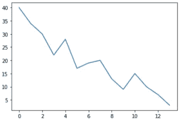

最基本最简单的剧情都准备好了！看，多简单。我们可以稍微改进一下。

我要补充的是:

一个数字大小，使地块的大小更大，

要更改默认的蓝色，

上面的标题显示了这个情节的内容

和字体大小来更改坐标轴上这些数字的默认字体大小

```
a.plot(figsize=(8, 6), color='green', title = 'Line Plot', fontsize=12)
```

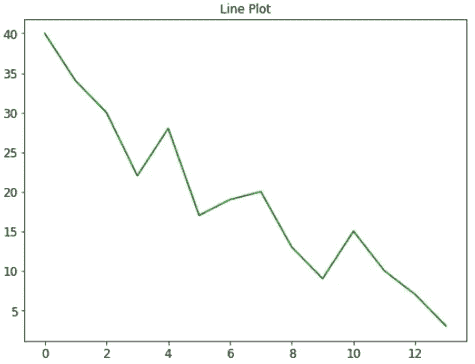

在本教程中，我们将学习更多的造型技巧。

> ***区域地块***

我将使用相同的系列“a ”,并在这里绘制一个面积图，

我可以用。plot()方法，并传递一个参数 kind 来指定我想要的绘图类型:

```
a.plot(kind='area')
```

或者我可以这样写

```
a.plot.area()
```

我上面提到的两种方法都会创建这个图:

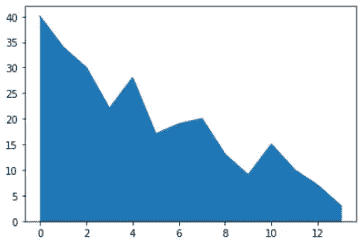

当有几个变量时，面积图更有意义，看起来也更好。因此，我将制作几个系列，制作一个数据表格，并从中制作一个面积图。

```
b = pd.Series([45, 22, 12, 9, 20, 34, 28, 19, 26, 38, 41, 24, 14, 32])
c = pd.Series([25, 38, 33, 38, 23, 12, 30, 37, 34, 22, 16, 24, 12, 9])
d = pd.DataFrame({'a':a, 'b': b, 'c': c})
```

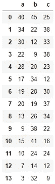

现在让我们把这个数据框画成面积图，

```
d.plot.area(figsize=(8, 6), title='Area Plot)
```

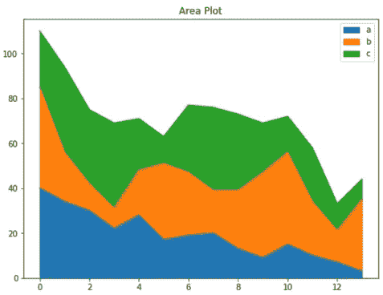

您不必接受这些默认颜色。让我们改变这些颜色，并添加一些更多的风格。

```
d.plot.area(alpha=0.4, color=['coral', 'purple', 'lightgreen'],figsize=(8, 6), title='Area Plot', fontsize=12)
```

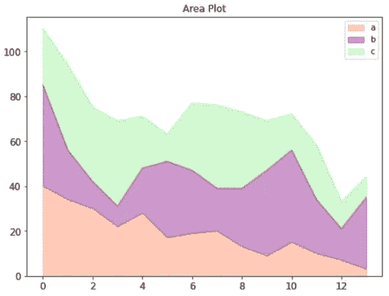

可能参数α对你来说是新的。

> *“alpha”参数为绘图增加了一些半透明的外观。*

当我们有重叠的面积图、直方图或密集散点图时，它显得非常有用。

> ***这个。plot()函数可以制作十一种类型的图:***

1.  线条
2.  区域
3.  酒吧
4.  barh
5.  馅饼
6.  箱子
7.  赫克宾
8.  嘘
9.  kde
10.  密度
11.  分散

我想展示所有这些不同情节的用法。为此，我将使用美国疾病控制和预防中心的 NHANES 数据集。我下载了这个数据集，并把它保存在 Jupyter 笔记本所在的文件夹中。请随意下载数据集并跟随:

[](https://github.com/rashida048/Datasets/blob/master/nhanes_2015_2016.csv) [## rashida 048/数据集

### 在 GitHub 上创建一个帐户，为 rashida048/Datasets 开发做出贡献。

github.com](https://github.com/rashida048/Datasets/blob/master/nhanes_2015_2016.csv) 

在这里，我导入数据集:

```
df = pd.read_csv('nhanes_2015_2016.csv')
df.head()
```

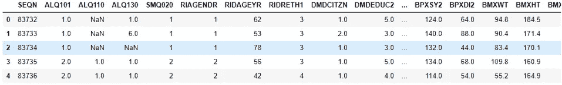

这个数据集有 30 列和 5735 行。

在开始绘制图之前，检查数据集的列很重要:

```
df.columns
```

输出:

```
Index(['SEQN', 'ALQ101', 'ALQ110', 'ALQ130', 'SMQ020', 'RIAGENDR', 'RIDAGEYR', 'RIDRETH1', 'DMDCITZN', 'DMDEDUC2', 'DMDMARTL', 'DMDHHSIZ', 'WTINT2YR', 'SDMVPSU', 'SDMVSTRA', 'INDFMPIR', 'BPXSY1', 'BPXDI1', 'BPXSY2', 'BPXDI2', 'BMXWT', 'BMXHT', 'BMXBMI', 'BMXLEG', 'BMXARML', 'BMXARMC', 'BMXWAIST', 'HIQ210', 'DMDEDUC2x', 'DMDMARTLx'], dtype='object')
```

这些列的名称可能看起来很奇怪。但是不要担心这个。在我们进行的过程中，我会继续解释这些列的含义。我们不会使用所有的列。我们将使用其中一些来练习这些情节。

> ***直方图***

我会用人口的权重做一个基本的直方图。

```
df['BMXWT'].hist()
```

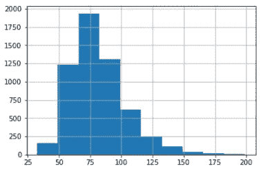

提醒一下，直方图提供了频率的分布。上图显示，约 1825 人体重 75。最大人数的权重范围为 49 到 99。

如果我想在一个图中放几个直方图呢？

我将使用体重、身高和身体质量指数(身体质量指数)在一张图中绘制三个直方图。

```
df[['BMXWT', 'BMXHT', 'BMXBMI']].plot.hist(stacked=True, bins=20, fontsize=12, figsize=(10, 8))
```

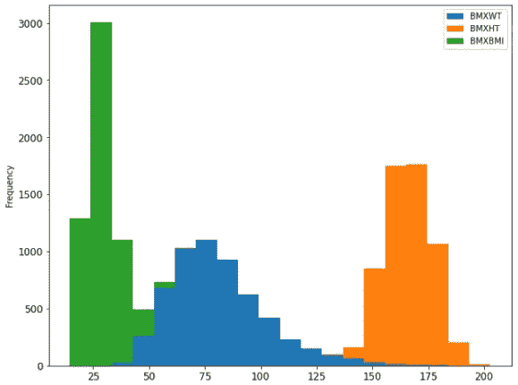

但是，如果您想要三个不同的直方图，也可以只使用一行代码，如下所示:

```
df[['BMXWT', 'BMXHT', 'BMXBMI']].hist(bins=20,figsize=(10, 8))
```

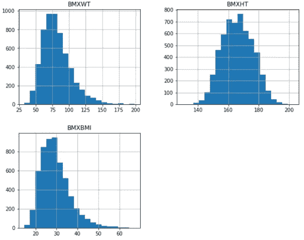

> *还可以更动感！*

我们在“BPXSY1”列中有收缩压数据，在“DM deduct 2”列中有教育水平。如果我们想检查每个教育水平的人群中收缩压的分布，也只需一行代码即可完成。

但在此之前，我想用更有意义的字符串值替换“DM deduct 2”列的数值:

```
df["DMDEDUC2x"] = df.DMDEDUC2.replace({1: "less than 9", 2: "9-11", 3: "HS/GED", 4: "Some college/AA", 5: "College", 7: "Refused", 9: "Don't know"})
```

现在做直方图，

```
df[['DMDEDUC2x', 'BPXSY1']].hist(by='DMDEDUC2x', figsize=(18, 12))
```

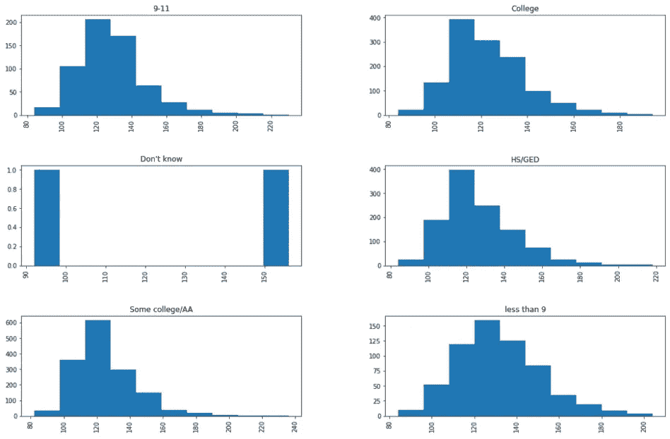

看啊！我们仅用一行代码就获得了每个教育水平的收缩压水平分布！

> ***柱状图***

现在我们来看看收缩压是如何随婚姻状况变化的。这次我将制作一个条形图。像以前一样，我将用更有意义的字符串替换“DMDMARTL”列的数值。

```
df["DMDMARTLx"] = df.DMDMARTL.replace({1: "Married", 2: "Widowed", 3: "Divorced", 4: "Separated", 5: "Never married", 6: "Living w/partner", 77: "Refused"})
```

为了制作柱状图，我们需要对数据进行预处理。也就是把数据按不同的婚姻状况分组，取每组的平均值。在这里，我在同一行代码中处理数据和绘图。

```
df.groupby('DMDMARTLx')['BPXSY1'].mean().plot(kind='bar', rot=45, fontsize=10, figsize=(8, 6))
```

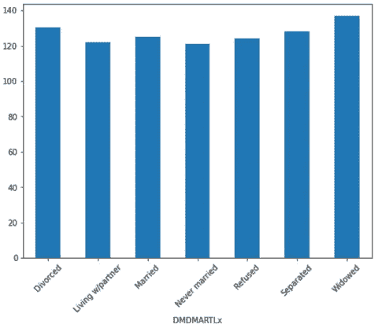

这里我们使用“rot”参数将 x 刻度旋转 45 度。否则，它们会太杂乱。

如果你愿意，你也可以把它做成水平的，

```
df.groupby('DMDEDUC2x')['BPXSY1'].mean().plot(kind='barh', rot=45, fontsize=10, figsize=(8, 6))
```

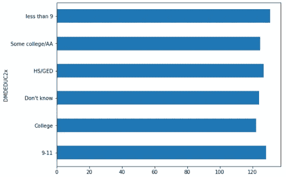

我想做一个多变量的柱状图。我们有一列包含人口的民族血统。看看人们的体重、身高和身体质量指数是否会随着种族的不同而变化，这将是一件有趣的事情。

为了绘制图表，我们需要将这三列(体重、身高和身体质量指数)按种族分组并取平均值。

```
df_bmx = df.groupby('RIDRETH1')['BMXWT', 'BMXHT', 'BMXBMI'].mean().reset_index()
```

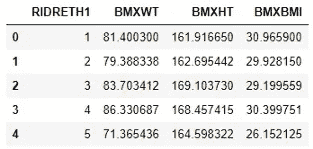

这一次我没有更改民族血统数据。我保留了原来的数值。现在让我们制作柱状图，

```
df_bmx.plot(x = 'RIDRETH1', 
            y=['BMXWT', 'BMXHT', 'BMXBMI'], 
            kind = 'bar', 
            color = ['lightblue', 'red', 'yellow'], 
            fontsize=10)
```

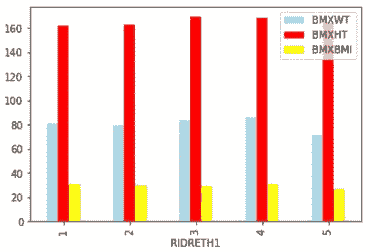

看起来第四种族比其他种族高一点。但是都很接近。没有显著差异。

我们也可以将不同的参数(体重、身高和体重指数)相互叠加。

```
df_bmx.plot(x = 'RIDRETH1', 
            y=['BMXWT', 'BMXHT', 'BMXBMI'], 
            kind = 'bar', stacked=True,
            color = ['lightblue', 'red', 'yellow'], 
            fontsize=10)
```

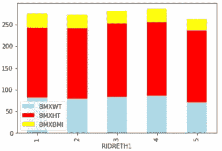

> ***派剧情***

这里我想检查一下婚姻状况和教育是否有关系。

我需要按教育程度对婚姻状况进行分组，并按教育程度统计每个婚姻状况组中的人口。听起来太罗嗦了吧？让我们看看:

```
df_edu_marit = df.groupby('DMDEDUC2x')['DMDMARTL'].count()
pd.Series(df_edu_marit)
```

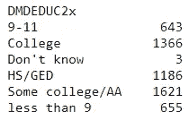

使用这个系列很容易做出一个饼图:

```
ax = pd.Series(df_edu_marit).plot.pie(subplots=True, label='',
     labels = ['College Education', 'high school', 
     'less than high school', 'Some college',
     'HS/GED', 'Unknown'],
     figsize = (8, 6),
     colors = ['lightgreen', 'violet', 'coral', 'skyblue', 'yellow', 'purple'], autopct = '%.2f')
```

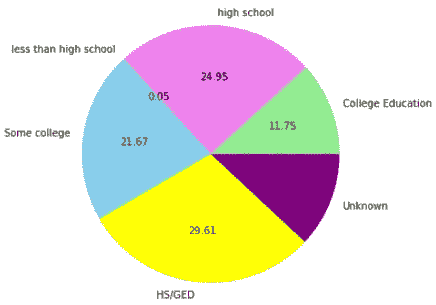

这里我添加了一些样式参数。请随意尝试更多的样式参数。

> ***箱线图***

例如，我将使用体重指数、腿和臂长数据绘制一个方框图。

```
color = {'boxes': 'DarkBlue', 'whiskers': 'coral', 
         'medians': 'Black', 'caps': 'Green'}
df[['BMXBMI', 'BMXLEG', 'BMXARML']].plot.box(figsize=(8, 6),color=color)
```

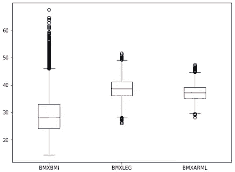

> ***散点图***

对于一个简单的散点图，我想看看身体质量指数(“BMXBMI”)和收缩压(“BPXSY1”)之间是否有任何关系。

```
df.head(300).plot(x='BMXBMI', y= 'BPXSY1', kind = 'scatter')
```

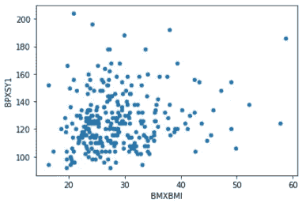

这太简单了！我只使用了 300 个数据，因为如果我使用所有的数据，散点图会变得过于密集，难以理解。尽管你可以使用 alpha 参数使其半透明。在本教程中，我倾向于保持轻松。

现在，让我们用同一行代码检查一个高级散点图。

这次我将添加一些颜色阴影。我将绘制一个散点图，x 轴表示重量，y 轴表示高度。有一点曲折！

我还会加上腿的长度。但是腿的长度会显示在阴影中。如果腿的长度更长，颜色会更深，否则颜色会更浅。

```
df.head(500).plot.scatter(x= 'BMXWT', y = 'BMXHT', c ='BMXLEG', s=50, figsize=(8, 6))
```

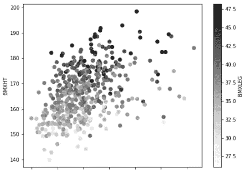

它显示了体重和身高的关系。你可以看看腿的长度与身高和体重之间是否有关系。

另一种增加第三个参数的方法是增加粒子的大小。在这里，我把身高放在 x 轴，体重放在 y 轴，体重指数作为气泡大小的指标。

```
df.head(200).plot.scatter(x= 'BMXHT', y = 'BMXWT', 
                          s =df['BMXBMI'][:200] * 7, 
                          alpha=0.5, color='purple',
                         figsize=(8, 6))
```

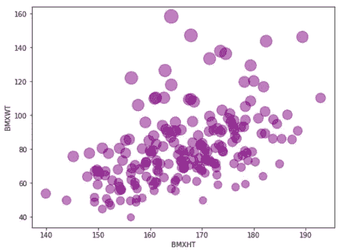

这里，小点表示身体质量指数较低，大点表示身体质量指数较高。

> ***Hexbin***

另一种美丽的可视化形式，点是六角形的。当数据太密集时，将它们放在箱中是有用的。正如你所看到的，在前面的两个图中，我只使用了 500 和 200 个数据，因为如果我把所有的数据都放在数据集中，图会变得太密集，无法理解或从中获得任何信息。

在这种情况下，使用空间分布会非常有用。我用的是 hexbin，数据用六边形表示。每个六边形是一个箱，代表该箱的密度。这是一个最基本的六邻体蛋白的例子。

```
df.plot.hexbin(x='BMXARMC', y='BMXLEG', gridsize= 20)
```

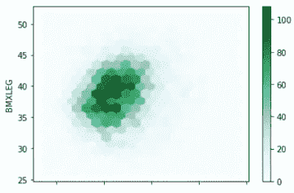

这里，较深的颜色代表较高的数据密度，较浅的颜色代表较低的数据密度。

听起来像直方图吗？是的，对吗？它不是用线条，而是用颜色来表示。

如果我们增加一个额外的参数 C，分布就会改变。它将不再像一个直方图。

参数“C”指定每个(x，y)坐标的位置，对每个六边形面元进行累加，然后使用 *reduce_C_function 进行缩减。*如果没有指定 reduce_C_ function，默认使用 np。卑鄙。你可以把它指定为 np。意思是，np。马克斯，np。sum，np。std 等。

> *查看文档了解更多信息* [*这里*](https://pandas.pydata.org/pandas-docs/stable/reference/api/pandas.DataFrame.plot.hexbin.html)

这里有一个例子:

```
df.plot.hexbin(x='BMXARMC', y='BMXLEG', C = 'BMXHT',
                         reduce_C_function=np.max,
                         gridsize=15,
                        figsize=(8,6))
```

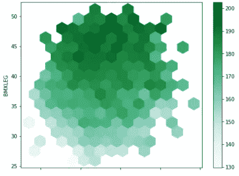

这里六边形的深色表示 np。max 有一个更高的人口高度值(' BMXHT ')，你可以看到我用了 np。max 作为 reduce_C_function。您可以使用色彩映射表来代替颜色阴影:

```
df.plot.hexbin(x='BMXARMC', y='BMXLEG', C = 'BMXHT',
                         reduce_C_function=np.max,
                         gridsize=15,
                        figsize=(8,6),
                        cmap = 'viridis')
```

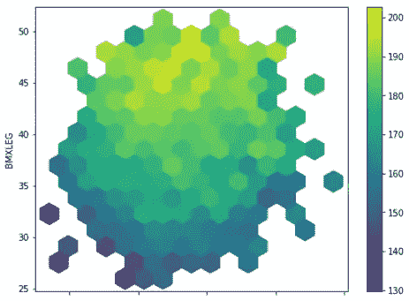

看起来很漂亮，对吧？而且信息量也很大。

# 一些高级的可视化

我解释了一些人们在日常生活中处理数据时使用的基本绘图。但是数据科学家需要更多。熊猫图书馆也有一些更先进的可视化。这可以在一行代码中提供更多的信息。

> ***散点 _ 矩阵***

Scatter_matrix 非常有用。它在一个图中提供了大量的信息。它可以用于一般的数据分析或机器学习的特征工程。我们先来看一个例子。之后我会解释。

```
from pandas.plotting import scatter_matrixscatter_matrix(df[['BMXWT', 'BMXHT', 'BMXBMI', 'BMXLEG', 'BMXARML']], alpha = 0.2, figsize=(10, 8), diagonal = 'kde')
```

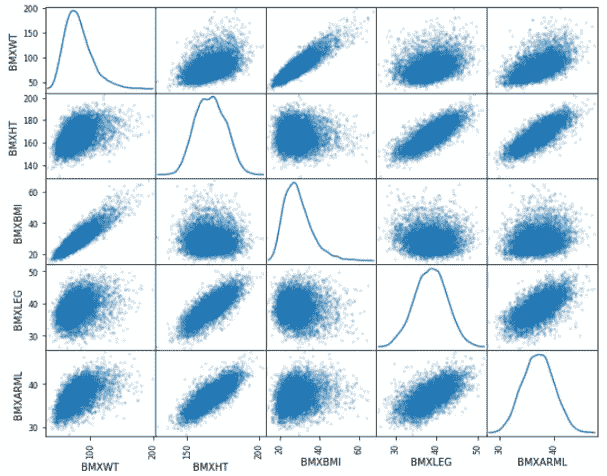

看那个！我在这里使用了五个特性。我得到了所有五个变量之间的关系。在对角线上，它给出了每个单独特征的密度图。我们将在下一个例子中讨论密度图。

> ***KDE 或密度图***

构建 KDE 图或核密度图是为了提供数据帧中一个系列或一列的概率分布。让我们来看看权重变量(' BMXWT ')的概率分布。

```
df['BMXWT'].plot.kde()
```


你可以在一张图中看到几种概率分布。在这里，我在同一张图中绘制了身高、体重和身体质量指数的概率分布:

```
df[['BMXWT', 'BMXHT', 'BMXBMI']].plot.kde(figsize = (8, 6))
```

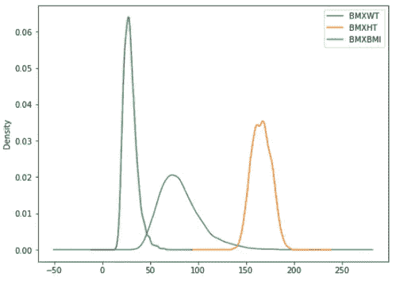

您也可以使用我们之前描述的其他样式参数。我喜欢保持简单。

> ***平行 _ 坐标***

这是显示多维数据的好方法。它清楚地显示了集群(如果有的话)。例如，我想看看男性和女性在身高、体重和身体质量指数方面是否有差异。让我们检查一下。

```
from pandas.plotting import parallel_coordinatesparallel_coordinates(df[['BMXWT', 'BMXHT', 'BMXBMI', 'RIAGENDR']].dropna().head(200), 'RIAGENDR', color=['blue', 'violet'])
```

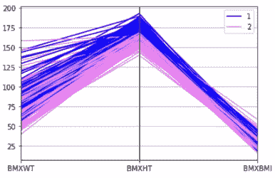

你可以看到男性和女性在体重、身高和身体质量指数方面的明显差异。在这里，1 是男性，2 是女性。

> ***自举 _ 剧情***

这对于研究和统计分析是非常重要的。会节省很多统计分析的时间。自举图用于评估给定数据集的不确定性。

该函数随机抽取指定大小的样本。然后计算该样本的平均值、中间值和中间值。这个过程重复指定的次数。

在这里，我使用身体质量指数数据创建了一个自举图:

```
from pandas.plotting import bootstrap_plotbootstrap_plot(df['BMXBMI'], size=100, samples=1000, color='skyblue')
```

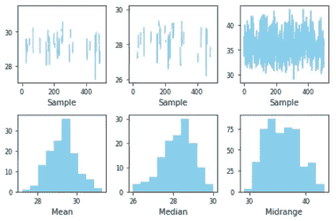

这里，样本量为 100，样本数为 1000。因此，我们随机抽取了 100 个数据样本来计算平均值、中间值和中间值。这个过程重复 1000 次。

这是一个极其重要的过程，也是统计学家和研究人员节省时间的方法。

# 结论

我想为熊猫的数据可视化做一个备忘单。虽然如果你使用 matplotlib 和 seaborn，有更多的可视化选项或类型。但是如果我们处理数据，我们在日常生活中会用到这些基本的可视化类型。使用 pandas 进行可视化将使您的代码更加简单，并节省大量代码。

欢迎在推特上关注我，喜欢我的脸书页面。

**更多阅读:**

[](/an-ultimate-cheatsheet-of-data-visualization-in-seaborn-be8ed13a3697) [## 用 Python 的 Seaborn 库实现数据可视化的终极指南

### 对学习者来说也是一个很好的资源

towardsdatascience.com](/an-ultimate-cheatsheet-of-data-visualization-in-seaborn-be8ed13a3697) [](/detailed-guide-to-multiple-linear-regression-model-assessment-and-inference-in-r-146845067aa3) [## 多元线性回归模型、评估和推理的详细指南

### 模型开发、解释、方差计算、f 检验和 t 检验

towardsdatascience.com](/detailed-guide-to-multiple-linear-regression-model-assessment-and-inference-in-r-146845067aa3) [](/a-collection-of-advanced-data-visualization-in-matplotlib-and-seaborn-f08136172e14) [## Matplotlib 和 Seaborn 中的高级数据可视化集合

### 让你的故事更有趣

towardsdatascience.com](/a-collection-of-advanced-data-visualization-in-matplotlib-and-seaborn-f08136172e14) [](/an-ultimate-guide-to-time-series-analysis-in-pandas-76a0433621f3) [## 熊猫时间序列分析终极指南

### 在 Pandas 中执行时间序列分析所需的所有 Pandas 功能。您也可以将此用作备忘单。

towardsdatascience.com](/an-ultimate-guide-to-time-series-analysis-in-pandas-76a0433621f3) [](/a-complete-project-on-image-classification-with-logistic-regression-from-scratch-in-python-ae7386211ab4) [## 一个完整的图像分类项目，使用 Python 从头开始进行逻辑回归

### 带有项目的逻辑回归算法的详细布局

towardsdatascience.com](/a-complete-project-on-image-classification-with-logistic-regression-from-scratch-in-python-ae7386211ab4) [](/an-ultimate-cheat-sheet-for-numpy-bb1112b0488f) [## Numpy 入门指南

### 日常工作所需的所有 Numpy 功能

towardsdatascience.com](/an-ultimate-cheat-sheet-for-numpy-bb1112b0488f) [](/sort-and-segment-your-data-into-bins-to-get-sorted-ranges-pandas-cut-and-qcut-7785931bbfde) [## 数据宁滨与熊猫削减或 Qcut 方法

### 当你在寻找一个范围而不是一个确切的数值，一个等级而不是一个分数

towardsdatascience.com](/sort-and-segment-your-data-into-bins-to-get-sorted-ranges-pandas-cut-and-qcut-7785931bbfde)