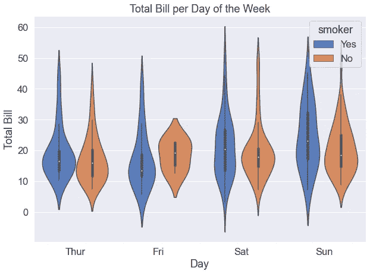

# 用 Python 的 Seaborn 库实现数据可视化的终极指南

> 原文：<https://towardsdatascience.com/an-ultimate-cheatsheet-of-data-visualization-in-seaborn-be8ed13a3697?source=collection_archive---------14----------------------->


由 [Unsplash](https://unsplash.com?utm_source=medium&utm_medium=referral) 上的 [CHUTTERSNAP](https://unsplash.com/@chuttersnap?utm_source=medium&utm_medium=referral) 拍摄

## 一大堆情节

Seaborn 是一个基于 Matplotlib 的 python 数据可视化库。seaborn 有什么特别的？我们已经有了 Maplotlib，为什么还需要使用 seaborn？Matplotlib 可以满足您的需求。它具有执行数据故事项目所需的所有可视化功能。但是 seaborn 很特别，因为它有很多风格。样式已经内置了。与普通的 matplotlib 图相比，普通的 seaborn 图看起来要好得多！

> 此外，seaborn 库具有高级可视化功能，更具表现力，能够更有效地表达更多信息。

一点背景知识。如果您不熟悉 python 中的数据可视化，或者需要复习 Matplotlib，请看看这篇文章:

</your-everyday-cheatsheet-for-pythons-matplotlib-c03345ca390d>  

您也可以在 Pandas 中执行数据可视化。当你在 pandas 中调用 plot()函数时，它在后台使用 Matplotlib。

</an-ultimate-cheat-sheet-for-data-visualization-in-pandas-f7bc239c9937>  

复习部分完成了。让我们现在潜入海底。

> 我将从基本的情节开始，然后慢慢转向一些更高级的。

我主要使用内置数据集。因此，安装了 seaborn 库的任何人都可以很容易地获得它们。

> 我将反复使用相同的变量，以节省寻找新数据集的时间。我的目标是为你展示可视化功能的选择。

首先导入必要的包和著名的 iris 数据集:

```
import matplotlib.pyplot as plt
import pandas as pd
import seaborn as snsiris = sns.load_dataset('iris')
iris
```


从 Matplotlib 中非常基本的散点图开始，然后是 Seaborn，以显示相同图中基本部分的差异。Matplotlib 中萼片长度与萼片宽度的基本散点图:

```
plt.scatter(iris.sepal_length, iris.sepal_width)
```


**这是《海波恩》中相同的基本情节:**

```
sns.set()
plt.scatter(iris.sepal_length, iris.sepal_width)
```


您可以看到，它甚至没有编写太多额外的代码就添加了一种样式！

我会尽量保持精确。大部分代码几乎是不言自明的。如果你是为了学习而阅读这篇文章的话，请把代码拿到你自己的笔记本上运行，改变不同的选项，然后玩一玩。这是唯一的学习方法。

在前面的情节中你已经看到。set()函数可以在绘图中引入默认的 seaborn 样式。下面是 set_style()函数的一个例子。

```
sns.set_style('whitegrid')
plt.scatter(iris.sepal_length, iris.sepal_width)
plt.show()
```


set_style()函数有一些其他的样式选项:深色网格、深色、白色和刻度。请随意试用它们。

下一个图也将是萼片长度对萼片宽度。但是花瓣长度参数也将被添加到它。圆点的大小会根据花瓣的长度而改变。

```
sns.set_style('darkgrid')
sns.set_context('talk', font_scale=1.1)
plt.figure(figsize=(8, 6))
sns.scatterplot(iris.sepal_length, iris.sepal_width, data=iris)
plt.xlabel("Sepal Length")
plt.ylabel("Sepal Width")
plt.title("Sepal Length vs Sepal Width")
plt.show()
```


圆点越大，花瓣越长。

此图中还引入了另一个新功能。那就是 [set_context()](https://seaborn.pydata.org/generated/seaborn.set_context.html) 。它控制线条、标签和其他类似参数的大小。在该图中使用了“talk”选项。**set _ context()函数中还有“纸张”、“笔记本”和“海报”选项。请检查一下。**

这里可以轻松地添加一个变量。我将在这块土地上增加花的种类。不同物种的圆点颜色会有所不同。

```
sns.set_context('talk', font_scale=1.1)
plt.figure(figsize=(8, 6))
sns.scatterplot(iris.sepal_length, iris.sepal_width, 
                size="petal_length", data=iris,
               sizes=(20, 500), hue="species", 
                alpha=0.6, palette="deep")
plt.xlabel("Sepal Length")
plt.ylabel("Sepal Width")
plt.title("Sepal Length vs Sepal Width")
plt.legend(bbox_to_anchor = (1.01, 1), borderaxespad=0)
plt.show()
```


## 重新绘图

relplot 函数既有趣又能提供信息。 **Relplots 可以是折线图或散点图。**这是一个折线图，每条线都显示置信区间。

> 如果不想要置信带，在 relplot 函数中添加“ci = None”。

我不会那么做的。因为我想要信心乐队。

```
sns.relplot(iris.sepal_length, iris.sepal_width, 
                data=iris, kind='line', hue='species')
plt.xlabel("Sepal Length")
plt.ylabel("Sepal Width")
plt.title("Sepal Length vs Sepal Width")
plt.show()
```


## 距离图

distplot 给出了直方图，一个连续变量的分布。这里有一个基本的。

```
plt.figure(figsize=(8, 6))
sns.distplot(iris.sepal_length)
plt.show()
```


如果您不想要密度曲线，在 distplot 函数中添加 kde = False 。下一个图是没有密度曲线的垂直直方图。

```
plt.figure(figsize=(8, 6))
sns.distplot(iris.sepal_length, vertical=True, kde=False, color='red')
plt.show()
```


直方图甚至可以提供更多信息。您可以用分类变量分隔连续变量的直方图。为了演示，我将使用不同的数据集。

```
tips = sns.load_dataset("tips")
tips.head()
```


该图将显示每个物种的鳍状肢长度，并按性别分类。

```
g = sns.displot(
    tips, x="total_bill", col="day", row="sex",
    binwidth=3, height=3, facet_kws=dict(margin_titles=True))
g.fig.set_size_inches(18, 10)
g.set_axis_labels("Total Bill", "Frequency")
```


因此，我们将账单总额的分布按照星期几和性别进行了划分。

也可以制作类似的重绘图。下面的 relplot 显示了按一周中的某一天和一天中的某个时间划分的账单总额与小费的散点图。

```
sns.set_context('paper', font_scale=1.8)
sns.relplot('total_bill', 'tip', data=tips, hue="time", col='day', col_wrap=2)
```


## 条形图

另一个广泛使用和流行的情节。在小费数据集中，我将在 x 轴上使用“大小”变量，总账单将在 y 轴上绘制。

总账单将按午餐和晚餐时间分开。

```
plt.figure(figsize=(8, 6))
sns.barplot(x='size', y= 'total_bill', hue='time', 
            palette = 'GnBu',
            data=tips, ci='sd',
           capsize=0.05,
           saturation=5,
           errcolor='lightblue',
           errwidth=2)
plt.xlabel("Size")
plt.ylabel("Total Bill")
plt.title("Total Bill Per Day of Week")
plt.show()
```


注意，我在这里使用调色板作为“GnBu”。seaborn 库中有几个不同的调色板。**在** [**页面**](https://seaborn.pydata.org/tutorial/color_palettes.html) **找到不同的调色板选项。**

如果你对统计学感兴趣，你会喜欢这里的“ci”选项。否则，**用' ci=None'** 就可以避免。

## 计数图

计数图看起来也像条形图。但是**它显示了每个类别的观察计数。**

```
plt.figure(figsize=(8, 6))
sns.countplot(x='day', data=tips)
plt.xlabel("Day")
plt.title("Total Bill Per Day of Week")
plt.show()
```


该图显示了一周中每天有多少数据可用。“hue”参数在这里也可以用于通过另一个分类变量将其分离。我在考虑“时间”变量。

```
plt.figure(figsize=(8, 6))
sns.countplot(x = 'day', hue='time', 
            palette = 'GnBu',
            data=tips)
plt.xlabel("Day")
plt.title("Tip Per Day of Week")
plt.show()
```


## 群集图

该图确保数据不会重叠。剧情之后再多解释。

```
plt.figure(figsize=(8, 6))
sns.set_style('whitegrid')
sns.swarmplot(x='size', y='total_bill', data=tips)
plt.xlabel("Size")
plt.ylabel("Total Bill")
plt.title("Total bill per size of the table")
plt.show()
```


当大小为 1 时，只有三个点，它们在同一条线上，自然不会重叠。但是当大小为 2 时，在同一个点上有很多数据，所以默认情况下 swarmplot 稍微调整了点的位置，使它们不相互重叠。

> 这看起来不错，而且当数据集不太大时，还可以更好地了解每个点有多少数据。如果数据集太大，群集图就不能很好地缩放。

在下一个图中，我将添加一个“色调”参数，它将显示不同性别的不同颜色。

```
plt.figure(figsize=(10, 6))
sns.set_style('whitegrid')
sns.set(font_scale=1.5)
sns.swarmplot(x='size', y='total_bill', data=tips, hue="sex")
plt.xlabel("Day")
plt.ylabel("Total Bill")
plt.legend(title="Time", fontsize=14)
plt.show()
```


性别隔离也可以被分开，

```
plt.figure(figsize=(10, 6))
sns.set_style('whitegrid')
sns.set(font_scale=1.5)
sns.swarmplot(x='size', y='total_bill', data=tips, hue="sex", split=True)
plt.xlabel("Size")
plt.ylabel("Total Bill")
plt.legend(title="Time", fontsize=14)
plt.show()
```


在这片土地上，雄性和雌性有不同的群体。

还有另一种称为因子图的图，它与群集图相同，但它是面网格图。您可以添加多个变量并提供更多信息。

```
g = sns.factorplot(x='size', y="tip",
              data=tips, hue="time",
              col="day", kind="swarm",
              col_wrap=2, size=4)g.fig.set_size_inches(10, 10)
g.set_axis_labels("Size", "Tip")
plt.show()
```


该图显示了一周中每一天每份食物的小费金额，不同的颜色代表了用餐的不同时间。如此多的信息被压缩在一个情节中！

## 点图

点图可以提供很多信息，比条形图更有用。这是一个显示一周中每天小费金额的点图。情节之后我会再解释一些。

```
plt.figure(figsize=(8, 6))
sns.pointplot(x="day", y="tip", data=tips)
plt.xlabel("Day")
plt.ylabel("Tip")
plt.title("Tip Per Day of Week")
plt.show()
```


这里的点表示平均值，垂直线表示置信区间。有时候少即是多。简单而又丰富的情节。

可以在这里添加一个“色调”参数，通过另一个分类变量显示一周中每天的小费。我在这里用了性别。

```
plt.figure(figsize=(8, 6))
sns.pointplot(x="day", y="tip", hue="sex", data=tips, palette="Accent")
plt.xlabel("Day")
plt.ylabel("Tip")
plt.title("Tip Per Day of Week by Gender")
plt.show()
```


性别在小费金额上的差异如此明显！

## Regplot

这实际上是一个散点图，增加了一条线性回归线和一个置信带。

```
plt.figure(figsize=(8, 6))
sns.set_style('whitegrid')
sns.regplot(x='total_bill', y='tip', data=tips)
plt.xlabel("Total Bill")
plt.ylabel("Tip")
plt.show()
```


## 接合图

联合绘图仅用一行代码在一个绘图中显示两种不同类型的绘图。默认情况下，散点图位于中心，x 和 y 变量的分布位于边缘。“hue”参数在这里是可选的。有需要就用。

```
sns.set_style('dark')
g = sns.jointplot(x='total_bill', y='tip', hue='time', data=tips)
g.fig.set_size_inches(8, 8)
g.set_axis_labels("Total Bill", "Tip")
plt.show()
```


该图是一个散点图，显示了账单总额与小费金额之间的关系，按“时间”进行划分。不同的颜色显示了用餐的不同时间。侧图显示了午餐和晚餐时间总账单和小费金额的分布。

如果您不喜欢默认选项，还有几个其他选项可用。这里我明确提到 regplot，它是一个散点图，带有一条线性回归线和置信带。

```
sns.set_style('darkgrid')
g = sns.jointplot(x='total_bill', y='tip', data=tips, kind='reg')
g.fig.set_size_inches(8, 8)
g.set_axis_labels("Total Bill", "Tip")
plt.show()
```


下一个图将不是散点图，而是 kde 图，

```
sns.set_style('darkgrid')
g = sns.jointplot(x='total_bill', y='tip', data=tips, kind='kde')
g.fig.set_size_inches(8, 8)
g.set_axis_labels("Total Bill", "Tip")
plt.show()
```


在这个 kde 图中可以随意使用“色调”参数，

```
sns.set_style('darkgrid')
g = sns.jointplot(x='total_bill', y='tip', hue='time', data=tips, kind='kde')
g.fig.set_size_inches(8, 8)
g.set_axis_labels("Total Bill", "Tip")
plt.show()
```


比起阴影线，kde 图总是更吸引我。下面有一个带阴影的 kde 图。

```
plt.figure(figsize=(8, 6))
sns.set_style('whitegrid')
g = sns.kdeplot(x='total_bill', y='tip', shade=True, data=tips)
plt.xlabel("Total Bill")
plt.ylabel("Tip")
plt.show()
```


阴影图显示了数据的密度。我觉得它更有表现力。

回到 jointplot，这里有一个 jointplot 中 hexplot 的例子。又一个美好的情节。

```
sns.set_style('dark')
g = sns.jointplot(x='total_bill', y='tip', data=tips, kind='hex')
g.fig.set_size_inches(8, 8)
g.set_axis_labels("Total Bill", "Tip")
plt.show()
```


当数据集太大时，Hexplot 特别有用。

## 抖动图

抖动图有点像之前展示的蜂群图。这一个也稍微调整了点的坐标以避免太多的混乱。但是有点不一样。在蜂群图中，没有一个点在另一个点的上面。但在抖动图中，它仅展开指定的量。下面是一个抖动图，指定抖动量为 0.2。此外，默认情况下，它添加了一个线性回归线和一个置信区间，这很好！

```
plt.figure(figsize=(8, 6))
sns.set_style('whitegrid')
sns.regplot(x='size', y='total_bill', data=tips, x_jitter=0.2)
plt.xlabel("Size")
plt.ylabel("Total Bill")
plt.show()
```


注意，这里的 x 轴包含一个分类变量。

## lmplot

lmplot 是 regplot 和 facet grid 的组合。该图可以显示每个条件组的线性回归线和置信带。这听起来可能有点晦涩。请看这个情节。

```
sns.set(font_scale=1.5)
sns.lmplot(x='total_bill', y='tip', data = tips, 
           hue='time')
plt.gcf().set_size_inches(12, 8)
plt.ylabel("Total Bill")
plt.xlabel("Tip")
plt.show()
```


听着，午餐和晚餐时间都有回归线。

它甚至可以提供更多的信息。下面这张示意图显示的是每天的总账单和小费。

```
g = sns.lmplot(x='total_bill', y='tip', col="day", hue = "day", 
          data=tips, col_wrap=2, height=4)
g.fig.set_size_inches(11, 11)
g.set_axis_labels("Total Bill", "Tip")
plt.show()
```


## 箱线图

我不喜欢基本的箱线图。请看看我在开始提到的关于熊猫和 Matplotlib 的可视化教程，重温一下基本的情节。我喜欢箱线图，因为它能在同一个图中给出分布、中位数、IQR 和异常值的信息。下一个图将显示每个尺寸的总账单的箱线图。

```
sns.set(font_scale = 1.5)
sns.boxplot(x='size', y='total_bill', data=tips)
plt.gcf().set_size_inches(12, 8)
plt.xlabel("Size")
plt.ylabel("Total Bill")
```


如果您需要关于如何从箱线图中提取我之前提到的所有信息的提示，请阅读这篇文章:

</understanding-the-data-using-histogram-and-boxplot-with-example-425a52b5b8a6>  

## 紫罗兰花

这里是一个基本的小提琴情节。

```
ax = sns.violinplot(x=tips["total_bill"])
```


小提琴图显示了数据的分布。你可能会认为它就像一个直方图。可以，但是可以更高级。如下图所示，吸烟者和非吸烟者每天的总账单分配情况。

```
plt.figure(figsize=(10, 7))
sns.violinplot(x='day', y='total_bill', hue="smoker",
              data=tips, palette="muted")
plt.xlabel("Day")
plt.ylabel("Total Bill")
plt.title("Total Bill per Day of the Week")
plt.show()
```



吸烟者和不吸烟者的部分可以显示在一把小提琴的不同侧面上，而不是由两把小提琴分开。看这个情节。

```
plt.figure(figsize=(10, 7))
sns.violinplot(x='day', y='total_bill', hue="smoker",
              data=tips, palette="muted", split=True)
plt.xlabel("Day")
plt.ylabel("Total Bill")
plt.title("Total Bill per Day of the Week")
plt.show()
```


这里蓝色显示的是吸烟者总账单的分布，黄色代表不吸烟者。

小提琴情节可以与其他类型的情节结合。这是一个在小提琴图中显示蜂群图的例子。它看起来很好，并且给出了与这些分布相关的数据量的概念。

```
plt.figure(figsize=(10, 6))sns.violinplot(x='day', y='total_bill', inner=None,
              data=tips, palette="muted")sns.swarmplot(x='day', y='total_bill',
              data=tips, color="k", alpha=0.9)
plt.ylabel("Total Bill")
plt.xlabel("Day")
plt.title("Total Bill per Day")
plt.show()
```


## 热图

热图用于显示变量之间的相关性。热图在数据科学的许多领域非常有用。在数据故事项目中，这是一个受欢迎的元素，在机器学习中，它有助于选择特征。

这是一个基本的热图，显示了总账单和小费金额之间的关系。

```
sns.heatmap(tips[["total_bill", "tip"]].corr(), annot=True, 
            linewidths=0.9, linecolor="gray")
plt.show()
```


让我们回到虹膜数据集。看到萼片长度和宽度、花瓣长度和宽度之间的相互关系将会很有趣。

```
plt.figure(figsize=(8, 6))
sns.heatmap(iris.corr(), annot=True, linewidths=0.5, cmap='crest')
plt.show()
```


看色彩图。颜色越深，相关性越强。

## facetgrid

我们以前处理过 facetgrid 样式的地块。但是没有直接使用函数 facet grid。以下是小平面网格函数的一个示例:

```
g = sns.FacetGrid(tips, col="time")
g.map(sns.scatterplot, "total_bill", "tip")
g.fig.set_size_inches(12, 8)
g.set_axis_labels("Total Bill", "Tip")
plt.show()
```


它还可以进一步被性别所分隔。

```
g = sns.FacetGrid(tips, col="time", row="sex")
g.map(sns.scatterplot, "total_bill", "tip")
g.fig.set_size_inches(12, 12)
g.set_axis_labels("Total Bill", "Tip")
plt.show()
```


## 配对图

又一个很有用的情节。你自己看个例子吧，之后我们会解释。

```
df = sns.load_dataset('iris')
sns.set_style('ticks')
sns.pairplot(df, hue="species", diag_kind='kde', kind='scatter', palette='husl')
plt.show()
```


该图显示了同一图中每对变量之间的关系。同时，给你每个连续变量的分布。我们在这里设置“色调=物种”来表示不同物种的不同颜色。这个图中包含了如此多的奇异图的信息。

本教程是不完整的，甚至没有显示一个时间序列热图。

我将在接下来的图中使用以下数据集:

<https://github.com/rashida048/Datasets/blob/master/stock_data.csv>  

让我们导入数据集:

```
df = pd.read_csv("stock_data.csv", parse_dates=True, index_col = "Date")
df.head()
```


我们的目标是按月份和年份绘制“开放”数据的热图。为此，我们需要从“日期”中检索月份和年份，并分别列出“月份”和“年份”。

```
df['month'] = df.index.month
df['year'] = df.index.year
```

如果您重新检查数据集，您会发现其中有一个“月”和“年”列。使用 pandas pivot table 函数，创建月和年的数据集，其中月是索引，年是列，“开放”数据是值。

```
import calendar
all_month_year_df = pd.pivot_table(df, values="Open",
                                   index=["month"],
                                   columns=["year"],
                                   fill_value=0,
                                   margins=True)
named_index = [[calendar.month_abbr[i] if isinstance(i, int) else i for i in list(all_month_year_df.index)]] # name months
all_month_year_df = all_month_year_df.set_index(named_index)
all_month_year_df
```


数据集已准备好制作我们的热图！

```
plt.figure(figsize=(10,10))
ax = sns.heatmap(all_month_year_df, cmap='GnBu', robust=True, fmt='.2f', 
                 annot=True, linewidths=.5, annot_kws={'size':11}, 
                 cbar_kws={'shrink':.8, 'label':'Open'})                       

ax.set_yticklabels(ax.get_yticklabels(), rotation=0, fontsize=10)
ax.set_xticklabels(ax.get_xticklabels(), rotation=0, fontsize=10)
plt.title('Average Opening', fontdict={'fontsize':18},    pad=14)
```


## 聚类图

聚类图也类似于热图。它不显示数字。仅按颜色进行分层聚类。让我们看一个例子:

```
sns.clustermap(all_month_year_df, linewidths=.5, cmap = "coolwarm")
```


查看该图中的 x 和 y 刻度标签。它们遵循集群的层次结构。2017 年最高，2016 年最低。如果您希望按顺序排列年份，请将“col_cluster”设置为 False。

```
sns.clustermap(all_month_year_df, linewidths=.5, cmap = "coolwarm", col_cluster=False)
```


现在，年是有序的。**您也可以通过将“row_cluster”设置为 False 来按顺序排列月份**。请你自己试试。

请随意查看这篇文章，以找到各种时间序列数据可视化选项:

</a-complete-guide-to-time-series-data-visualization-in-python-da0ddd2cfb01>  

## 结论

恭喜你。如果你今天真的在所有这些地块上工作了，你走了很长的路！Seaborn 是一个巨大的图书馆。当然，这些还不是全部。但是这篇文章涵盖了很多！关于这个库还有很多需要了解的。我希望在将来的某个时候能制作更多关于更多情节的教程。但在此之前，请随意阅读下面“更多阅读”部分的 python 文章中的高级可视化。他们在 Matplotlib 和 Seaborn 收集了更多的高级地块。

欢迎在[推特](https://twitter.com/rashida048)上关注我，并喜欢我的[脸书](https://www.facebook.com/rashida.smith.161)页面。

## 更多阅读:

</a-collection-of-advanced-data-visualization-in-matplotlib-and-seaborn-f08136172e14>  </a-collection-of-advanced-visualization-in-matplotlib-and-seaborn-with-examples-2150e6c3f323>  <https://medium.com/illumination/a-practical-pathway-to-get-your-first-2000-followers-on-medium-42df26ce6571>  </a-full-length-machine-learning-course-in-python-for-free-f2732954f35f>  </an-ultimate-guide-to-time-series-analysis-in-pandas-76a0433621f3>  </a-complete-guide-to-confidence-interval-and-examples-in-python-ff417c5cb593>  </a-complete-project-on-image-classification-with-logistic-regression-from-scratch-in-python-ae7386211ab4> 