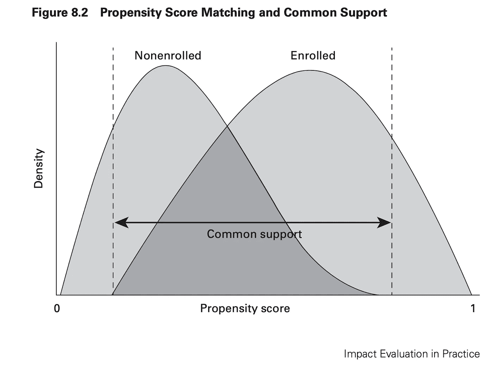
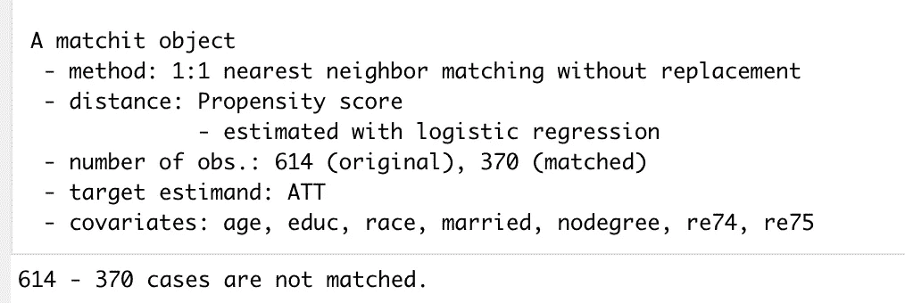
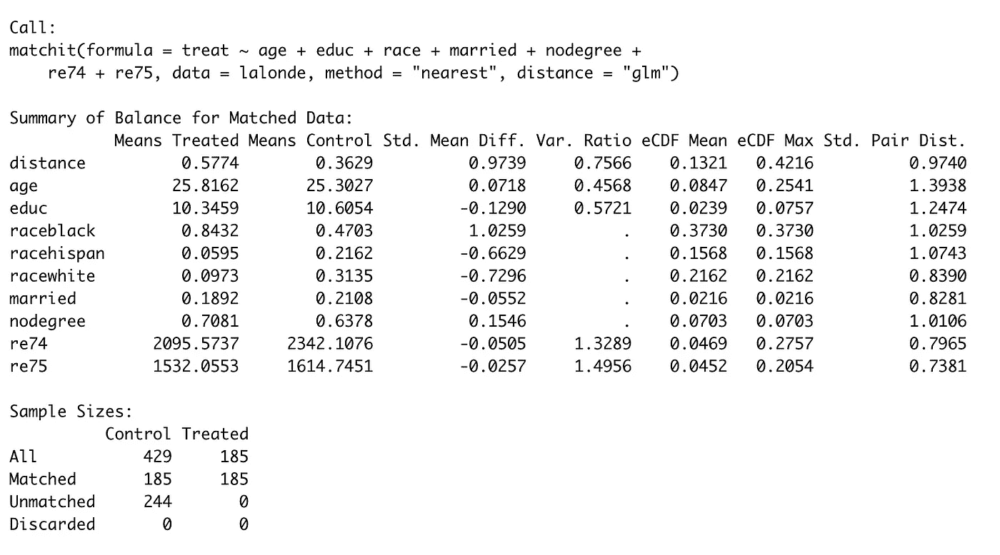
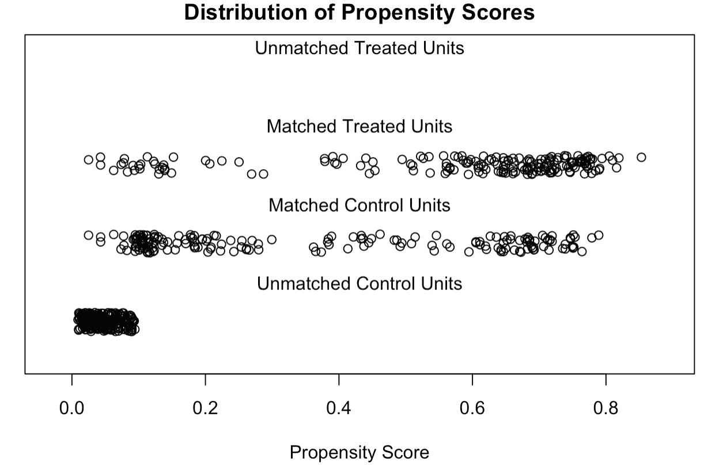
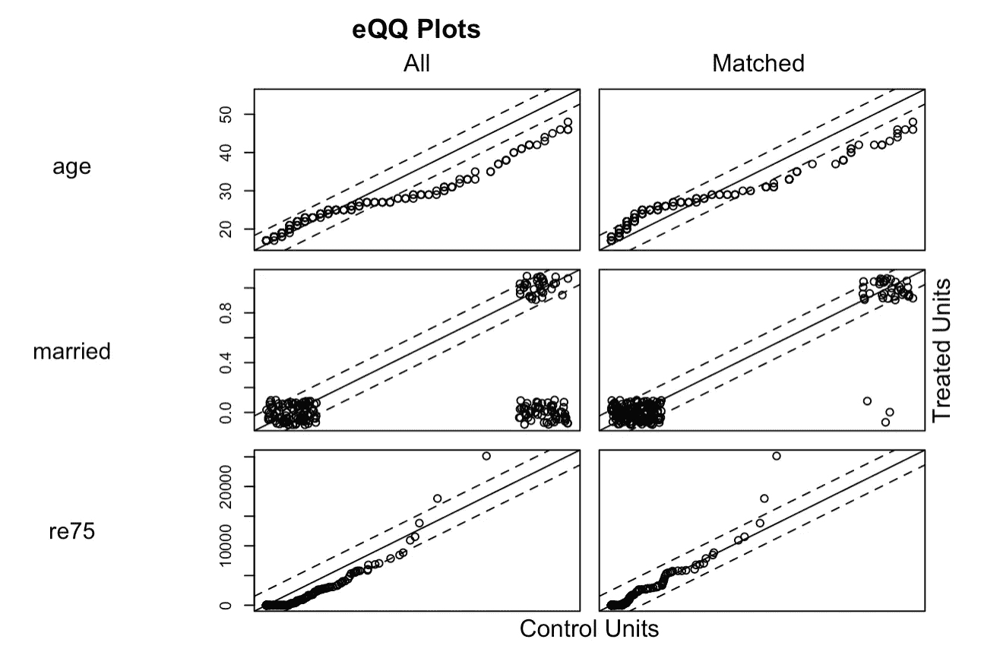
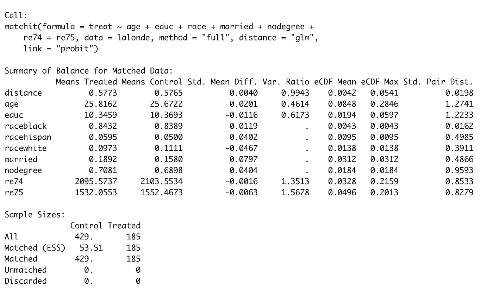
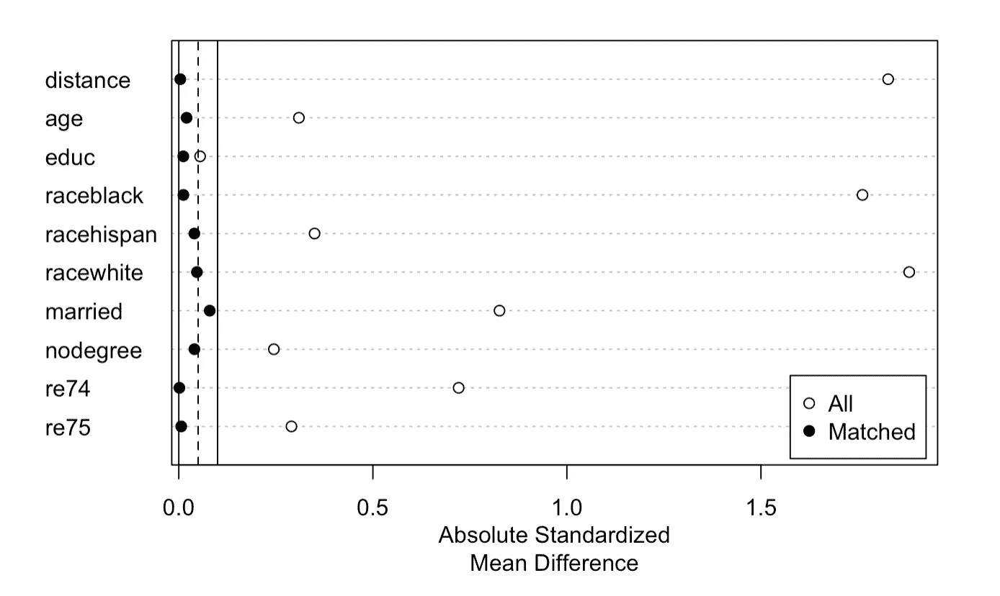
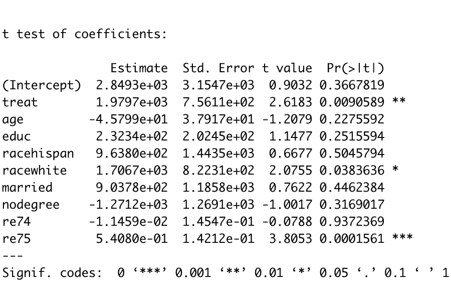

# 匹配和倾向评分匹配终极指南

> 原文：<https://towardsdatascience.com/an-ultimate-guide-to-matching-and-propensity-score-matching-644395c46616?source=collection_archive---------3----------------------->

## [实践教程](https://towardsdatascience.com/tagged/hands-on-tutorials)，使用观察数据进行因果推断

## 如何减少观察数据中混杂因素的影响


由[拉尔夫·梅休](https://unsplash.com/@ralphmayhew?utm_source=unsplash&utm_medium=referral&utm_content=creditCopyText)在 [Unsplash](https://unsplash.com/s/photos/twins?utm_source=unsplash&utm_medium=referral&utm_content=creditCopyText) 上拍摄的照片

*2021 年 8 月 15 日更新*

# 介绍

随机对照试验(又名。A/B 测试)是确定干预和结果之间因果关系的黄金标准。RCT 的高效度源于其通过随机化过程对数据生成过程(DGP)的严密控制，使得实验组在很大程度上具有可比性。因此，我们可以将实验组之间最终指标的差异归因于干预。

它的缺点是，由于实际原因，RCT 在现实世界中并不总是可行的。公司没有实验基础设施来促进大规模测试。或者，高用户干扰会使个体水平随机化的任何结果无效。

在这种情况下，当 A/B 测试被搁置时，幸运的是我们有两种选择:准实验设计和观察设计。在几篇文章中，我介绍了几种准实验设计:[差异中的差异](/does-minimum-wage-decrease-employment-a-difference-in-differences-approach-cb208ed07327?sk=9b4ec9afcef8bee1041720945cd0dd7d)、[回归不连续设计](/the-crown-jewel-of-causal-inference-regression-discontinuity-design-rdd-bad37a68e786?sk=401520d9e48b64e24aeb0064745b34fe)、[间断时间序列](/what-is-the-strongest-quasi-experimental-method-interrupted-time-series-period-f59fe5b00b31?sk=8ccf52232b23f5be74856768d4af15ce)、[和综合控制](/causal-inference-using-synthetic-control-the-ultimate-guide-a622ad5cf827?sk=74c2e04700963a589b03357105ca765b)。

在今天的帖子中，我们转向观察性设计，重点关注两种观察方法——匹配和倾向得分匹配——并特别关注 PSM 的基本假设、限制和应用。

在未来的帖子中，我们将更深入地研究序列**“使用观察数据的因果推断”**，并讨论高级主题，如[、倾向评分分层](/propensity-score-stratification-in-observational-data-a-tutorial-ef21321eb586?sk=52b3b023eabfedf2c6f5d60e8af401be)、治疗加权的逆概率和协变量调整。

# **对观测数据的一些抱怨**

与具有清晰 DGP 的实验数据相反，研究人员不知道也不能控制治疗分配过程。我们只观察到一些受试者属于一个组(如治疗组)，而其他受试者属于另一个组(如对照组)，但不知道他们为什么会出现在那里。这两个群体之间的任何直接比较都是没有意义和误导性的。

为什么？

可能会有混杂变量影响分配过程和结果变量。

这是程序评估文献中的一个经典例子。比方说，我们正试图评估一个针对失业者的职业培训项目的有效性，这个项目是通过家庭年收入来衡量的。

由于道德约束，RCT 是不可能的。想想媒体的影响，如果公众意识到一部分人可以参加有益的社会项目，但不是所有人。

一个更好的选择是采用观察设计。

问题仍然是:我们能直接比较注册和未注册之间的目标度量来评估计划的有效性吗？

不要！

那些参与者可能比其他人更有动力和渴望找到工作。因此，结果指标的差异可能是由动机水平(**一个混杂变量**)而不是治疗状态(**参与计划**)引起的。换句话说，参与者即使不参加该计划也会做得更好(Gertler 等人，2011)。


我自己的截图

*注:*

*   *虚线表示变量之间没有因果关系*
*   *实线表示因果关系*

观察法的首要任务是找到一种方法来减少或消除选择偏差或混杂变量的影响。

# 选择可比反事实的三个条件

到一天结束时，因果推理是关于反事实的:如果没有干预，会发生什么？不幸的是，我们只能观察到两个潜在结果中的一个。从概念上来说，因果推理受到缺失数据问题的困扰，研究人员必须依靠标准程序来找到一个完美的克隆作为反事实。

由于随机化过程，这对于实验数据来说是一项简单的任务:我们可以在很大程度上相信治疗组和非治疗组之间的可比性。

然而，与实验方法相比，观察方法建立在更多的假设基础上，并做出仔细的推断。在选择控制案例时，我们必须牢记以下原则(Gertler 等人，2011 年):

> 宗旨 1:不要追求每个个体的相似性，而是群体水平的相似性。
> 
> 原则 2:如果给予治疗，治疗组和对照组对治疗的反应应该相同。
> 
> 原则 3:控制混杂因素。

***宗旨 1*** 。无论你选择哪种估计量来估计，因果推断从来都不是关于每个个体单位的因果效应。相反，它是关于群体(总体)水平的治疗效果，平均*。*

****宗旨二*** 。如果被分配到治疗组，两组对干预的反应是一样的。否则，就不可能获得因果效应。*

****宗旨 3*** 。如何控制混杂因素？*

# *如何控制混杂因素？*

*如果混杂变量是可观察到的，我们可以通过将每个治疗个体与一个或多个对照相匹配来减少或消除协变量偏倚。假设倾向得分包含了关于选择过程的所有信息，那么倾向得分匹配获得了最佳的效率和一致性(Rosenbaum 和 Rubin，1983)。*

*不应有任何未观察到的变量；否则，估计量将是有偏差的和不一致的。*

# ***匹配***

*匹配是一个统计过程，试图根据关键的观察协变量将治疗受试者与对照受试者配对。*

> *对于具有大量潜在对照的小治疗组，匹配是理想的。*

*基于匹配比例(一对一匹配、多对一匹配)、匹配对象的替换(有或无替换)、算法(贪婪、遗传或最优/完全匹配)，有各种匹配策略(Kim 和 Steiner，2016)。*

*不可能在一篇博文中检查所有这些子类别。如果可能的话，我会在后续文章中研究一些最重要的方法。*

# ***倾向评分匹配***

*如果我们认为有多个混杂变量，由于缺乏数据，匹配所有变量可能是不可能的。作为一个解决方案，我们构建了一个比例条件概率接受治疗分配给定的协变量向量。*

*只有在少数罕见的情况下，已知分配治疗的概率，如在 RCT，真实的倾向评分仍然未知的观察设计。相反，我们必须使用 logit 或 probit 来估计它。*

*倾向得分是一个平衡得分:根据倾向得分，观察到的基线协变量的分布在治疗/对照受试者之间足够相似。换句话说，倾向得分为使用观察数据的有效因果推断提供了足够好的反事实。*

*倾向评分匹配模拟了 RCT，我们在倾向评分匹配样本中比较了治疗和未治疗受试者的结果(Austin，2011)。*

*然而，这是一个有争议的过程。正如 King 和 Nielsen (2019)所说，PSM 试图近似一个完全随机的实验，而不是一个分块随机的实验。因此，PSM 无法消除可以通过阻塞消除的协变量不平衡。我不会详细阐述这场辩论，把它留给以后的帖子。此外，金教授推荐其他类型的倾向得分分析，如[倾向得分分层](/propensity-score-stratification-in-observational-data-a-tutorial-ef21321eb586?sk=52b3b023eabfedf2c6f5d60e8af401be)。*

## *警告*

*PSM 有以下警告(Gertler 等人，2011 年):*

> *警告 1:常见的支持。待治疗的倾向的范围在已治疗和未治疗的病例之间是相同或相似的。*
> 
> *警告 2:仅使用不受干预影响的基线特征进行匹配。*
> 
> *警告 3:潜在的混杂变量是可观察的，没有不可观察的变量；否则，估计是有偏差的。*
> 
> *警告 4:匹配最相关的特征，不应该将每个变量都放入等式中。*

**告诫 1* 。在计算了治疗组和非治疗组的倾向后，我们得到了下图。在两个极端，缺乏共同的支持。在最右边，有更高概率接受治疗的人找不到可比较的对照。在最左边，接受治疗的概率较低的人找不到可比较的治疗案例。*

*在中档中有一个共同的支持，在未注册者和注册者之间有重叠。因此，我们不得不把我们的因果发现缩小到**当地的平均治疗效果(晚期)。***

**

*格特勒等人，2011 年*

**警告 2* 。在估计倾向得分时，我们不应该包括任何可能被干预改变的特征；否则，估计可能会有偏差。*

**告诫 3。没有正式的方法来测试它，我们必须依靠深入的领域知识来假设。在这种情况下，一些基于设计的想法就派上用场了。**

*首先，我们可以交叉检查不受干预影响的结果(Shadish 等人，2002)。*

*第二，我们可以添加第二个但概念上不同的对照组，允许对未受影响的结果进行类似的测试(Rosenbaum，2002)。*

**告诫 4。*仅包含决定注册状态的变量而非所有变量可提高估计值的精度。我们对登记过程了解得越多，倾向评分在构建可比群体时就越准确。*

# *使用 PSM 的步骤 **(Jalan 和 Ravallion，2003):***

1.  **计算所有单位的倾向得分**
2.  **按照某种匹配策略将治疗组与对照组进行匹配**
3.  **检查协变量平衡&如果不平衡，使用替代规格*重复步骤 1 和 2*
4.  **计算治疗组和对照组之间结果的平均差异**

# *应用程序*

*在这一部分，我将重复两项研究的结果(LaLonde，1986；德赫贾和瓦赫巴，1997 年)。**请查看诺亚·格里弗(** [**链接**](https://cran.r-project.org/web/packages/MatchIt/vignettes/MatchIt.html) **)的这篇帖子，获取完整的 R 代码和演练。读诺亚的** [**帖**](https://cran.r-project.org/web/packages/MatchIt/vignettes/MatchIt.html) **，我受益匪浅。***

***第 0 步:安装包并加载库***

```
*#install.packages(“MatchIt”)
#install.packages(‘optmatch’)
library(“MatchIt”)
library(“optmatch”)
data(“lalonde”)
head(lalonde)*
```

**

*我自己的截图*

```
*Note: - The outcome variable is 1978 earnings ( ‘re78’)- The intervention: ‘treat’- 1974 earnings: re74- 1975 earnings: re75- and other control variables*
```

*在这里，我们基于协变量(年龄、教育、种族、已婚、无学位、re74 和 re75)为每个观察构建了一个倾向得分，代表其加入该计划的倾向。*

***步骤 1:无匹配&比较协变量不平衡***

```
*result_0 <- matchit(treat ~ age + educ + race + married +  nodegree + re74 + re75, data = lalonde, method = NULL, distance = 'glm')result_0*
```

**

*我自己的截图*

```
*summary(result_0)*
```

**

*我自己的截图*

*总共有 185 个经处理的观察值和 429 个未经处理的观察值。*

*标准差和 eCDF 统计接近 0 或方差比接近 1 表示良好的平衡；否则，不平衡。*

*在没有应用匹配方法的情况下，治疗组和非治疗组之间存在严重的不平衡。它们在标准均值差(Std)方面看起来非常不同。平均差异。)，方差比(Var。比率)，以及经验累积密度函数(eCDF)。*

*协变量失衡表明治疗前的选择偏差，因此我们不能将差异归因于干预。*

***步骤 2.1:最近邻居***

```
*result_1 <- matchit(treat ~ age + educ + race + married +  nodegree + re74 + re75, data = lalonde, method = “nearest”, distance = ‘glm’)result_1*
```

**

*我自己的截图*

*我们应用最近的方法和 1:1 匹配最近的邻居。1:1 匹配意味着我们将一个治疗单位与一个具有最接近倾向得分的对照单位进行匹配。然后，这个控制单元将被从控制池中取出，并且不可用于其他情况(也称为。不更换)。对其余已处理的病例重复该过程。*

```
*summary(result_1, un=FALSE)*
```

**

*我自己的截图*

```
*plot(result_1, type = “jitter”, interactive = FALSE)*
```

**

*我自己的截图*

```
*plot(result_1, type = “qq”, interactive = FALSE, which.xs = c(“age”, “married”, “re75”))*
```

**

*我自己的截图*

*让我们检查三个变量的协变量的分布。远离实线对角线的点表示两组之间的协变量差异。两个变量，已婚和 re75，匹配后有更好的平衡，但对年龄没有改善。*

*在 1:1 匹配后，就 Std 而言，与不匹配相比，两组具有更好的平衡。平均差异。，Var。比率和 eCDF 统计。然而，仍然存在群体不平衡。让我们检查其他匹配方法并比较结果。*

***步骤 2.2:完全匹配和概率单位***

```
*result_2 <- matchit(treat ~ age + educ + race + married + nodegree + re74 + re75, data = lalonde, method = “full”, distance = “glm”, link = “probit”)result_2*
```

**

*我自己的截图*

*完全匹配将一个处理单元匹配到一个或多个控制单元(或一个控制单元匹配到一个或多个处理单元)()。此外，我们将链接函数从 logit 更改为 probit。*

```
*summary(result_2, un = FALSE)*
```

**

*我自己的截图*

```
*plot(summary(result_2))*
```

**

*我自己的截图*

*在应用完全匹配后，治疗组和非治疗组之间的协变量看起来更加平衡。*

***第三步:估计效果和标准误差***

```
*m.data2 <- match.data(result_2)
m.data2*
```

**

*我自己的截图*

```
*library(‘lmtest’) 
library(‘sandwich’) fit2 <- lm(re78 ~ treat + age + educ + race + married + nodegree + 
 re74 + re75, data = m.data2, weights = weights)coeftest(fit2, vcov. = vcovCL, cluster = ~subclass)*
```

**

*最后一步，我们估计治疗效果及其标准误差。对于成对集合，我们使用聚类稳健的标准误差(查看 Noah 的[帖子](https://cran.r-project.org/web/packages/MatchIt/vignettes/MatchIt.html)以获得解释)。治疗的效果是 1980 美元，标准误差为 756，统计显著性为 0.001。*

# *结论*

*使用实验数据的因果推断依赖于温和的假设，但观察方法提出了更多的要求，需要更多的假设。对于观察数据，倾向评分匹配旨在通过匹配治疗组和未治疗组来减少干预前存在的偏差。*

**Medium 最近进化出了它的* [*作家伙伴计划*](https://blog.medium.com/evolving-the-partner-program-2613708f9f3c) *，支持像我这样的普通作家。如果你还不是订户，通过下面的链接注册，我会收到一部分会员费。**

*[](https://leihua-ye.medium.com/membership) [## 阅读叶雷华博士研究员(以及其他成千上万的媒体作家)的每一个故事

### 作为一个媒体会员，你的会员费的一部分会给你阅读的作家，你可以完全接触到每一个故事…

leihua-ye.medium.com](https://leihua-ye.medium.com/membership)* 

# *参考*

*德赫贾和瓦赫巴(1999 年)。非实验研究中的因果效应:重新评估训练计划的评估。美国统计协会杂志 94:1053–1062。*

*[Gertler，P.J .，Martinez，s .，Premand，p .，Rawlings，L.B .和 Vermeersch，C.M .，2016 年。*实际影响评估*。世界银行](https://openknowledge.worldbank.org/bitstream/handle/10986/25030/9781464807794.pdf?sequence=2&isAllowed=y)。*

*[Kim，y .和 Steiner，p .，2016 年。因果推理的准实验设计。*教育心理学家*，*51*(3–4)，第 395–405 页](https://www.ncbi.nlm.nih.gov/pmc/articles/PMC6086368/pdf/nihms-983980.pdf)。*

*拉隆德，R. (1986 年)。用实验数据评估训练计划的经济计量评估。美国经济评论 76:604–620。*

*格里弗，N .(2021 年)。MatchIt:入门*

*j .贾兰和 m .拉瓦里翁，2003 年。通过倾向得分匹配估计反贫困项目的受益发生率。*商业杂志&经济统计*， *21* (1)，第 19–30 页。*

# *相关阅读*

*[](/propensity-score-stratification-in-observational-data-a-tutorial-ef21321eb586) [## 观察数据中的倾向评分分层:指南

### 倾向评分匹配的更好替代方案

towardsdatascience.com](/propensity-score-stratification-in-observational-data-a-tutorial-ef21321eb586) [](/online-controlled-experiment-8-common-pitfalls-and-solutions-ea4488e5a82e) [## 运行 A/B 测试的 8 个常见陷阱

### 如何不让你的在线控制实验失败

towardsdatascience.com](/online-controlled-experiment-8-common-pitfalls-and-solutions-ea4488e5a82e) 

# 喜欢读这本书吗？

> 请在 [LinkedIn](https://www.linkedin.com/in/leihuaye/) 和 [Youtube](https://www.youtube.com/channel/UCBBu2nqs6iZPyNSgMjXUGPg) 上找到我。
> 
> 还有，看看我其他关于人工智能和机器学习的帖子。*