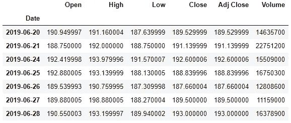

# 熊猫时间序列分析终极指南

> 原文：<https://towardsdatascience.com/an-ultimate-guide-to-time-series-analysis-in-pandas-d511b8e80e81?source=collection_archive---------22----------------------->


桑德拉·维尔廷格在 [Unsplash](https://unsplash.com?utm_source=medium&utm_medium=referral) 上的照片

## 在 Pandas 中执行时间序列分析所需的所有 Pandas 功能。您也可以将此用作备忘单。

# 什么是时间序列分析？

正是对数据集的分析才有了一系列时间戳。随着对机器学习的日益重视，它变得越来越重要。现在，许多不同类型的行业使用时间序列数据进行时间序列预测、季节性分析、发现趋势以及做出重要的商业和研究决策。所以作为数据科学家或数据分析师，清楚地理解时间序列数据是非常重要的。

> *时间序列数据用于:*

银行和金融机构

股票市场

社会化媒体

电力、天然气和石油工业

机械或化学过程中的周期性措施

以及更多的领域

这是不可避免的。所以，我们来学学吧。

我将从一些通用函数开始，并使用**脸书股票价格数据集**展示更多主题。

让我们开始吧！

# 使用正确的格式

时间序列数据可以有多种不同的格式。但并非所有这些格式都对 python 的熊猫库友好。最方便的格式是熊猫的时间戳格式。但是大多数时候时间序列数据都是字符串格式的。这里我有一个不同格式的时间序列数据的例子。

```
import pandas as pd
import numpy as npdates = ['2020-11-25 2:30:00 PM', 'Jan 5, 2020 18:45:00', '01/11/2020', '2020.01.11', '2020/01/11', '20201105']
```

上面的“日期”变量显示了五种不同格式的日期时间设置，并且都是正确的。但是我们需要这种特定的格式来方便地工作。因此，将这些日期转换成正确的格式。

```
pd.to_datetime(dates)
```

输出:

```
DatetimeIndex(['2020-11-25 14:30:00', '2020-01-05 18:45:00',
               '2020-01-11 00:00:00', '2020-01-11 00:00:00',
               '2020-01-11 00:00:00', '2020-11-05 00:00:00'],
              dtype='datetime64[ns]', freq=None)
```

世界上还有其他国家，他们首先使用天数。例如，在美式英语中，2002 年 6 月 1 日被写成“2020 年 6 月 1 日”。但是在英国，像印度、孟加拉国、巴基斯坦和世界其他一些地方的南亚国家把它写成“1/6/2020”。

如果你为来自世界其他地方的客户工作，以下是如何格式化日期。

```
pd.to_datetime(dates).strftime('%d-%m-%y')
```

输出:

```
Index(['25-11-20', '05-01-20', '11-01-20', '11-01-20', '11-01-20', '05-11-20'], dtype='object')
```

我只是在这里使用了“%d-%m-%y”作为格式。您可以根据需要更改顺序。

> *如果需要先放月或者先放年，只需要改变格式中的顺序即可。*

现在，我将导入数据集，我们将使用该数据集来演示许多函数。我们的脸书股票数据。请随意在此下载数据集并跟随:

[](https://github.com/rashida048/Datasets/blob/master/FB_data.csv) [## master rashida048/Datasets 上的 Datasets/FB_data.csv

### 在 GitHub 上创建一个帐户，为 rashida048/Datasets 开发做出贡献。

github.com](https://github.com/rashida048/Datasets/blob/master/FB_data.csv) 

你学习的唯一方法是通过实践。

> 如果你读这篇文章是为了学习，我强烈建议你边读边练。

```
df = pd.read_csv('FB_data.csv')
df.head()
```


这是一个原始数据集。看起来不坏！井井有条。但是我们需要像前面讨论的那样改变“日期”列的格式。我们将把它做成 DatetimeIndex 格式，并把它作为索引列。

因为当“日期”列是索引列时，我们将能够非常容易地对其进行重新采样。您将在后面的章节中看到这意味着什么。

这是导入数据的正确方法，我在导入时更改了日期的格式并将其设置为索引。

```
df = pd.read_csv('FB_data.csv', parse_dates=['Date'], index_col="Date")
df.head()
```


看，我们改变了“日期”栏的格式！

# 重采样

在这一节中，我将讨论如何对数据进行重采样。

> *为什么重采样很重要？*

因为我们并不总是需要庞大数据集中的所有数据。例如，我们可能只需要 2019 年 6 月的数据。如果您的日期格式是 DatetimeIndex，那就非常简单了:

```
df["2019-06"]
```



我们只有八天的数据。求 2019 年 6 月开盘价均值。

```
df["2019-06"].Open.mean()
```

输出:

```
190.71000014285715
```

我们也可以得到单个日期的数据。

```
df.loc["2019-06-21"]
```

输出:

```
Open         1.887500e+02
High         1.920000e+02
Low          1.887500e+02
Close        1.911400e+02
Adj Close    1.911400e+02
Volume       2.275120e+07
Name: 2019-06-21 00:00:00, dtype: float64
```

比方说，我们需要 2019 年 6 月 27 日到 7 月 10 日两个星期的数据。

```
df.loc["2019-06-27": "2019-07-10"
```


你也可以按月重新取样。这给出了月平均值。例如，这里我将获得月平均收盘数据:

```
df.Close.resample('M').mean()
```

输出:

```
Date
2019-06-30    190.324286
2019-07-31    199.595454
2019-08-31    184.497726
2019-09-30    185.735000
2019-10-31    184.383912
2019-11-30    195.718500
2019-12-31    201.951904
2020-01-31    216.643333
2020-02-29    207.505263
2020-03-31    165.747727
2020-04-30    177.003335
2020-05-31    216.549001
2020-06-30    232.671332
Freq: M, Name: Close, dtype: float64
```

我们可以用一行代码计算月平均值并绘图:

```
df.Close.resample('M').mean().plot()
```


如果您想要周数据并绘制它，您可以通过以下代码获得它:

```
df.Close.resample('W').mean().plot()
```

> *使用 plot()函数中的“kind”参数，您可以获得总共 13 种类型的图，而不是简单的线形图。*

我用这个柱状图命名了这 13 种类型的图。

我将绘制季度结算数据的柱状图。

```
df.Close.resample('Q').mean().plot(kind='bar')
```


上面的“种类”参数采用以下 13 种可视化类型:

1.  线条
2.  区域
3.  酒吧
4.  barh
5.  馅饼
6.  箱子
7.  赫克宾
8.  嘘
9.  kde
10.  密度
11.  分散

# 变化

听起来，shift 函数将数据移动指定的次数。我们正在使用的 FB 数据集从 2019 年 6 月 20 日开始。现在，如果我们将数据移动 1，2019 年 6 月 20 日的数据将移动到 2019 年 6 月 21 日，2019 年 6 月 21 日的数据将移动到 2019 年 6 月 22 日，依此类推。

> *我稍后会解释为什么人们使用 shift*

对于这个例子，我将只使用列。你会非常清楚地看到变化。我将创建一个名为“df1”的新数据帧，只包含开放数据。

```
df1 = pd.DataFrame(df['Open'])
df1.head()
```


将该数据移动 1。

```
df1.shift(1)
```


第一行的值为空。仅仅是因为第一行移到了第二行。但是第一行之前没有数据。

如果你在 shift 中使用了一个负值，结果正好相反。

```
df1.shift(-1)
```


> *我们为什么要使用 shift？*

班次给你前一天的数据或者第二天的数据。这是一个使用案例。我将使用 shift 将今天的数据和前一天的数据并排放置。

```
df1['Prev Day Opening'] = df1['Open'].shift(1)
df1
```


有用吗！？

您还可以在另一列中获得 1 天数据的变化:

```
df1['1 day change'] = df1['Open'] - df1['Prev Day Opening']
```

以百分比计算 1 周的总数。为此，我们必须推迟 5 天。对吗？然后取今天和 5 天前数据的差值。乘以 100，然后除以今天的原始数据。让我们来看看，以便更好地理解它。

```
df1['One week total return'] = (df1['Open'] - df1['Open'].shift(5)) * 100/df1['Open'].shift(5)
df1.tail()
```


我要用 df.tail()，因为我们上了 5 天的班。所以前 5 行将为空。

# 时区

理解时区很重要。很可能，你在一个时区，而你的客户在另一个时区。熊猫有很强的适应不同时区的功能。

我们有两种类型的日期时间数据。**不知道时区的简单日期时间**和知道时区的**时区感知日期时间**。我们拥有的数据是朴素的日期时间。所以，我们需要使用 tz_localize 来转换这个 DateTime。

将脸书数据集的索引转换为“美国/东部”。

```
df.index = df.index.tz_localize(tz = 'US/Eastern')
df.index
```

输出:

```
DatetimeIndex(['2019-06-20 00:00:00-04:00', '2019-06-21 00:00:00-04:00', '2019-06-24 00:00:00-04:00', '2019-06-25 00:00:00-04:00', '2019-06-26 00:00:00-04:00', '2019-06-27 00:00:00-04:00', '2019-06-28 00:00:00-04:00', '2019-07-01 00:00:00-04:00', '2019-07-02 00:00:00-04:00', '2019-07-03 00:00:00-04:00',
               ...
               '2020-06-08 00:00:00-04:00', '2020-06-09 00:00:00-04:00', '2020-06-10 00:00:00-04:00', '2020-06-11 00:00:00-04:00', '2020-06-12 00:00:00-04:00', '2020-06-15 00:00:00-04:00', '2020-06-16 00:00:00-04:00', '2020-06-17 00:00:00-04:00', '2020-06-18 00:00:00-04:00', '2020-06-19 00:00:00-04:00'], dtype='datetime64[ns, US/Eastern]', name='Date', length=253, freq=None)
```

在每个日期，它显示负 4 小时。同样，如果我们将其转换为“欧洲/柏林”,它将增加 6 个小时。

```
df = df.tz_convert('Europe/Berlin')
df.index
```

输出:

```
DatetimeIndex(['2019-06-20 06:00:00+02:00', '2019-06-21 06:00:00+02:00', '2019-06-24 06:00:00+02:00', '2019-06-25 06:00:00+02:00', '2019-06-26 06:00:00+02:00', '2019-06-27 06:00:00+02:00', '2019-06-28 06:00:00+02:00', '2019-07-01 06:00:00+02:00', '2019-07-02 06:00:00+02:00', '2019-07-03 06:00:00+02:00',
               ...
               '2020-06-08 06:00:00+02:00', '2020-06-09 06:00:00+02:00', '2020-06-10 06:00:00+02:00', '2020-06-11 06:00:00+02:00', '2020-06-12 06:00:00+02:00', '2020-06-15 06:00:00+02:00', '2020-06-16 06:00:00+02:00', '2020-06-17 06:00:00+02:00', '2020-06-18 06:00:00+02:00', '2020-06-19 06:00:00+02:00'], dtype='datetime64[ns, Europe/Berlin]', name='Date', length=253, freq=None)
```

您可以找到世界上所有可用的时区，并以这种方式使用适合您的时区:

```
from pytz import all_timezones
print(all_timezones)
```

这是输出的一部分。满输出太大:

```
['Africa/Abidjan', 'Africa/Accra', 'Africa/Addis_Ababa', 'Africa/Algiers', 'Africa/Asmara', 'Africa/Asmera', 'Africa/Bamako', 'Africa/Bangui', 'Africa/Banjul', 'Africa/Bissau', 'Africa/Blantyre', 'Africa/Brazzaville', 'Africa/Bujumbura', 'Africa/Cairo',.....
```

# 如何生成缺失日期

如果您有数据并且知道时间段，但是时间没有记录在数据集中，该怎么办？或者你有去年第二季度的数据，但没有今年的数据。而你今年需要用去年的数据。

在许多情况下，您可能需要生成一系列日期。熊猫 **date_range** 功能就派上用场了。让我们生成一个 10 天的时间段:

```
rng = pd.date_range(start='11/1/2020', periods=10)
rng
```

输出:

```
DatetimeIndex(['2020-11-01', '2020-11-02', '2020-11-03', '2020-11-04', '2020-11-05', '2020-11-06', '2020-11-07', '2020-11-08', '2020-11-09', '2020-11-10'], dtype='datetime64[ns]', freq='D')
```

> ***如果我只需要工作日怎么办？***

我只需要添加一个称为频率的额外参数，如下所示:

```
rng = pd.date_range(start='11/1/2020', periods=10, freq='B')
rng
```

输出:

```
DatetimeIndex(['2020-11-02', '2020-11-03', '2020-11-04', '2020-11-05', '2020-11-06', '2020-11-09', '2020-11-10', '2020-11-11', '2020-11-12', '2020-11-13'], dtype='datetime64[ns]', freq='B')
```

还有几个类似的选项和频率。请查看这篇文章，我只详细解释了 date_range 函数:

[](/pandas-date-range-function-details-fc1bd91b80a0) [## 熊猫日期范围函数详细信息

### 考虑不同条件生成一系列日期

towardsdatascience.com](/pandas-date-range-function-details-fc1bd91b80a0) 

因此，我们可以生成一系列日期，并将它们添加到我们的数据集中！

# 旋转

rolling 函数聚合指定日期时间数的数据。这里我将取每三天的平均值。在完成这个例子后，我将进一步解释:

```
df[["High"]].rolling(3).mean()[:10]
```


这里到底发生了什么？我在滚动函数中传递了 3 作为参数，而聚合函数是 mean。因此，它取 6 月 20 日、21 日和 24 日“高”数据的平均值，放在 24 日。对第 21、24 和 25 个数据进行同样的操作，并放在第 25 个数据上，以此类推。很多时候，我们使用周平均值或三天平均值来做决定。

您还可以选择放置滚动数据的位置。这里有一个例子:

```
data_rol = df[['High', 'Low']].rolling(window = 7, center = True).mean()
data_rol
```


在这个滚动函数中，我传递了 window = 7。这意味着需要 7 天的平均时间。center = True 表示将平均值放在第 4 行而不是第 7 行。这就是为什么它的底部也有一些空值。

让我们在同一个图中绘制原始“高”数据和 7 天累计“高”数据:

```
%matplotlib inline
import matplotlib.ticker as ticker 
fig, ax = plt.subplots(figsize= (11, 4))
ax.plot(df['High'], marker = '.', markersize=4, color='0.4', linestyle='None', label='Daily')
ax.xaxis.set_major_locator(ticker.MultipleLocator(30))
ax.plot(data_rol['High'], linewidth=2, label='7-d rolling mean')
ax.set_xlabel('Month')
```


> *通常，这种类型的图用于观察数据中的任何趋势*

在我们的数据中，有一个趋势是可以观察到的。2020 年 1 月后，价值开始下降，曲线变得陡峭。在时间序列分析中，我们有时会努力寻找趋势。但有时我们需要从数据中剔除趋势。尤其是当我们需要使用时间序列数据进行机器学习或预测时。

再次行军后，它有一个陡峭的上升。在下一节，我将告诉你如何摆脱这种趋势。

# 消除趋势的差异

如果数据中有任何趋势，这对于建模、预测或观察季节性都是不利的。为了提高模型性能，或者观察数据中的任何季节性或任何噪声，差分是一种常见的做法。它采用指定天数的数据差异。这里有一个例子:

```
df_first_order_diff = df[['High', 'Low']].diff()
df_first_order_diff
```


在这里，我没有指定。diff()函数。因此，默认情况下，只需要 1 天的差异。

您看到结果表中发生了什么吗？“高”和“低”数据是“20–06–19”是 21–06–19 和 20–06–19 的“高”和“低”数据的差值。故事发生在 2019 年 6 月 21 日。这就是为什么它在 20–06–19 中为空。因为在那之前没有数据可以减去。

这种差异过程被认为可以消除这种趋势。万一没有，尝试 3 天差异或 7 天差异。这是如何进行 3 天的差异:

```
df[['High', 'Low']].diff(3)
```

让我们绘制上面一阶差分的数据，看看我们在上一节观察到的趋势是否已经消除。

```
start = '20-06-19'fig, ax = plt.subplots(figsize = (11, 4))
ax.plot(df_first_order_diff.loc[start:, "High"], marker = 'o', 
        markersize = 4, linestyle = '-', label = 'First Order Differencing')
ax.xaxis.set_major_locator(ticker.MultipleLocator(30))
```


看那明显的趋势没了！如果你能在最后摆脱这种轻微的趋势，请随意检查我之前提到的 3 天差异。

# 重要时间特征提取

您可以从时间序列中提取非常有用的年、月、周或工作日。让我们从索引列“Date”中提取年份开始。

```
pd.DatetimeIndex(df.index).year
```

输出:

```
Int64Index([2019, 2019, 2019, 2019, 2019, 2019, 2019, 2019, 2019, 2019,
            ...
            2020, 2020, 2020, 2020, 2020, 2020, 2020, 2020, 2020, 2020], dtype='int64', name='Date', length=253)
```

现在，选取数据集的一个子集使其变小，并在单独的列中添加年份。

```
df3 = df[['High','Low', 'Volume']]
df3['Year'] = pd.DatetimeIndex(df3.index).year
df3
```


看到我们在最后加上了年份。同样，您可以提取月份和工作日。下面是代码:

```
pd.DatetimeIndex(df3.index).month
```

输出:

```
Int64Index([6, 6, 6, 6, 6, 6, 6, 7, 7, 7,
            ...
            6, 6, 6, 6, 6, 6, 6, 6, 6, 6], dtype='int64', name='Date', length=253)
```

以下是提取工作日的方法:

```
pd.DatetimeIndex(df3.index).weekday
```

输出:

```
Int64Index([3, 4, 0, 1, 2, 3, 4, 0, 1, 2,
            ...
            0, 1, 2, 3, 4, 0, 1, 2, 3, 4], dtype='int64', name='Date', length=253)
```

工作日出来就是数字。如果您需要周日、周一等工作日格式，该怎么办？那会更有用！

```
df3['Weekday'] = pd.DatetimeIndex(df3.index).to_series().dt.day_name()
df3.head()
```


让我们检查工作日是否对“高”、“低”和“量”数据有任何影响。

```
import seaborn as sns
fig, axes = plt.subplots(3, 1,figsize=(11, 10), sharex=True)for name, ax in zip(['High', 'Low', 'Volume'], axes):
    sns.boxplot(data=df3, x = 'Weekday', y = name, ax=ax)
    ax.set_title(name)
```


工作日对这些数据有影响，对吗？周三的“高”、“低”和“量”都在上涨。周一情况正好相反。箱线图在一个包中给出了很多信息。如果您需要复习如何从箱线图中提取所有数据，这里有一篇详细的文章:

[](/understanding-the-data-using-histogram-and-boxplot-with-example-425a52b5b8a6) [## 使用直方图和箱线图理解数据，并举例说明

### 了解如何从直方图和箱线图中提取最多的信息。

towardsdatascience.com](/understanding-the-data-using-histogram-and-boxplot-with-example-425a52b5b8a6) 

# 周期和周期指数

另一个重要的 python 函数。我们将通过实践来学习。使用周期函数的最基本方法是:

```
y = pd.Period('2020')
y
```

输出:

```
Period('2020', 'A-DEC')
```

此输出表明，这一时期' 2020 年'将于 12 月结束。有道理，对吧？

以下是可从周期函数中提取的所有信息的目录:

```
dir(y)
```

这是输出的一部分。因为目录大！

```
.
.
.
.
.
'asfreq',
 'day',
 'dayofweek',
 'dayofyear',
 'days_in_month',
 'daysinmonth',
 'end_time',
 'freq',
 'freqstr',
 'hour',
 'is_leap_year',
 'minute',
 'month',
 'now',
 'ordinal',
 'quarter',
 'qyear',
 'second',
 'start_time',
 'strftime',
 'to_timestamp',
 'week',
 'weekday',
 'weekofyear',
 'year']
```

> 我将展示其中的一些。

```
y.start_time
```

输出:

```
Timestamp('2020-01-01 00:00:00')
```

输入:

```
y.end_time
```

输出:

```
Timestamp('2020-12-31 23:59:59.999999999')
```

如果我们使用频率作为月份:

```
month = pd.Period('2020-2', freq="M") 
month
```

输出:

```
Period('2020-02', 'M')
```

输入:

```
month.start_time
```

输出:

```
Timestamp('2020-02-01 00:00:00')
```

输入:

```
month.end_time
```

输出:

```
Timestamp('2020-02-29 23:59:59.999999999')
```

> *我们可以用这种类型的月数据做什么？*

必要的话可以加减。例如，如果您有学生的年龄数据，并且需要更新年份或月份，您可以这样做:

```
month + 2
```

输出:

```
Period('2020-04', 'M')
```

同样的，你可以增加或减少天数。如果我们输入一个日期，默认情况下它会将频率作为日期。

```
d = pd.Period('2020-02-28')
d
```

输出:

```
Period('2020-02-28', 'D')
```

如果你增加一两天，它就会增加一两天。但是我这里写的日期是 2 月 28 日。这是不同的，对不对？闰年的二月有 29 天，其他年份的二月有 28 天。

让我们在上面的日期 d 的基础上增加两天:

```
d + 2
```

输出:

```
Period('2020-03-01', 'D')
```

2 月 28 日加 2 天，就得到 3 月 1 日。这意味着周期函数知道闰年。

同样，你可以添加年、小时、分钟甚至季度。

让我们来看一个 25 美分硬币的例子:

```
q = pd.Period('2020Q1')
q
```

输出:

```
Period('2020Q1', 'Q-DEC')
```

检查 q 的开始和结束月份。

```
q.asfreq('M', how='start')
```

输出:

```
Period('2020-01', 'M')
```

2020Q1 的第一个月是一月。这意味着默认情况下第一季度从一月份开始。检查什么时候结束。虽然我们知道它应该在三月结束。

```
q.asfreq('M', how='end')
```

输出:

```
Period('2020-03', 'M')
```

q 期始于一月，止于三月。任何地方的商业年度都不是从一月开始到三月结束。一会儿我会再谈一谈。

在 q 上加 1:

```
q + 1
```

输出:

```
Period('2020Q2', 'Q-DEC')
```

在这里，“Q-DEC”表示该季度在 12 月结束。一年有四个季度，最后一个季度在 12 月结束。但是有几个行业将一月作为第四季度末，或者将六月作为第四季度末。

我们可以使用“频率”参数来指定季度末。在下一个例子中，我将使用第四季度末作为一月份。

```
q1 = pd.Period('2020Q2', freq = 'Q-Jan')
q1
```

输出:

```
Period('2020Q2', 'Q-JAN')
```

看，这里我们把第四季度末改成了一月份！请随意查看第一季度的开始和结束月份。你会看到开始的月份是三月而不是四月。因为第一季度是从二月到四月。

按照我们之前生成 date_range 的方式，我们也可以生成期间范围:

```
idx = pd.period_range('2017', '2020', freq = 'Q')
idx
```

输出:

```
PeriodIndex(['2017Q1', '2017Q2', '2017Q3', '2017Q4', '2018Q1', '2018Q2', '2018Q3', '2018Q4', '2019Q1', '2019Q2', '2019Q3', '2019Q4', '2020Q1'], dtype='period[Q-DEC]', freq='Q-DEC')
```

默认情况下，从“2017Q1”开始。因为默认情况下，季度从一月开始，到十二月结束。但与之前一样，如果我们在 1 月份指定季度末，它将从 2017 年第四季度开始。

```
idx = pd.period_range('2017', '2020', freq = 'Q-Jan')
idx
```

输出:

```
PeriodIndex(['2017Q4', '2018Q1', '2018Q2', '2018Q3', '2018Q4', '2019Q1', '2019Q2', '2019Q3', '2019Q4', '2020Q1', '2020Q2', '2020Q3', '2020Q4'], dtype='period[Q-JAN]', freq='Q-JAN')
```

您可以将这些季度转换为时间戳:

```
idx = idx.to_timestamp()
idx
```

输出:

```
DatetimeIndex(['2016-11-01', '2017-02-01', '2017-05-01', '2017-08-01', '2017-11-01', '2018-02-01', '2018-05-01', '2018-08-01', '2018-11-01', '2019-02-01', '2019-05-01', '2019-08-01', '2019-11-01'], dtype='datetime64[ns]', freq='QS-NOV')
```

同样，当我们有时间戳时，我们可以使用 to_period()将其转换为季度。

```
idx.to_period()
```

输出:

```
PeriodIndex(['2016Q4', '2017Q1', '2017Q2', '2017Q3', '2017Q4', '2018Q1', '2018Q2', '2018Q3', '2018Q4', '2019Q1', '2019Q2', '2019Q3', '2019Q4'], dtype='period[Q-DEC]', freq='Q-DEC')
```

恭喜你！您现在刚刚学会了对任何数据集执行时间序列分析！

# 结论

我试图记录和解释大部分大熊猫的功能，用于时间序列分析。学习完这一整页后，您应该有足够的知识对任何时间序列数据执行有效的时间序列分析。但是请记住，要熟练使用所有这些功能需要大量的练习！编码快乐！

欢迎在推特上关注我，喜欢我的 T2 脸书页面。

更多阅读:

[](/series-of-projects-on-data-science-and-data-analytics-in-both-python-and-r-76db3fea9b7e) [## Python 和 R 语言的数据科学和数据分析系列项目

### 探索性数据分析、机器学习、自然语言处理和计算机视觉项目

towardsdatascience.com](/series-of-projects-on-data-science-and-data-analytics-in-both-python-and-r-76db3fea9b7e) [](/an-overview-of-performance-evaluation-metrics-of-machine-learning-classification-algorithms-7a95783a762f) [## 机器学习(分类)算法性能评价指标综述

### 开发一个分类模型和计算所有流行的性能评估指标使用…

towardsdatascience.com](/an-overview-of-performance-evaluation-metrics-of-machine-learning-classification-algorithms-7a95783a762f) [](/four-popular-feature-selection-methods-for-efficient-machine-learning-in-python-fdd34762efdb) [## Python 中高效机器学习的四种流行特征选择方法

### 使用真实数据集执行特征选择方法，并在每个方法后检索所选特征

towardsdatascience.com](/four-popular-feature-selection-methods-for-efficient-machine-learning-in-python-fdd34762efdb)