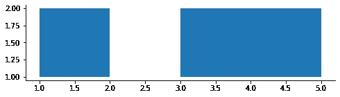
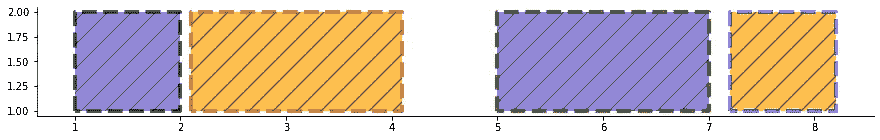
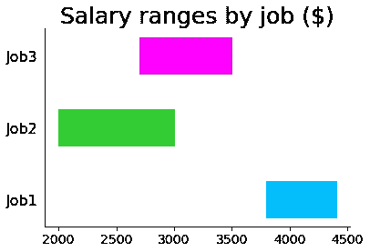
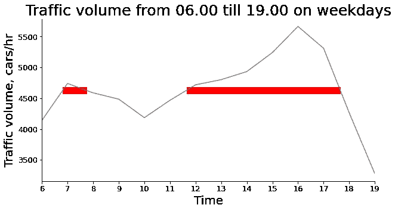
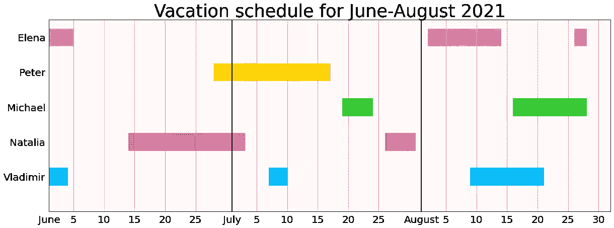

# 一个非常规但方便的 Matplotlib Broken_Barh 函数，当它特别有用时

> 原文：<https://towardsdatascience.com/an-unconventional-yet-convenient-matplotlib-broken-barh-function-and-when-it-is-particularly-88887b76c127?source=collection_archive---------26----------------------->

## 它是什么，如何使用和定制，何时使用


作者图片

尽管对于 Python 中的某些数据可视化情况非常方便，但`[broken_barh](https://matplotlib.org/stable/api/_as_gen/matplotlib.pyplot.broken_barh.html)`是 matplotlib 中不太为人所知和被低估的方法之一。它用于绘制不同 x 范围的水平矩形序列，并且位于 y 范围定义的相同垂直位置。换句话说，它产生了一个“断开的”水平条形图，即一个有间隙的图。

语法非常简单:该函数主要接受两个参数，`xranges`和`yrange`。`xranges`参数表示 2 项元组的列表或元组，其中每个元组的第一项`xmin`是相应矩形的最左侧 x 位置，第二项`xwidth`是该矩形的宽度。`yrange`参数是一个元组，表示所有矩形的 y 位置和高度。

一个基本的情节是这样的:

```
import matplotlib.pyplot as plt
import seaborn as sns
plt.figure(figsize=(8,2))
plt.broken_barh(xranges=[(1, 1), (3, 2)], yrange=(1, 1))
sns.despine()
plt.show()
```



作者图片

一些额外的不言自明的参数可以用来定制结果矩形的外观:`color`、`alpha`、`edgecolor`、`linewidth`、`linestyle`(可以是`'solid'`、`'dashed'`、`'dashdot'`或`'dotted'`)。`hatch`参数用于用图案填充矩形，可以取下列值之一或其组合作为字符串:`/`、`\\`、`|`、`-`、`+`、`x`、`o`、`O`、`.`、`*`。`label`参数设置将在图例中显示的标签。

这些参数中的每一个都可以是应用于所有矩形的单个自变量(浮点或字符串)(例如`color='red'`)或自变量的列表/元组(例如`color=('red','blue')`)，在该列表/元组上迭代以创建矩形的间歇序列:

```
plt.figure(figsize=(15,2))
x1 = (1, 1), (2.1, 2), (5, 2), (7.2, 1)
y1 = (1, 1)
plt.broken_barh(x1, y1, 
                color=['slateblue', 'orange'], alpha=0.7, 
                linewidth=4, 
                edgecolor=['black', 'brown', 'green', 'blue'], 
                linestyle='dashed', hatch='/')
sns.despine()
plt.show()
```



作者图片

我知道，上面的情节看起来有点让人不知所措🙂然而，它清楚地显示了附加参数是如何工作的。

`broken_barh`函数什么时候能在现实世界中派上用场？

# 1.要显示范围

使用这种方法，我们可以在同一个图上显示不同类别的范围，例如:

*   不同种类动物的边界条件(比如温度),
*   不同地理位置在一段时间内的降雨量，
*   各种工作的工资范围。

让我们用虚拟数据来看看最后一种情况:

```
x_ranges = [[(3800, 600)], [(2000, 1000)], [(2700, 800)]]
y_start = 1
colors = ['deepskyblue', 'limegreen', 'magenta']
for i in range(len(x_ranges)):
    plt.broken_barh(x_ranges[i], (y_start+i, 0.5), color=colors[i])    
plt.title('Salary ranges by job ($)', fontsize=25)
plt.xticks(fontsize=14)
plt.yticks(ticks=[1.25, 2.25, 3.25], 
           labels=['Job1', 'Job2', 'Job3'], fontsize=16)
plt.tick_params(left=False)
sns.despine()
plt.show()
```



作者图片

在这种情况下，`broken_barh`方法实际上为每个类别绘制了一个矩形。

**注意:**当我们必须为一个类别只绘制一个矩形时，我们必须将相应的 2 项元组放在*列表*中，而不是放在*元组*中。

# 2.强调另一个图形上的某些音程

在强调其他图表上的某些特定区间时，`broken_barh`方法是一个不错的选择。例如:

*   我们有一个地理区域在一段时间内温度波动的线图，我们希望显示温度高于某个值的时间间隔，
*   货币汇率随着利息的变化而变化，
*   当交通比平均水平更拥挤时，交通流量波动

下图准确地代表了最后一种情况:工作日从 06:00 到 19:00， [I-94 州际公路](https://en.wikipedia.org/wiki/Interstate_94)上每小时的交通量波动(数据取自 [this repository](https://archive.ics.uci.edu/ml/datasets/Metro+Interstate+Traffic+Volume) ，经过修改和略微修改)。我们应用了`broken_barh`方法来强调流量高于平均水平的时间范围:

```
import pandas as pd
cars_per_hr = pd.Series([4141, 4740, 4587, 4485, 4185, 4466, 4718, 4801, 4932, 5241, 5664, 5310, 4264, 3276])# Create a line plot
plt.figure(figsize=(10,5))
plt.plot(cars_per_hr, color="grey")# Create a broken horizontal bar plot
x = [(0.8, 0.95), (5.65, 6)]
y = (cars_per_hr.mean()-50, 100)
plt.broken_barh(x, y, color ='red')plt.title('Traffic volume from 06.00 till 19.00 on weekdays', 
          fontsize=25)
plt.xlabel('Time', fontsize=20)
plt.ylabel('Traffic volume, cars/hr', fontsize=20)
plt.xticks(ticks=list(range(14)), 
           labels=list(range(6,20)), fontsize=13)
plt.yticks(fontsize=13)
plt.xlim(0,13)
sns.despine()  
plt.show()
```



作者图片

我们看到有两个时间段的交通比平均水平更拥挤:大约从 6.45 到 7.40，以及从 11.40 到 17.40。

# 3.要创建甘特图

或许，`broken_barh`方法的最佳应用是创建简化的[甘特图](https://en.wikipedia.org/wiki/Gantt_chart)。甘特图是一种特殊类型的条形图，通常用于显示不同活动之间随时间变化的关系。这些活动可以包括:

*   项目管理进度及其当前状态，
*   要完成的任务及其截止日期，
*   正在进行的事件，
*   假期。

在 Python 中还有其他更复杂的创建甘特图的方法，比如使用 [Plotly](https://plotly.com/python/gantt/) 或 [python-gantt](https://pypi.org/project/python-gantt/) 库。然而，`broken_barh` matplotlib 函数也足以创建一个基本但信息丰富的图形。此外，它只需要几行代码就可以完成。

让我们以今年夏天的假期计划为例来说明这种方法是如何工作的。我们将为一个 5 人的部门使用虚拟数据:

```
plt.figure(figsize=(20,7))# Create broken horizontal bar plots for vacation ranges 
x_ranges = [[(0,3), (36,3), (69,12)], [(13,19), (55,5)], [(48,5), (76,12)], [(27,19)], [(0,4), (62,12), (86,2)]]
y_start = 0.75
colors = ['deepskyblue', 'indianred', 'limegreen', 'gold', 'violet']
for i in range(len(x_ranges)):
    plt.broken_barh(x_ranges[i], (y_start+i, 0.5), color=colors[i])# Create broken horizontal bar plots for weekends 
x_weekend = [(4,2), (11,2), (18,2), (25,2), (32,2), (39,2), (46,2), (53,2), (60,2), (67,2), (74,2), (81,2), (88,2)]
y_weekend = (0, 5.5)
plt.broken_barh(x_weekend, y_weekend, color='tomato', alpha=0.1)plt.title('Vacation schedule for June-August 2021', fontsize=35)
plt.xticks(ticks= [0, 4, 9, 14, 19, 24, 30, 34, 39, 44, 49, 54, 61, 65, 70, 75, 80, 85, 90],
           labels=['June', 5, 10, 15, 20, 25, 'July', 5, 10, 15, 20, 25, 'August', 5, 10, 15, 20, 25, 30], fontsize=20)
plt.yticks(ticks= [1, 2, 3, 4, 5], 
           labels=['Vladimir', 'Natalia', 'Michael', 'Peter', 'Elena'], fontsize=20)
plt.xlim(0, 92)
plt.ylim(0, 5.5)
plt.axvline(30, color='black')
plt.axvline(61, color='black')
plt.grid(axis='x')
plt.tick_params(left=False, bottom=False)
plt.show()
```



作者图片

即使不使用任何专门的库，上面的图看起来也很清楚:我们看到了雇员的姓名、每个雇员的假期数和假期范围、主要的时间标志(开始、5 日、10 日等等。每个月、所有的周末)、重叠假期的时段或者没有人休假的时段。

# 结论

在本文中，我们探索了一个很少使用但很方便的`broken_barh` matplotlib 方法的语法，定制结果图的方法，特别是该方法有特殊用途的情况，即在同一图上显示不同类别的范围(边界条件、工资范围)，在另一个图上强调一些区间(汇率变化、交通量波动)，以及创建甘特图(可视化计划，如项目步骤、任务或假期)。

感谢阅读！

**相关主题:**

</how-to-fill-plots-with-patterns-in-matplotlib-58ad41ea8cf8>  </bar-plots-alternatives-specific-types-9d10ef250e5>  <https://medium.com/geekculture/creating-toyplots-in-python-49de0bb27ec1> 