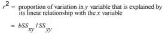

# 15 分钟的大学水平的统计学入门课程

> 原文：<https://towardsdatascience.com/an-undergraduate-level-introductory-statistics-course-in-15-minutes-51996bb7caf3?source=collection_archive---------8----------------------->

## 一个包含最基本的概念和公式的备忘单让你开始统计学。

照片由 [Pexels](https://www.pexels.com/photo/crop-unrecognizable-woman-working-on-laptop-near-adorable-dog-6589063/?utm_content=attributionCopyText&utm_medium=referral&utm_source=pexels) 的 [Meruyert Gonullu](https://www.pexels.com/@meruyert-bissimbayeva?utm_content=attributionCopyText&utm_medium=referral&utm_source=pexels) 拍摄

由于之前数学不及格，我怀着恐惧走进了我的第一门本科统计学课程。

不过，我害怕的不仅仅是数学。我担心，如果我连一门简单的统计学课程都学不会，我将会失去就业机会。沉迷于成为数据科学家的想法，我害怕无法建立所有数据科学家都需要的基本技能之一:理解和执行统计程序的能力。

不过，我本不必担心。尽管战战兢兢，我还是以 82%的成绩轻松通过了这门课(一个 A-)，并以 92%的最终成绩杀进了期末考试。我今天与你分享的笔记正是那些帮助我取得成功的笔记。

在开始学习统计学之前，重要的是要知道统计学是一门非常“简单明了”的数学。简而言之，如果你知道公式，并能仔细阅读和理解问题，你就能回答任何摆在你面前的统计问题。统计问题通常会确切地告诉你他们在寻找什么作为答案的一部分(例如，计算平均值、确定标准差、完成双变量分析等)。).这就是为什么我今天与你分享的笔记非常“简单”,主要包含公式、一些词汇、显示概念之间关系的表格以及解决问题的逐步方法。

这些笔记假设理解一些概念，例如求和符号、寻找一组数字的范围、数据可视化(理解图表的类型)、基本概率和基本代数。这些注释确实省略了关于使用各种分布表的信息，因为这会大大增加本文的长度。相反，在这里分享的笔记突出了最重要的细节——其余的可以在其他地方填写。

# 介绍

## 关键术语

*   **描述性统计:**通过使用表格、图表以及其他汇总和可视化措施来组织、显示和描述数据的方法。
*   **推断统计学:**使用样本结果对总体进行决策或预测的方法。
*   **定量变量:**可以用数字测量的变量。在定量变量上收集的数据称为定量数据。
*   **定性/分类变量:**不能假定为数值，但可以归类为非数值类别的变量。在定性变量上收集的数据是定性数据。
*   **群体:**由所有特征被研究的元素组成。
*   **样本:**为研究选择的一部分人口。
*   **代表样本:**代表总体特征的样本。
*   **随机抽样:**抽取样本，使总体中的每个成员都有一定的机会被选中。
*   **非随机样本:**抽取的样本，使得总体中的某些成员没有机会被选中。
*   **抽样误差:**从抽样调查中获得的结果与如果整个人口都包括在调查中所获得的结果之间的差异。
*   **非抽样误差/偏差:**数据收集、记录和制表过程中出现的误差。

## 桌子

表格中数据各个方面的实际例子。

非随机抽样的类型。

抽样和非抽样误差的类型。

随机抽样技术。

# 组织和绘制数据

## 公式

计算一个类别的相对频率。

计算百分比。

寻找班级宽度。

计算班级中点。

计算相对频率和百分比。

计算累积相对频率和累积百分比。

## 桌子

频率分布表中显示的分组数据。

# 数字描述性度量

## 关键术语

*   **均值/平均值:**一个数据集的平均值。
*   **中位数:**将按升序排列的数据集分成两半的值。如果数据集有奇数个值，则中值由数据集中中间项的值给出。如果数据集有偶数个值，则中位数由数据集中两个中间项的平均值给出。
*   **模式:**数据集中出现频率最高的值。
*   **标准差:**表示数据集的值围绕平均值聚集的紧密程度的值。标准差的较低值表示数据集分布在平均值附近的较小范围内。标准差的值越大，表明数据集分布在平均值附近的较大范围内。
*   **经验法则**:对于钟形分布，(1) 68%的观察值位于均值的一个标准差内，(2) 95%的观察值位于均值的两个标准差内，(3) 99.7%的观察值位于均值的三个标准差内。
*   **四分位数:**将已排序的数据集分成四等份的三个值。第二个四分位数与数据集的中位数相同。第一个四分位数是小于中位数的观察值的中位数。第三个四分位数是大于中位数的观察值的中位数。
*   **盒须图:**使用数据集中的中间值、第一个四分位数、第三个四分位数以及最小和最大值来显示数据集的中心、分布和偏斜度的图。

## 公式

计算平均值。

未分组数据的计算平均值。

计算样本和总体的未分组数据的方差和标准差。

计算样本和总体分组数据的平均值。

计算样本和总体分组数据的方差和标准差。

计算四分位数间距(第三个四分位数和第一个四分位数之间的差值)。

计算百分点。

计算数值的百分位数等级。

# **概率**

## 关键术语

*   **边际概率:**不考虑任何其他事件的情况下，单个事件发生的概率。
*   **条件概率:**假设一个事件已经发生，另一个事件将要发生的概率。如果 A 和 B 是两个事件，那么给定 B 的条件概率写成 P(A|B)。
*   **独立事件:**一个事件的发生不影响另一个事件发生的概率。如果 P(A|B) = P(A)或 P(B|A) = P(B ),则 A 和 B 是独立事件。
*   **事件的交集:**A 和 B 的交集表示 A 和 B 共有的所有结果的集合，用(A 和 B)表示。
*   **联合概率:**两个事件相交的概率，记为 P(A 和 B)。
*   **互斥事件的联合概率:**两个互斥事件的联合概率始终为 0。
*   **事件的并:**属于 P(A 或 B)表示的 A 或 B 或 A 和 B 的所有结果的集合。
*   **阶乘:** n！(读作“n 阶乘”)表示从 n 到 1 的所有整数的乘积。
*   **组合:**给出从 n 个元素中选择 x 个元素的方法。
*   **排列:**从 x 个元素中选择 x 个元素的总数。

## 公式

求概率的经典概率法则。

使用相对频率作为概率的近似值。

计算独立事件概率的乘法法则。

求两个相关事件的联合概率的乘法法则。

计算两个事件的条件概率。

求两个互不排斥的事件并的概率的加法法则。

求两个互斥事件并的概率的加法规则。

组合符号读作“一次选择 x 个 n 个元素的组合数”。

组合的数量。

排列符号读作“从 n 个元素中选择 x 个元素的排列数”

从 n 项中选择 x 项的排列数。

# 离散随机变量及其概率分布

## 关键术语

*   **随机变量:**其值由随机实验结果决定的变量。
*   **离散随机变量:**取可数数值的随机变量。
*   **连续型随机变量:**可以取区间内任意值的随机变量。
*   **离散随机变量的概率分布:**列出随机变量可能出现的所有值及其概率。

## 笔记

概率分布的两个特征。

**二项式实验的条件:**

1.  有 n 个相同的试验。
2.  每次试验只有两种可能的结果。审判分为两个相互排斥的事件。
3.  这两种结果的概率保持不变。
4.  轨迹是独立的。

## 公式

一个离散随机变量的平均值是指如果一个实验被重复了很多次，那么在每次重复中预期出现的值。也称为期望值，可以用 E(x)表示。

离散随机变量的标准差给出了其概率分布的范围。

二项式公式。

二项分布的均值和标准差。

# 连续随机变量和正态分布

## 关键术语

*   **z 值/ z 得分:**标在标准正态曲线横轴上的单位，以标准差的形式给出平均值与 z 所代表的点之间的距离。

## 笔记

**正态概率分布**:绘制时产生一条钟形曲线；

1.  曲线下的总面积为 1.0。
2.  这条曲线关于平均值是对称的。
3.  曲线的两个尾部无限延伸。

## 公式

将 x 值转换为 z 值，其中 mu 和 sigma 是 x 的正态分布的平均值和标准差。

# 抽样分布

## 关键术语

*   **人口概率分布:**人口数据的概率分布。
*   **条形 x 的抽样分布:**给出其抽样分布的样本统计量的概率分布。
*   **样本比例的抽样分布:**样本比例的概率分布(p hat)。
*   **样本比例的中心极限定理:**陈述对于足够大的样本量，p hat 的抽样分布近似正态，使得 np > 5 和 nq > 5。

## 公式

当总体呈正态分布时，条形 x 的抽样分布均值。

当总体呈正态分布时，条形 x 的抽样分布的标准差。

z 值为条形 x 的值。

人口和样本比例。

样本比例的平均值。

样本比例的标准差。

p hat 值的 z 值。

# 均值和比例的估计

## 关键术语

*   **估计:**根据样本统计值指定给总体参数的值。
*   **估计量:**用于估计总体参数的样本统计量。
*   **点估计:**用于估计总体参数的样本统计值。
*   **区间估计:**围绕点估计构造的包含相应总体参数的区间。

## 笔记

**评估程序包括:**

1.  选择一个样本。
2.  从样本成员处收集所需信息。
3.  计算样本统计值。
4.  为相应的填充参数赋值。

## 公式

给定置信水平的置信区间。

置信区间的置信水平，表明我们对该区间包含真实总体参数有多大的把握。

mu 的点估计。

标准差已知时均值的置信区间。

标准差未知时均值的置信区间。

平均值估计的误差幅度。

均值估计的样本量。

大样本 p 的置信区间。

p 估计的误差范围。

p 估计的样本容量。

# 关于平均值和比例的假设检验

## 关键术语

*   **无效假设:**关于一个总体参数的声明，该参数在被声明为假之前一直被假定为真。
*   **替代假设:**关于总体参数的声明，如果零假设被声明为假，该参数将被声明为真。
*   **第一类错误:**当真零假设被拒绝时发生。
*   第二类错误:发生在错误的零假设没有被拒绝的时候。
*   **双尾检验:**双尾都有拒绝区域。
*   **左尾检验:**在分布曲线的左尾有拒绝区域。
*   **右尾检验:**在分布曲线的右尾有拒绝域。
*   **P 值:**零假设被拒绝的最小显著性水平。

## 笔记

**临界值方法:**

1.  陈述无效假设和替代假设。
2.  选择要使用的分布。
3.  确定拒绝和非拒绝区域。
4.  计算检验统计的观察值。
5.  做决定，写结论。

**P 值法:**

1.  陈述无效假设和替代假设。
2.  选择要使用的分布。
3.  计算 p 值。
4.  做个决定。

## 公式

当标准偏差已知时，检验关于平均值的假设。

关于平均值和标准差的假设检验是未知的。

大样本下 p 的假设检验。

## 桌子

假设检验的四种可能结果。

检验的零假设、替代假设和尾部的符号。

# 估计和假设检验:两个总体

## 关键术语

*   **独立样本:**从两个总体中抽取的两个样本，其中从一个总体中选择一个样本不影响从第二个总体中选择第二个样本。
*   **相依样本:**从两个总体中抽取的两个样本，其中从一个总体中选择一个样本会影响从第二个总体中选择第二个样本。
*   **成对/匹配样本:**两个样本当从一个样本收集的每个数据值都有从第二个样本收集的相应数据值，并且这两个数据值都是从同一来源收集的。

## 公式

当两个标准差都已知时，使用正态分布对两个独立样本的均值 1 减去均值 2 的假设进行检验的检验统计量。

从两个具有相等但未知标准差的总体中抽取的两个独立样本的混合标准差。

x 条 1 减去 x 条 2 的标准差估计。

使用 t 分布的测试统计。

配对样本中 sub d 假设的检验。

p1 — p2 假设的检验。

# 卡方检验

## 关键术语

*   **卡方分布:**只有一个参数(自由度)的分布。这种分布曲线的形状对于小自由度向右倾斜，对于大自由度变得对称。整个分布位于垂直轴的右侧。这个分布只假设非负值。
*   **观察频率:**从实验中获得的频率，用 o 表示
*   **期望频率:**如果零假设为真，我们期望获得的频率。由 E = np 获得。
*   **同质性检验:**涉及检验两个或两个以上不同群体中具有某些特征的元素比例相同的原假设，以及这些比例不同的替代假设。

## 笔记

**多项实验**:具有以下特征的实验为多项实验:

1.  这个实验由 n 个相同的试验组成。
2.  每次试验都产生 k 种可能结果中的一种，其中 k > 2。
3.  这些试验是独立的。
4.  各种结果的概率在每次试验中保持不变。

## 公式

拟合优度检验。

用列联表检验独立性。

使用列联表的同质性检验。

# 方差分析

## 关键术语

*   **ANOVA:** 用于检验三个或三个以上总体均值相等的零假设的程序。
*   **样本间均方值(MSB):** 从不同人群中抽取的样本的平均值的变化度量。
*   **样本内均方值(MSW):** 对取自不同人群的所有样本的数据内变化的度量。
*   **SSB:** 样本间的平方和。
*   **SST:** 总平方和。
*   **SSW:** 样本内的平方和。

## 笔记

**f 分布:**

1.  f 分布是连续的并且向右倾斜。
2.  分布有两个自由度:分子的 df 和分母的 df。
3.  f 分布的单位是非负的。

**单因素方差分析的假设:**

1.  从中抽取样本的总体近似呈正态分布。
2.  从中抽取样本的总体具有相同的方差或标准差。
3.  从不同人群中抽取的样本是随机和独立的。
4.  单向方差分析总是右尾的。

## 公式

单向 ANOVA 检验的方程式。

# 简单线性回归

## 关键术语

*   **简单回归:****模型，描述两个或更多变量之间的关系，只包括两个变量:一个自变量和一个因变量。**
*   ****线性回归:**给出两个变量之间直线关系的简单回归模型。**
*   ****A 和 B 的最小二乘估计:**利用样本数据计算出的 A 和 B 的值。**
*   ****最小二乘法:**通过散点图拟合回归线，使误差平方和最小的方法。**
*   ****最小二乘回归线:**用最小二乘法得到的回归线。**
*   ****线性相关系数:**衡量两个变量之间线性关系强度的指标。**
*   ****多元回归模型:**包含两个或多个自变量的回归模型。**
*   ****两个变量之间的正关系:**回归线中斜率的值和两个变量之间的相关系数都是正的。**
*   ****两个变量之间的负关系:**回归线中斜率的值和两个变量之间的相关系数都为负。**
*   ****斜率:**回归模型中 x 的系数，它给出了 x 变化一个单位时 y 的变化。**
*   ****SSE(误差平方和):**y 的实际值和预测值的平方差之和。**
*   ****SSR(回归平方和):**由回归模型解释的 SST 部分。**
*   ****SST(总平方和):**实际 y 值与 y 的平方差之和。**
*   ****误差的标准偏差:**随机误差扩散的度量。**

## **公式**

****

**简单线性回归模型。**

****

**估计回归模型。**

****

**b 的置信区间。**

****

**关于 b 的假设检验。**

********

**线性相关系数。**

********

**决定系数。**

# **最终想法和附加资源。**

**虽然这个备忘单是一个很好的起点，但是网上有大量的资源可以帮助你进一步加深对统计概念的理解。下面列出了一些我最喜欢的:**

**<https://www.khanacademy.org/math/statistics-probability>  </8-fundamental-statistical-concepts-for-data-science-9b4e8a0c6f1c>  </10-statistical-concepts-you-should-know-for-data-science-interviews-373f417e7d11>  

当学习统计学时，重复和一致性是关键。当你知道你在寻找什么以及如何寻找时，问题很少是难以解决的。通过熟悉寻找所需值的最重要的公式和程序，你将能够很快解决任何摆在你面前的统计问题。**