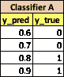
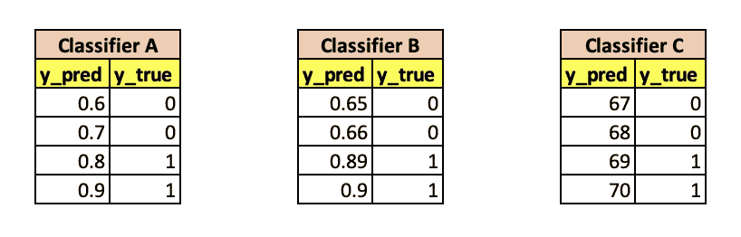
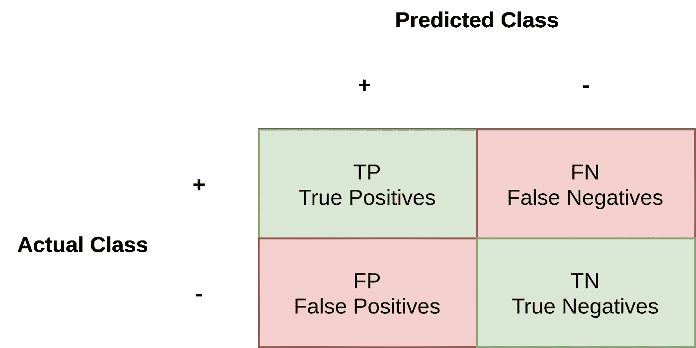
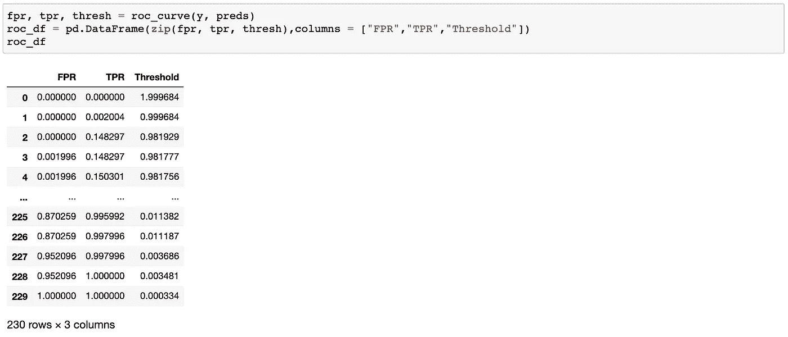
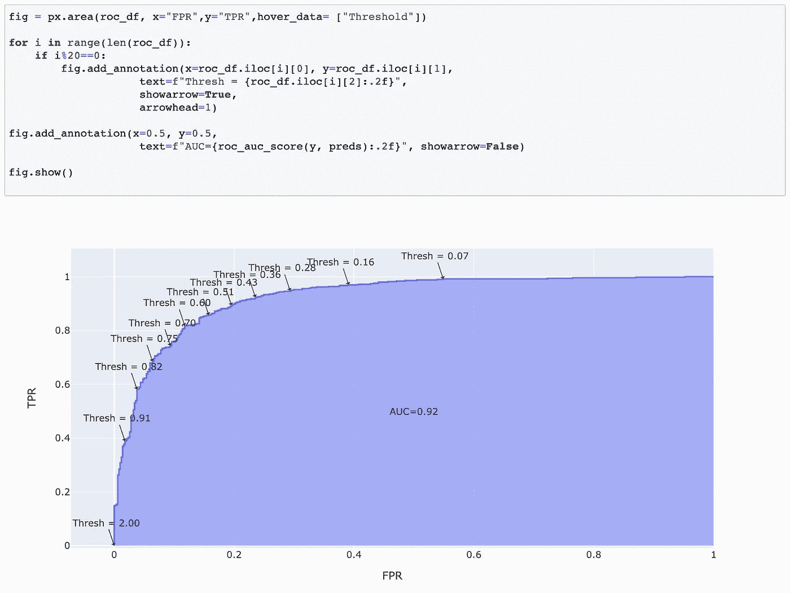
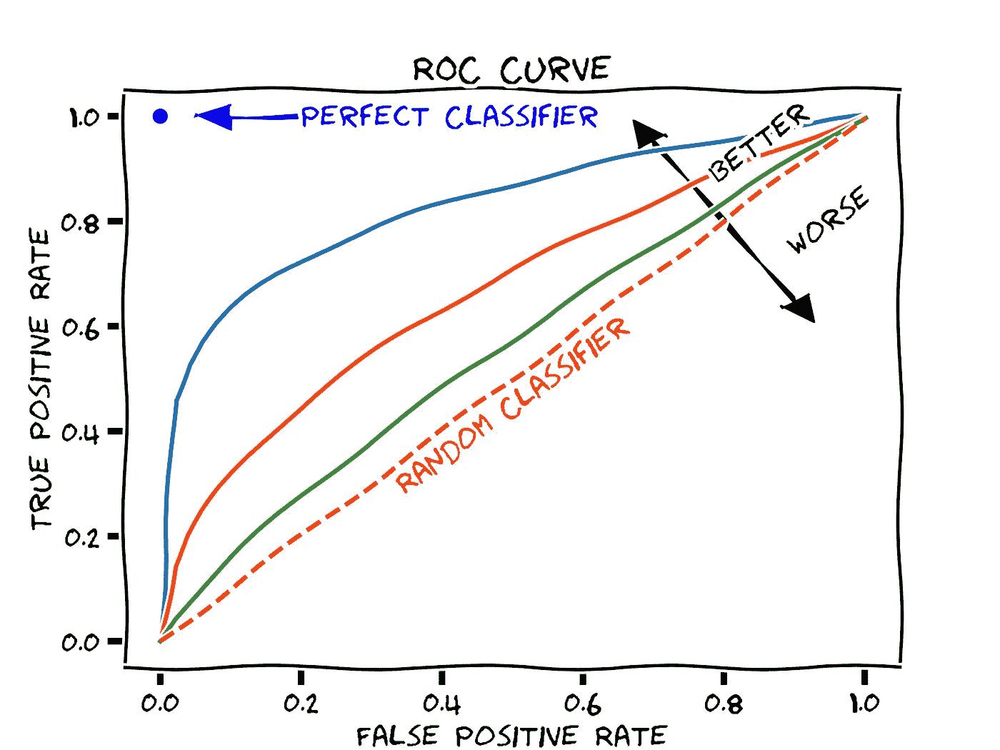
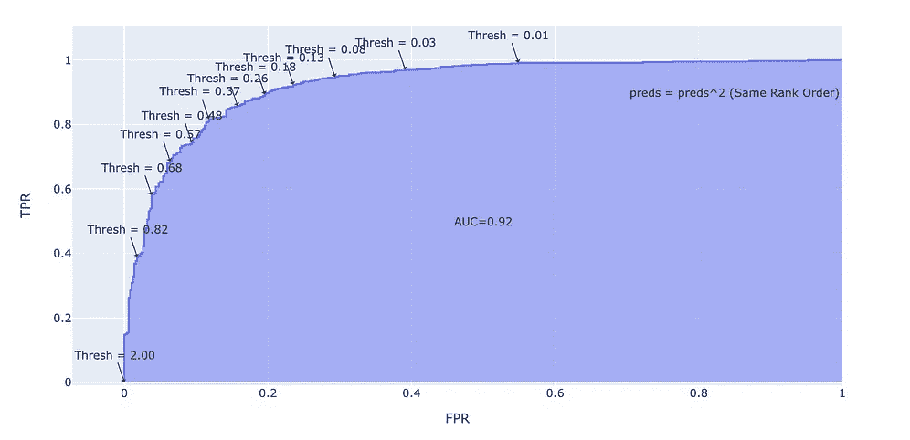

# ROC 曲线和 AUC 以及为什么和何时使用它们的易懂指南？

> 原文：<https://towardsdatascience.com/an-understandable-guide-to-roc-curves-and-auc-and-why-and-when-to-use-them-92020bc4c5c1?source=collection_archive---------6----------------------->


图片由[皮克斯拜](https://pixabay.com/fr/illustrations/apprendre-les-math%C3%A9matiques-enfant-2300141/)的 Gerd Altmann 提供

## ROC 曲线是检查分类模型性能的最常见评估指标之一。本指南将帮助您真正理解 ROC 曲线和 AUC 是如何协同工作的

ROC 曲线或受试者操作特征曲线是检查分类模型性能的最常见评估指标之一。不幸的是，许多数据科学家经常只是看到 ROC 曲线，然后引用 AUC(ROC 曲线下面积的缩写)值，而没有真正理解 AUC 值的含义以及如何更有效地使用它们。

其他时候，他们不理解 ROC 曲线解决的各种问题以及 AUC 的多重属性，如阈值不变性和比例不变性，这必然意味着 AUC 度量不依赖于所选的阈值或概率比例。这些性质使得 AUC 对于评估二元分类器非常有价值，因为它为我们提供了一种在不关心分类阈值的情况下比较它们的方法。这就是为什么数据科学家更全面地了解 ROC 曲线和 AUC 非常重要。

# 那么，ROC 曲线/AUC 满足什么需要呢？

因此，在我们开始学习 ROC 曲线和 AUC 之前，我们想到的第一个问题是，为什么不使用一个相当简单的度量标准，如二进制分类任务的准确性？毕竟，准确性很容易理解，因为它只是计算模型正确预测的百分比。

答案是，准确度没有抓住概率分类器的全部本质，即，它既不是阈值不变的度量，也不是尺度不变的度量。我这么说是什么意思？最好用一些例子来解释。

**1。为什么准确度不是阈值不变的？**

假设逻辑回归分类器的阈值为 0.5，您认为该分类器的准确度是多少？



来源:作者图片

如果你说 50%，那恭喜你。我们会把两个零误归类为一。这个结果没那么好。但是我们的分类器真的那么差吗？基于准确性作为评价指标，似乎是这样的。但是如果我们把同一个例子中的阈值改成 0.75 呢？现在，我们的分类器变得 100%准确。**这让我们不禁要问，我们如何才能提出一个不依赖于阈值的评估指标**。也就是说，我们想要一个阈值不变的度量。

**2。为什么精度不是尺度不变的？**

现在，让我们再次做同样的练习，但是这次我们的分类器预测不同的概率，但是在**相同的等级顺序**。这意味着概率值会改变，但顺序保持不变。因此，在分类器 B 中，预测的等级保持不变，而分类器 C 在完全不同的尺度上进行预测。那么，以下哪一个是最好的？



来源:作者图片

在所有这些情况下，我们可以看到每个分类器在很大程度上是相同的。也就是说，如果分类器 A 的阈值为 0.75，分类器 B 的阈值为 0.7，分类器 C 的阈值为 68.5，那么我们对所有这些分类器都有 100%的准确性。

当等级顺序保持不变时，评估度量具有相同值的属性被称为尺度不变属性。在分类器预测分数而不是概率的情况下，这个属性确实可以帮助我们，从而允许我们比较两个不同的分类器，它们预测不同尺度上的值。

因此，最后，我们需要一个满足以下两个条件的评估指标:

*   它是**阈值不变量** **，即**度量的值不依赖于选定的阈值。
*   它是**尺度不变的，即**它衡量预测的排名，而不是它们的绝对值。

好消息是 AUC 满足上述两个条件。然而，在我们甚至可以看如何计算 AUC 之前，让我们更详细地理解 ROC 曲线。

# ROC 曲线

关于 ROC 曲线的一个有趣的历史事实是，它们在第二次世界大战期间首次用于分析雷达信号。珍珠港事件后，美国军方想用他们的雷达信号探测日本飞机。ROC 曲线特别适合这项任务，因为它们让操作员选择阈值来区分阳性和阴性样本。

但是我们如何自己制作这些曲线呢？要理解这一点，我们需要先了解**真阳性率** (TPR)和**假阳性率** (FPR)。因此，假设我们有一个具有特定概率阈值的模型的以下样本混淆矩阵:



来源:作者图片

为了解释 TPR 和 FPR，我通常会举一个司法系统的例子。自然，任何司法系统都只想惩罚有罪的人，而不想指控一个无辜的人。现在让我们说，上面的模型是一个司法系统，它评估每个公民，并预测要么是零(无辜)，要么是一(有罪)。

在这种情况下，TPR 是我们的模型能够捕获的有罪罪犯的比例。因此，分子是抓获的罪犯，分母是罪犯总数。这个比率也被称为回忆或敏感度。

`**TPR(True Positive Rate)/Sensitivity/Recall**= TP/(TP+FN)`

FPR 是我们错误预测为罪犯(误报)的无辜者的比例除以实际无辜公民的总数。因此，分子是被抓获的无辜者，分母是无辜者总数。

`**FPR(False Positive Rate)**= FP/(TN+FP)`

通常，我们会想要高 TPR(因为我们想抓住所有的罪犯)和低 FPR(因为我们不想抓住无辜的人)。

那么，我们如何使用 TPR 和 FPR 绘制 ROC 曲线呢？我们使用不同的阈值在 X 轴上绘制假阳性率(FPR ),在 Y 轴上绘制真阳性率(TPR)。当我们连接这些点时产生的曲线称为 ROC 曲线。

让我们通过一个简单的代码示例来理解如何在 Python 中实现这一点。下面，我们只是创建一个小样本分类数据集，并在数据上拟合一个逻辑回归模型。我们还从分类器中得到概率值。

```
from sklearn.datasets import make_classification
from sklearn.linear_model import LogisticRegression
from sklearn.metrics import roc_curve
from sklearn.metrics import roc_auc_score
import plotly.express as px
import pandas as pd# Random Classification dataset
X, y = make_classification(n_samples=1000, n_classes=2, random_state=1)model = LogisticRegression()
model.fit(X, y)# predict probabilities
preds = model.predict_proba(X)[:,1]
```

现在我们想评估我们的模型使用 ROC 曲线的效果。为此，我们需要找到不同阈值的 FPR 和 TPR。我们可以通过使用来自`sklearn.metrics`的函数`roc_curve`很容易地做到这一点，它为我们提供了不同阈值的 FPR 和 TPR，如下所示:

```
fpr, tpr, thresh = roc_curve(y, preds)roc_df = pd.DataFrame(zip(fpr, tpr, thresh),columns = ["FPR","TPR","Threshold"])
```



我们从获得不同阈值的 FPR 和 TPR 开始。来源:作者图片

现在剩下的就是使用上面的数据绘制曲线。我们可以通过使用任何图形库来做到这一点，但我更喜欢`[plotly.express](https://mlwhiz.com/blog/2019/05/05/plotly_express/)`，因为它非常容易使用，甚至允许您在 plotly express 图形的基础上使用 plotly 构造。正如您在下图中看到的，我们绘制了不同阈值下的 FPR 与 TPR 的关系。



来源:作者图片

## **如何使用 ROC 曲线？**

我们通常可以使用 ROC 曲线来决定阈值。阈值的选择也将取决于分类器打算如何使用。因此，如果上面的曲线用于癌症预测应用，您希望获取最大数量的阳性结果(即，具有较高的 TPR ),您可能会选择较低的阈值值，如 0.16，即使此时 FPR 非常高。

这是因为你真的不想为一个实际上得了癌症的人预测“没有癌症”。在这个例子中，假阴性的成本相当高。即使一个没有癌症的人测试呈阳性，你也没问题，因为假阳性的成本比假阴性的成本低。这实际上是许多临床医生和医院为这种重要测试所做的，也是为什么如果一个人测试呈阳性，许多临床医生会第二次做同样的测试。(你能想到为什么这样做有帮助吗？提示:贝叶斯法则)。

否则，在像前面例子中的罪犯分类器这样的情况下，我们不需要高 FPR，因为司法系统的原则之一是我们不希望捕获任何无辜的人。因此，在这种情况下，我们可以将阈值选择为 0.82，这样我们的召回率或 TPR 为 0.6。也就是说，我们可以抓获 60%的罪犯。

# **现在，什么是 AUC？**

AUC 是 ROC 曲线下的面积。该区域始终表示为 0 到 1 之间的值(正如 TPR 和 FPR 的范围都可以从 0 到 1)，我们本质上希望最大化该区域，以便我们可以在某个阈值下拥有最高的 TPR 和最低的 FPR。

Scikit 还提供了一个实用函数，如果我们有使用`roc_auc_score(y, preds)`的预测和实际 y 值，它可以让我们获得 AUC。



[来源](https://en.wikipedia.org/wiki/Receiver_operating_characteristic#/media/File:Roc-draft-xkcd-style.svg):维基百科

还可以从数学上证明，AUC 等于分类器将随机选择的阳性实例排序高于随机选择的阴性实例的概率。因此，AUC 为 0.5 意味着阳性实例排名高于阴性实例的概率为 0.5，因此是随机的。一个完美的分类器总是将一个阳性实例排在一个阴性实例之上，并且 AUC 为 1。

## 那么，AUC 是阈值不变和尺度不变的吗？

是的，AUC 是阈值不变的，因为我们不必设置阈值来计算 AUC。

为了检查标度不变性，我将做一个实验，在这个实验中，我将我们的预测乘以一个随机因子(标度),并对预测求幂，以检查即使它们的等级顺序不变，如果预测改变，AUC 是否改变。由于 AUC 是比例不变的，我希望有相同的 ROC 曲线和相同的 AUC 指标。在下面，你可以看到左边的比例和右边的指数排名顺序。



缩放(左)和取幂排序(右)

事实上这就是我得到的。只有阈值随着标度的变化而变化。曲线的形状以及 AUC 保持完全相同。

# 结论

创建任何[机器学习管道](/6-important-steps-to-build-a-machine-learning-system-d75e3b83686)的一个重要步骤是相互评估不同的模型。选择错误的评估指标或者不理解您的指标的真正含义可能会对您的整个系统造成严重破坏。我希望，通过这篇文章，我能够消除你对 ROC 曲线和 AUC 的一些困惑。

如果你想了解更多关于如何构建机器学习项目以及这样做的最佳实践，我会推荐 Coursera [深度学习专业化](https://click.linksynergy.com/deeplink?id=lVarvwc5BD0&mid=40328&murl=https%3A%2F%2Fwww.coursera.org%2Fspecializations%2Fdeep-learning)中名为“构建机器学习项目”的这个优秀的[第三门课程](https://click.linksynergy.com/link?id=lVarvwc5BD0&offerid=467035.11421702016&type=2&murl=https%3A%2F%2Fwww.coursera.org%2Flearn%2Fmachine-learning-projects)。一定要去看看。它解决了陷阱和许多改进模型的基本思想。

我以后也会写更多这样的帖子。让我知道你对这个系列的看法。在 [**媒体**](http://mlwhiz.medium.com) 关注我，或者订阅我的 [**博客**](https://mlwhiz.ck.page/a9b8bda70c) 了解他们。一如既往，我欢迎反馈和建设性的批评，可以通过 Twitter [@mlwhiz](https://twitter.com/MLWhiz) 联系到我

此外，一个小小的免责声明——这篇文章中可能会有一些相关资源的附属链接，因为分享知识从来都不是一个坏主意。