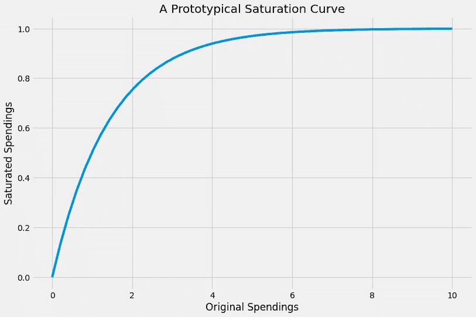
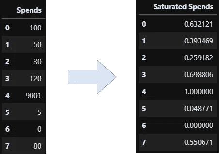
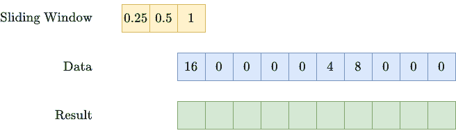
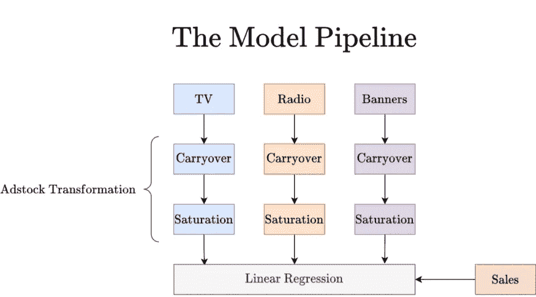
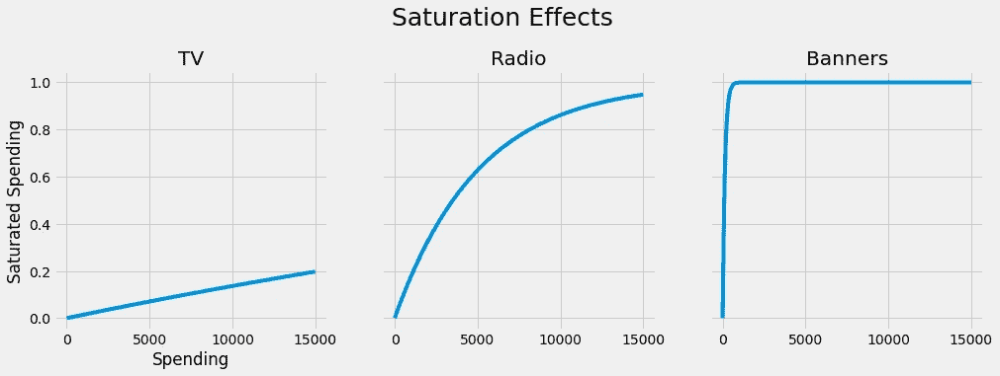
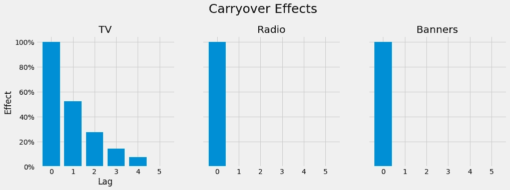
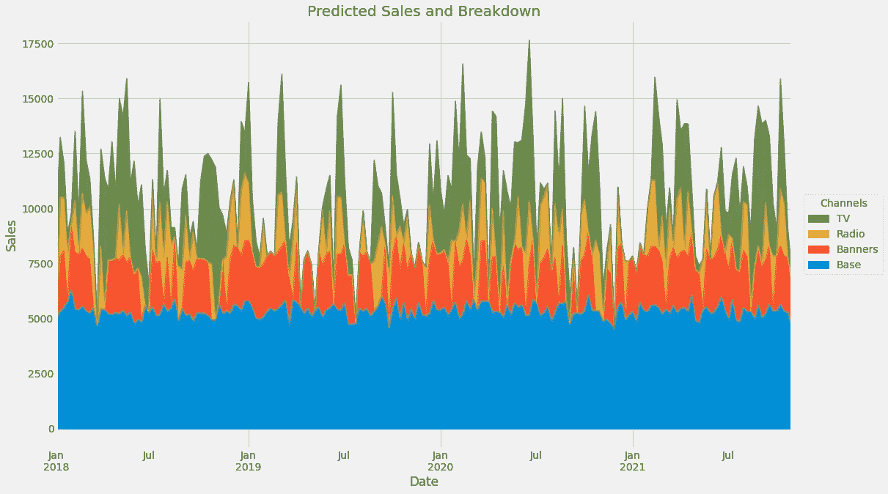
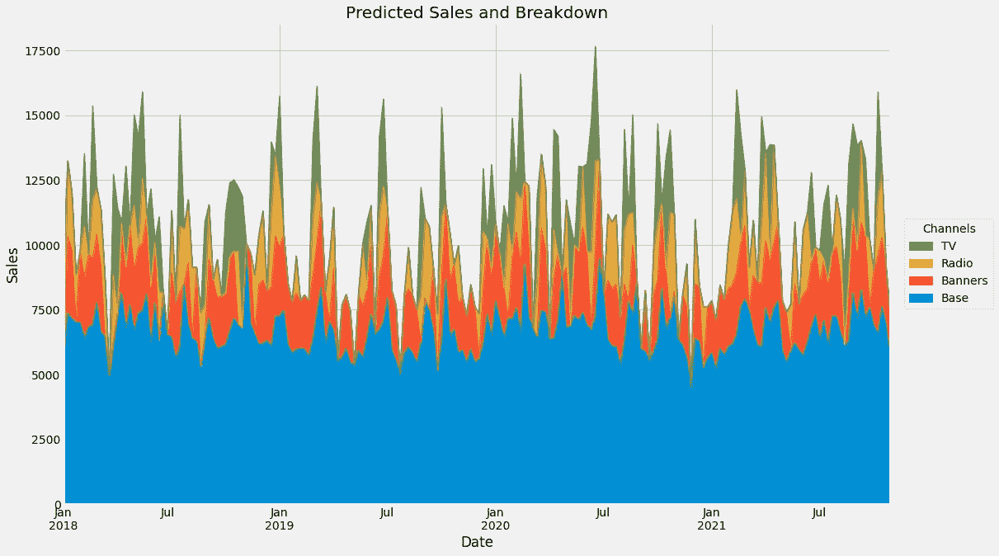

# Python 中升级的营销组合建模

> 原文：<https://towardsdatascience.com/an-upgraded-marketing-mix-modeling-in-python-5ebb3bddc1b6?source=collection_archive---------1----------------------->

## [营销分析](https://medium.com/tag/marketing-analytics)

## 让我平庸的营销组合模式更加强大


照片由[彼得·阮](https://unsplash.com/@peterng1618?utm_source=medium&utm_medium=referral)在 [Unsplash](https://unsplash.com?utm_source=medium&utm_medium=referral) 上拍摄

# 闪回

在我的上一篇文章中，我向您介绍了营销组合建模的世界。如果您尚未阅读，请在继续之前阅读。

</introduction-to-marketing-mix-modeling-in-python-d0dd81f4e794>  

在那里，我们创建了一个**线性** **回归**模型，该模型能够根据几个广告渠道(如电视、广播和网络横幅广告)的原始广告支出来预测销售额。对于作为机器学习实践者的我来说，这样的模型本身就已经很好了。更好的是，它还让商界人士感到高兴，因为该模型让我们能够计算投资回报率，让我们能够判断每个渠道的表现如何。

然而，我们上次的简单线性回归模型有一些问题，我们将在本文中解决。让我给你解释一下:

1.  我们第一款产品的性能可能会更好。
2.  我们的第一个模型表现得不真实。将支出增加到无穷大也会将销售额增加到无穷大，这毫无意义，因为人们只能在我们的产品上花有限的钱。
3.  优化变得琐碎、无用、不切实际。为了在给定固定预算的情况下最大化销售额，我们现在将把所有资金投入到线性回归系数最高的渠道中。

# 广告😉

我创建了一个小库，在这里我实现了本文其余部分的思想，甚至更多。通过`pip install mamimo`安装，并在此查看如何使用:

</a-small-python-library-for-marketing-mix-modeling-mamimo-100f31666e18>  

# 解决问题

为了规避这些问题，我们可以做一些聪明的**特征工程**，允许我们将一些营销领域的知识整合到模型中。不要担心，理解这些概念不需要营销经验，因为它们很自然，因此很容易理解。以下技术将提高性能，并使模型更加真实。

## 广告股票

我们要做的这个特色工程是一个至关重要的组件，叫做<https://en.wikipedia.org/wiki/Advertising_adstock>***，*这是西蒙·布罗德本特发明的一个术语[1]。这是一个包含两个简单概念的奇特词汇:**

1.  **我们假设你花在广告上的钱越多，你的销售额就越高。然而，我们花得越多，增长就越弱。例如，将电视支出从 0 €增加到 100，000 €会大大增加我们的销售额，但将它从 100，000，000 €增加到 100，100，000 €就没有那么多了。这叫做**饱和效应**或**收益递减效应** *。***
2.  **如果你在广告周花钱，人们通常不会立即购买你的产品，而是在几周之后。这是因为该产品可能很贵，人们希望仔细考虑它，或者将其与其他公司的类似产品进行比较。不管是什么原因，在第 *T + x* 周的销售部分是由你在第 *T、*周播放的广告引起的，所以它也应该得到一些积分。这被称为**遗留**或**滞后效应**。**

**我认为这两个事实都很容易理解，商界人士也很喜欢。**

> **我们的新模型仍然是线性的，但是用 adstock 特性代替原始支出作为输入。这使得模型更加强大，同时保持其可解释性。**

## **在 scikit-learn 中构建饱和度和结转效应**

**对我们来说不幸的是，scikit-learn 不包含这些转换，因为它们不是跨行业的兴趣。但是由于这两种转换都没有那么复杂，所以这是一个练习编写 scikit-learn 兼容估计器的好机会。**

**如果你以前从未这样做过，你可以看看我的另一篇关于这个话题的文章。这篇文章是关于回归变量而不是变压器的，但是方法并没有太大的不同。**

**</build-your-own-custom-scikit-learn-regression-5d0d718f289>  

所以，让我们从更简单的开始:饱和效应。

## 产生饱和效果

我们希望创建一个具有以下属性的变换(=数学函数):

1.  如果支出为 0，则*饱和支出*也为 0。
2.  该转换是单调递增的，即输入支出越高，饱和输出支出越高。
3.  饱和值不会增长到无穷大。相反，它们的上限是某个数，比如说 1。

**简而言之，我们想要这样的东西:**



图片由作者提供。

有很多方法可以得到这样的函数，例如，在图片中你可以看到函数 1-exp(-0.7 *x* )。所以让我们使用这个函数模板，并将其推广到 1-exp(-*ax*)for some*a*>0。 *a* 是一个超参数，我们可以随后进行调整，因为通常我们不知道饱和函数的形状。

> N ***ote:*** *还有许多更标准的饱和度函数，如****Adbudg****和****Hill****函数，但让我们坚持用* ***指数函数*** *函数* *为*

一个很好的副作用:我们最终能够输出饱和曲线，所以我们知道花更多的钱是否有意义，或者渠道是否已经饱和。比如从上图来看，投资 8 以上好像就没用了。

所以，我们来编码一下。事实上，就是这个简单的小类:

```
class ExponentialSaturation:
    def __init__(self, a=1.):
        self.a = a

    def transform(self, X):
        return 1 - np.exp(-self.a*X)
```

然而，我们将为输入添加一些健全性检查，以使其符合 scikit-learn。这增加了一点代码，但这是我们必须付出的相对较小的代价。

```
from sklearn.base import BaseEstimator, TransformerMixin
from sklearn.utils.validation import check_is_fitted, check_array

class ExponentialSaturation(BaseEstimator, TransformerMixin):
    def __init__(self, a=1.):
        self.a = a

    def fit(self, X, y=None):
        X = check_array(X)
        self._check_n_features(X, reset=True) # from BaseEstimator
        return self

    def transform(self, X):
        check_is_fitted(self)
        X = check_array(X)
        self._check_n_features(X, reset=False) # from BaseEstimator
        return 1 - np.exp(-self.a*X)
```

它仍然不完美，因为我们还应该实现对大于零的 *a* 的检查，但这是你可以自己轻松完成的事情。使用`ExponentialSaturation`变压器，我们可以做到以下几点:



图片由作者提供。

这个不算太糟，对吧？现在让我们来看下一个效应。

## 产生遗留效应

这个稍微复杂一点。让我用一个例子来说明我们想要达到的目标。随着时间的推移，我们会有一系列的支出，例如

> (16, 0, 0, 0, 0, 4, 8, 0, 0, 0),

这意味着我们在第一周花了 16 英镑，然后从第 2 周到第 5 周我们什么也没花，然后在第 6 周我们花了 4 英镑，等等。

我们现在希望一周的花费能以指数形式部分结转到下一周。这意味着:在第一周有 16 英镑的支出。那么我们携带超过 50%,意思是

*   0.5 * 16 = 8 到第 2 周，
*   0.5 * 16 = 4 到第 3 周，
*   0.5 * 16 = 2 到第 4 周，
*   …

这引入了两个超参数:**强度**(有多少被结转？)和**长度**(多长时间结转？)的结转效应。如果我们使用 50%的**强度**和 2 的**长度，则上面的支出顺序变为**

> (16, 8, 4, 0, 0, 4, 10, 5, 2, 0).

我相信你可以写一些循环来实现这个行为，一个好的快速的方法是使用卷积。我就不详细解释了，就拿代码当礼物吧。我再次强调了真正重要的线。

```
from scipy.signal import convolve2d
import numpy as np

class ExponentialCarryover(BaseEstimator, TransformerMixin):
    def __init__(self, strength=0.5, length=1):
        self.strength = strength
        self.length = length

    def fit(self, X, y=None):
        X = check_array(X)
        self._check_n_features(X, reset=True)
        self.sliding_window_ = (
            self.strength ** np.arange(self.length + 1)
        ).reshape(-1, 1)
        return self

    def transform(self, X: np.ndarray):
        check_is_fitted(self)
        X = check_array(X)
        self._check_n_features(X, reset=False)
        convolution = convolve2d(X, self.sliding_window_)
        if self.length > 0:
            convolution = convolution[: -self.length]
        return convolution
```

可以看到，上课是走强度和长度的。在拟合过程中，它会创建一个滑动窗口，由 convolve2d 函数使用，神奇地完成我们想要的工作。如果你知道 CNN 的卷积层，这就是这里发生的事情。从图形上看，它执行以下操作:



图片由作者提供。

> N ***注:*** *还有很多方法可以创建遗留问题。衰变不一定是指数的。也许广告效果的顶峰不是在花钱的那天，而是在下一周。您可以通过相应地更改滑动窗口来表达所有这些变化。*

让我们结合饱和效应和结转效应来创建一个更现实的营销组合模型。

# 最终模型

我们将对每个渠道使用不同的饱和度和结转。这是有道理的，因为通常情况下，电视广告比你在网上看到的横幅广告在你脑海中停留的时间更长。从高层次的角度来看，该模型将如下所示:



图片由作者提供。

请注意，蓝色管道只是电视支出的函数，橙色管道是广播支出的函数，紫色管道是横幅广告支出的函数。我们可以使用`ColumnTransformer`和`Pipeline`类在 scikit-learn 中有效地实现这一点。`ColumnTransformer`允许我们对每个广告渠道使用不同的转换，而`Pipeline`允许我们对单个渠道进行连锁操作。花点时间理解下面的片段:

```
from sklearn.compose import ColumnTransformer
from sklearn.pipeline import Pipeline
from sklearn.linear_model import LinearRegression

adstock = ColumnTransformer(
    [
     ('tv_pipe', Pipeline([
                           ('carryover', ExponentialCarryover()),
                           ('saturation', ExponentialSaturation())
     ]), ['TV']),
     ('radio_pipe', Pipeline([
                           ('carryover', ExponentialCarryover()),
                           ('saturation', ExponentialSaturation())
     ]), ['Radio']),
     ('banners_pipe', Pipeline([
                           ('carryover', ExponentialCarryover()),
                           ('saturation', ExponentialSaturation())
     ]), ['Banners']),
    ],
    remainder='passthrough'
)

model = Pipeline([
                  ('adstock', adstock),
                  ('regression', LinearRegression())
])
```

最难的部分是`ColumnTransformer`，所以让我来解释一下如何阅读用粗体标记的**电视块**。它只是说:

> 将管道应用于“TV”列，并将此部分命名为“tv_pipe”。管道只是 adstock 转换。

那里没有更多的事情发生。最后，我们使用这个大的预处理步骤，并在末尾添加一个简单的`LinearRegression`来得到一个实际的回归变量。那么，让我们 [**再次加载数据**](https://github.com/Garve/datasets/blob/4576d323bf2b66c906d5130d686245ad205505cf/mmm.csv) 并做一些训练。

```
import pandas as pd
from sklearn.model_selection import cross_val_score, TimeSeriesSplit

data = pd.read_csv(
    'https://raw.githubusercontent.com/Garve/datasets/4576d323bf2b66c906d5130d686245ad205505cf/mmm.csv',
    parse_dates=['Date'],
    index_col='Date'
)

X = data.drop(columns=['Sales'])
y = data['Sales']

model.fit(X, y)

print(cross_val_score(model, X, y, cv=TimeSeriesSplit()).mean())

# Output: ~0.55
```

> ***注:*** *我们这里不使用标准的* k *-fold 交叉验证，因为我们处理的是时间序列数据。* `*TimeSeriesSplit*` *是比较合理的做法，这里* *可以多了解一下* [*。*](https://scikit-learn.org/stable/modules/cross_validation.html#time-series-split)

有用！然而，该模型仍然相当糟糕，交叉验证的 *r* 约为 **0.55，**而旧的、更简单的模型为 0.72。这是因为我们为每个通道使用了默认的非最佳参数，即饱和度的 *a* = 1，残留强度为 0.5，长度为 2。

因此，让我们调整所有的 adstock 参数！

## 超参数调谐

我将使用 [Optuna](https://optuna.readthedocs.io/en/stable/) ，一个用于优化任务的高级库。在许多其他的事情中，它提供了一个 scikit-learn 兼容的`OptunaSearchCV`类，你可以把它看作是 scikit-learn 的`[GridSearchCV](https://scikit-learn.org/stable/modules/generated/sklearn.model_selection.GridSearchCV.html)`和`[RandomizedSearchCV](https://scikit-learn.org/stable/modules/generated/sklearn.model_selection.RandomizedSearchCV.html)`的替代物。

简而言之，`OptunaSearchCV`是`RandomizedSearchCV`的更智能版本。虽然`RandomizedSearchCV`只是随机走动，但是`OptunaSearchCV`首先随机走动，然后检查看起来最有希望的超参数组合。

查看与您习惯用 scikit 编写的代码非常接近的代码——了解:

```
from optuna.integration import OptunaSearchCV
from optuna.distributions import UniformDistribution, IntUniformDistribution

tuned_model = OptunaSearchCV(
    estimator=model,
    param_distributions={
        'adstock__tv_pipe__carryover__strength': UniformDistribution(0, 1),
        'adstock__tv_pipe__carryover__length': IntUniformDistribution(0, 6),
        'adstock__tv_pipe__saturation__a': UniformDistribution(0, 0.01),
        'adstock__radio_pipe__carryover__strength': UniformDistribution(0, 1),
        'adstock__radio_pipe__carryover__length': IntUniformDistribution(0, 6),
        'adstock__radio_pipe__saturation__a': UniformDistribution(0, 0.01),
        'adstock__banners_pipe__carryover__strength': UniformDistribution(0, 1),
        'adstock__banners_pipe__carryover__length': IntUniformDistribution(0, 6),
        'adstock__banners_pipe__saturation__a': UniformDistribution(0, 0.01),
    },
    n_trials=1000,
    cv=TimeSeriesSplit(),
    random_state=0
)
```

你告诉 Optuna 优化`model`。它通过使用您在`param_distributions`中指定的所有参数来实现。因为我们的模型是完全嵌套的，也就是说，列转换器中有管道，而列转换器本身又在管道中，所以我们必须准确地指定我们想要优化的超参数。这是通过诸如`adstock__tv_pipe__carryover__strength`这样的字符串来完成的，其中**两个下划线**分隔了完整模型的不同层次。你发现`adstock`、`tv_pipe`、`carryover`这几个字都在型号说明书里，而`strength`是`ExponentialCarryover`变压器的一个参数。

然后，你找到一些分布。`UniformDistribution(0, 1)`表示应该在 0 和 1 之间寻找**浮点**参数。按照同样的逻辑，`IntUniformDistribution(0, 6)`搜索 0 到 6 之间的**整数**值(不是 5！)，因此我们告诉模型只考虑结转长度小于或等于六周，这只是我们的一个选择。

我们尝试`n_trials=1000`不同的参数组合，并再次使用`TimeSeriesSplit`进行评估。通过设置`random_state=0`保持结果的可再现性。*搞定！*这应该足够理解代码了。

## 性能检查

让我们使用这个名为`tuned_model`的优化模型来检查性能。小心，这需要很长时间。你可以将`n_trials`减少到 100，以更快地得到一个更差的解。

```
print(cross_val_score(tuned_model, X, y, cv=TimeSeriesSplit()))

# Output: array([0.847353, 0.920507, 0.708728, 0.943805, 0.908159])
```

平均交叉验证的 *r* 为 **0.87，**与未优化的模型(0.55)和我们上一篇文章中的旧平面线性模型(0.72)相比，这是一个很大的改进。让我们现在改装模型，看看它学到了什么。

```
tuned_model.fit(X, y)
```

最佳超参数如下:

```
print(tuned_model.best_params_)
print(tuned_model.best_estimator_.named_steps['regression'].coef_)
print(tuned_model.best_estimator_.named_steps['regression'].intercept_)

# Output:
# Hyperparameters = {
# 'adstock__tv_pipe__carryover__strength': 0.5248878517291329
# 'adstock__tv_pipe__carryover__length': 4
# 'adstock__tv_pipe__saturation__a': 1.4649722346562529e-05
# 'adstock__radio_pipe__carryover__strength': 0.45523455448406197
# 'adstock__radio_pipe__carryover__length': 0
# 'adstock__radio_pipe__saturation__a': 0.0001974038926379962
# 'adstock__banners_pipe__carryover__strength': 0.3340342963936898
# 'adstock__banners_pipe__carryover__length': 0
# 'adstock__banners_pipe__saturation__a': 0.007256873558015173
# }
#
# Coefficients = [27926.6810003   4114.46117033  2537.18883927]
# Intercept = 5348.966158957056
```

## 对新数据使用模型

如果您想为新的支出表创建预测，可以按如下方式进行:

```
X_new = pd.DataFrame({
    'TV': [10000, 0, 0],
    'Radio': [0, 3000, 0],
    'Banners': [1000, 1000, 1000]
})

tuned_model.predict(X_new)
```

请注意，**预测总是以零库存**开始，即模型不知道过去的任何结转，除非您将它放入预测数据框架。例如，如果您想知道第*周到第*周的销售额，并且您只输入第*周到第*周的支出，那么它不会考虑之前第*周到第* -1 周、*周到第* -2 周的结转。如果你想让模型建立一个库存，你也必须包括之前的几周，即使你只对最后一次观察的预测感兴趣。

你甚至可以用更多不花费的特性来扩展训练数据，所谓的*控制变量*。如果您没有在`ColumnTransformer`对象中指定任何预处理，原始值将直接传递给`LinearRegression`并被考虑用于训练和预测。

# 解释模型

使用上面的数据，我们可以创建一些漂亮的图片，帮助我们从模型中获得洞察力。

## 饱和效应

如果我们插入饱和变压器的值，我们会得到以下结果:



图片由作者提供。

*   我们可以看到，该模型认为电视频道仍然非常*不饱和——*在这里花费更多可能有利于销售。注意，我们最大的电视支出大约是 15000 英镑。
*   广播看起来有点饱和，但增加这方面的支出似乎还是合理的。该渠道最高消费约 7700。
*   横幅看起来*过饱和*。这里最高消费 2500 左右，函数值已经接近 1 了。更高的支出似乎不会有太大的成效。

## 遗留效应

如果我们插入延续变压器的值，我们会得到以下结果:



图片由作者提供。

似乎电视广告在最初消费 4 周后仍然对销售有影响。这比广播和网络横幅广告在同一周内迅速消失的效果要长得多。

## 渠道贡献

和上一篇文章一样，我们可以计算每个渠道对每天销售额的贡献。代码比以前稍微复杂一些，因为模型也变得更复杂了。无论如何，这里有一个工作版本:

```
adstock_data = pd.DataFrame(
    tuned_model.best_estimator_.named_steps['adstock'].transform(X),
    columns=X.columns,
    index=X.index
)

weights = pd.Series(
    tuned_model.best_estimator_.named_steps['regression'].coef_,
    index=X.columns
)

base = tuned_model.best_estimator_.named_steps['regression'].intercept_

unadj_contributions = adstock_data.mul(weights).assign(Base=base)
adj_contributions = (unadj_contributions
                     .div(unadj_contributions.sum(axis=1), axis=0)
                     .mul(y, axis=0)
                    )

ax = (adj_contributions[['Base', 'Banners', 'Radio', 'TV']]
      .plot.area(
          figsize=(16, 10),
          linewidth=1,
          title='Predicted Sales and Breakdown',
          ylabel='Sales',
          xlabel='Date'
      )
     )

handles, labels = ax.get_legend_handles_labels()
ax.legend(
    handles[::-1], labels[::-1],
    title='Channels', loc="center left",
    bbox_to_anchor=(1.01, 0.5)
)
```

输出:



图片由作者提供。

与旧图相比，基线不再摇摆不定，因为该模型可以更好地解释给定渠道支出的销售情况。下面是**老款**的一款:



**老**型号。图片由作者提供。

# **总结与展望**

在本文中，我们采用了旧的简单线性模型，并通过不依赖原始渠道支出，而是依赖广告库存来改进它。广告库存是通过引入饱和效应和结转效应来更真实地反映现实世界的转换支出。

我们甚至对这两个概念做了简明的实现，可以在 scikit-learn 生态系统中以即插即用的方式使用。

我们做的最后一件事是调整模型，然后看看它已经了解了什么。我们以人们容易理解的图片形式获得了一些有趣的见解，使这个模型既准确又可解释。

**然而，仍有一些未解决的问题:**

1.  我们已经讨论了优化支出，以及旧模式为何无法做到这一点。嗯，有了新的，但我不会在这里详细介绍。简而言之，对待我们的`tuned_model`函数，用你选择的程序优化它，例如 **Optuna** 或**scipy . optimize . minimize**。为优化添加一些预算约束，例如总支出应少于 1，000，000。
2.  将**非支出**数据输入模型可能会进一步改善它。例如，以一周中的**日**、**月**，或者甚至是我们想要销售的产品的**价格为例。尤其是价格是销售的一个重要驱动力:一部售价 10000 €的普通 iPhone 不会产生多少销量，而一部售价 100 €的 iPhone 会在一眨眼的功夫就脱销。对于季节性产品(如粉丝或热巧克力)来说，月份等及时功能可能很有意思。或者像圣诞节这样的特殊日子。收集你的想法，并确保添加所有能够影响销售的内容！**

# 参考

[1] S .布罗德本特，《电视广告的单向作用》(1979 年)。*《市场研究学会杂志*， *21* (3)，第 139–166 页。** 

**我希望你今天学到了新的、有趣的、有用的东西。感谢阅读！**

****作为最后一点，如果你****

1.  ****想支持我多写点机器学习和****
2.  ****无论如何都要计划获得中等订阅量，****

****为什么不做** [**通过这个环节**](https://dr-robert-kuebler.medium.com/membership) **？这将对我帮助很大！😊****

**透明地说，给你的价格不变，但大约一半的订阅费直接归我。**

**非常感谢，如果你考虑支持我的话！**

> ***有问题就在*[*LinkedIn*](https://www.linkedin.com/in/dr-robert-k%C3%BCbler-983859150/)*上写我！***