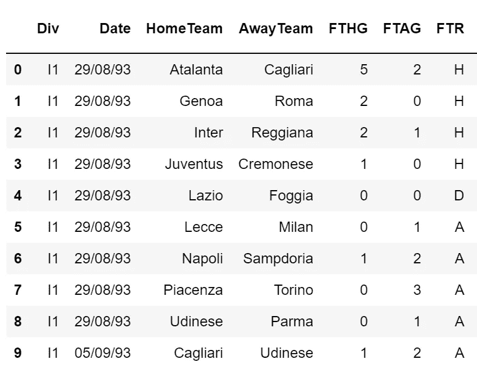
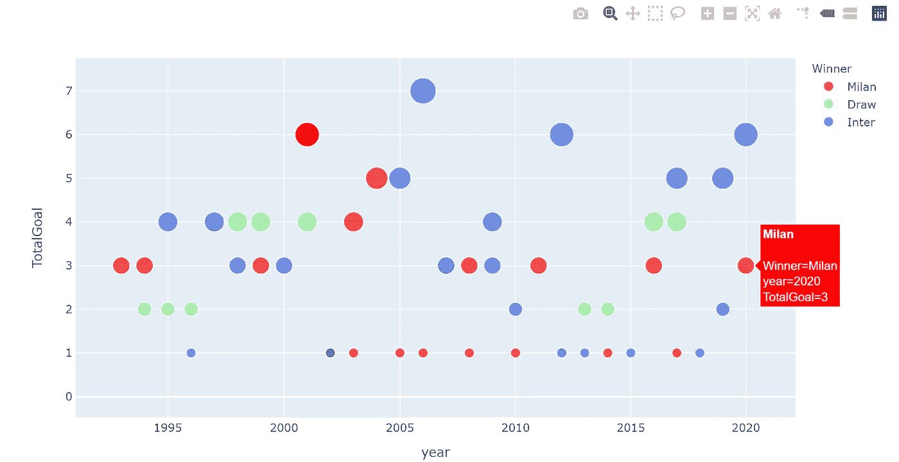
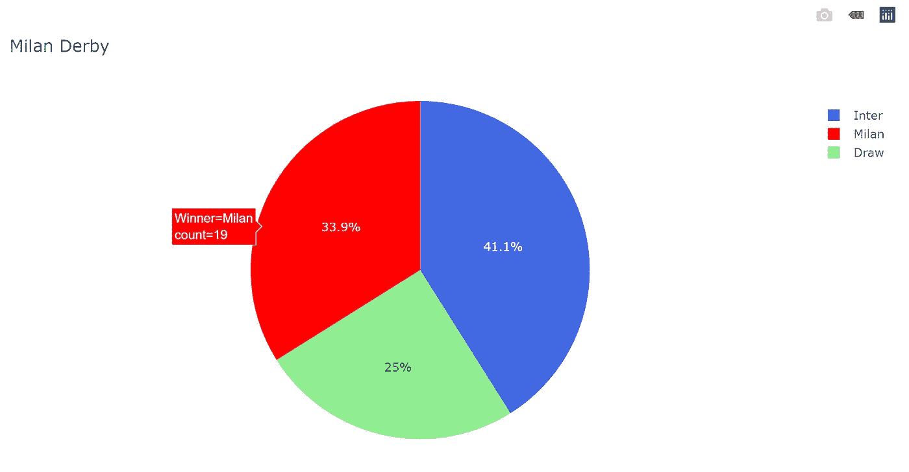

# 用熊猫和 Plotly 分析 1993 年的米兰德比数据

> 原文：<https://towardsdatascience.com/analyse-milan-derby-data-from-1993-with-pandas-and-plotly-b4648376c947?source=collection_archive---------37----------------------->

下一场米兰德比将于下周开始，为了向我的足球迷丈夫提供更多的信息和可视化，以及建立我的 python 学习，我从 Kaggle 获取了关于意甲和维基百科的数据，并试图开发一个基于证据的可视化。


Izuddin Helmi Adnan 在 [Unsplash](https://unsplash.com/s/photos/soccer--derby?utm_source=unsplash&amp;utm_medium=referral&amp;utm_content=creditCopyText) 上拍摄的照片

# **先决条件:**

用于此分析的 Python 包:

```
import pandas as pd
import glob
import matplotlib.pyplot as plt
import numpy as np
import plotly.express as px
```

# **第一步:获取数据**

当前分析中使用的数据来自 ka ggle([https://www.kaggle.com/massibelloni/serie-a-19932017](https://www.kaggle.com/massibelloni/serie-a-19932017))，我从那里下载了 1993 年至 2017 年的所有意甲数据，并保存到本地文件夹中。

# **第二步:合并数据**

从 Kaggle 下载的意甲数据是按年份呈现的。为了了解意甲的概况，我在过滤 AC 米兰/国际米兰的结果之前，先合并了所有的数据。

这里我使用了函数 **glob** :

```
##set up the path
path = r'.....SerieA'
all_files = glob.glob(path + "/*.csv")##read all files
tb = []
for filename in all_files:
    df = pd.read_csv(filename, index_col=None, header=0)
    tb.append(df)##combine all files
frame = pd.concat(tb, axis=0, ignore_index=True)
```

# **第三步:过滤掉 AC 米兰和国际米兰的所有比赛**

根据数据框架，它有主队和客场队(见下图 1)。我们需要让 AC 米兰成为主队，国际米兰成为客场，反之亦然。



**图 1** :车架头部(10)

首先，我试图找到 AC 米兰是主队，国际米兰是客队的比赛:

```
df1= frame[(frame['HomeTeam'] == 'Milan') & (frame['AwayTeam'] == 'Inter')]
```

然后，国际米兰是主队，AC 米兰是客场队:

```
df2 = frame[(frame['HomeTeam'] == 'Inter') & (frame['AwayTeam'] == 'Milan')]
```

要将这两个数据帧合并为一个数据帧:

```
ddff = [df2,df1]
result = pd.concat(ddff)
```

我们就要完成数据清理了！因为我只想知道数据的前几列，所以我省略了其余几列:

```
data = result.iloc[:, 0:7]
```

# **步骤 4:完成可视化数据集**

为了使可视化更容易，我做了一些事情:1)添加 1997 年到 2020 年的比赛数据，因为这些数据在下载的文件中丢失了；2)获取比赛日期的“年份”；3)添加两列——一列为“冠军队”,另一列为每场比赛的“总目标”:

```
## add data from 1997 to 2020 - a bit messy method was used here:
new_row = {'Date': '15/10/17', 'HomeTeam':'Inter', 'AwayTeam':'Milan', 'FTHG':'3','FTAG':'2', 'FTR': 'H'} 
data = data.append(new_row, ignore_index = True)new_row = {'Date': '27/12/17', 'HomeTeam':'Milan', 'AwayTeam':'Inter', 'FTHG':'1','FTAG':'0', 'FTR': 'H'} 
data = data.append(new_row, ignore_index = True)new_row = {'Date': '04/04/18', 'HomeTeam':'Milan', 'AwayTeam':'Inter', 'FTHG':'0','FTAG':'0', 'FTR': 'D'} 
data = data.append(new_row, ignore_index = True)new_row = {'Date': '21/10/18', 'HomeTeam':'Inter', 'AwayTeam':'Milan', 'FTHG':'1','FTAG':'0', 'FTR': 'H'} 
data = data.append(new_row, ignore_index = True)new_row = {'Date': '17/03/19', 'HomeTeam':'Milan', 'AwayTeam':'Inter', 'FTHG':'2','FTAG':'3', 'FTR': 'A'} 
data = data.append(new_row, ignore_index = True)new_row = {'Date': '09/02/20', 'HomeTeam':'Inter', 'AwayTeam':'Milan', 'FTHG':'4','FTAG':'2', 'FTR': 'H'} 
data = data.append(new_row, ignore_index = True)new_row = {'Date': '18/10/20', 'HomeTeam':'Inter', 'AwayTeam':'Milan', 'FTHG':'1','FTAG':'2', 'FTR': 'A'} 
data = data.append(new_row, ignore_index = True)
```

为可视化准备色谱柱:

```
## Add the column - "Year" of each match
data['year'] = pd.DatetimeIndex(data['Date']).year
data = data.sort_values('year')## Add the column - "Winner" of each match
data['Winner'] = np.where(data['FTR'] == 'A', data['AwayTeam'], (np.where(data['FTR'] == 'H', data['HomeTeam'], 'Draw')))## Add the column - "TotalGoal" of each match
data["FTHG"] = pd.to_numeric(data["FTHG"])
data["FTAG"] = pd.to_numeric(data["FTAG"])
data['TotalGoal'] = data['FTHG'] + data['FTAG']
```

# 第五步:用 Plotly 可视化

在这里，我创建了两个图表:

## **气泡图:**

显示“比赛日期”、“每场比赛的总进球数”和“比赛获胜者”之间关系的图表:

```
fig = px.scatter(data, x="year", y="TotalGoal",size="TotalGoal", color="Winner",
                 color_discrete_map={'Milan':'red',
                                 'Inter':'royalblue',
                                 'Draw':'lightgreen'},
                 hover_name="Winner", log_x=True, size_max=20)
fig.show()
```



**图二**:气泡图

## **饼图:**

另一张图表是关于过去几年中获胜的比例。为了得到饼图，需要用 **groupby** 重新构造数据帧:

```
## Restructure the dataframe with groupby
counts = data['TotalGoal'].groupby(data['Winner']).count().reset_index(name="count")## Pie chart
fig1 = px.pie(counts, values ='count', names ='Winner', title='Milan Derby', color = 'Winner',
             color_discrete_map={'Milan':'red',
                                 'Inter':'royalblue',
                                 'Draw':'lightgreen'})
fig1.show()
```



**图三**:饼状图

# **思绪**

通过看这两张图表，下面是对米兰德比的一些思考。

1.  很明显，AC 米兰和国际米兰在赢得比赛方面没有太大的区别。国际米兰赢的比赛比 AC 米兰略多；
2.  AC 米兰在 2010 年之前的比赛中比国际米兰更有可能获胜，而国际米兰在 2010 年之后获得了更多的获胜机会；
3.  当比赛的总进球数超过 4 个时，国际米兰似乎更有可能赢得比赛。

这些想法似乎与球队那些年的表现一致。我等不及要看下一场德比了！