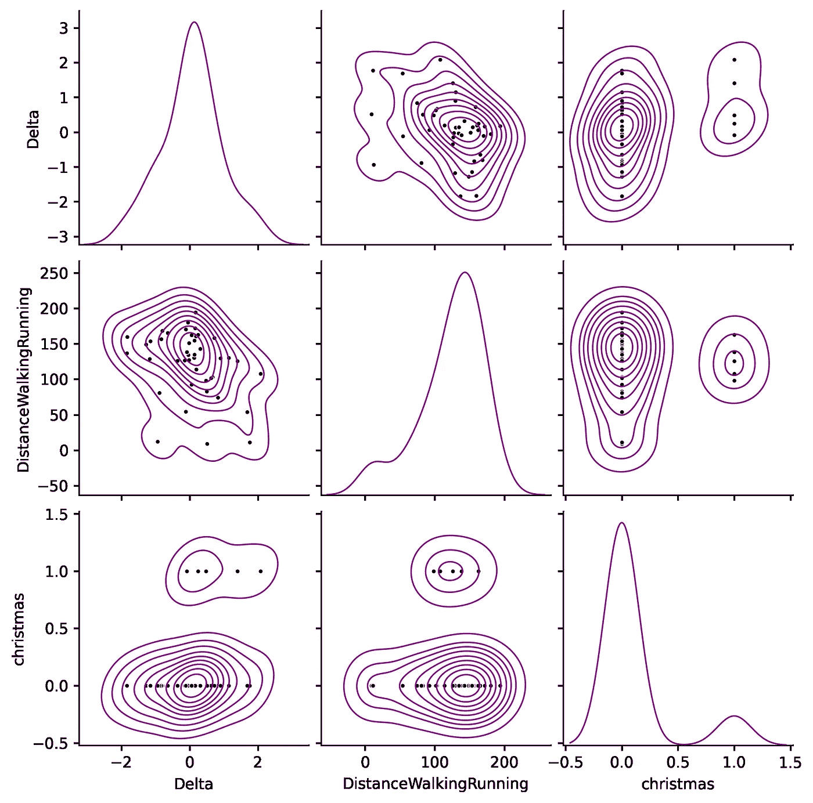

# 使用 Python 和 Apple Health 分析您的健康状况

> 原文：<https://towardsdatascience.com/analyse-your-health-with-python-and-apple-health-11c12894aae2?source=collection_archive---------6----------------------->

## 厌倦了用鸢尾花和海难学习数据科学？让我们试试你的健康数据。

Solen Feyissa 在 [Unsplash](https://unsplash.com/s/photos/wearable?utm_source=unsplash&utm_medium=referral&utm_content=creditCopyText) 上拍摄的照片

眼下，描述手机对我们生活的影响感觉有些毫无意义。无论我们在哪里，我们形影不离的伙伴让我们打电话，写信息，浏览互联网，玩游戏等等。可能性的列表是无穷无尽的，并且每天都在增长。

另一个重要方面是，它们配备了各种硬件传感器(例如 GPS、加速度计、陀螺仪)，结合软件，几乎可以跟踪我们生活的方方面面。此外，随着*可穿戴设备*的到来，他们的数据收集能力进一步扩展。

如果你是苹果用户，你大概知道[苹果健康](https://www.apple.com/ios/health/)。它是 iOS 的一项功能，用于监控和组织与健康相关的数据。它整合了苹果生态系统和第三方设备和应用程序收集的数据。根据您的具体设置，它可以提供关于您的身体活动、身体测量、睡眠习惯、心率、听力、营养、血糖甚至月经周期的宝贵见解，仅举几个例子。虽然一些指标很简单，如步数，但其他指标更详细，如我们行走时的*双支撑时间*或*不对称*的比率。

这些工具引发了隐私问题，因为它们利用并可能暴露敏感数据。即使用户同意，我们的记录有多安全？这些特征构成了自我意识的机会还是仅仅是另一种形式的虐待？我们如何利用它们进行科学研究？毫无疑问，这是一场引人入胜的辩论，但它超出了本文的范围。

在本文中，我们将**下载并探索我们自己的健康记录**。如果您正在使用其他人的，请负责任地行事，并确保在您继续之前得到他们的同意。从数据科学的角度来看，这些全面的数据集构成了研究和增加我们自我知识的黄金机会，也就是说，更好地了解我们的生活方式。如果你正在学习数据科学，还有另一个优势:**这是来自你的实际数据**。将你所学到的一切应用到真实数据中，并得出一个可以改善你自己生活的可行结论，这难道不是一件很棒的事情吗？不要误解我，那些流行的数据集(例如 [Iris](https://en.wikipedia.org/wiki/Iris_flower_data_set) 、 [Titanic](https://en.wikipedia.org/wiki/Passengers_of_the_Titanic) )非常有教育意义，但它们并没有那么实用。相反，这些健康和[生活日志](https://en.wikipedia.org/wiki/Lifelog)数据源可以提供有趣的、激励性的和可操作的例子。值得给他们一试！

## 1.下载数据集

首先，我们正在下载数据集。它需要几个手动步骤:

*   打开手机上的健康应用。
*   触摸右上角的个人资料图片。
*   触摸下一屏幕底部的*导出所有健康数据*。
*   您将看到几个选项来共享生成的 zip 文件。选择对你最方便的，比如给自己发邮件。
*   在您的桌面上，解压缩附加的归档文件。

图片作者。有些区域是故意模糊的。

## 2.将 XML 处理成数据帧

从存档中的两个文件中，名为`export.xml`的文件包含我们需要的数据。只需几行代码和标准包，就可以很容易地将其改造成一个[熊猫](https://pandas.pydata.org/)T1。不需要安装其他任何东西。所以，让我们打开一个 [Jupyter](https://jupyter.org/) 笔记本，运行这个:

上面的代码使用 [xml](https://docs.python.org/3/library/xml.etree.elementtree.html) 模块中的`ElementTree`解析 XML。文件结构非常简单，一系列带有一些属性的条目。首先，我们将 XML 转换成一个字典列表(每个条目对应一个属性)。其次，我们将它们转换成一个`DataFrame`，将列表映射到行，将字典映射到列。接下来，我们调整数据类型，这对于日期和度量尤其重要。最后，由于观察类型的标签相当大，我们通过仅保留标识符的尾部来缩短它们(*例如 hkquantitytypeidentifierbodymasus*被翻译成仅 *BodyMass* )。

完成了:我们有了一个整洁的`DataFrame`，里面有我们所有的长格式健康记录！要检查可用度量的范围，只需执行`data.type.unique()`来获得`type`列的不同值。这取决于你的情况，但通常你会得到诸如*步数*、*距离步行跑步或*、飞行攀爬等标签。

## 3.透视和重新取样

为了方便地分析数据，最好切换到宽格式的表格。况且看到数据稀疏，也方便汇总成月。结果将是一个表，每月一行，度量以列表示。下面的示例代码只聚集了*身体质量*和*距离行走跑步*。您需要的具体列取决于您的案例中可用的数据和您的特定研究问题。请注意，每个度量都需要自己的聚合策略。例如，我们应该将这段时间内的所有观察值相加，以计算每月的总步行距离。相反，为了计算平均重量，我们应该应用平均值(从 [numpy](https://numpy.org/) 导入)而不是总和。

## 4.添加外部数据和合成变量

虽然我们可以单独使用 pivot 和 long 表完成许多事情，但是如果我们添加 Apple Health 外部的数据或创建合成变量，我们的分析会变得更加有趣:

如果变量不是通过直接测量获得的，则该变量是*合成的*。让我们来计算一下我体重的月差异(稍后会有更多的介绍)。作为外部数据，我包括三个虚拟变量，它们将标记我生活中的一些相关事件。在相关事件发生的月份，它们将被设置为 1，否则为零。例如， *covid* 表示我的国家第一次新冠肺炎封锁(当流动性显著降低时)， *phd* 强调我的博士学位的持续时间，*圣诞节*强调寒假期间(即 12 月和 1 月)。因此，最终的表格如下所示:

2020 年的表格摘录。图片作者。

## 5.研究问题:什么因素影响我的体重？

现在到了有趣的部分，让我们把所有的部分组合在一起，并从数据中提取有价值的见解。作为解决问题的第一个方法，我们绘制了*身体质量*月时间序列:

图片作者。

这些年来，我的体重并没有保持不变。哪些因素可能会影响它？解释这些变化的简单数学模型如下:

图片作者。

等式的左侧是*体重*的每月变化(此后为*增量*)。右边是一个常数，一个因子的线性组合和一个误差项。哪些因素？在数据集中，我们有*远程行走跑步*和假人*博士*、 *covid* 和*圣诞*。让我们试试这些。

下图显示了*体重*月差异的时间序列，旁边是密度函数。

图片作者。

## 6.相关矩阵

相关矩阵是总结数据集中所有变量之间相关性的一种便捷方式。除了数字之外，我们还可以绘制一个热图，使其在视觉上更具吸引力。正相关的变量显示为蓝色，负相关的变量显示为红色。只需扫一眼就可以得出一些结论:

*   *Delta* 与步数、距离和 PhD 负相关。这些因素似乎降低了我的体重。前两个是因为体力活动，第三个最有可能是因为压力。然而，圣诞节似乎让我超重了。
*   由于对移动性的相应限制，锁定会对距离和步数产生负面影响。
*   步数和距离有很强的相关性。
*   *体重*和体力活动呈正相关。尽管这似乎违反直觉，但实际上是有道理的:当我的体重高时，我会进行更多的身体活动来补偿和减肥。

图片作者。

## 7.配对图

另一种有效的表示是配对图。它将每个变量映射到双变量和单变量图网格中的列和行上。在这种情况下，对角线显示每个变量的密度，而上下三角形用散点图和一些*核密度估计* (KDE)等高线描述变量之间的成对关系。让我们画出关系最密切的变量:

图片作者。

如果我们只关注第一行，*δ*是纵坐标，其他变量是横坐标。最左边的图是 *Delta* 的概率分布，我们之前已经展示过了。下面两个是 *Delta* 和 *DistanceWalkingRunning* 和 *christmas* 的关系。我们欣赏两个图表中清晰的斜率。

## 8.线性回归

情节是解决问题的很好的探索工具。然而，为了得出更有意义的结论，我们需要测量效果的强度和统计显著性。考虑到这个目标，我们正在计算一个*普通最小二乘法* (OLS)回归:

图片作者。

结果包含了大量的图表，这些图表非常有助于更好地理解这个问题:

*   **决定系数**，R 的平方，测量自变量预测的因变量的方差。越高越好。我们的 0.31 是合理的，但离最大值 1.0 还很远。随着解释变量数量的增加，调整后的版本解释了虚假结果。
*   **回归系数**测量影响的数量和方向。例如，我在圣诞节期间每月增加约 0.911 公斤，或者如果我每天穿越 3 公里，我可能每月减少 1 公斤。
*   **p 值**回答了另一个有趣的问题:我们确定系数不为零吗？为了拒绝零假设，我们需要低于临界值的 p 值(T21)。在本例中，我们将其设置为 5%。因此，我们应该只考虑*常量*、*距离步行跑步*和*圣诞节*的值。
*   95%的**置信区间**为每个系数提供了最可能的范围。

## 最后的话

如果你足够老，你肯定还记得电脑在处理能力和多功能性方面无法与今天的智能手机相提并论的时代。如今，这些设备伴随我们到任何地方，并记录我们的个人生活。虽然在这种情况下，隐私是一个合理的问题，但作为数据科学家，我们的职责是将可用数据转化为对个人、组织和整个社会有用的东西。在这个过程中，我们必须采取负责任的行动。

健康数据为了解一个人的生活提供了有价值的信息。在这篇文章中，我们学会了从手机中轻松检索数据，并(希望)得出一些有趣的结论。

可能性是无限的！另外，如果你是学生，这个教程可以让你在对你有意义的真实数据上练习技巧。极限是你的想象力。

期待您的评论，感谢您的阅读！