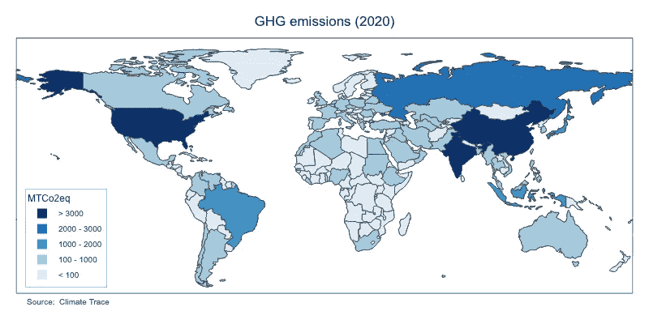
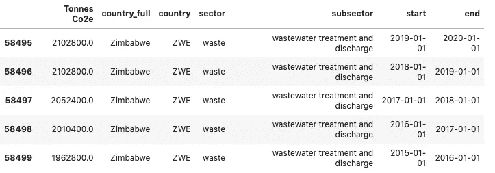
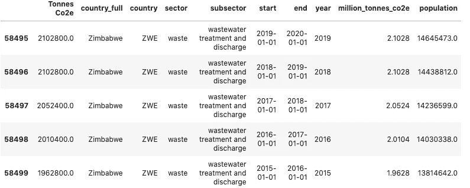

# 分析气候跟踪全球温室气体排放数据

> 原文：<https://towardsdatascience.com/analysing-climate-trace-global-greenhouse-gas-emissions-data-part-1-fba426128e34?source=collection_archive---------20----------------------->

作者图片

## 使用 Python 的 Plotly 库的一系列交互式世界地图

随着至关重要的第 26 次联合国气候变化大会(COP26)的临近，来自各个领域的气候变化活动人士正在努力影响和施压将参加 2021 年 10 月 31 日至 11 月 12 日在格拉斯哥举行的气候谈判的政策制定者。

最引人注目和创新的举措之一来自排放跟踪联盟[气候跟踪](https://medium.com/u/3baf58561d08?source=post_page-----fba426128e34--------------------------------)，该联盟最近[发布了](https://medium.com/climate-trace-the-source/climate-trace-releases-first-comprehensive-independent-database-of-global-greenhouse-gas-emissions-718822862862)全球首个**基于直接、独立观察的全球温室气体(GHG)排放综合核算，涵盖 2015 年至 2020 年期间。**利用卫星技术、遥感、人工智能和机器学习的力量，该清单旨在提高 GHG 监测和报告的透明度，特别是在那些缺乏技术和资源来确保对排放数据进行合理核算的国家。

该清单可在 Climate Trace [网站](https://www.climatetrace.org/)上获得，提供了一个直观且用户友好的界面来可视化数据并按不同变量过滤信息。然而，除了条形图和折线图，我相信有地图来比较 GHG 在世界范围内的排放量也是很棒的。

这个职位(以及本系列即将上任的职位)有三重目的。首先，它旨在**提高对当前** **气候危机的认识。**其次，它提供了一个分析迷人且改变游戏规则的气候痕量排放数据库的绝佳机会，从而使其更加可见和熟悉，以便其他研究人员、气候科学家和数据分析师可以使用它。最后，它为那些对使用 Python 进行数据分析和可视化感兴趣的人提供了一个编码教程。更准确地说，在本帖中，我们将关注如何使用强大的 **Plotly Python 图形库制作世界地图。**

这个项目的代码可以在我的 GitHub 库中找到。地图(两者都有。巴新和。html 格式)也可以在我的 GitHub 库和我的 Plotly 工作室[账户](https://chart-studio.plotly.com/~jcanalesluna)中找到。请随意使用和分享:**我们对气候危机、其原因和后果了解得越多，我们就越有准备去解决它。**

*注:根据* [*知识共享署名 4.0*](https://creativecommons.org/licenses/by/4.0/) *国际许可(CC BY 4.0)，排放数据已通过 Climate TRACE 提供。*

*免责声明:以下地图尺寸因嵌入略有变化。这种大小调整影响了标题、图例和源文本的位置。*

## 数据

数据的主要来源是气候追踪排放数据库，你可以从气候追踪[网站](https://www.climatetrace.org/inventory)下载。此外，我还使用了来自[世界银行](https://medium.com/u/6ed2e6ddbb88?source=post_page-----fba426128e34--------------------------------)的[世界人口数据](https://data.worldbank.org/indicator/SP.POP.TOTL)，因此我可以计算各国的人均排放量。

该清单涵盖 2015 年至 2020 年期间，提供了 250 个国家 10 个部门和 38 个分部门的 GHG 排放数据(以二氧化碳当量衡量)。下面你可以找到谁的数据看起来像:

作者图片

经过一些处理和一些预处理步骤后，我们可以将总量数据与排放数据合并:

结果如下:

作者图片

## 用 Plotly 创建世界地图

地图是理解分布和比较各国数据的绝佳视觉工具。 **Plotly 的** Python 图形库提供了创建交互式、出版物质量的图形的工具，包括可以轻松嵌入网站的地图。关于如何在你的 Plotly Chart Studio 账户上上传 Plotly graphs 和在中型帖子上嵌入 Plotly graphs 的更多信息，请查看本[教程](https://jennifer-banks8585.medium.com/how-to-embed-interactive-plotly-visualizations-on-medium-blogs-710209f93bdhttps://jennifer-banks8585.medium.com/how-to-embed-interactive-plotly-visualizations-on-medium-blogs-710209f93bd)。

本质上，**创建 GHG 排放地图(以及一般意义上的地图)，是一个子集化、过滤和分组操作的游戏**。例如，我们可以绘制 2020 年按国家划分的 GHG 排放量地图，2017 年按国家划分的 GHG 人均排放量地图，以及计算 2015 年农业排放量的第三张地图。由于有许多选择，而不是写一段代码为每一个地图，**我们可以创建函数，将创建一个特定的参数集的地图。**

下图显示了 2020 年各个国家的 GHG 排放量:

作者图片

这张地图是三个以**套娃方式**工作的函数组合的结果(即我们只需调用一个函数，这个函数随后会调用另一个函数，依此类推)。在我们的例子中，我们必须调用函数 **show_map (metric，year，map_format='img ')，**调用函数 **df_metric (metric，year)，**调用函数 **calculate_percentiles (df，metric)。**

**show_map()** 主要处理可视化任务。它使用 Plotly 语法创建一个 **choropleth map** ，**控制布局选项**(地图框架、标题、悬停、图例和注释)**美学属性**(如颜色、字体和文本大小)**配置选项**(将文件保存在您的本地计算机或您的 Plotly Chart Studio 帐户中，以及 Plotly 按钮)。默认情况下，函数将文件保存在本地计算机的中。png 格式。PNG 文件是不允许交互的静态图像。要允许这个选项，我们只需将 **map_format** 参数改为*【html】***，**这样一个交互。将创建 htlm 映射，而不是在本地创建。

为了构建地图， **show_map(metric，year，map_format='img')** 依赖于由 **df_metric(metric，year)创建的数据。**根据我们想要计算的指标— GHG 排放量(*【百万吨二氧化碳当量】*)、人口数(*【人口数】*)或 GHG 人均排放量*(【二氧化碳当量/人均排放量】* ) —以及所选年份，该函数将对数据框架执行不同的操作以选择正确的数据。最重要的任务之一是创建一个名为“range”的新列，它使用 pandas 函数 **cut()对数据值进行分段和分类。**此栏是用颜色区分国家的关键。我可以使用连续色标，我认为使用离散色标更有效，如地图图例所示。(有关这方面的更多示例，请查看世界银行数据网站[上的地图可视化。)](https://data.worldbank.org/)

但是如何分割数据，使地图上的颜色有意义呢？由于指标的价值和尺度不同(例如，GHG 的排放量是以百万吨二氧化碳当量来衡量的，而 GHG 的人均排放量是以每人多少吨二氧化碳当量来衡量的)，我们需要摆弄数据，直到我们找到合理的分割值。这是通过函数 **calculate_percentiles(df，metric)完成的。**该函数返回两个列表:第一个是根据指标分割数据的百分比列表；第二个是将出现在地图图例中的标注列表。用于计算百分位数的值是在对每个指标中的数据分布进行了一些实验后选择的。

## 按部门绘制排放图

气候追踪数据中最酷的事情之一是，它提供了 GHG 按部门和子部门的排放分布。例如，“**石油和天然气”**部门由三个子部门组成:石油和天然气生产、炼油和固体燃料转化。在地图上标出这些信息也很有意义。我已经建立了第二组函数来创造奇迹: **show_map_sector(sector，year，map_format='img')** ， **df_sector(sector，year)** 和 **percentiles_sector (df，sector)。**

函数的推理与上面解释的函数非常相似。唯一的特殊性是，对于每个部门，其分部门的排放信息可以在与每个国家相关的悬停框中找到。例如，您可以在下面找到 2020 年石油和天然气行业的世界排放地图。

作者图片

## 结论

我希望你喜欢这个教程。随意使用 Python 代码——即 **show_map** 函数——作为 Plotly 新世界地图可视化的模板。如前所述，不同指标和部门的地图可以在我的 [GitHub 库](https://github.com/jcanalesluna/climate_trace)以及我的 Plotly 工作室[账户](https://chart-studio.plotly.com/~jcanalesluna)中找到。请注意，我只创建了最近一年(2020 年)的地图。如果您想创建前几年的地图，只需下载我的代码，安装所需的依赖项并更改 year 参数。

在本系列的后续文章中，我们将进一步挖掘气候跟踪数据库，提供新的数据分析和可视化，这可能有助于提高对我们这个时代最大挑战:气候变化的认识和理解。