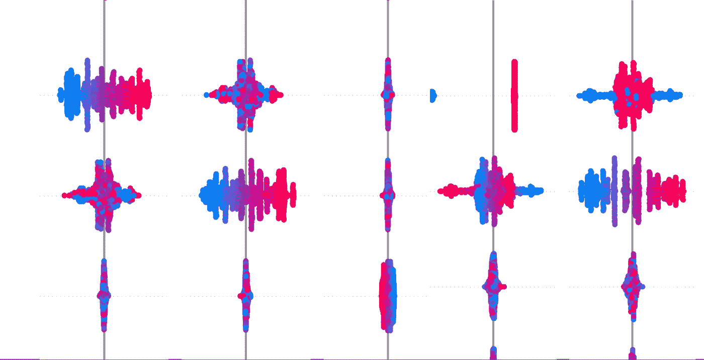
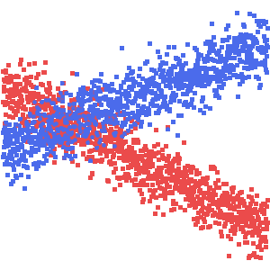
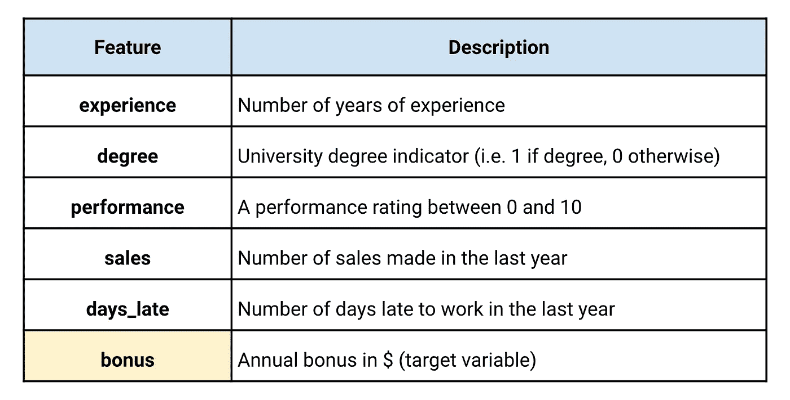
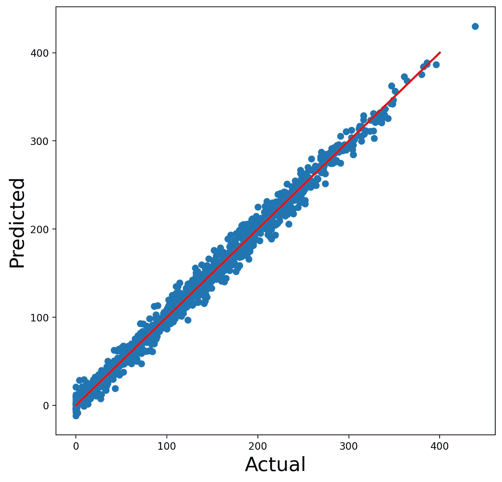
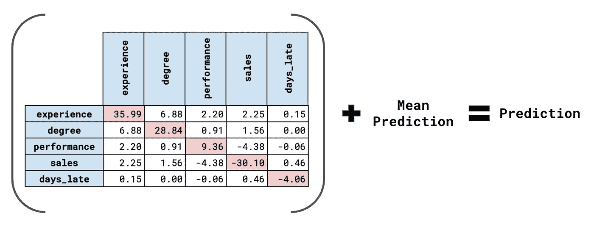
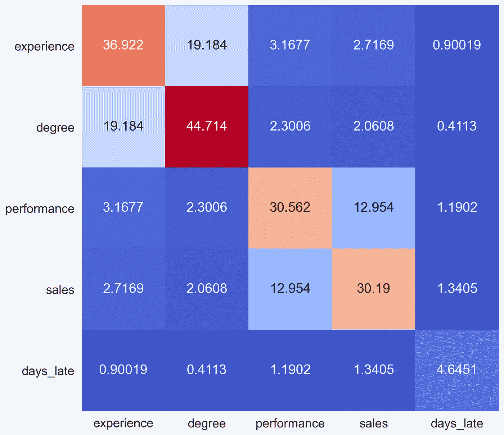
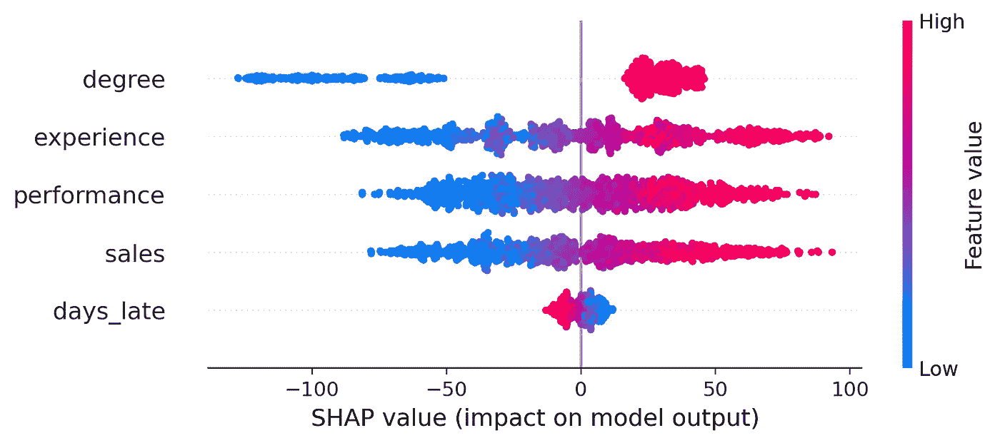
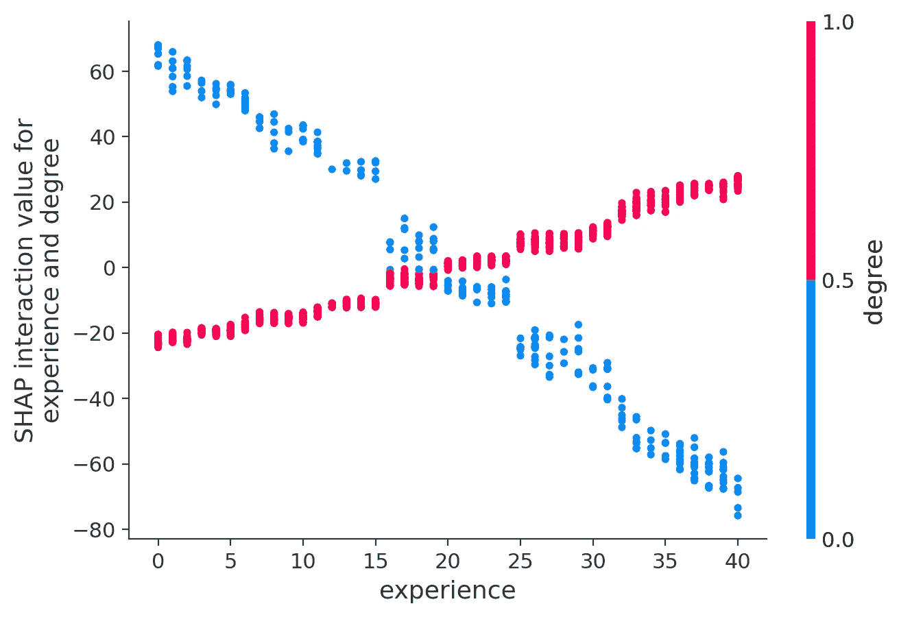
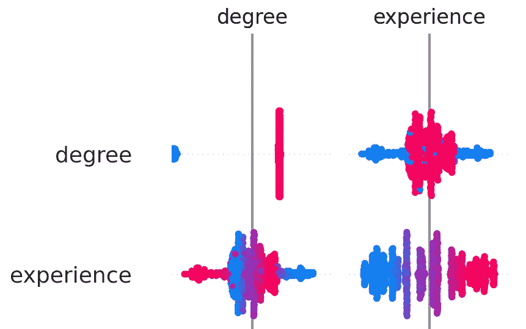
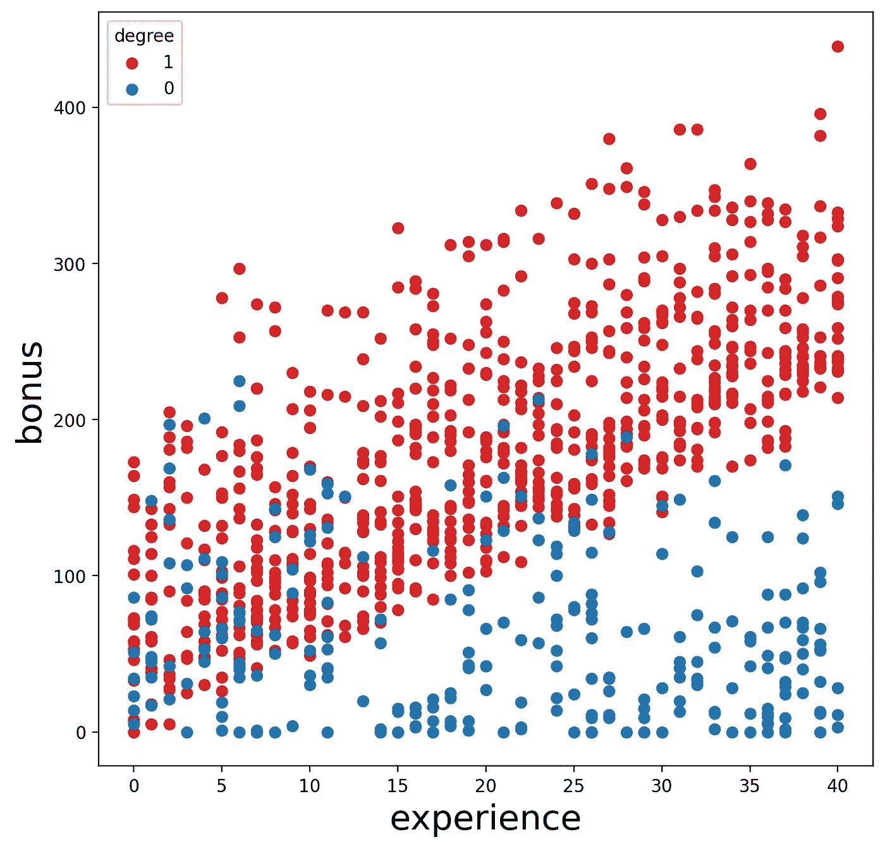

# 分析与 SHAP 的互动

> 原文：<https://towardsdatascience.com/analysing-interactions-with-shap-8c4a2bc11c2a?source=collection_archive---------2----------------------->

## 使用 SHAP Python 包来识别和可视化数据中的交互

来源:作者

SHAP 值用于解释模型做出的单个预测。它通过给出每个因素对最终预测的贡献来做到这一点。SHAP 相互作用值通过将贡献分解成它们的主效应和相互作用效应对此进行了扩展。我们可以用这些来突出和可视化数据中的交互。它也是了解模型如何做出预测的有用工具。

来源:作者

重点将放在应用 SHAP 方案和解释结果上。具体来说，我们首先解释什么是 SHAP 相互作用值，以及如何用它们来解释个人预测。然后，我们深入研究这些值的 3 种不同聚合，这有助于我们解释模型一般是如何进行预测的。这包括取所有相互作用值的绝对平均值，并使用 SHAP 汇总和相关图。我们会检查关键的代码片段，你可以在 [GitHub](https://github.com/conorosully/medium-articles/blob/master/src/shap_interaction.ipynb) 上找到完整的项目。

# 资料组

为了解释如何使用 SHAP 包，我们创建了一个包含 1000 个观测值的模拟数据集。在表 1 中，您可以看到该数据集中的要素。目标是使用剩余的 5 个特征来预测员工的年度奖金。我们设计了数据集，因此体验和程度之间以及业绩和销售之间存在互动。days_late 不与任何其他功能交互。你可以在 [Kaggle](https://www.kaggle.com/conorsully1/interaction-dataset) 上找到这个数据集。

表 1:随机生成的数据集中的字段

本文假设您对数据交互有所了解。如果没有，下面的文章将是一个很好的阅读第一。在这里我们确切地解释什么是相互作用。使用与上面相同的数据集，我们还解释了可以用来分析它们的其他技术。这些可以是 SHAP 的一个很好的替代品。

 [## 发现和可视化交互

### 使用特征重要性、弗里德曼的 H-统计量和 ICE 图分析相互作用

towardsdatascience.com](/finding-and-visualising-interactions-14d54a69da7c) 

# 包装

在下面的代码中，您可以看到我们将用来分析这些数据的包。在第 2 行到第 5 行，我们有一些用于管理和可视化数据的标准库。在第 7 行，我们导入 XGBoost，用于对目标变量建模。在第 9 行，我们导入 SHAP 包。在那之下，我们初始化允许你在一个笔记本里显示图表的包。确保你已经安装了所有这些。

# 系统模型化

要使用 SHAP 软件包，我们首先需要训练一个模型。在第 2–4 行，我们导入数据集并分配目标变量和特性。在第 7 行和第 8 行，我们定义并训练了 XGBoost 模型。为了简单起见，我们使用整个数据集来训练我们的模型。为了避免过度拟合，我们限制了模型中每棵树的最大深度为 3。

如果您将 SHAP 应用于现实世界的问题，您应该遵循最佳实践。具体来说，您应该确保您的模型在训练集和验证集上都表现良好。你的模型越好，你的结果就越可靠。作为对该模型的快速检查，我们在下面绘制了实际奖金与预测奖金的对比图。这个模型应该可以很好地展示 SHAP 一揽子计划。

图 1:实际奖金与预测奖金

# 解读 SHAP 互动价值观

现在我们有了模型，我们可以得到 SHAP 相互作用值。这些可以解释为类似于正常的 SHAP 值。如果你对解释这些不熟悉，下面的文章会很有帮助。这将使本文的其余部分更容易理解，因为所讨论的情节是相似的。

 [## Python SHAP 简介

### 如何创造和解释 SHAP 情节:瀑布，力量，决定，SHAP 和蜂群

towardsdatascience.com](/introduction-to-shap-with-python-d27edc23c454) 

为了计算 SHAP 交互值，在第 2 行，我们通过将模型传递给 TreeExplainer 函数来定义一个 explainer。该函数用于解释系综树模型的输出。使用第 3 行的解释器，我们得到交互值。这将返回一个数组，***【shap _ interaction】***，它包含 X 特征矩阵中 1000 个观察值中每一个的记录。

为了理解**的结构*shap _ interaction*我们可以使用下面的代码。第 2 行告诉我们数组的形状是(1000，5，5)。这意味着该阵列包含 1000 个 5x5 矩阵。我们将 5×5 矩阵称为贡献矩阵。它们包含了用于解释 1000 个预测的 SHAP 值。第 5 行给出了数据集中第一个雇员的贡献矩阵。我们可以在下面的图 2 中看到这个矩阵。**

该矩阵告诉我们，与平均预测相比，每个因素对模型预测的贡献有多大。这是对标准 SHAP 值的类似解释，除了贡献被分解成主效应和交互效应。主要效应在对角线上给出。例如，该员工的经验水平使他们的预测奖金增加了 35.99 美元。相互作用效应在非对角线上给出。这些值减半，例如，performance.sales 交互将预测奖金减少了 8.76 美元(-$4.38 x 2)。

图 2:第一个员工的 SHAP 互动价值观

平均预测是所有 1000 名员工的平均预测奖金。如果您将贡献矩阵中的所有值相加，并添加平均预测值，您将获得该员工的模型实际预测值。在我们的例子中，平均预测奖金是 148.93 美元。矩阵中的所有值加起来是 59.98 美元。这为第一个雇员提供了 208.91 美元的预测奖金。您可以使用下面的代码确认这与模型的预测相同。

# SHAP 交互图

查看单个贡献矩阵可以解释单个模型预测。但是如果我们想解释模型是如何做出一般预测的呢？为此，我们可以用几种不同的方式聚集贡献矩阵中的值。

## 绝对平均图

首先，我们将计算所有 1000 个矩阵中每个单元的绝对平均值。我们采用绝对值，因为我们不希望正负 SHAP 值相互抵消。因为相互作用的影响减半，我们也将非对角线乘以 2。然后我们将它显示为热图。您可以在下面的代码中看到这是如何实现的，输出如图 3 所示。

此图可用于突出重要的主效果和交互效果。例如，我们可以看到，平均主效应对于体验、程度、性能和销售都很大。这告诉我们，这些特点往往有很大的积极或消极的主要影响。换句话说，这些特征往往会对模型的预测产生重大影响。同样，我们可以看到，体验程度和绩效销售互动的影响是显著的。

图 3:主效应和交互效应的绝对平均值

## 汇总图

对于标准 SHAP 值，一个有用的图是蜂群图。这是 SHAP 一揽子计划中的一个情节。在下面的代码中，我们获得了 SHAP 值并显示了这个图。具体来说，这些是没有被分解成它们的主效应和交互效应的 SHAP 值。

关于如何解读这张图表，我们不会涉及太多细节。快速看一下图 4，您可以看到图表的颜色是由左轴给出的特性的特征值决定的。我们可以看到，学位、经验、绩效和销售的高价值都与更高的 SHAP 价值或更高的奖金相关联。

图 4: SHAP 蜂群图

有了 SHAP 相互作用值，我们可以通过使用下面代码中的摘要图来扩展这个图。输出如图 5 所示。这里主要效应的 SHAP 值在对角线上给出，非对角线给出了相互作用效应。对于这个情节，互动效果已经翻倍了。与蜂群图一样，颜色由 y 轴上的特征的特征值给出。

图 5: SHAP 汇总图

通过指出重要的主效应和交互效应，该图可以给出与绝对均值图相似的见解。具体来说，我们可以看到，在图 3 中，具有高 SHAP 值的细胞对应于具有高绝对平均值的相同细胞。摘要图通过可视化关系的性质提供了额外的洞察力。例如，我们可以看到，学位、经验、业绩和销售的主要影响都是积极的。

## 依赖图

在概要情节中有很多细节，即使有颜色，也很难解释交互作用的效果。我们可以使用依赖图来更好地理解交互的本质。下面，您可以看到用于为 experience.degree 交互创建依赖图的代码。

查看图 6 中的输出，我们可以看到，如果这个人有学位，那么随着经验的增加，experience.degree 交互效应也会增加。如果这个人没有学位，情况正好相反。我们应该记住，这只是相互作用的结果。应该根据经验和学位的主要影响来考虑这种关系。

图 6:体验度交互依赖图

图 7: SHAP 总结图(仅学位和经验)

回到我们的总结剧情，可以看到经验的主效应是正面的。所以假设一个有学位的人的经验增加了。主效应和交互效应将在同一个方向上起作用。这意味着随着经验的增加，他们的预期奖金也会增加。另一方面，如果一个人没有学位。那么主要的(积极的)和交互作用的(消极的)影响将在相反的方向上起作用。随着经验的增加，预测奖金可能增加、减少或保持稳定。

这与下面的散点图是一致的。这里我们绘制了原始数据值——没有 SHAP 值。我们可以看到，如果一个人有学位，那么他们的奖金往往会随着经验的增加而增加。如果他们没有学位，奖金在不同的经验水平上趋于稳定。我们还没有用 SHAP 值来展示，但稳定的奖金表明，当一名员工没有学位时，主效应和交互效应可能会完美地相互抵消。

图 8:体验度交互散点图

最后，在图 6 中，我们有业绩-销售互动的依赖图。这个情节可以用类似的方式来解释。我们应该记住，我们现在有一个更好的相互作用的两个连续变量，而像以前一样，我们有一个连续和分类变量。

图 9:绩效-销售互动依赖图

上面我们使用了 SHAP 相互作用值作为更多的探索性数据分析技术。也就是说，我们用它们来识别和可视化重要的相互作用。我们也可以使用这个包来帮助解释我们的模型。你可以用类似的方式使用它，除了我们的目标是理解我们的模型如何做出预测。我们将在下面的文章中详细解释为什么这很重要。

 [## 机器学习中的可解释性

### 为什么我们需要理解我们的模型如何做出预测

towardsdatascience.com](/interpretability-in-machine-learning-ab0cf2e66e1) 

支持我成为我的 [**推荐会员**](https://conorosullyds.medium.com/membership) **:)**

 [## 通过我的推荐链接加入 Medium 康纳·奥沙利文

### 作为一个媒体会员，你的会员费的一部分会给你阅读的作家，你可以完全接触到每一个故事…

conorosullyds.medium.com](https://conorosullyds.medium.com/membership) 

|[Twitter](https://twitter.com/conorosullyDS)|[YouTube](https://www.youtube.com/channel/UChsoWqJbEjBwrn00Zvghi4w)|[时事通讯](https://mailchi.mp/aa82a5ce1dc0/signup) —注册免费参加 [Python SHAP 课程](https://adataodyssey.com/courses/shap-with-python/)

## 图像来源

所有图片都是我自己的或从[www.flaticon.com](http://www.flaticon.com/)获得的。在后者的情况下，我拥有他们的[保费计划](https://support.flaticon.com/hc/en-us/articles/202798201-What-are-Flaticon-Premium-licenses-)中定义的“完全许可”。

## 参考

南伦德伯格， *SHAP 蟒包* (2021) *，*https://github.com/slundberg/shap

南 Lundberg，*NHANES I Survival model . ipynb*(2020)*，*[https://github . com/slund Berg/shap/blob/master/notebooks/tabular _ examples/tree _ based _ models/NHANES % 20I % 20 Survival % 20 model . ipynb](https://github.com/slundberg/shap/blob/master/notebooks/tabular_examples/tree_based_models/NHANES%20I%20Survival%20Model.ipynb)

南伦德伯格和 s .李，*解释模型预测的统一方法* (2017)，[https://arxiv.org/pdf/1705.07874.pdf](https://arxiv.org/pdf/1705.07874.pdf)

C.Molnar，*可解释机器学习*(2021)[https://christophm . github . io/interaction-ml-book/html](https://christophm.github.io/interpretable-ml-book/shap.html)