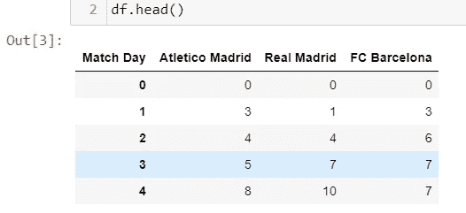
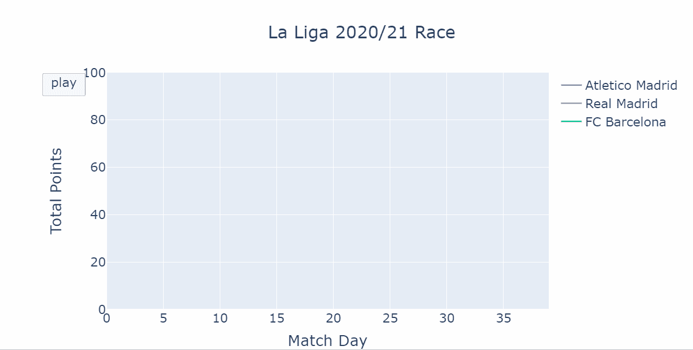
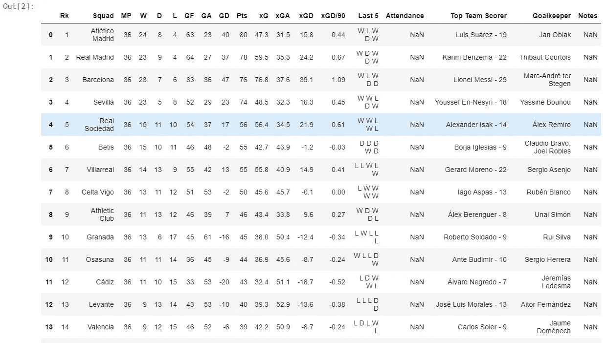
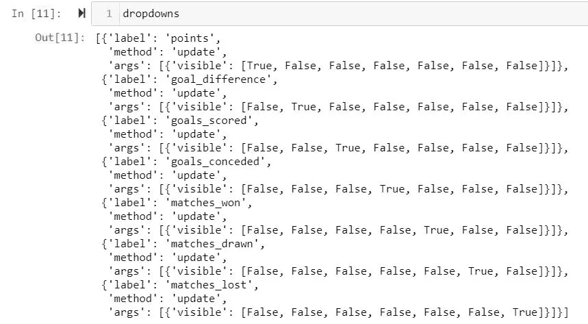
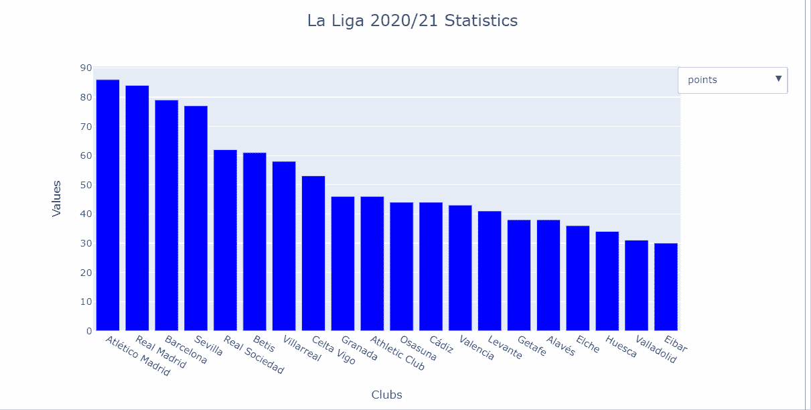

# 用普罗特利分析 2020/21 赛季西甲联赛

> 原文：<https://towardsdatascience.com/analysing-la-liga-2020-21-with-plotly-1f63c99073b4?source=collection_archive---------49----------------------->

## **用动画线形图描绘西甲比赛，用图表显示统计数据**

> "进攻为你赢得比赛，防守为你赢得冠军."

作为一个狂热的巴萨球迷，我不禁赞同弗格森爵士(前曼联主帅)的上述说法，尤其是在当前俱乐部足球的背景下。巴塞罗那足球俱乐部(FC Barcelona)曾在其黄金时代完全主宰国内联赛和欧洲足球。然而，俱乐部自 2015/16 赛季以来就没有打进过欧冠决赛。在上赛季输给劲敌皇家马德里之后，巴塞罗那在本赛季的倒数第二个比赛日输给了塞尔塔维戈，也被踢出了冠军争夺战。另一方面，马德里竞技队在去年夏天从巴塞罗那转会到马德里竞技队的首席射手路易斯·苏亚雷斯的激励下，获得了他们的第 11 个西甲冠军。

西甲联赛在很大程度上被认为是一场三足鼎立的比赛，尤其是在最近几年，因为在过去十年中，只有巴塞罗那、皇家马德里和马德里竞技赢得了联赛冠军或成为了联赛冠军的最大竞争者。在这篇文章中，我将使用一个动画情节的线图比赛和一个非常基本的仪表板来讨论这三个俱乐部在本赛季西甲的竞争和基本统计数据。代码和数据可以在这个 GitHub [资源库](https://github.com/hbshrestha/Analysing-La-Liga-2020-21-Statistics-using-Plotly)中获得。让我们开始吧。

# **西甲 2020/21 赛季动画剧情线路图**

首先，我的目标是想象整个赛季前三名球队在西甲联赛中的表现。我首先导入三个必需的包，在本例中是 pandas、numpy 和 plotly.graph_objects。用于此目的的数据可在这个[储存库](https://github.com/hbshrestha/Analysing-La-Liga-2020-21-Statistics-using-Plotly/blob/main/data/la%20liga%20race.xlsx)中获得，这个储存库是我根据[FcTables.com](https://www.fctables.com/spain/liga-bbva/)通过跟踪每个俱乐部每个比赛日的赢、输和平而创建的。dataframe 由每个比赛日之后西甲三支顶级球队的累计积分组成，如下图所示。



每个比赛日后包含累积积分的数据框(图片由作者提供)

plotly.graph_objects 包括显示图形的数据和布局元素。我从定义`numOfFrames` *，*开始，这相当于 dataframe 中的行数。我创建了一个名为`initial_data` *，*的散点图类型的轨迹，它表示数据帧的第一行中的数据。

为了获得动画折线图竞赛，在每个瞬时时间点捕获帧是一个先决条件，这样第一帧捕获第一行的数据，第二帧捕获第一和第二行的数据，依此类推。为此目的创建了嵌套 for 循环，使得`frames` 将每个`current_frame` 的实例附加到末尾。

通过传递用于数据的`initial_data`和用于布局的`frames`，我得到了一个描述联赛中前三名俱乐部每个比赛日总积分的动画线图，如下所示:



前三名俱乐部每个比赛日的积分(图片由作者提供)

**分析**

正如上面的 gif 图片所示，巴塞罗那在赛季开始的前十场比赛中表现不佳。这是他们这么多赛季以来最糟糕的开局之一，俱乐部在前八场比赛中仅积 11 分，在联赛中排名第 13 位。相比之下，马竞的开局要好得多。到 2021 年 1 月赛季中期，马竞在联赛中稳步上升，分别与皇家马德里和巴塞罗那拉开了 10 分和 13 分的差距。

前十场比赛后，巴塞罗那加快了速度，连续几场连胜，甚至在某些点上超过了皇家马德里，并缩小了与联赛领头羊的差距。另一方面，马德里竞技在赛季中期后下降了几分，并将领先优势从超过 11 分缩小到只有几分。在赛季的最后一个季度，巴塞罗那和皇家马德里都丢掉了几个关键分，甚至错过了登上榜首的机会。在本赛季的最后一个比赛日，三家俱乐部都赢得了比赛，然而，马德里竞技成为了西甲 2020/21 赛季的最终赢家。

# **Plotly 仪表盘**

在本节中，我打算创建一个非常基本的交互式仪表盘，以可视化西甲 2020/21 的统计数据并进行讨论。我为此使用的包与上面的线图比赛使用的包是一样的。用于此目的的数据可在[此处](https://github.com/hbshrestha/Analysing-La-Liga-2020-21-Statistics-using-Plotly/blob/main/data/la%20liga%20statistics.xlsx)获得，可从[fbref.com](https://fbref.com/en/comps/12/La-Liga-Stats)公开获得。数据帧如下所示:



西甲 2020/21 积分表(图片由作者提供)

接下来，我初始化该图，并创建一个我希望在仪表板中显示的指标的字典。在我的字典里，这些键代表着分数、进球、失球、净胜球、获胜的比赛、平局的比赛和失败的比赛。该字典的每个键都链接到原始数据集的相应子集。

```
#create a figure from the graph objects (not plotly express) library
fig=go.Figure()#Create dictionary for ease of access
df_dict={"points":df[["Squad","Pts"]],
        "goal_difference":df[["Squad","GD"]],
        "goals_scored":df[["Squad","GF"]],
        "goals_conceded":df[["Squad","GA"]],
        "matches_won":df[["Squad","W"]],
        "matches_drawn":df[["Squad","D"]],
        "matches_lost":df[["Squad","L"]]}
```

在这一步，我需要为下拉菜单创建一个按钮列表。为此，我初始化了一个名为`dropdowns` 的空列表和一个计数器`i`。使用 for 循环，我为每个指示器创建一个名为`dropdown` 的按钮对象。该按钮还包含一个名为`args`的布尔值(真/假)列表，它告诉根据真值显示哪个轨迹。

所有的按钮对象都被追加到`dropdowns`列表中。如下图所示，对于第一个字典，只有列表中的第一项在更新时可见。对于第二个字典，它是列表中可见的第二个项目，依此类推。



***下拉列表*** 由每个指标组成的列表作为标签，“更新”作为方法，True/False 作为可见参数。(图片由作者提供)

最后，为了更新绘图的布局，我指定了(x，y)坐标，我想要的`dropdowns`按钮的位置，以及我想要菜单弹出的方向。

我得到了一个基本的交互式仪表板，如下所示。



带有西甲 2020/21 统计数据的仪表板

# 分析

在西甲 2020/21 赛季总共 38 场比赛之后，马竞以 86 分的成绩成为冠军。皇家马德里以 84 分接近第二，巴塞罗那以 79 分排名第三。排名前三的俱乐部分别赢得了 26 场、25 场和 24 场比赛。巴塞罗那以 85 个进球成为联赛中进球最多的球队，冠军和亚军各进 67 个球。然而，巴塞罗那也是三支球队中防守最差的，在同样多的比赛中丢了 38 个球。虽然巴塞罗那在三个俱乐部中净胜球最多，但输掉七场比赛和七场平局对俱乐部来说是非常昂贵的。

# 结论

在这篇文章中，一个简单的西甲比赛和基本统计数据的分析是在一个动画线图比赛和使用 Plotly 的仪表板的帮助下进行的。除了对数据有一个整体的了解之外，Plotly 的交互功能对于从图中获得准确的信息非常有用。交互式功能、地图、动画等。可以通过其开源图形库[访问。](https://plotly.com/python/)