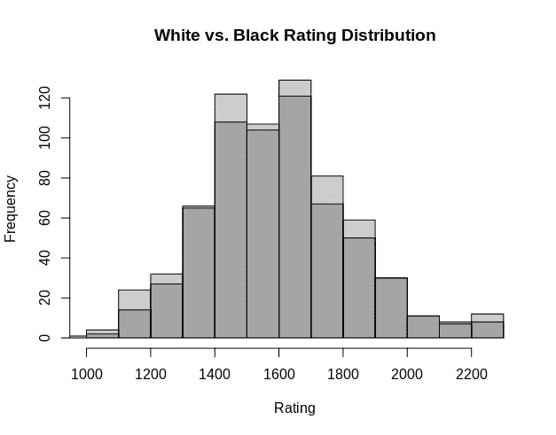
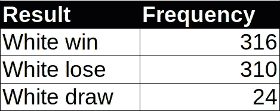
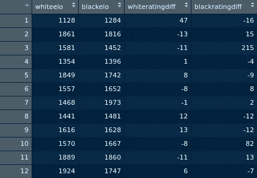
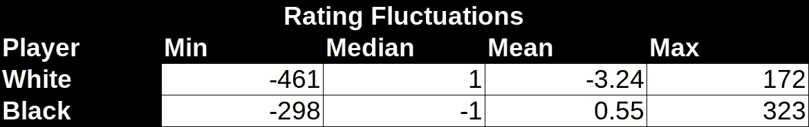
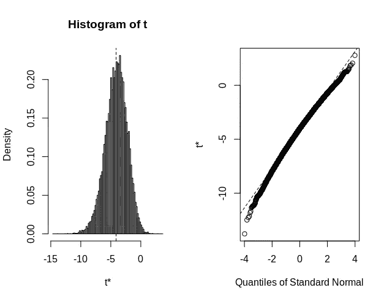
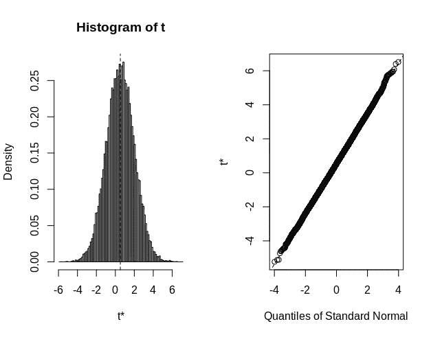

# 用 R 分析李氏对策

> 原文：<https://towardsdatascience.com/analysing-lichess-games-with-r-c4f8b0bc512c?source=collection_archive---------20----------------------->

## 使用 ANOVA 和 Bootstrapping 揭示游戏洞察力


来源:图片来自 [Pixabay](https://pixabay.com/photos/chess-chessboard-board-game-1215079/) 的 [Devanath](https://pixabay.com/users/devanath-1785462/)

国际象棋历史悠久，可以追溯到 1500 年前。然而，由于在线游戏的激增，这款游戏直到最近才成为数据分析的宝库。

玩家经常会有很多问题，比如随着时间的推移，一个人的评级可以提高到什么程度，什么样的开局与胜利最相关，等等。

然而，一个经常被争论的问题是，在任何特定的游戏中，白棋是否由于先走而比黑棋有优势。

也就是说，这个问题的答案并不明确，因为在任何特定游戏中的表现都取决于棋手的能力。一个 Elo 评分为 900 的玩家下白棋将很难击败一个 Elo 评分为 2000 的玩家下黑棋——即使前者有先发优势。

# 初步分析

为了获得关于这个问题的更多见解，我决定分析来自 database.lichess.org[的数据，该公司根据知识共享 CC0 许可证提供其数据。](https://database.lichess.org/)

具体来说，我决定从 2013 年 2 月的数据库中抽取 650 个不同的样本(游戏),以更详细地分析每个游戏的结果和评分变化。

在所玩的一系列游戏中，Elo 评分在白人和黑人玩家中的分布或多或少遵循了我们倾向于在整体评分中看到的正态分布曲线。



来源:RStudio 输出

在这 650 场比赛中，我们看到白棋赢的比输的多，但只是很少:



资料来源:作者的计算

然而，更有趣的是每场比赛后玩家评分的波动。例如，如果输了一场比赛，输的玩家可能会失去 10 分，而赢的玩家可能会得到 15 分，等等。

一般来说，两个玩家之间的收视率差距越大，收视率变化就越深刻。例如，如果排名 1200 的玩家赢了排名 2000 的玩家，则随后的评级变化将比该玩家与类似级别的人比赛时高得多。



来源:RStudio 输出

从本次分析中使用的 650 个游戏样本中，我们可以看到，我们获得了在特定游戏中玩白棋和黑棋的玩家的总体评级，以及每个玩家的评级波动，这取决于他们在特定游戏中是赢是输。

查看一些收视率波动的汇总统计数据，会发现一些非常有趣的事情:



资料来源:作者的计算

在这 650 场比赛中，白人的平均收视率变化明显低于黑人。平均而言，白人每场比赛的收视率下降了 3.24，而黑人每场比赛的收视率上升了 0.55。

# 方差分析和自举

让我们更详细地探讨这一点。

首先，进行 ANOVA 测试，以确定玩白色游戏的人和玩黑色游戏的人之间的评分变化的均值差异是否显著。

```
>>> anova <- aov(df$blackratingdiff ~ df$whiteratingdiff)
>>> summary(anova) Df Sum Sq Mean Sq F value  Pr(>F)    
df$whiteratingdiff   1  77223   77223   65.99 2.3e-15 ***
Residuals          648 758311    1170                    
---
Signif. codes:  0 ‘***’ 0.001 ‘**’ 0.01 ‘*’ 0.05 ‘.’ 0.1 ‘ ’ 1
```

根据 ANOVA 检验，平均值的差异具有统计学意义。

假设我们的样本量是 650，我们假设这个样本代表了象棋游戏的总体。利用这一假设，我们希望使用 bootstrapping 生成评级波动的抽样分布，即带有替换的随机抽样。在这种情况下，替换意味着可以从样本中不止一次地选择一个观察值。

具体来说，我们将对 30，000 个 bootstraps 进行重新采样，以检查随着样本的增加，95%的置信区间会是什么样子。例如，bootstrap 样本将显示一个评级变化分布，我们可以 95%确信它包含总体均值。

这是针对白色和黑色评级波动而进行的。

使用随机抽样替换两组间的等级变化，生成了白色等级(称为 *x* )和黑色等级(称为 *y* )的样本。

```
x<-sample(df$whiteratingdiff, 650, replace = TRUE, prob = NULL)
xy<-sample(df$blackratingdiff, 650, replace = TRUE, prob = NULL)
y=
```

使用引导库，可以生成 30，000 个引导。

```
library(boot)boot_mean <- function(original_vector, resample_vector) {
  mean(original_vector[resample_vector])
}# R is number of replications
mean_results <- boot(x, boot_mean, R = 30000)
mean_results
```

## 白色等级分布

以下是为白色生成的自举置信区间。

```
BOOTSTRAP CONFIDENCE INTERVAL CALCULATIONS
Based on 30000 bootstrap replicatesCALL : 
boot.ci(boot.out = mean_results)Intervals : 
Level      Normal              Basic         
95%   (-7.674, -0.569 )   (-7.445, -0.346 )Level     Percentile            BCa          
95%   (-7.875, -0.777 )   (-8.523, -1.157 )  
Calculations and Intervals on Original Scale
```

95%置信区间表示总体均值位于 **-7.647** 和 **-0.569** 之间。这是分布的图示。



来源:RStudio 输出

## 黑色评级分布

以下是为 black 生成的 bootstrap 置信区间。

```
BOOTSTRAP CONFIDENCE INTERVAL CALCULATIONS
Based on 30000 bootstrap replicatesCALL : 
boot.ci(boot.out = mean_results_2)Intervals : 
Level      Normal              Basic         
95%   (-2.3838,  3.4096 )   (-2.3830,  3.3846 )Level     Percentile            BCa          
95%   (-2.3354,  3.4323 )   (-2.2885,  3.4720 )  
Calculations and Intervals on Original Scale
```

95%的置信区间表示总体平均值位于 **-2.38** 和 **3.4** 之间。这是分布的图示。



来源:RStudio 输出

bootstrap 样本生成的分布非常有趣。平均而言，那些在任何特定游戏中扮演白人的人可能会看到他们的评分平均下降，而那些扮演黑人的人则会看到平均上升。

当然，我们必须注意这样一个事实，即平均值受到分布两端的极端评级变化的影响。当我们根据**初步分析**分析评分变化的汇总统计数据时，我们发现，虽然白人评分的平均变化为负，黑人评分的平均变化为正，但评分的中值变化却显示出相反的情况。

那么，我们能从这些发现中得出什么结论呢？如果假设白棋有先发优势，是否可以推断出能和黑棋一起赢的玩家(特别是在高等级游戏中)总体上更强？

从目前为止的数据来看，这并不一定是结论性的，这将保证一项单独的研究，即是否持续拥有较高黑棋胜率的玩家比拥有较高白棋胜率的玩家表现出更高的评级。

# 限制

虽然上述发现是有趣的，但当以这种方式分析国际象棋评级时，当然存在局限性。

首先，bootstrapping 技术假设选择的 650 个样本代表总体。虽然 650 是一个很大的样本量，但与历史上大量的国际象棋比赛相比，这只是沧海一粟。

虽然 bootstrap 是推断抽样分布特征的一种非常有用的工具——拥有人们可能认为的大样本量并不一定万无一失，如果收集的数据存在任何偏差，那么 bootstrap 抽样的结果也会如此。

此外，值得记住的是，在这个特定的数据集中，有许多一个玩家用两种颜色玩多种游戏的例子。如果一个球员特别有天赋，并且赢了所有他们穿黑白球衣的比赛，那么这更多的是一个强大球员的标志，而不是他们穿的颜色。

# 结论

希望你喜欢这篇文章！最近我又回到了国际象棋，我想这可能是一个利用统计分析收集更多关于游戏的见解的好机会。

这里有棋手希望提供任何评论或反馈吗？如果你对我的发现或如何改进分析有任何建议，我很乐意听到你的意见。

概括地说，本文涵盖了:

*   如何用 R 来分析博弈
*   方差分析在确定样本均值差异是否显著中的意义
*   自举在估计统计量的抽样分布中的作用

非常感谢您的宝贵时间，再次感谢您的任何问题或意见。

# 参考

*   [cran . r . project . org:Package ' boot '](https://cran.r-project.org/web/packages/boot/boot.pdf)
*   【lichess.org 开放数据库

*免责声明:本文是在“原样”的基础上编写的，没有任何担保。它旨在提供数据科学概念的概述，不应被解释为专业建议。本文中的发现和解释是作者的发现和解释，不被本文中提到的任何第三方认可或隶属于任何第三方。作者与本文提及的任何第三方无任何关系。*