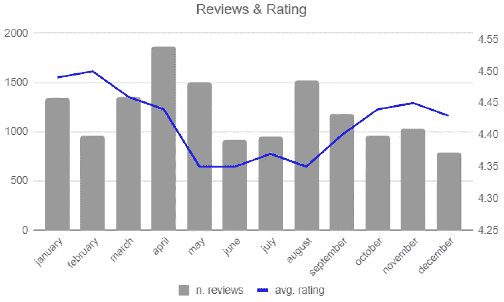
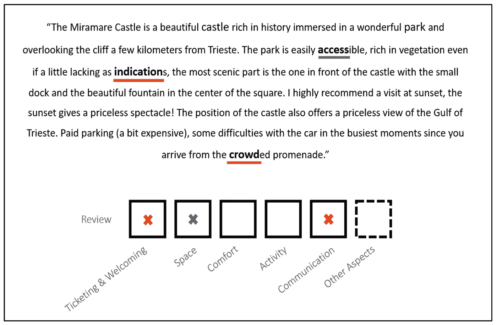
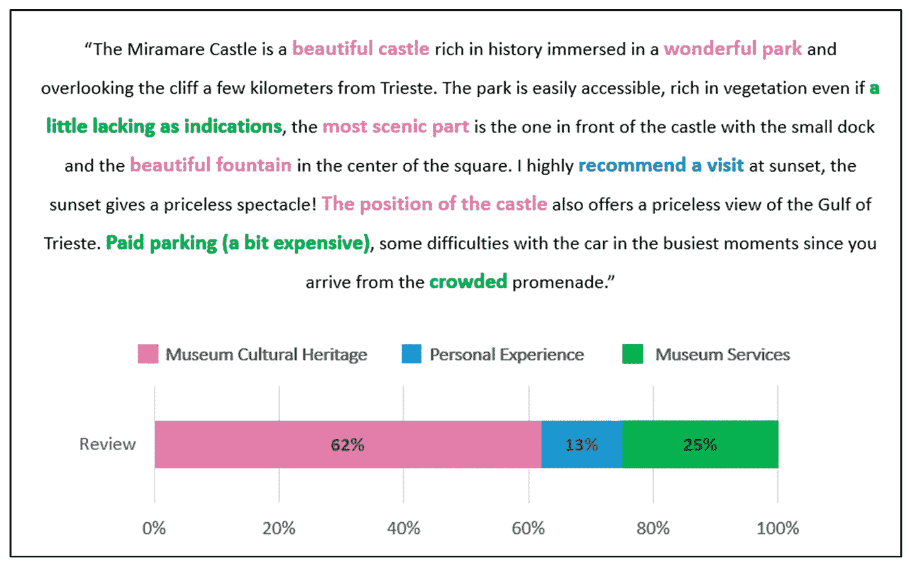
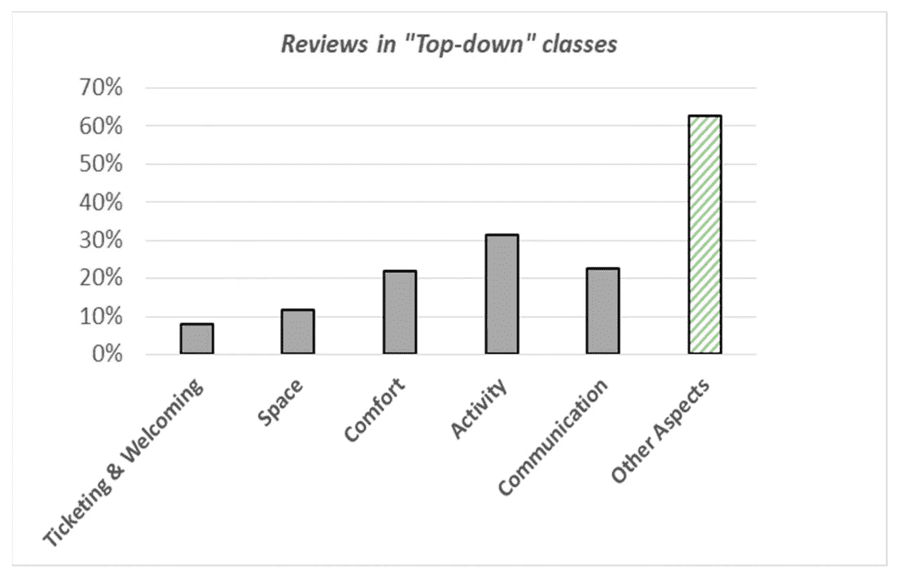
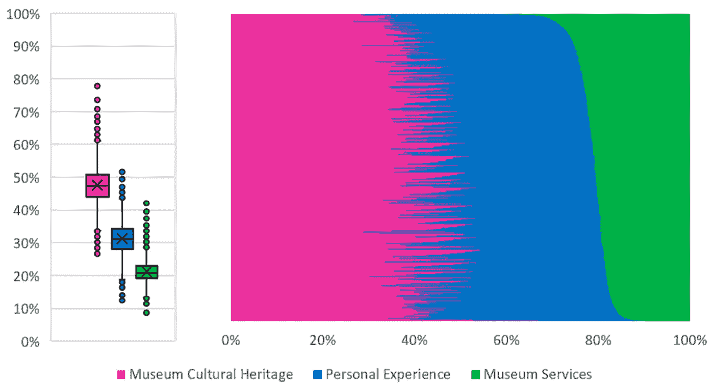

# 利用在线评论评估文化旅游的质量

> 原文：<https://towardsdatascience.com/analysing-online-reviews-for-evaluating-the-quality-of-cultural-tourism-services-2c9004d12123?source=collection_archive---------23----------------------->

## [思想与理论](https://towardsdatascience.com/tagged/thoughts-and-theory)，社交媒体和网络评论能否超越一般的情绪？

## 意大利博物馆的经历

由[米歇尔·比特托](https://unsplash.com/@michelebit_?utm_source=medium&utm_medium=referral)在 [Unsplash](https://unsplash.com?utm_source=medium&utm_medium=referral) 上拍摄的照片

在文化旅游领域，人们对采用数据驱动的方法越来越感兴趣，这些方法旨在通过在线评论衡量服务质量。在线评论长期以来一直是旅游领域数据分析的宝贵来源，但这些数据源主要是根据评论平台提供的数字评级进行研究的。

# 自顶向下与自底向上数据驱动的质量评估

在最近的一篇文章中，我们探讨了社交媒体和在线评论平台是否可以成为量化评估文化场所(如博物馆、剧院等)服务质量的良好来源。本文应用在线评论的自动分析，通过比较两种不同的自动分析方法来评估哪一种更适合评估质量维度。该分析涵盖了用户对意大利前 100 家博物馆的评论。

具体来说，我们比较两种方法:

*   **基于监督分类的“自上而下”方法，监督分类基于国家一级政策制定者指南所定义的战略选择；**还有
*   一种**“自下而上”的方法，基于评论者在线词汇的无监督主题模型**。

我们比较了由此产生的博物馆质量维度，表明与通过“自上而下”方法获得的结果相比，**“自下而上”方法揭示了额外的质量维度。**

> “自上而下”的战略研究和“自下而上”的数据驱动方法的结果不一致，凸显了数据科学如何为文化旅游的决策做出重要贡献。

# 关于质量维度的问题

该研究解决了以下三个问题:

*   从战略的、集中的角度来看，哪些博物馆质量维度是按照“自上而下”的方法确定的？
*   哪些博物馆质量维度是根据在线评论中“自下而上”的数据驱动方法确定的？
*   这两种方法中的质量维度有什么不同？

在“自上而下”的方法中，**由决策者(即国家一级的政策制定者)**定义一组预定义的维度，我们使用基于关键字的分类器来分析在线评论文本中的预期维度。

在“自下而上”的方法中，**潜在的质量维度已经通过依靠无监督的主题分析从游客体验的文本描述中直接导出**，而没有强加一组预定义的质量维度。

> 决策者选择的质量维度可能与博物馆参观者感知的质量维度非常不同。

照片由[塞巴斯蒂安·皮克勒](https://unsplash.com/@pichler_sebastian?utm_source=medium&utm_medium=referral)在 [Unsplash](https://unsplash.com?utm_source=medium&utm_medium=referral) 上拍摄

# 数据集准备和探索

在线评论的数据是从意大利文化遗产、活动和旅游部确定的前 100 家意大利公共博物馆的猫途鹰网页上收集的。一旦收集，在线评论通过语言检测阶段得到丰富。最后，这两种分析方法都应用于 14，250 篇意大利评论的同一数据集。

2019 年 100 家意大利博物馆的评论和评级[图片由作者提供]

# 自上而下的方法

自上而下的方法是指决策者根据主观选择对要考虑的服务/产品的质量进行衡量。

在我们的实证背景下，决策者由政策制定者“意大利文化遗产和旅游部”代表，该部在 2018 年推出了一套公共博物馆的质量标准。基于该指南和对政策制定者的采访，我们确定了遵循“自上而下”观点的五个质量维度:*票务和欢迎、空间、舒适度、活动、*和*沟通*。这些维度中的每一个都被认为是用户评论分类问题中的一类。自上而下的方法允许我们将每个评论标记为对这 5 个维度之一的描述。

分类已经被实现为机器学习分类问题和基于关键字的标记(即，每个维度与预期代表该维度的一组关键字相关联)。特别是，**我们将基于关键字的分类器与来自 Transformers (BERT)** 语言模型的双向编码器表示进行了比较。通过人工标记的 1，000 条评论来检查性能。基于关键词的方法在五类( [**表 2**](https://www.mdpi.com/2071-1050/13/23/13340/htm#table_body_display_sustainability-13-13340-t002) )中获得了 80%的平均准确率和 50%的召回率，而 BERT 方法获得了 88.2%的准确率和 58%的召回率。这种方法的缺点是数据在类间高度不平衡。

应用“自上而下”方法识别在线评论中博物馆质量维度的结果示例(多级软分类)。[图片由作者提供]

# 自下而上的方法

“自下而上”的方法利用在线评论，而没有关于访问维度的预定义预期；相反，它是基于直接从评论者的话语中获得体验的潜在维度，而没有任何预先定义的期望。

从分析的角度来看,“自下而上”的方法是通过无监督的主题建模方法实施的，即 LDA(潜在狄利克雷分配),在多达 30 个主题的范围内实施和调整。我们选择的最好的“自下而上”模型，确定了评论文本中的 13 个潜在维度。

为了获得更好的可解释性，我们将讨论的潜在主题手动分组为博物馆质量的三个主要“自下而上”的维度，我们将其解释为*博物馆文化遗产、个人体验*和*博物馆服务。*

应用“自下而上”方法的结果示例。[图片由作者提供]

# 结果和比较

至于详细的结果，我想让读者阅读全文，这里我总结一下主要的发现。

> 游客的大部分注意力不是集中在服务上，而是博物馆的实际内容质量。

很大一部分评论内容无法归类到服务类别中。[图片由作者提供]

*   “自上而下”的方法(基于政策制定者发布的标准中定义的一组关键字)导致 63%的在线评论不符合任何预定义的质量维度；
*   “自下而上”的数据驱动方法通过使用评论者自己的话搜索感兴趣的方面来克服这一限制，甚至不知道有多少或哪些可能是博物馆的质量维度；
*   特别是，当分析标记为*其他方面*的评论时，“自下而上”的分析以 21%的平均概率识别出*博物馆服务*。这意味着决策者也能够通过“自下而上”的方法发现与服务质量相关的其他方面；
*   基于主题分析，我们看到博物馆评论更多地讨论博物馆的文化遗产方面(46%的平均概率)和个人经历(31%的平均概率)，而不是博物馆提供的服务(23%的平均概率)；
*   这意味着游客的大部分注意力不是集中在服务上，而是博物馆的实际内容质量。

“自下而上”的博物馆质量维度在通过“自上而下”方法分类为“*其他方面”*的评论中的分布。[图片由作者提供]

# TL；速度三角形定位法(dead reckoning)

在本研究的各种定量发现中，我认为最重要的一点是，决策者认为是质量维度的方面可能与博物馆游客认为是质量维度的方面有很大不同:在博物馆的特定环境中使用“自上而下”的方法，大多数评论(63%)与决策者定义的博物馆服务质量维度无关，因为博物馆游客不仅仅看重博物馆服务的质量维度(23%)，而是更重视文化遗产(46%)和个人体验(31%)。

你可以通过阅读在线发表的开放获取的完整文章找到更多关于这个分析的信息。该论文的完整参考文献是:

阿戈斯蒂诺博士；布朗比拉，m。帕瓦内托；丽娃，p。在线评论对文化旅游产品质量评估的贡献:意大利博物馆的经验。*持续性* **2021** ， *13* ，13340。[https://doi.org/10.3390/su132313340](https://doi.org/10.3390/su132313340)