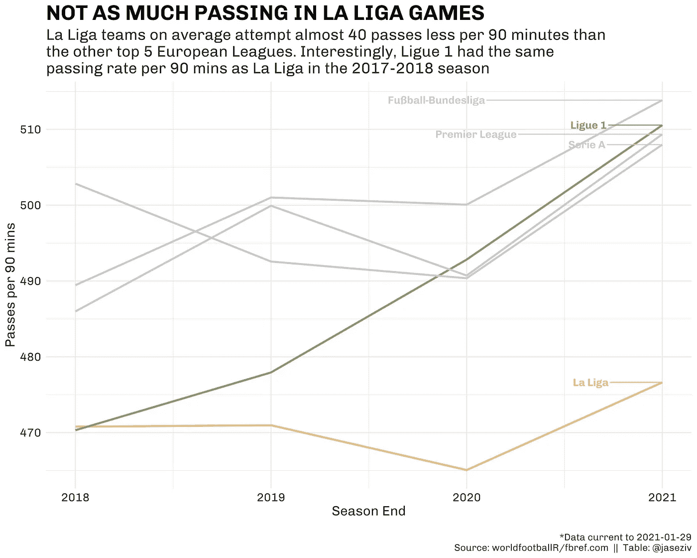
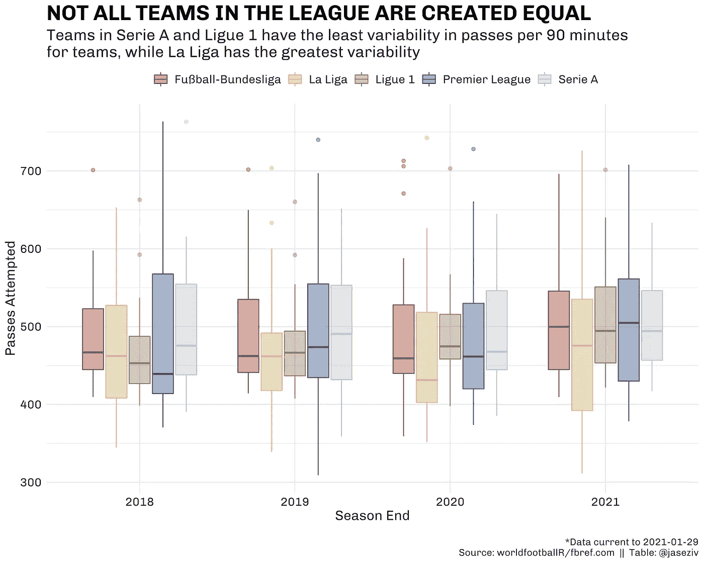
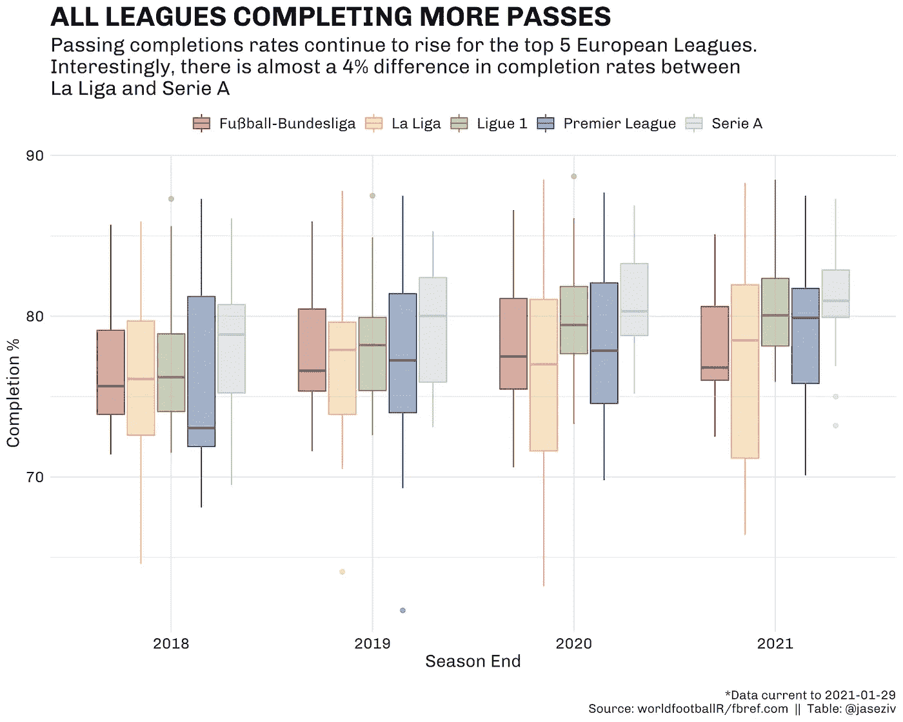
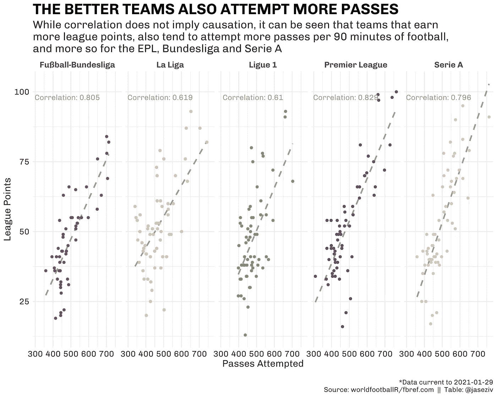
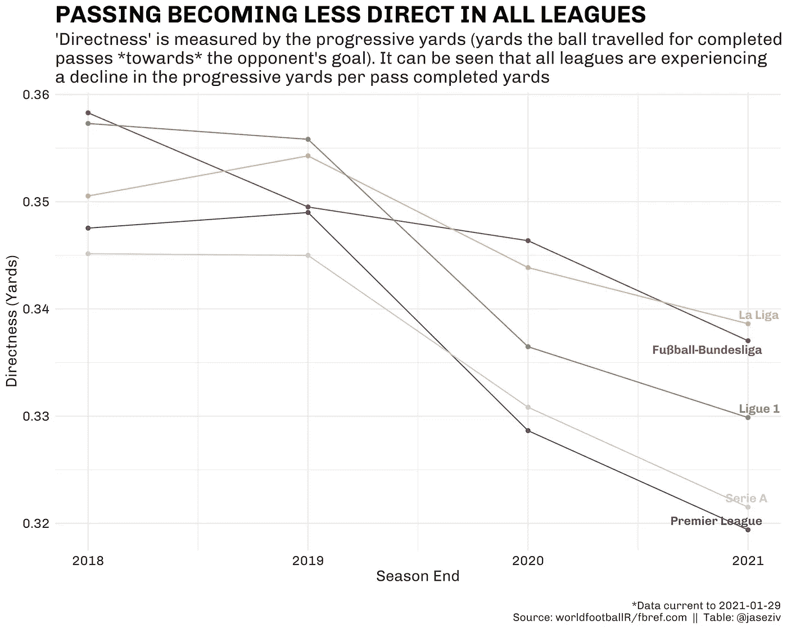
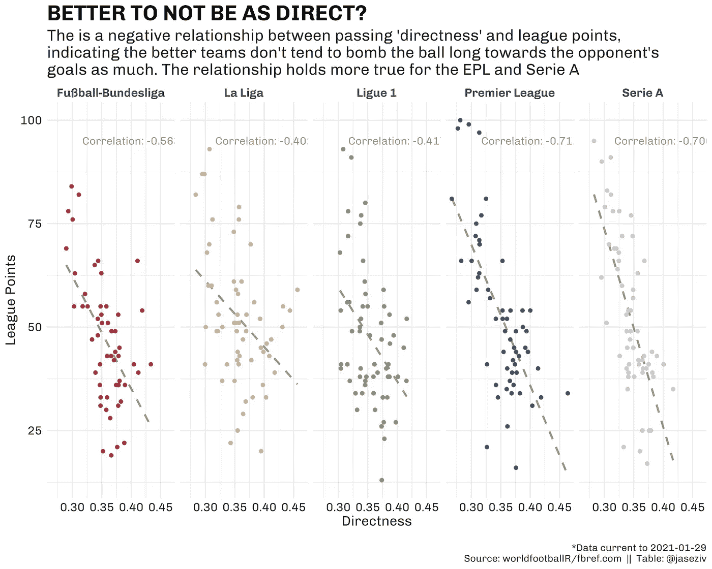
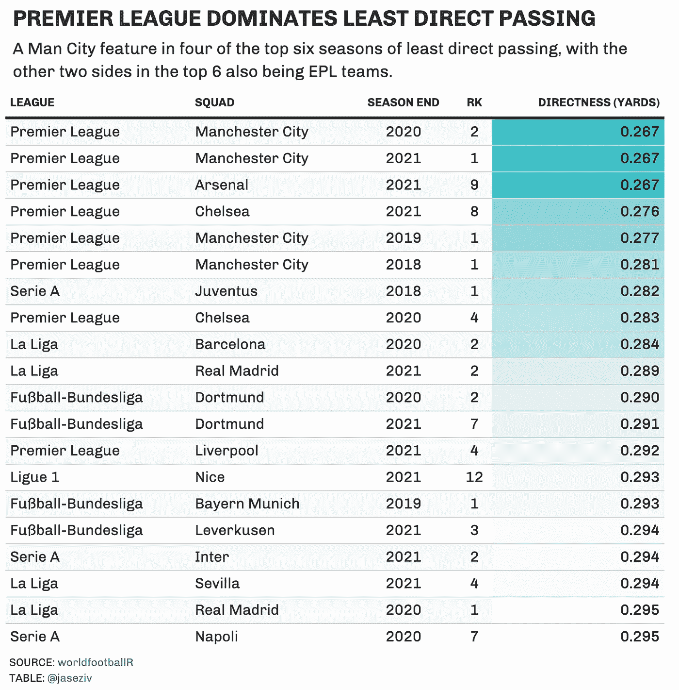
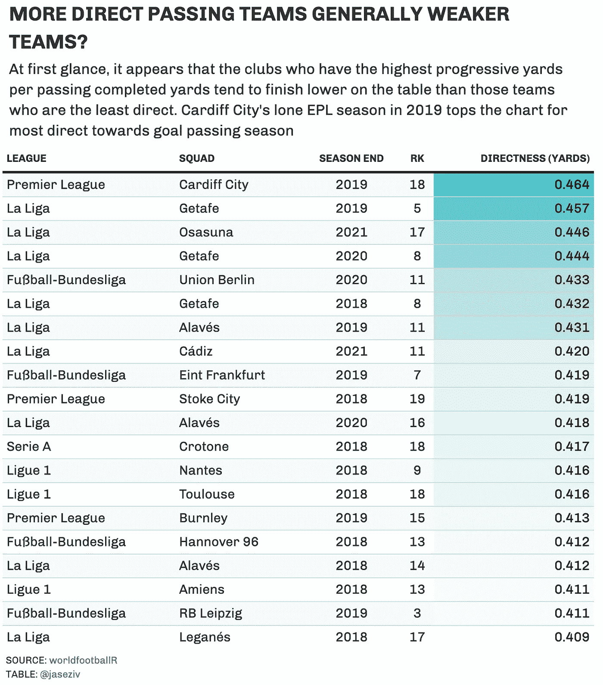

# 欧洲五大国内联赛传球分析

> 原文：<https://towardsdatascience.com/analysing-passing-in-the-top-five-european-domestic-leagues-907f18231a20?source=collection_archive---------21----------------------->

## 使用 worldfootballR 软件包分析欧洲五大国内足球联赛中不同的传球行为

照片由[埃德加·恰帕罗](https://unsplash.com/@echaparro?utm_source=unsplash&utm_medium=referral&utm_content=creditCopyText)在 [Unsplash](https://unsplash.com/s/photos/soccer?utm_source=unsplash&utm_medium=referral&utm_content=creditCopyText) 拍摄

足球经常被称为“美丽的运动”，因为不同国家之间错综复杂的比赛风格而变得更加美丽。

这篇文章旨在开始探索欧洲五大国内联赛比赛风格的一些差异。作为参考，当我们提到前五名时，我们指的是以下国内联赛:

*   足球-德甲(德国)
*   西甲(西班牙)
*   法甲联赛(法国)
*   英超联赛(英格兰)
*   意甲(意大利)

具体来说，这篇文章将集中在传球上，并分析这些联盟中的球队如何在球场上运球是否有任何差异。

这一块的数据来自 [fbref](https://fbref.com/en/) ，来自`worldfootballR` R 包。这个包目前可以从 GitHub 安装，这里的库是。

# 尝试和完成传球

首先，我们将注意力转向每 90 分钟足球比赛中传球次数最多的联赛。

除了意甲在 2017-18 赛季的传球尝试次数最高之外，德甲在传球尝试次数方面占据了最高地位，本赛季的传球尝试次数最高(514 次)。

法甲球队继续增加传球尝试，本赛季首次超过了 EPL 和意甲。有趣的是，在 2017–18 赛季，英甲和西甲同样是传球率最低的联赛，在短短的三年时间里，各自的联赛在传球尝试上出现了分化。

进一步深入分析联赛赛季中的各个球队，可以看出，尽管德甲和 EPL 的传球率最高，但它们的可变性也最高，每个联赛中传球率最高和最低的球队之间的差异最大(尽管西甲的可变性最大)。

# 完成率

尝试传球无疑对比赛很重要，但有人会说完成传球更重要。

下面的方框图显示，总的来说，每个联赛的球队在过去四年中都增加了传球完成率(尽管德甲有些停滞)。

意甲球队一直比其他联赛的球队有更高的传球准确性，而西甲则是所有联赛中完成率变化最大的球队——毫无疑问，这是由马德里队和巴萨以及联赛其他球队之间的巨大质量差异所驱动的。

# 为什么这很重要？

从下面可以看出，在一个赛季中尝试更多传球的球队往往会积累更多的联赛积分，变量之间有相当强的正相关性。以下数据不包括当季。

这对于 EPL 相关性(0.829)、德甲(0.805)和意甲(0.796)来说更是如此，而对于西甲和法甲来说，这种相关性并不那么强。

# 通行证往哪个方向走？

所以，我们已经看到了不同联盟之间在将球传给队友的频率和成功程度上存在一些差异。当他们传球时，球的行进方向是怎样的？

为此，我们可以查看已完成传球的渐进距离(以码为单位),并将其与所有已完成传球的总码数进行比较。fbref 将累进码定义为:

> 完成的传球朝向对方球门的总距离，以码为单位。注意:远离对手球门的传球被算作零码

得出的数字表明每完成一码传球，球前进了多少*码*码。一个较高的数字表示一个队更直接地移动球，而一个较低的数字表示一个队更大比例的完成传球码不像对手的球门那样直接。

# 联赛传球不那么直接？

联赛已经逐渐远离更直接的传球路线，EPL 领先(每完成总码数 0.319 个累进码)，而西甲最不直接，每完成总码数 0.339 个累进码。

就像联赛积分和传球尝试之间的相关性一样，在*直接性*和联赛积分之间似乎也有关系，然而这种关系是负面的，这意味着传球不太直接的球队也往往在赛季末获得更多的联赛积分。

此外，这种关系并不是所有的联盟都如此。这种关系在 EPL(相关系数为-0.711)和意甲(-0.706)中相当强，而在西甲中最弱(-0.402)。

我们也可以看看那些直接传球最多和最少的单个球队赛季。

下面列出了过去四个赛季中最不直接的 20 支球队，榜首由 EPL 俱乐部占据，特别是曼城，他们占据了前六名中的四个席位。

有趣的是，这份名单上的队伍似乎比排名靠后的队伍更接近榜首，这加强了我们上面的相关性。

同样，我们也可以看看最近四个赛季最直接传球的 20 支球队。

这些俱乐部的最终排名看起来更接近他们的积分榜底部(西甲 2018-19 赛季的赫塔菲和德甲 2018-19 赛季的莱比锡是明显的例外)。

卡迪夫城唯一的英超赛季是最直接的传球赛季，每完成传球码数 0.464 递进码。

虽然欧洲五大国内联赛之间的传球活动没有太大的差异，但仍然有一些差异，看看他们的联赛在未来几年如何演变将是有趣的。

一如既往，任何反馈或意见都将在评论区得到重视，或者随时在 Twitter[@ jaseziv]([https://twitter.com/jaseziv](https://twitter.com/jaseziv))上联系。

这个完整的帖子最初出现在 dontblamethedata.com。这篇文章的代码可以在这里找到[。](https://github.com/JaseZiv/DontBlameTheData/blob/master/content/post/top_five_euro_league_passing.Rmd)