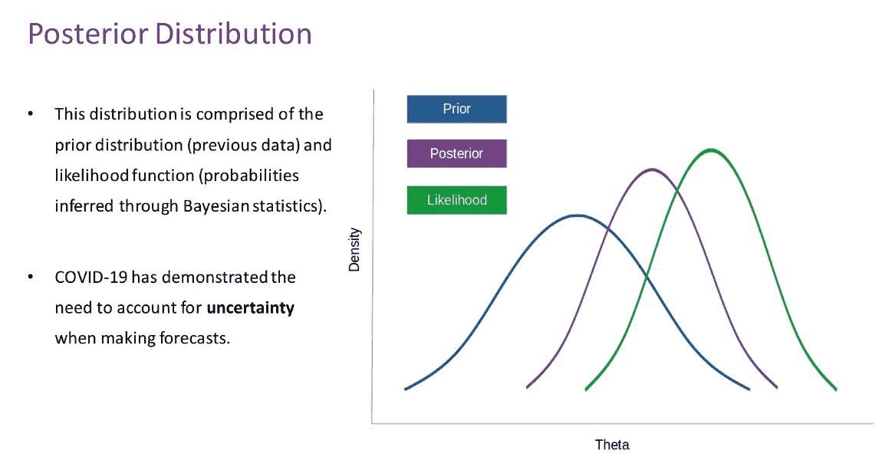
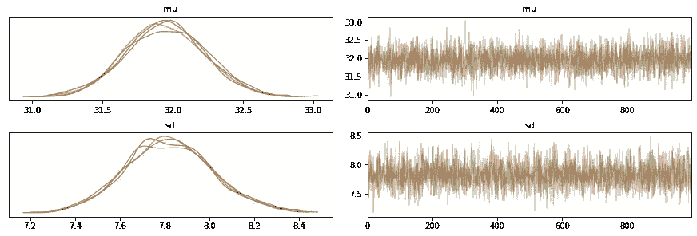
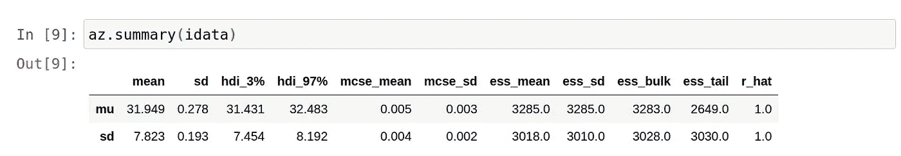
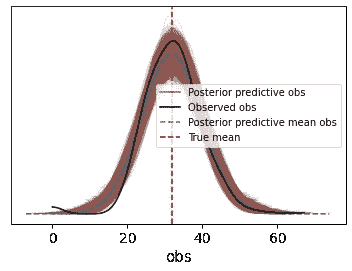
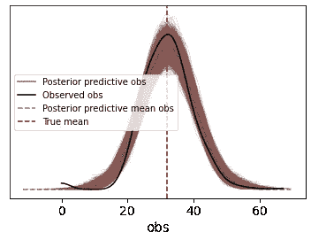

# 用 PyMC3 分析后验预测分布

> 原文：<https://towardsdatascience.com/analysing-posterior-predictive-distributions-with-pymc3-5b6544398181?source=collection_archive---------20----------------------->

## [实践教程](https://towardsdatascience.com/tagged/hands-on-tutorials)

## 使用 PyMC3 模拟后验分布


来源:图片来自 [Pixabay](https://pixabay.com/photos/cube-shaker-luck-gambling-5214498/)

贝叶斯分析的主要目的是在给定不确定性的情况下对数据进行建模。

由于人们无法获得关于一个群体的所有数据来确定其精确的分布，因此经常会做出相同的假设。

例如，我可能会对某个国家人口的平均身高做一个假设。这是一个**先验分布**，或者是一个建立在先验信念基础上的分布，在此之前，我们先来看看可以证明或否定这个信念的数据。

在分析一组新数据(似然函数)时，可以将先验信念和似然函数结合起来形成**后验分布。**



来源:图片由作者创建

让我们看看如何使用 PyMC3 来模拟这样的分布。

# 用 PyMC3 分析身体质量指数数据

在本例中， [Pima Indians 糖尿病数据集](https://www.kaggle.com/uciml/pima-indians-diabetes-database)用于模拟大量患者(其中一些是糖尿病患者，一些不是)的体重指数数据。

在查看数据之前，需要建立一个关于该数据的均值和标准差的先验信念。鉴于数据集中相当多的患者是糖尿病患者，那么人们可以形成一种先验信念，即平均身体质量指数高于平均水平。

## 螺母(不掉头取样器)

在这方面，我们先假设平均身体质量指数为 **30** ，相对较小的标准偏差为 2，表明我们不希望在个别情况下偏离平均值太多。

```
mu_prior=30
sigma_prior=2with pm.Model() as model:
    mu = pm.Normal("mu", mu=mu_prior, sigma=sigma_prior)
    sd = pm.HalfNormal("sd", sigma=sigma_prior)
    obs = pm.Normal("obs", mu=mu, sigma=sd, observed=data)
    idata = pm.sample(1000, tune=1500, return_inferencedata=True)
```

使用 3.1 版本。采样模板来自 [PyMC3 通用 API 快速入门](https://docs.pymc.io/notebooks/api_quickstart.html)手册，NUTS(不掉头)采样器用于从每个链的后部抽取 1000 个样本，然后允许在额外的 1500 次迭代中进行重新调整。注意，在生成后验分布时，除了先验均值和标准差之外，模型还考虑了观察数据*(观察=数据)*。

NUTS 是蒙特卡罗马尔可夫链(MCMC) [算法](https://arxiv.org/abs/1111.4246)的一种形式，它绕过随机游走行为，允许更快地收敛到目标分布。这不仅具有速度优势，而且允许拟合复杂的模型，而不必使用关于这些拟合方法的理论的专业知识。

## 解释

使用 **arviz，**下面是生成的后验图:



来源:Jupyter 笔记本输出

还提供了分布的统计摘要:



来源:Jupyter 笔记本输出

请注意， **31.949** 的平均值略高于之前的估计，而标准偏差在 **7.823** 处明显更高。

考虑到这些数据，事后看来，标准差高于最初的预期是有道理的。

毕竟，数据集中的许多患者都不是糖尿病患者。此外，尽管人们可能认为身体质量指数和糖尿病之间存在正相关，但这是基于先前的信念——如果不查看数据，我们没有确凿的证据证明这一点。

考虑到更新的平均值和标准偏差，下面是更新的后验分布:



来源:Jupyter 笔记本输出

我们可以看到，离差高于最初的预期。也就是说，如果数据本身并不总是十分准确呢？例如，没有人的身体质量指数可以为 0，但由于某种未知的原因，数据中存在许多 0 身体质量指数值。

然而，先验值的说明——以及数据中的大多数其他值——表明这种观察是极不可能的。在这方面，后验预测分布显著下降到 20 以下(数据中观察到的最低身体质量指数值为 18.2)。

## 重温先前的信念

当我们第一次形成对身体质量指数的先验信念时，估计的平均值与实际值相差不远。

然而，如果我们先前的信念完全偏离了目标呢？假设我们估计平均身体质量指数为 50，标准差为 2？

生成的后验分布如下:



来源:Jupyter 笔记本输出

即使存在不准确的先验信念，采样器也可以认识到这完全偏离了相对于实际观察到的数据的标记，并且相应地更新分布。

在新数据采用不同于先前模式的分布的情况下，这也非常有用。例如，一个公司的经理可能会根据经验假设某一年的产品销售倾向于显示某一平均值和标准偏差，但随后的数据与前几年的数据不同。在这方面，后验分布允许更新管理者的先前信念，以反映正在观察的新数据。

# 结论

后验分布允许在生成这种分布时通过考虑新的证据(或数据)来更新先前的信念。

在本例中，您已经学习了:

*   先验分布和后验分布之间的差异
*   如何用 PyMC3 模拟后验分布
*   如何用阿尔维兹解读后验情节
*   先验信念和似然函数在生成后验分布中的作用

非常感谢您的时间，任何问题或反馈都非常欢迎。你也可以在 michael-grogan.com 找到更多我的数据科学内容。

*免责声明:本文是在“原样”的基础上编写的，没有担保。它旨在提供数据科学概念的概述，不应被解释为专业建议。本文中的发现和解释是作者的发现和解释，不被本文中提到的任何第三方认可或隶属于任何第三方。*

# 参考

*   [盖尔曼和霍夫曼(2011)。不掉头采样器:在哈密尔顿蒙特卡罗中自适应地设置路径长度](https://arxiv.org/abs/1111.4246)
*   [Kaggle:皮马印第安人糖尿病数据库](https://www.kaggle.com/uciml/pima-indians-diabetes-database)
*   [PyMC3:通用 API 快速入门](https://docs.pymc.io/notebooks/api_quickstart.html)