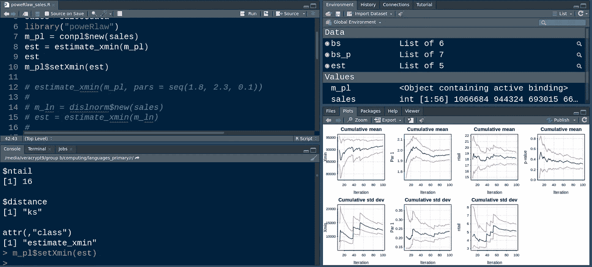
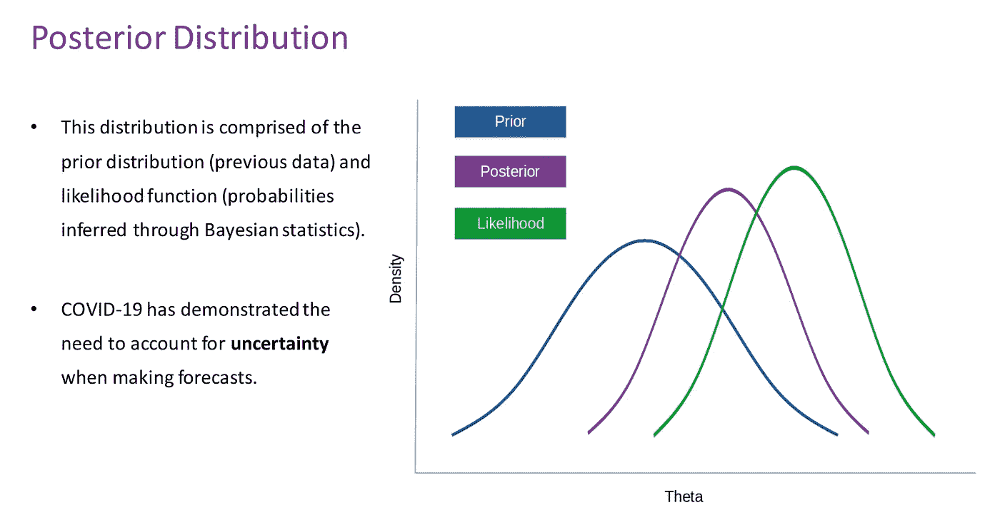
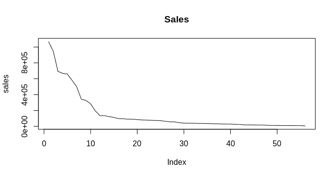
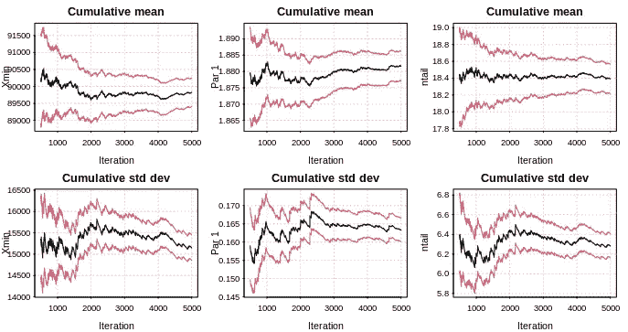
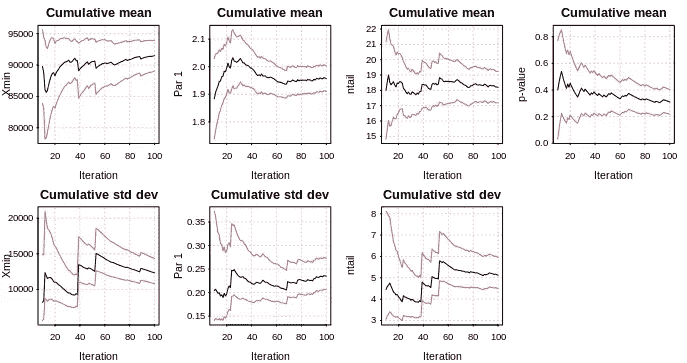

# 用 R 分析幂律分布

> 原文：<https://towardsdatascience.com/analysing-power-law-distributions-with-r-4312c7b4261b?source=collection_archive---------21----------------------->

## 用幂律检验幂律假设



资料来源:RStudio

幂律分布(如帕累托分布)描述了支配我们周围许多现象的 80/20 法则。

例如:

*   一家公司 80%的销售额通常来自 20%的客户
*   计算机 80%的存储空间通常被 20%的文件占用
*   一个国家 80%的财富掌握在 20%的人手中

这些只是几个例子。虽然许多人认为大多数数据集倾向于遵循正态分布，但幂律分布往往比我们意识到的要普遍得多。在分析数据试图捕捉生产率差异的分布时，情况尤其如此。

也就是说，因为不可能获取所有的数据，比如销售数据，所以我们最终必须根据我们所拥有的数据生成一个概率分布。

在这点上，贝叶斯分析试图将先验分布(或研究者对分布形状的先验假设)与似然函数(代表观察到的样本数据的概率密度)相结合，以最终生成**后验分布**。



来源:图片由作者创建

因此，贝叶斯分析的目的最终是用数据更新我们的先验信念。

例如，当谈到财富、销售和存储空间时，我做了声明来证明我的**先验信念**，即这些现象遵循幂律分布。

如果我们想从经验上证明事实是否如此呢？

# 幂律简介

科林·吉莱斯皮的幂律[软件包](https://cran.r-project.org/web/packages/poweRlaw/vignettes/b_powerlaw_examples.pdf)在更详细地分析离散和连续幂律分布时非常有用。

例如，我决定使用美国人口普查局的销售数据-特别是 2019 年年度零售贸易调查[-来确定不同零售行业的销售是否也遵循幂律分布-即只有少数几个行业占 2019 年记录的大部分销售？](https://www.census.gov/data/tables/2019/econ/arts/annual-report.html)

当导航到名为**销售(1992–2019)**的数据集时，您将会看到，每个行业都分为不同零售公司的子组，如*汽车经销商、家具店、服装店、*等。

从最高到最低排列子组销售额时，我们可以看到存在一个广泛的幂律形状:



来源:RStudio 输出

然而，我们不能确定是否是这种情况，我们将使用上述软件包对幂律分布的存在进行经验测试。

## 离散分布与连续分布

当使用幂律包时，首先要决定的是数据是否遵循一个**离散**或**连续**分布。

离散分布的值是特定的和有限的。例如，假设有人希望测量参加体育比赛的人数。明明一个人 0.5 都不能参加！因此，这种分布将是离散的。

但是，在销售数据的情况下，数量可能是连续的。例如，虽然此实例中的销售数据四舍五入到最接近的美元，但从技术上讲，总销售额可能是 100，000.50 美元。此外，考虑到我们正在处理该数据集中的大量数据，分布被建模为**连续**。

# 模拟连续分布

首先，估计分布的下限(xmin ):

```
> sales<-sales$data
> library("poweRlaw")
> m_pl = conpl$new(sales)
> est = estimate_xmin(m_pl)
xmin search space truncated at 1e+05
        You have three options
                  1\. Increase xmax in estimate_xmins
                  2\. Specify xmins explicitly
                  3\. Ignore and hope for the best (which may be OK)
> est
$gof
[1] 0$xmin
[1] 96940$pars
[1] 1.832684$ntail
[1] 16$distance
[1] "ks"attr(,"class")
[1] "estimate_xmin"
> m_pl$setXmin(est)
```

xmin 标识为**96940**，表示为下限阈值。我们还注意到一条警告消息，说明*“xmin 搜索空间在 1e+05 处被截断”*。

这意味着概率分布的下限限于 100，000。然而，当分析数据时，这似乎是合理的——因为数据集中大约 26%的值超过 100，000。

因此，在这种情况下，我判断 xmin 搜索空间足以继续进行引导过程。

# 拔靴带

自举指的是**带替换的随机采样**。这允许使用重采样数据来更好地估计总体分布，从而将样本本身视为总体。

在本例中，我们对 5，000 个具有两个内核的引导进行了采样。以下是输出和计算的标准偏差:

```
> bs = bootstrap(m_pl, no_of_sims = 5000, threads = 2)
xmin search space truncated at 1e+05
        You have three options
                     1\. Increase xmax in estimate_xmins
                     2\. Specify xmins explicitly
                     3\. Ignore and hope for the best (which may be OK)
Some of your data is larger than xmax. The xmax parameter is
            the upper bound of the xmin search space. You could try increasing
            it. If the estimated values are below xmax, it's probably OK not to
            worry about this.
Expected total run time for 5000 sims, using 2 threads is 160 seconds.
> bootstrap(m_pl)
xmin search space truncated at 1e+05
        You have three options
                  1\. Increase xmax in estimate_xmins
                  2\. Specify xmins explicitly
                  3\. Ignore and hope for the best (which may be OK)Some of your data is larger than xmax. The xmax parameter is
the upper bound of the xmin search space. You could try increasing
it. If the estimated values are below xmax, it's probably OK not to
worry about this.Expected total run time for 100 sims, using 1 threads is 7.45 seconds.
$gof
[1] 0$bootstraps
           gof  xmin     pars ntail
1   0.00000000 96940 1.745017    16
2   0.08522512 64208 2.044028    23
3   0.00000000 96940 1.752732    20
...
98  0.00000000 96940 1.650699    17
99  0.05581238 84703 2.013810    18
100 0.09645264 28837 1.730375    44$sim_time
[1] 0.04173159$seed
NULL$package_version
[1] ‘0.70.6’$distance
[1] "ks"attr(,"class")
[1] "bs_xmin"
> sd(bs$bootstraps[, 2])
[1] 15144.57
> sd(bs$bootstraps[, 3])
[1] 0.1633353
```

累积平均值和标准偏差的迭代结果如下:



来源:RStudio 输出

在绘制分布图时，显示了最后 90%的迭代。此外，在假设如下的情况下计算 p 值:

> H0:数据是根据幂律分布生成的
> 
> H1:数据不是由幂律分布产生的

以下是结果输出:

```
> ## trim=0.1 only displays the final 90% of iterations
> plot(bs, trim = 0.1)
> 
> hist(bs$bootstraps[, 2])
> hist(bs$bootstraps[, 3])
> 
> # bs1 = bootstrap(m_ln)
> 
> bs_p = bootstrap_p(m_pl)
xmin search space truncated at 1e+05
        You have three options
                  1\. Increase xmax in estimate_xmins
                  2\. Specify xmins explicitly
                  3\. Ignore and hope for the best (which may be OK)Some of your data is larger than xmax. The xmax parameter is
the upper bound of the xmin search space. You could try increasing
it. If the estimated values are below xmax, it's probably OK not to
worry about this.Expected total run time for 100 sims, using 1 threads is 10.5 seconds.> bs_p$p
[1] 1
> plot(bs_p)
```

生成的 p 值为 **1** ，非常高，在 5%的显著性水平上无法拒绝。这表明我们不能拒绝零假设，即所讨论的销售数据遵循幂律分布，即基于这个 p 值，我们非常确信它**遵循**。

然而，由于这个值在这种情况下非常高，我们还将检查 p 值在迭代中的波动，以确定我们是否仍然可以拒绝零假设。

以下是累积平均值和标准差统计数据的生成图:



来源:RStudio 输出

我们可以看到，在 100 次迭代中，p 值的范围在 **0.2** 和 **0.4** 之间。虽然指示的 p 值 1 比这些范围高得多，但我们仍然可以相当有信心，在给定这些范围的 5%显著性水平下，我们不能拒绝零假设，我们可以推断这是数据遵循幂律分布的证据。

# 结论

poweRlaw 是一个特别有趣的包，我期待着进一步探索它。在这个例子中，我们看了如何使用这个包来模拟连续分布，特别是如何测试一个分布是否遵循幂律。

我们还了解了如何执行用于重采样目的的自举方法，这在样本大小低于预期的情况下非常有用。

此外，我们还看到了如何生成累积平均值和标准差统计数据的图表，以及如何推断迭代中的 p 值范围。

非常感谢您的宝贵时间，非常感谢您的任何问题或反馈。你也可以在 michael-grogan.com[的](https://www.michael-grogan.com/)找到更多我的数据科学内容。

*免责声明:本文是在“原样”的基础上编写的，没有任何担保。它旨在提供数据科学概念的概述，不应被解释为专业建议。本文中的发现和解释是作者的发现和解释，不被本文中提到的任何第三方认可或隶属于任何第三方。*

# 参考

*   [科林·s·吉莱斯皮:幂律包:示例](https://cran.r-project.org/web/packages/poweRlaw/vignettes/b_powerlaw_examples.pdf)
*   [美国人口普查局:2019 年年度零售贸易调查](https://www.census.gov/data/tables/2019/econ/arts/annual-report.html)