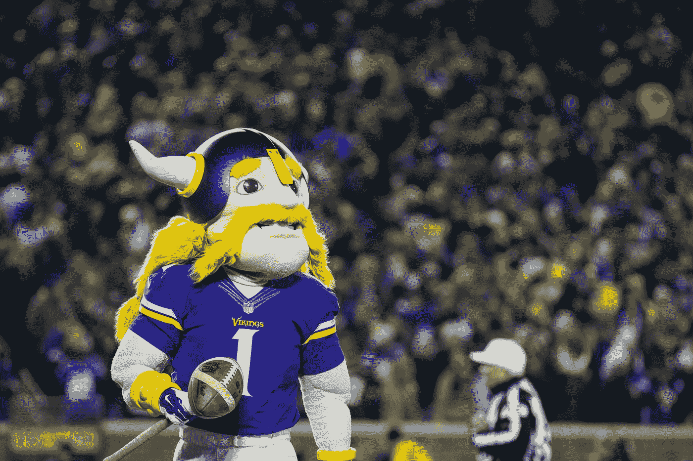
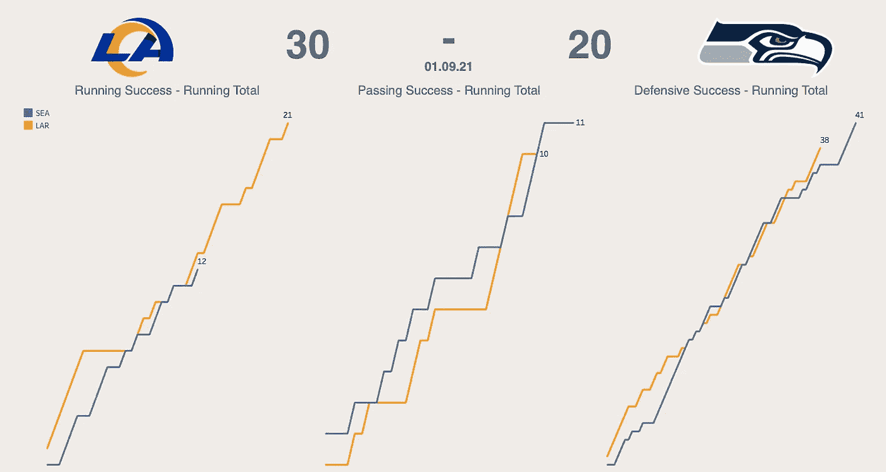
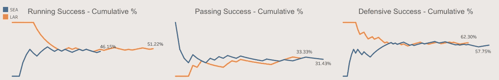

# 用一个简单的统计数据分析 NFL 比赛的流程

> 原文：<https://towardsdatascience.com/analysing-the-flow-of-nfl-games-with-one-simple-statistic-5bfca4e17dd4?source=collection_archive---------31----------------------->

## 如何发挥成功可以帮助您理解普通盒分数

蒂姆·米尔克在 [Unsplash](https://unsplash.com/s/photos/nfl?utm_source=unsplash&utm_medium=referral&utm_content=creditCopyText) 上的照片

在周末对阵小马队的比赛中，比尔·乔希·艾伦投出了 26 次传球，35 次尝试，324 码，2 次达阵。比尔跑比赛也有 21 次 96 码的冲刺。

作为回应，小马队 QB 菲利普里弗斯在 46 次尝试中完成了 27 次 309 码，也有 2 次达阵。他们的跑垒有 29 次，共 163 码。

从这些数据中，我们知道艾伦在空中的表现稍微好一点。他的完成率更高了，他投了更远的距离。小马有一个相当好的运行游戏，他们比比尔尝试更多的运行发挥，并有更高的码数。

但是这些球队在比赛过程中各自的表现如何呢？我们知道比尔队最终打得更好，因为他们以 27 比 24 获胜，但了解比分是如何产生的很重要，这样我们才能有效地评估他们的表现。一个四分卫在井喷比赛的垃圾时间里投出了他 300 码中的大部分，因此不会与带领他的球队赢得胜利的表现相同。

本文的目的是介绍一种单一的度量标准，它采用标准的逐场比赛数据，并将它们转换成更好地描述游戏流程的图表。这只是体育分析的表面，但它有助于给数字带来一点生命和视觉化。

## 玩成功

对于任何不熟悉这项运动的人来说，美式足球的每一次进攻都是由一系列的下沉组成的。你有 4 个向下获得 10 码之前，你的向下重置。通常情况下，第三次倒地是你实际上可以跑位或传球的最后一次倒地，因为第四次通常是预留给把球踢给对手的，除非你有非常好的场上位置或者你在一场势均力敌的比赛中卷土重来。如果你在第四次击球时没有成功地打出 10 码，球将在最后一次击球的地方被传给对方。

那么我们如何定义一部戏剧是否成功呢？嗯，用最简单的话来说，如果你获得了所需的码数，那么这出戏就一定会成功，对吗？。但这引发了一个问题。如果你在第一和第十，并获得 8 码，这是一个相当稳定的发挥，但在我们的初始条件下不会被算作一个。

我们必须稍微调整我们的要求，我们通过设定固定的每羽绒所需码数百分比来做到这一点。标准共识使用以下规则:

如果一部戏剧达到了…就被认为是成功的

*   …第一次降落所需码数的 40%
*   …第二次击球所需码数的 60%
*   …第三次或第四次下降所需码数的 100%

所以这个指标帮助我们给那些在场上不断进攻的球员更多的信任。至少有 3 个 downs 可用于弥补 10 码，我们确保球队不会因为使用所有这些而受到处罚。

我们现在可以开始开发这一指标，并将其分为比赛过程中的传球和跑动。我们也可以引入防守成功，如果他们阻止了一场成功的进攻，那么这场比赛就被认为是成功的防守。

将每一次跑位分配为 0 或 1，传球和防守也是如此，这给了我们一组数值来绘制比赛过程。

我们可以把它直接绘制成成功游戏的累计次数。对于周末的海鹰@公羊比赛，看起来有点像这样。

作者图片

从这张图表中我们可以初步看出，公羊队似乎在这场比赛中赢得了奔跑和防守。这个图表中我们没有看到的是相对比较。例如，我们知道海鹰队有更多的传球和成功，但这和公羊队的成功相比又如何呢？

我们可以通过公式(成功播放次数/总播放次数)计算累计成功百分比。对于公羊海鹰队的比赛，我们的情节可能看起来像这样。

作者图片

这种视觉化帮助我们理解游戏的流程。我们看到一个球队的整体表现基于它周围的数据，这给了我们一个更清晰的关于西雅图传球比赛的画面。虽然他们确实投得更多，他们确实有更多成功的比赛，但总体百分比很低，只有 46.15%。此外，总的来说，他们的跑动和防守更差，我们开始理解为什么公羊队在这里赢得了胜利。

这种观想有一个明显的缺陷。一支球队越晚取得成功，它对他们的百分比的贡献就越小，这就是为什么同时看这两张图很重要。不过，这种观想确实能帮助我们理解游戏是如何结束的。如果我们在任何一条线的末端看到方向的剧烈变化，这真的会放大四分卫、跑卫或防守完成比赛的好坏。

这只是一个简单的例子，说明我们如何理解赛后得到的数字和比赛数据。这是一种有效而清晰的总结表现的方式，同时不会忘记游戏是如何进行的。