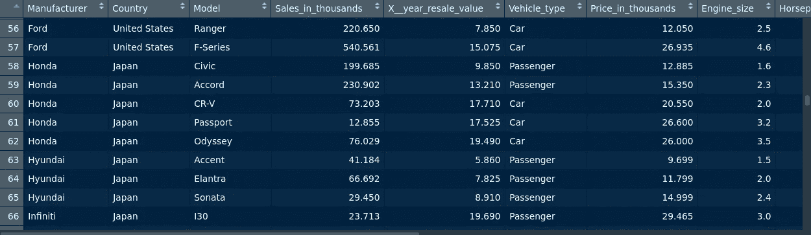
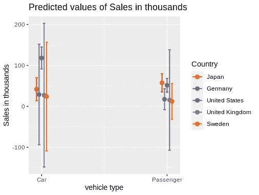

# 汽车销售的方差分析

> 原文：<https://towardsdatascience.com/analysis-of-car-sales-with-anova-in-r-a62546d8fa41?source=collection_archive---------20----------------------->

## 确定各组之间的销售差异


来源:照片由[奥斯卡琳](https://pixabay.com/users/oskaline-11884/)拍摄，来自[皮克斯拜](https://pixabay.com/photos/car-vehicle-sports-car-auto-63930/)

使用 ANOVA(方差分析)模型的主要目的是确定组间均值是否存在差异。

虽然 t 检验能够确定两个均值之间是否存在差异，但如果存在几个组，则需要进行更广泛的检验。

在本例中，我们将了解如何实现 ANOVA 模型来分析汽车销售数据。

# 背景

该分析是在 [Kaggle](https://www.kaggle.com/gagandeep16/car-sales) 的汽车销售数据集上进行的。

该分析的目的是确定基于**车型**和**原产国**的汽车组之间的发动机尺寸、马力和燃油效率等因素是否不同。

当只使用一个分类变量时，使用单向 ANOVA 来确定影响。

双向方差分析用于确定跨多个类别的影响(也称为因子方差分析),以及是否存在**交互影响**,即因素对因变量的[综合影响](https://pages.uoregon.edu/stevensj/interaction.pdf),而不是单独考虑它们。

以下是数据集的概述:



来源:RStudio 输出

请注意，对于制造商列，数据集中提供了 50 个不同的类别(或因子)。为了减少因素的数量，增加了称为**国家**的第二个因素，制造商根据其原产国进行分组。例如，奥迪和大众生产的所有汽车都被归为德国制造，而现代和丰田生产的所有汽车都被归为日本制造，等等。

# 单向方差分析

如前所述，在这种情况下，将使用单向方差分析来确定以下变量在车辆类型和制造商所在国家之间是否存在显著的平均值差异:

*   功率性能因数
*   发动机尺寸
*   马力
*   燃料容量
*   燃料效率

让我们运行 ANOVAs 并分析结果。

```
> one.way <- aov(Power_perf_factor ~ vehicle_type, data = mydata)
> summary(one.way)
              Df Sum Sq Mean Sq F value Pr(>F)
vehicle_type   1      0     0.1       0   0.99
Residuals    153  97352   636.3               
2 observations deleted due to missingness

> one.way <- aov(Engine_size ~ vehicle_type, data = mydata)
> summary(one.way)
              Df Sum Sq Mean Sq F value Pr(>F)   
vehicle_type   1  11.34  11.338   11.06 0.0011 **
Residuals    154 157.81   1.025                  
---
Signif. codes:  0 ‘***’ 0.001 ‘**’ 0.01 ‘*’ 0.05 ‘.’ 0.1 ‘ ’ 1
1 observation deleted due to missingness

> one.way <- aov(Horsepower ~ vehicle_type, data = mydata)
> summary(one.way)
              Df Sum Sq Mean Sq F value Pr(>F)
vehicle_type   1     11      11   0.003  0.954
Residuals    154 498303    3236               
1 observation deleted due to missingness

> one.way <- aov(Fuel_capacity ~ vehicle_type, data = mydata)
> summary(one.way)
              Df Sum Sq Mean Sq F value Pr(>F)    
vehicle_type   1  836.4   836.4   85.49 <2e-16 ***
Residuals    154 1506.6     9.8                   
---
Signif. codes:  0 ‘***’ 0.001 ‘**’ 0.01 ‘*’ 0.05 ‘.’ 0.1 ‘ ’ 1
1 observation deleted due to missingness

> one.way <- aov(Fuel_efficiency ~ vehicle_type, data = mydata)
> summary(one.way)
              Df Sum Sq Mean Sq F value   Pr(>F)    
vehicle_type   1    928   928.0    75.1 6.21e-15 ***
Residuals    152   1878    12.4                     
---
Signif. codes:  0 ‘***’ 0.001 ‘**’ 0.01 ‘*’ 0.05 ‘.’ 0.1 ‘ ’ 1
3 observations deleted due to missingness
```

我们可以看到，对于数据集中的车辆类型(指定为客车或轿车)，结果对于**马力**或**功率性能系数**并不重要，即这些变量的平均值并没有显示出统计上的显著差异，这取决于车辆是被分类为**客车**还是**轿车**。

现在让我们来看看这些变量的平均值是否因国家而异。

```
> one.way <- aov(Power_perf_factor ~ Country, data = mydata)
> summary(one.way)
             Df Sum Sq Mean Sq F value Pr(>F)
Country       4   4851  1212.7   1.967  0.102
Residuals   150  92501   616.7               
2 observations deleted due to missingness

> one.way <- aov(Engine_size ~ Country, data = mydata)
> summary(one.way)
             Df Sum Sq Mean Sq F value  Pr(>F)   
Country       4  14.56   3.641   3.556 0.00838 **
Residuals   151 154.59   1.024                   
---
Signif. codes:  0 ‘***’ 0.001 ‘**’ 0.01 ‘*’ 0.05 ‘.’ 0.1 ‘ ’ 1
1 observation deleted due to missingness

> one.way <- aov(Horsepower ~ Country, data = mydata)
> summary(one.way)
             Df Sum Sq Mean Sq F value Pr(>F)
Country       4  14798    3699   1.155  0.333
Residuals   151 483516    3202               
1 observation deleted due to missingness

> one.way <- aov(Fuel_capacity ~ Country, data = mydata)
> summary(one.way)
             Df Sum Sq Mean Sq F value Pr(>F)
Country       4   10.7    2.67   0.173  0.952
Residuals   151 2332.3   15.45               
1 observation deleted due to missingness

> one.way <- aov(Fuel_efficiency ~ Country, data = mydata)
> summary(one.way)
             Df Sum Sq Mean Sq F value Pr(>F)
Country       4   11.3   2.826   0.151  0.962
Residuals   149 2795.0  18.758               
3 observations deleted due to missingness
```

我们可以看到，除了**发动机尺寸**之外，F 统计的 p 值对于所有发动机尺寸来说都是不显著的，这意味着根据制造商的国家不同，平均发动机尺寸在统计上存在显著差异。

值得注意的是，使用 ANOVA 的一个限制是，测试将仅表明组间的平均差异是否具有统计显著性——它们不会特别揭示**哪个**组对平均差异负责。

例如，我们可能会观察到不同国家的平均发动机尺寸不同，但是 ANOVA 本身无法告诉我们与其他国家的车辆相比，哪个国家的制造商的平均发动机尺寸更大。

# 双向方差分析

此外，单向方差分析的局限性在于它不能检验交互作用的影响。例如，车辆类型和制造国家可能不会单独影响车辆的马力，但是当这两个因素结合在一起时呢？

在这方面，双向方差分析用于 1)检验多个因素对因变量的影响，以及 2)组合这些因素的影响，即交互作用的影响。

以下是我们将运行的四个模型(包括交互效应):

```
model_1 = lm(Engine_size ~ vehicle_type + Country + vehicle_type*Country, data = mydata)model_2 = lm(Fuel_efficiency ~ vehicle_type + Country + vehicle_type*Country, data = mydata)model_3 = lm(Fuel_capacity ~ vehicle_type + Country + vehicle_type*Country, data = mydata)model_4 = lm(Sales_in_thousands ~ vehicle_type + Country + vehicle_type*Country, data = mydata)
```

对四个模型中的每一个进行双向 ANOVA 测试:

```
library(car)
Anova(model_1, type = "II")
Anova(model_2, type = "II")
Anova(model_3, type = "II")
Anova(model_4, type = "II")
```

结果如下:

```
> Anova(model_1, type = "II")
Note: model has aliased coefficients
      sums of squares computed by model comparison
Anova Table (Type II tests)Response: Engine_size
                      Sum Sq  Df F value   Pr(>F)   
vehicle_type          10.219   1 10.4870 0.001484 **
Country               13.444   4  3.4492 0.009989 **
vehicle_type:Country   0.159   2  0.0814 0.921836   
Residuals            144.211 148                    
---
Signif. codes:  0 ‘***’ 0.001 ‘**’ 0.01 ‘*’ 0.05 ‘.’ 0.1 ‘ ’ 1> Anova(model_2, type = "II")
Note: model has aliased coefficients
      sums of squares computed by model comparison
Anova Table (Type II tests)Response: Fuel_efficiency
                      Sum Sq  Df F value    Pr(>F)    
vehicle_type          997.09   1 81.5442 9.305e-16 ***
Country                80.39   4  1.6436    0.1664    
vehicle_type:Country   12.65   2  0.5171    0.5973    
Residuals            1785.22 146                      
---
Signif. codes:  0 ‘***’ 0.001 ‘**’ 0.01 ‘*’ 0.05 ‘.’ 0.1 ‘ ’ 1 > Anova(model_3, type = "II")
Note: model has aliased coefficients
      sums of squares computed by model comparison
Anova Table (Type II tests)Response: Fuel_capacity
                      Sum Sq  Df  F value    Pr(>F)    
vehicle_type          888.24   1 104.4075 < 2.2e-16 ***
Country                62.56   4   1.8383    0.1245    
vehicle_type:Country  184.94   2  10.8693 3.941e-05 ***
Residuals            1259.10 148                       
---
Signif. codes:  0 ‘***’ 0.001 ‘**’ 0.01 ‘*’ 0.05 ‘.’ 0.1 ‘ ’ 1> Anova(model_4, type = "II")
Note: model has aliased coefficients
      sums of squares computed by model comparison
Anova Table (Type II tests)Response: Sales_in_thousands
                     Sum Sq  Df F value   Pr(>F)   
vehicle_type          24865   1  6.3332 0.012909 * 
Country               49466   4  3.1497 0.016097 * 
vehicle_type:Country  45149   2  5.7497 0.003932 **
Residuals            585007 149                    
---
Signif. codes:  0 ‘***’ 0.001 ‘**’ 0.01 ‘*’ 0.05 ‘.’ 0.1 ‘ ’ 1
```

我们可以看到，对于车型 **4** ，**车型**和**国家**之间的交互作用在统计上是显著的。

这表明销售价值受到车型和制造商所在国家的显著影响。而且，这两个变量也是相互作用的。

举一个假设的例子，我们可能会发现日本的乘用车销量较高，但德国的乘用车销量较低。换句话说，我们不能简单地得出结论，车辆类型和销售之间的关系在不同国家将保持不变——相互作用的存在表明它们可能不同。

使用 **sjPlot** [库](https://cran.r-project.org/web/packages/sjPlot/vignettes/plot_interactions.html)，我们可以进一步查看交互效果。

```
library(sjPlot)
plot_model(model_4, type = "pred", terms = c("vehicle_type", "Country"))
```



来源:RStudio 输出

我们可以看到，不同车型的销售价值差异很大。例如，在德国，汽车的销售范围要比乘用车大得多。

同样，日本的乘用车销售价格中值高于轿车。

# 结论

总之，我们已经看到了如何使用单因素和双因素方差分析来分析均值之间的差异，在这种情况下，使用的是汽车销售数据集。

我们还看了一下:

*   使用方差分析的局限性
*   如何使用双向方差分析来检验变量之间的交互作用
*   使用 **sjPlot** 库在视觉上检查交互效果

非常感谢您的宝贵时间，非常感谢您的任何问题或反馈。你也可以在 michael-grogan.com 的[找到更多我的内容。](https://www.michael-grogan.com/)

*免责声明:本文是在“原样”的基础上编写的，没有担保。它旨在提供数据科学概念的概述，不应被解释为专业建议。本文中的发现和解释是作者的发现和解释，不被本文中提到的任何第三方认可或隶属于任何第三方。作者与本文提及的任何第三方无任何关系。*