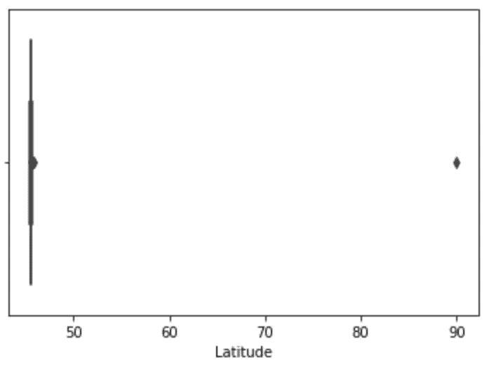
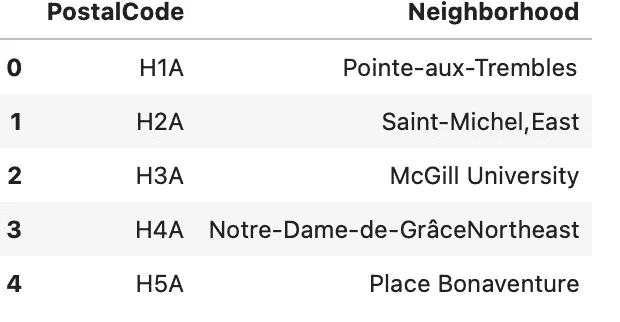
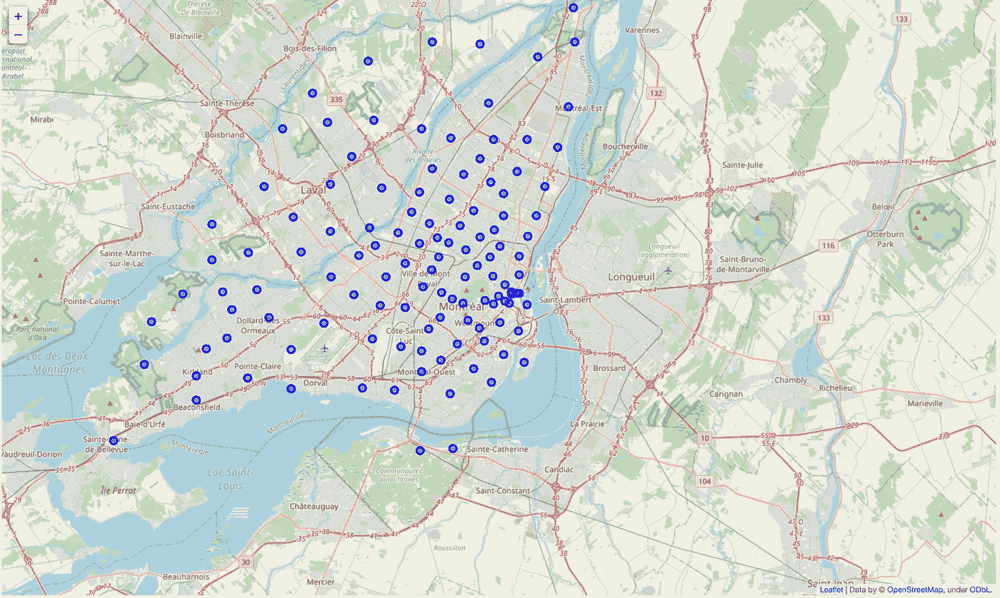
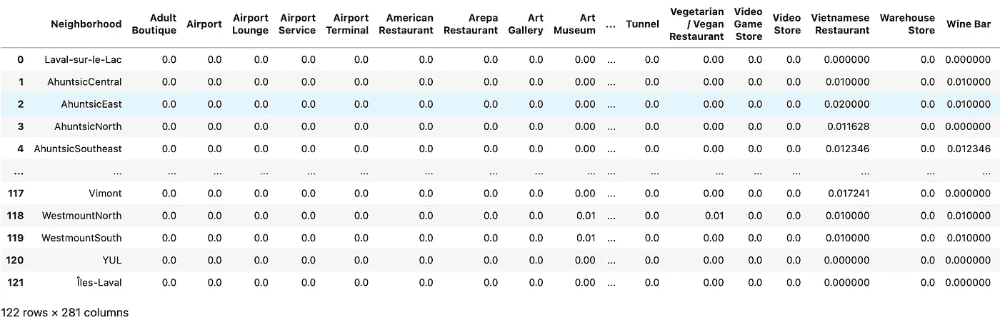
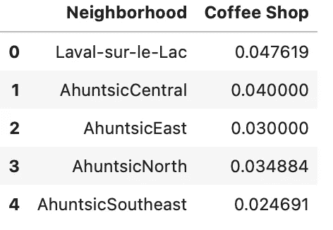
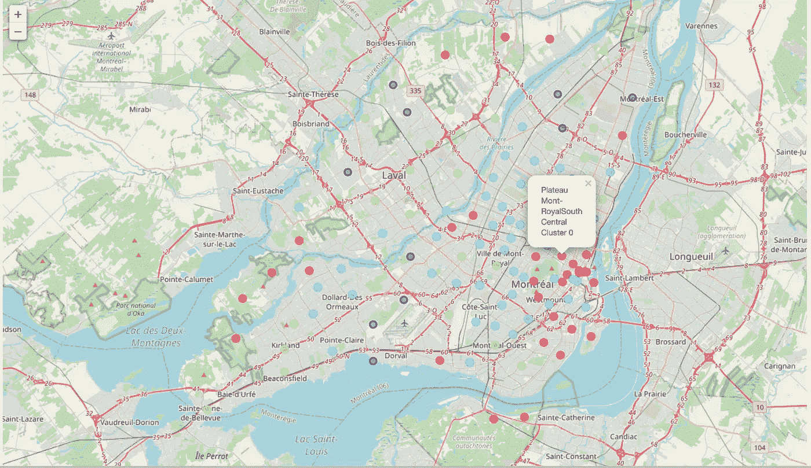
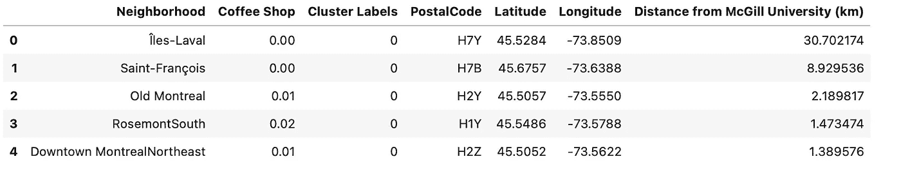

# 蒙特利尔咖啡店分析——街区分割和聚类

> 原文：<https://towardsdatascience.com/analysis-of-coffee-shops-in-montreal-neighbourhood-segmentation-and-clustering-4e4f020c30d7?source=collection_archive---------25----------------------->

## [实践教程](https://towardsdatascience.com/tagged/hands-on-tutorials)

## *如何使用 four square API k-means 聚类对蒙特利尔市的社区进行分类和聚类*

图 1——由[拍摄的自由照片](https://pixabay.com/photos/?utm_source=link-attribution&utm_medium=referral&utm_campaign=image&utm_content=983955)在 [Pixabay](https://pixabay.com/pt/?utm_source=link-attribution&utm_medium=referral&utm_campaign=image&utm_content=983955) 上

## 介绍

蒙特利尔是加拿大人口第二多的城市，也是加拿大魁北克省人口最多的城市。

这座城市是一个旅游胜地，有几个娱乐区、历史古迹、众多的酒吧、餐馆和咖啡馆。一项既是游客也是居民的活动是喝咖啡。这项活动可以单独进行，也可以在朋友的陪同下，在这个城市的任何时间进行。

在世界上人均饮用咖啡量较高的 20 个国家中，加拿大人的人均消费量约为 6.5 公斤/年，高于美国和英国。

平均而言，72%的 18 至 79 岁的加拿大人每天都喝咖啡，但在经常喝咖啡的人中，平均消费量是每天 2.8 杯(加拿大咖啡协会)。

## 商业问题

这个项目的目标是分析和探索一个咖啡店的最佳位置。这份报告将针对那些想从零开始，购买现有企业的利益相关者，或者任何对加拿大蒙特利尔的好咖啡感兴趣的人。

由于蒙特利尔有很多咖啡店，我们将尝试检测那些还没有挤满咖啡店的位置。我们还对附近没有咖啡店的地区特别感兴趣。假设前两个条件都满足，我们也希望位置尽可能靠近市中心(麦吉尔大学附近)。

## 数据

对于蒙特利尔居民区的数据，维基百科上有一个页面，里面有我们探索和聚集城市居民区所需的所有信息。

为了获得蒙特利尔居民区和邮政编码的数据，维基百科页面被废弃了。用于此任务的库是 BeautifulSoup。通过刮擦，从 124 个邮政编码、地区和区域获得了数据。仍然需要添加每个邮政编码的纬度和经度，为此，我使用了 [**pgeocode**](https://pypi.org/project/pgeocode/) 库。

在验证了一个邮政编码(HOP)没有关于它的邻居、地区的信息，因此既没有纬度也没有经度之后，执行了数据清理。我研究了蒙特娄的邮政编码，发现 H0 的前缀很奇怪。零表示交付农村地区，因此实际上是空的。([加拿大的邮政编码](https://en.wikipedia.org/wiki/Postal_codes_in_Canada))。这样，那个邮政编码就被删除了。

通过邮政编码的*箱线图*图，观察到经纬度的异常值。该坐标不属于加拿大，因此已从数据集中移除。

图 2—按作者分类的图像—纬度箱线图中的异常值

之后，该数据框总共有 122 个邻域，并且它的存储方式可以读取到 pandas 数据框中，因此它是一种类似于魁北克蒙特利尔数据集的结构化格式。

图 3——作者的图片——蒙特利尔街区

## 方法学

在这一节中，将展示用于项目分析的方法。

首先，我们检查了候选社区。这是创造了经纬度坐标的质心，麦吉尔大学附近。

可视化库 [**叶子**](https://python-visualization.github.io/folium/quickstart.html) 被用来创建一个蒙特利尔的地图，上面叠加了街区，以及一个覆盖感兴趣区域的网格。20x20 公里，以麦吉尔大学附近为中心。

图 4—按作者分类的图像—候选人社区

为了探索蒙特利尔市的街区，使用了[**four square**](https://developer.foursquare.com)API。该界面用于获取每个街区中最常见的位置类别(咖啡馆、餐馆、冰淇淋店、艺术画廊等)，然后使用该功能对街区进行分组。必须在应用程序中创建一个帐户来获取您的客户端凭据。

首先，API 被用来获取半径为 2.5 公里的麦吉尔大学附近的前 100 个场馆。

第二，分析验证了蒙特利尔地区上空 280 个类别的频率，并且在咖啡店类别被过滤之后。

图 5——按作者分类的图片——每个类别的出现频率

图 6—按作者分类的图片—咖啡店类别频率

然后，执行 k-means 聚类算法以将邻域聚类成 4 个聚类。再次，叶图书馆被用来可视化城市的集群分布。根据咖啡店在每个区域的出现频率，按照本项目的要求(附近很少或没有咖啡店的区域),对每个集群进行检查和区分。

图 7—作者提供的图片— **群集**

最后，计算出咖啡店很少或没有的街区到麦吉尔大学街区的距离，并将其添加到分析中。

图 8—作者提供的图片— **距离市中心最近的前 5 个街区，咖啡馆的出现频率很低**

## 结果

这项工作分析了蒙特利尔的 122 个街区，目的是发现不再充满咖啡店的地方。

蒙特利尔自助餐厅密度最低的区域集中在分析区域的外围区域。这个区域与群集 0(地图上的红点)相关。在这个组群中，有 25 个居民区密度较低。

凡尔登南部是离麦吉尔大学最近的街区，咖啡店密度很低。距离中心坐标 1.97 公里。

还有更近的地方，没有拥挤的咖啡店:Plateau Mont-royal southeast(0.75 公里)，Verdun North(1.36 公里)，Place Desjardins，蒙特利尔市中心东北(都是 1.38 公里)。

## 结论和建议

项目要求包括检测尚未挤满咖啡馆的地方，或附近咖啡店密度较低的区域，并尽可能靠近市中心(麦吉尔大学)。建议以下五个方案满足项目要求:*凡尔登南*，距离*麦吉尔大学*最近的街区，咖啡店密度最低，距离中心坐标 1.97 公里；*Plateau Mont-royal 东南*(0.75 公里)*Verdun North*(1.36 公里)*Place Desjardins*(1.38 公里)*蒙特利尔市区东北*(1.38 公里)。

这个项目只考虑了附近咖啡店的频率。其他因素对最终决定自助餐厅的位置也很重要，如附近的其他企业(将是补充自助餐厅的其他相关类别)、附近的生活费用、安全区等。此外，所有分析都是使用免费 API 或其开放访问选项进行的。可以使用付费资源进行分析，以便获得更多的结果选项

这个分析的笔记本可以看[这里](https://github.com/ssilvacris/Coursera_Capstone/blob/main/capstone_project_final/Notebook_coffee.ipynb)。