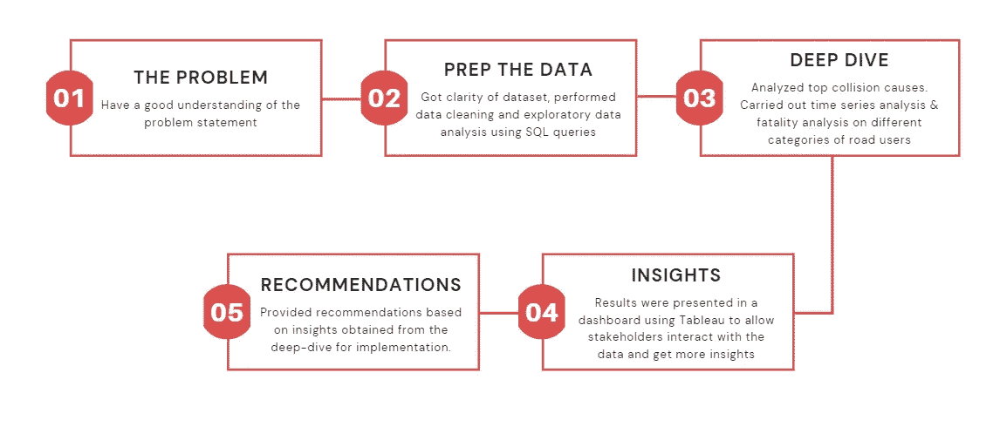
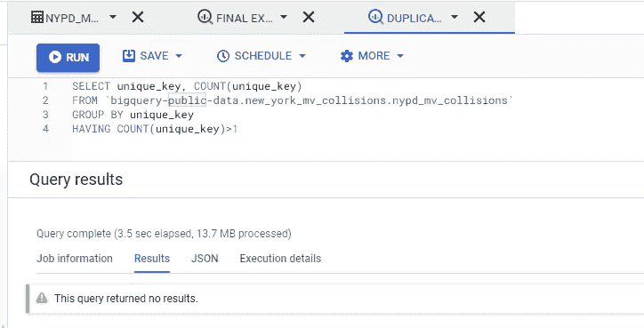
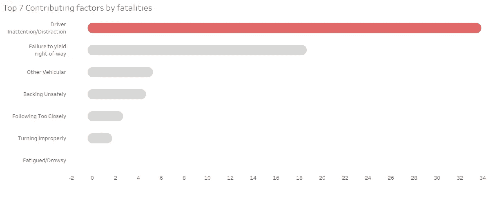
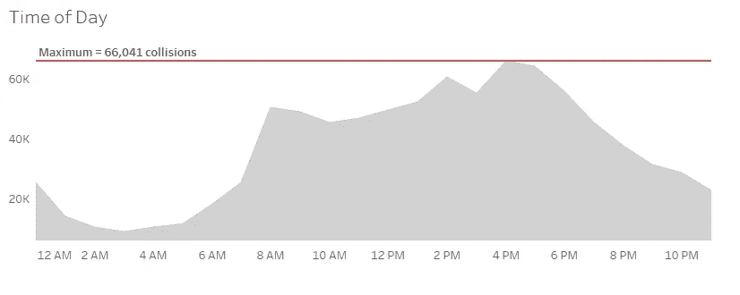
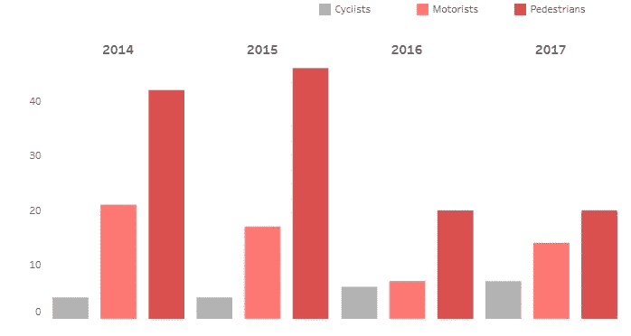
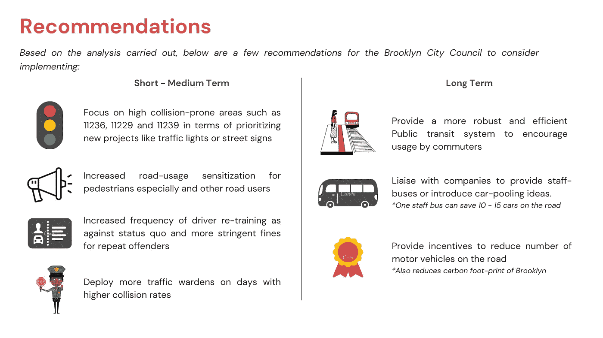
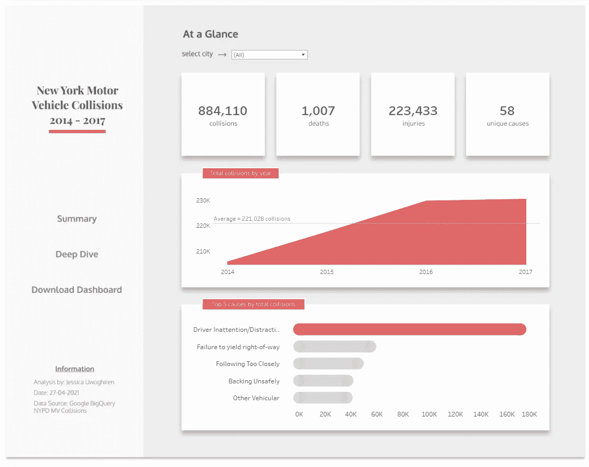

# 纽约市机动车碰撞事故分析

> 原文：<https://towardsdatascience.com/analysis-of-new-york-city-motor-vehicles-collisions-927da110dfc7?source=collection_archive---------19----------------------->

## [实践教程](https://towardsdatascience.com/tagged/hands-on-tutorials)

## *使用 Google BigQuery 和 Tableau 的数据分析师访谈案例研究*

在我的上一篇文章中，我谈到了我向数据分析的转变，以及我最近如何获得一份全职数据分析师的职位。整个 4 月 21 日，我在各种北美公司的面试中来去自如。对于其中一些公司，我必须参与 Excel、SQL 或 Python 测试，而其他一些公司则让我进行案例研究。在本文中，我将向您介绍我通过的一个这样的案例研究，以及我解决这个问题的方法。

照片由[卢克·斯塔克波尔](https://unsplash.com/@withluke?utm_source=medium&utm_medium=referral)在 [Unsplash](https://unsplash.com?utm_source=medium&utm_medium=referral) 拍摄

# 任务

首先，案例研究是公司在考虑让你进入高级面试阶段之前测试核心技能的一种方式。在这个案例研究中，我的任务是分析 2014 年 1 月至 2017 年 12 月谷歌大查询中的纽约市机动车辆碰撞数据集，并提供建议以减少纽约布鲁克林区**的事故发生率。*从 2012 年至今，整个数据集目前拥有超过 170 万条记录，可在此处[访问](https://console.cloud.google.com/bigquery?project=brooklyn-collisions-311918&ws=!1m5!1m4!4m3!1sbigquery-public-data!2snew_york_mv_collisions!3snypd_mv_collisions&d=new_york_mv_collisions&p=bigquery-public-data&t=nypd_mv_collisions&page=table)。*

**附注:Google BigQuery 有几个定期更新的公共数据集，可以用来为你的投资组合构建项目。**

# *我的方法*

*我的第一反应是在网上搜索与这项任务相关的文章，因为“太阳底下没有新东西”。我发现以前的文章对开发我的方法很有用。我的方法总结如下图所示。*

**

*我的案例研究方法(图片由作者提供)*

# *第一步*

*这里有一些技巧和步骤，你可以用来进行未来的案例研究。*

*   ****理解任务:*** 这对于任何案例研究都是相关的，以确保你的分析不会跑题。重要的是，在多走一步之前，先按照指示去做。在本案例研究中，我差点错过了简报中要求我仅分析 2014-2017 年数据的地方。*
*   ***准备数据**:在浏览数据集时，识别主键并检查重复值和空值应该是很容易的事情。还要寻找可能与您的分析相关的字段，这样您就不会将不相关的字段导入到您的商业智能工具中。这就是 SQL 派上用场的地方。*

**

*在 Google BigQuery 中检查重复项(P.S. Query 没有返回结果)在这种情况下是一件好事。)*

# *深潜*

*为了分析数据集，我使用了 *Tableau Public* ，原因有二:我想创建一个交互式仪表盘，Tableau 是工作描述中提到的技能之一。通过研究数据集，我获得了对关键特性进行深入分析的想法。下面重点介绍了一些，而其他的可以在最终的控制面板中探索。*

*   **碰撞分析:*这样做是为了揭示导致碰撞和死亡的主要原因。我们可以看到，大多数死亡事故都是由*驾驶员疏忽/分心造成的。**

**

*按死亡人数列出的 7 大碰撞促成因素(图片由作者使用表格提供)*

*   **时间序列分析:*揭示一天中的什么时间或一周中的哪一天碰撞最多。我们可以从下面的图表中看到，大多数碰撞发生在高峰时间*(下午 4 点到 5 点)*。在一天的早些时候，我们也能看到大量的数据。*

**

*碰撞时间序列分析(图片由作者使用 Tableau 提供)*

*   **死亡分析:*这表明，每当发生碰撞时，行人比其他道路使用者更容易死亡。*

**

*道路使用者每年死亡总数(作者使用表格提供图片)*

# *将这一切结合在一起*

*利用从我的分析中收集的见解，我准备了一个幻灯片来提供建议。一个额外的建议是确保你提供的任何建议都是由你的分析*支持的——而不是先前的知识。*此外，大多数公司会给几个小时到 5 个工作日的时间来完成案例研究。如果你看到你有更多的时间，请尽量不要匆忙。*

**

*根据我的分析提供的建议(图片由作者提供)*

*此案例研究的最终提交是一个*幻灯片组*和*仪表盘*。后者是一个附加物，因为这是一个主要的技术公司，他们喜欢它:)。交互式仪表板的预览如下所示。我在 Figma 设计了背景，剩下的魔术发生在 Tableau。*

**

*最终 Tableau 仪表板(图片由作者提供)*

# *相关链接*

*   *[画面仪表盘](https://tabsoft.co/3qGoC2B)*
*   *[最终幻灯片组](https://jess-analytics.com/resources)*
*   *[LinkedIn 个人资料](https://www.linkedin.com/in/jessicauwoghiren)*