# 利用熊猫分析纽约市报告的犯罪数据

> 原文：<https://towardsdatascience.com/analysis-of-nyc-reported-crime-data-using-pandas-821753cd7e22?source=collection_archive---------16----------------------->


[安德烈·本茨](https://unsplash.com/@trapnation?utm_source=medium&utm_medium=referral)在 [Unsplash](https://unsplash.com?utm_source=medium&utm_medium=referral) 上拍照

# 介绍

当我在 Python 中使用 [Pandas](https://pandas.pydata.org/pandas-docs/stable/user_guide/index.html) 学习数据分析时，我决定分析关于纽约市的公开数据——美国最大和最有影响力的大都市。纽约市实际上是分散在该市五个区的许多街区的集合:曼哈顿、布鲁克林、布朗克斯、皇后区和斯塔滕岛。纽约是美国人口最多、最国际化的城市。

[*Pandas*](https://pandas.pydata.org/) 是一个高级库，用于在 Python 中进行实际的、真实世界的数据分析。它是分析和操作数据的最强大、最灵活的开源工具之一。在这篇文章中，我的目标是探索熊猫视觉分析的广泛机会。

# 关于数据集

该数据集包括从 2006 年到 2019 年底向纽约市警察局(NYPD)报告的所有有效的重罪、轻罪和违规犯罪。[原始数据集](https://data.cityofnewyork.us/d/qgea-i56i?category=Public-Safety&view_name=NYPD-Complaint-Data-Historic)可以在 [NYC 开放数据](https://opendata.cityofnewyork.us/)网站上找到。

# 导入库和数据

*   `read_csv`上面写着。csv 数据并返回熊猫数据帧。
*   我做了。csv 数据集可在 [Kaggle](https://www.kaggle.com/brunacmendes/nypd-complaint-data-historic-20062019) 获得供公众使用。

```
*#import pandas*
import pandas as pd *# data processing and manipulation*

*#import data*
df = pd.read_csv('NYPD_Complaint_Data_Historic.csv')
```

*   检查是否成功获取数据。

`df.head()`

# 数据预处理

## 先看数据

首先，我们检查数据集中的行数，以了解我们正在处理的大小。为此，我们使用函数`df.shape`返回数组的形状。

*   意见数量:6 983 207
*   变量:35

在查看数据集的头部之后，我们已经能够注意到一些 NaN 值，因此我们需要在继续分析之前进一步检查缺失的值。

*   `isna()`函数向我们显示了每个变量的不存在值的百分比。

```
PARKS_NM              object             99.64%
STATION_NAME          object             97.75%
TRANSIT_DISTRICT     float64             97.75%
HADEVELOPT            object             95.04% 
HOUSING_PSA           object             92.31%
SUSP_AGE_GROUP        object             67.41%
SUSP_SEX              object             49.72%
SUSP_RACE             object             47.81%
CMPLNT_TO_DT          object             23.89%
CMPLNT_TO_TM          object             23.82%
VIC_AGE_GROUP         object             23.46%
LOC_OF_OCCUR_DESC     object             21.19%
PREM_TYP_DESC         object              0.56%
Y_COORD_CD           float64              0.34%
X_COORD_CD           float64              0.34%
Lat_Lon               object              0.34%
Latitude             float64              0.34%
Longitude            float64              0.34%
OFNS_DESC             object              0.26%
BORO_NM               object              0.15%
PATROL_BORO           object              0.09%
PD_DESC               object              0.08%
PD_CD                float64              0.08% 
JURISDICTION_CODE    float64              0.08%
ADDR_PCT_CD          float64              0.03%
CMPLNT_FR_DT          object              0.009%
VIC_RACE              object              0.004%
VIC_SEX               object              0.004%
CMPLNT_FR_TM          object              0.0006%
CRM_ATPT_CPTD_CD      object              0.0001%
JURIS_DESC            object              0.00%
LAW_CAT_CD            object              0.00%
KY_CD                  int64              0.00%
RPT_DT                object              0.00%
CMPLNT_NUM             int64              0.00%
```

## 处理缺失数据

因为一些列对于分析非常重要，所以我删除了缺少任何关键值的整行。为此，我在 Pandas 中使用了`dropNA()`函数。

我不想删除整行的列，我选择用“未知”值填充它们(这些值包括包含犯罪受害者信息的变量，如他们的年龄组、种族和性别)。为此我使用了`fillNA()`函数。

值得一提的是，一些特定的变量有很多 NaN 值，它们在这个分析中不一定有任何用处(比如 PARKS_NM 表示犯罪发生的附近的公园或公共场所，考虑到它们有很多缺失的数据，包含嫌疑人信息的列也不重要)，所以我会用`drop()`函数完全删除这些列。

## 预处理关于犯罪类型的文本

好好看看这个数据，去掉 NaN 值，才知道犯罪类型数据真的很混乱。通过提取 OFNS_DESC 列(进攻描述)中的唯一值，我可以看到哪些描述不太直观，并重命名这些值，使它们更容易理解。

`replace()`方法返回一个子字符串被另一个子字符串替换后的副本。这样，我就能够将数据集`copy()`成一个名为‘df _ clean’的新数据集，并将一些犯罪描述重新命名(例如‘骚扰 2’改为‘骚扰’，‘关。从“违反公共秩序/行政管理”到“违反公共秩序/行政管理”。

# 探索性分析

## 1.犯罪类型

清理完数据后，我想知道纽约市有多少种犯罪类型。

*   在熊猫身上用`value_counts`。

`value_counts`方法有助于统计不同类型犯罪出现的次数，并按顺序排序。

以下是数据集中报告的 10 大犯罪。

```
df_clean.OFNS_DESC.value_counts().iloc[:10].sort_values().plot(kind="barh", title = "Types of Crimes")
```

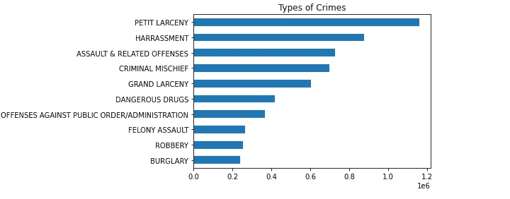

在这里，我们可以看到纽约市发生最频繁的犯罪事件是“小盗窃”，这是一种盗窃行为，被盗财产的价值一般低于 50 美元。

在纽约州有三种级别的犯罪:违规、轻罪和重罪。

从下面的图表中，我可以看出轻罪是最受欢迎的犯罪级别，轻罪的刑期可能超过 15 天，但不超过一年。第二种常见的是重罪，是最严重的违法行为，第三种是违反，是较轻的违法行为，刑期不超过 15 天。

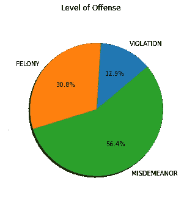

## 2.犯罪在时间上的分布

我还想知道纽约市犯罪事件的趋势。

第一张图显示了按年份、按月份、最后按一天的犯罪分布的犯罪事件。

```
df_clean['year'].value_counts().plot(kind="line", title = "Total Crime Events by Year")
```

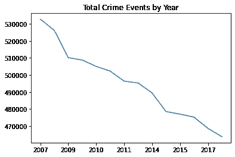

总的来说，通过查看纽约市警方记录的犯罪数量，可以看出自 2006 年以来犯罪率一直在下降。

```
df_clean.groupby('month').size().plot(kind = 'bar', title ='Total Crime Events by Month', color = '#C0392B',rot=0)
```

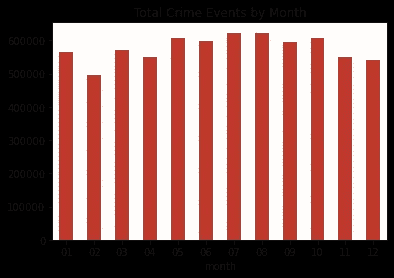

犯罪在 7 月、8 月和 10 月最多，而 2 月、11 月和 12 月似乎更安全。根据这些信息，有可能假设温度和犯罪之间存在正相关关系。

```
df_clean.groupby('time').size().plot(kind = 'bar', title ='Total Crime Events by Day', color = '#E67E22', xlabel = 'hours',rot=0)
```

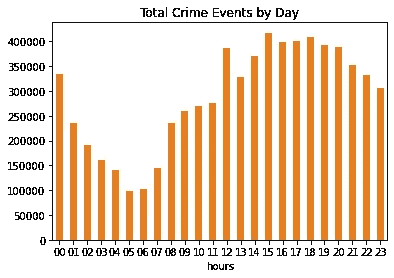

我们可以知道一天中最不容易发生犯罪的时间是早上 5 点，但更有可能发生在晚上 12 点到 6 点之间。

## 3.每个行政区的犯罪分布

```
df_clean['BORO_NM'].value_counts().sort_values().plot(kind="barh", color = '#1ABC9C', title = 'Total of Crime Events by Borough')
```

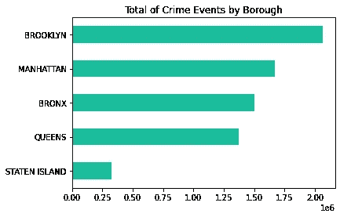

根据这一可视化，布鲁克林的犯罪事件总数最高，有超过 200 万份报告。

## 4.分析具体的犯罪

我想具体分析一下纽约市的性犯罪。为此，我将包含犯罪描述“性犯罪”和“强奸”的数据框部分放入另一个数据框，并将其命名为“性犯罪”

```
sex_crimes = df_clean[df.OFNS_DESC.str.contains('SEX CRIMES|RAPE')]
```

*   新的数据集记录了纽约市总共 104.211 起性犯罪报告。

我们可能对这些年的数值分布感兴趣，所以我将按年份对数据进行分组，并绘制出结果。

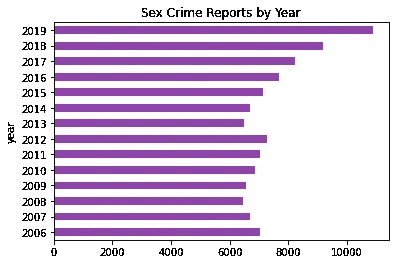

*   根据我计算的柱状图，与前几年相比，性犯罪在过去 3 年中发生得最多。
*   平均而言，纽约市每年有 7443 名强奸和性侵犯受害者。

让我们看看报告的数量在一天内是如何变化的。

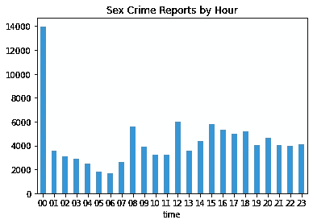

在这里，我们可以告诉你一天中最安全的时间是早上 6 点，这是纽约最不可能发生性犯罪的时间。然而，人们需要在午夜和凌晨 1 点之间更加小心。

## 分析受害者

性暴力影响了数百万人。性侵犯、家庭暴力、约会暴力或跟踪的影响可能会改变幸存者及其家人的生活。因此，我决定对纽约的性犯罪受害者做一个简要的分析。

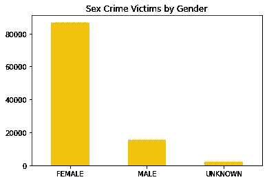

```
FEMALE                   83.20%
MALE                     14.75%
UNKNOWN                   1.93%
```

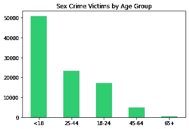

```
<18      48.85%
25-44    22.43%
18-24    16.44%
45-64     4.69%
65+       0.53%
```

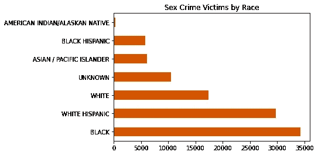

```
BLACK                             32.87%
WHITE HISPANIC                    28.59%
WHITE                             16.66%
UNKNOWN                           10.13%
ASIAN / PACIFIC ISLANDER           5.85%
BLACK HISPANIC                     5.60%
AMERICAN INDIAN/ALASKAN NATIVE     0.28%
```

**通过对受害者的这种分析，我发现了以下几点感悟:**

*   83%的受害者是女性。女性成为强奸、强奸未遂或性侵犯受害者的可能性大约是男性的四倍。
*   18 岁以下的人最容易遭到强奸/性侵犯。
*   黑人和白人西班牙裔居民经历强奸/性侵犯的可能性是其他种族的两倍。

# 结论

通过使用 Pandas，我分析并可视化了纽约市犯罪事件报告的公开数据。这个库被证明是数据分析中一个强大的工具，是一个很好的开始。
在这之后，我对研究更多与犯罪相关的数据感兴趣，并尝试不同的图书馆进行数据可视化。

感谢您的阅读！请随意检查我的 [Github](https://github.com/brunacmendes/) 的完整代码。

布鲁纳·m