# 使用 Python 分析 Garmin Watch 中的跑步活动

> 原文：<https://towardsdatascience.com/analysis-of-runing-activities-from-garmin-watch-using-python-99609f83314e?source=collection_archive---------15----------------------->

## 发现你的跑步模式

在疫情期间，我决定寻找一种新的活动，而不是当时关闭的健身房或游泳池。我从来不喜欢跑步，但对我来说，这显然是一个对 Covid 友好的选择，所以我决定尝试一下。我买了 Garmin Vivoactive 4 来跟踪我的进展，并开始了旅程。

Garmin Connect 应用程序确实提供了一些见解，如平均速度、一段时间内的心率等。但我很好奇，想自己摆弄数据，看看自己的进步。在最初几个月的跑步后，我还受过两次伤(先是左腿，然后右腿)，所以想看看数据是否能揭示这些伤的根本原因。这个项目我用的是 Python 3.8 和 Jupiter Notebook。

# 数据收集

首先，我们需要得到数据。Garmin 提供了几种方式来[访问你的数据](https://support.garmin.com/en-US/?faq=W1TvTPW8JZ6LfJSfK512Q8)。您可以将上传的活动导出为 CSV 文件或请求数据导出，Garmin 会将您所有的数据以 JSON 格式发送到您的电子邮件中(无论如何您都必须将其解析为 CSV 格式才能进行分析)。我通过“运行”类型过滤了我的活动，并将其导出:

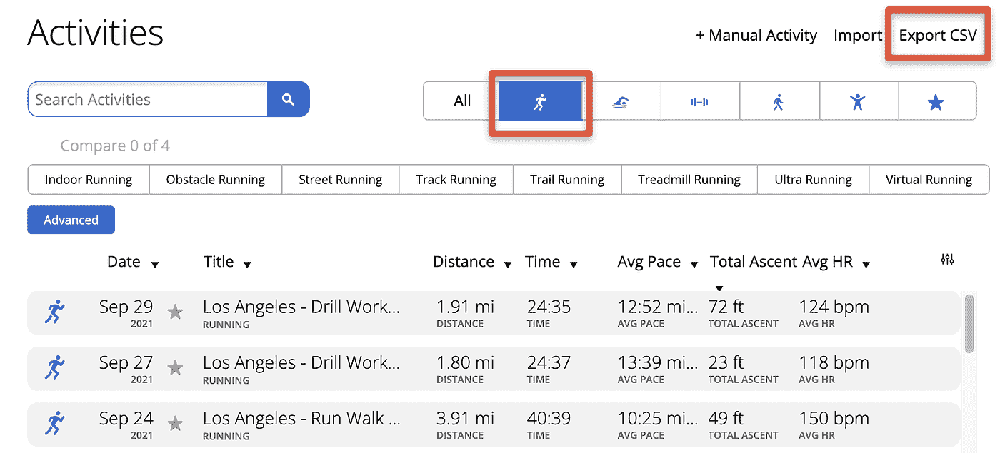

作者图片

我也使用法定测量单位，所以所有的数据都是英里。如果您更喜欢 km，您可以更改 Garmin 设置并以公制单位导出所有内容，或者稍后修改数据框中的数据。

# 数据清理

我们先来看看数据。我们需要导入 pandas 库来处理数据框:

```
import pandas as pddf = pd.read_csv('garmin/Activities.csv')df.info()
```

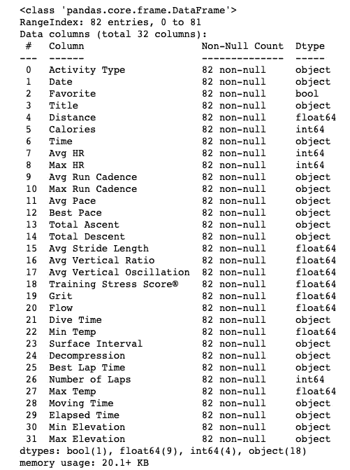

作者图片

哇，32 列！我不需要全部，所以让我们先清理一下:

0.活动类型—这必须始终“运行”,以便我们能够安全地删除它。让我们做一个快速的理智检查:

```
df['Activity Type'].describe()
```

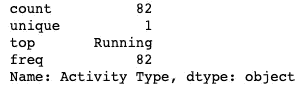

作者图片

是的，正如预测的那样，所有的活动都是“运行”类型的，删除这个列很好。

1.Date —我们肯定需要这个列，但是，数据类型是 object，而不是 datetime，所以我们将稍后修复它。

我也会用 4。距离，5。卡路里，6。时间，平均 7 小时，最大 8 小时，9 小时。平均跑步节奏，10。最大跑步步频，11。平均配速，12。最佳配速，平均步幅 15，耗时 29。

其中一些是对象类型，我们需要在以后将它们转换成 datetime 或 float64。

好了，让我们更新数据框，只保留我们要使用的列:

```
df = df[['Date', 'Distance','Calories','Avg HR','Avg Run Cadence', 'Avg Pace', 'Best Pace', 'Avg Stride Length', 'Elapsed Time']]
```

让我们将日期、平均配速、最佳配速、经过时间转换成日期时间，然后将时间转换成分钟数:

```
#convert 'Date', 'Avg Pace', 'Best Pace', 'Elapsed Time' objects to datetime formatdf['Date'] = pd.to_datetime(df['Date'])df['Avg Pace'] = pd.to_datetime(df['Avg Pace'], format='%M:%S')df['Best Pace'] = pd.to_datetime(df['Best Pace'], format='%M:%S')df['Elapsed Time'] = pd.to_datetime(df['Elapsed Time'])#convert 'Avg Pace', 'Best Pace', 'Elapced Time' objects to the number of minutesdf['Avg Pace'] = df['Avg Pace'].dt.hour*60 + df['Avg Pace'].dt.minute + df['Avg Pace'].dt.second/60df['Best Pace'] = df['Best Pace'].dt.hour*60 + df['Best Pace'].dt.minute + df['Best Pace'].dt.second/60df['Elapsed Time'] = df['Elapsed Time'].dt.hour*60 + df['Elapsed Time'].dt.minute + df['Elapsed Time'].dt.second/60
```

我更了解速度(英里/小时)而不是配速(分钟/英里)，所以将增加 2 个新列:

```
#add 'Avg Speed' and 'Best Speed' columnsdf['Avg Speed'] = 60 / df['Avg Pace']df['Best Speed'] = 60 / df['Best Pace']
```

最后，让我们将对象类型的其余列转换为 float64:

```
s = df.select_dtypes(include=’object’).columnsdf[s] = df[s].astype(“float”)
```

总部，我有:

值错误:无法将字符串转换为浮点数:“—”

我没想到会看到这个。让我们找出我们在哪里有' ——:

```
df[df.isin(['--']).any(axis=1)]
```

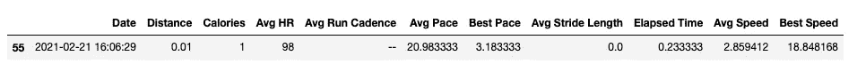

作者图片

我的数据集中有 1 个虚拟运行会话。我们可以用 NaN 代替'—':

```
import numpy as npdf.replace({'--':np.nan},  inplace=True)
```

让我们再次尝试运行我们的小代码来将对象列转换为 float64:

```
#convert remaining columns of object type to float64s = df.select_dtypes(include='object').columnsdf[s] = df[s].astype("float")df.info()
```

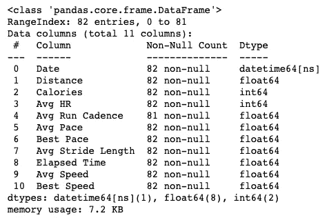

作者图片

终于成功了！最后看一下数据:

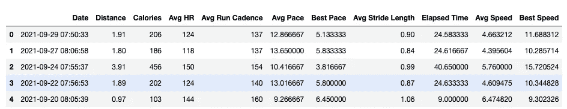

作者图片

# 数据分析

我将使用 seaborn 和 Matplotlib Pyplot 库来可视化我的数据。让我们从心跳分布的简单直方图开始:

```
import seaborn as snsimport matplotlib.pyplot as pltplt.figure(figsize=(14,6))sns.histplot(data = df, x='Avg HR').set(title = 'Average HR Distribution')
```

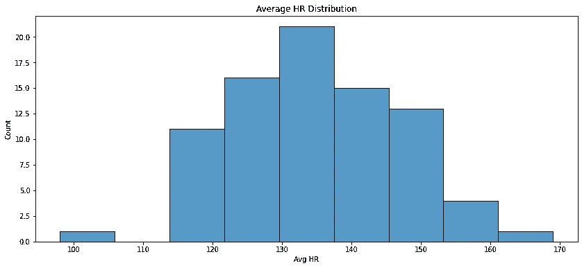

作者图片

心跳分布在我看来很正常(:


塞巴斯蒂安·劳贝在 [Unsplash](https://unsplash.com/?utm_source=unsplash&utm_medium=referral&utm_content=creditCopyText) 上的照片

运行期间最有可能的值是大约 135 BPM。

只有两种方法可以提高你的跑步速度:你可以增加你的步频(每分钟的步数)或者步幅。我们去看看。

首先是节奏:

```
sns.jointplot(x='Avg Speed',y='Avg Run Cadence', data=df.dropna(),kind='scatter')print("The correlation coefficient between cadence and speed:", df['Avg Speed'].corr(df['Avg Run Cadence']))
```

*节奏与速度的相关系数:0.7879793392063*

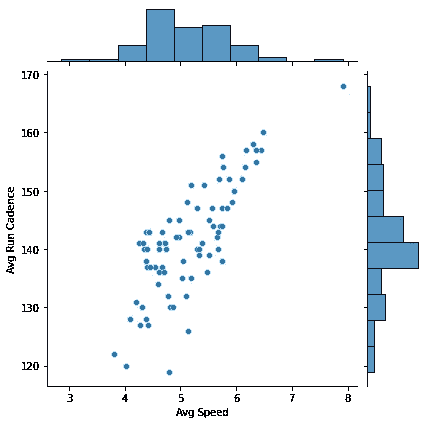

作者图片

对于步幅长度:

*步幅与速度的相关系数:0.792976223204663*

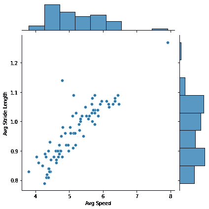

作者图片

节奏和步幅与速度有很强的相关性。我可以同时增加步频和步幅吗？让我们来看看:

*步幅与跑步节奏的相关系数:0.4213359685994146*

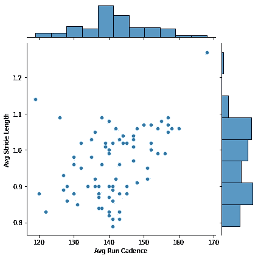

作者图片

在我的例子中，步频和步幅之间的相关性要弱得多。至少还是正面的。比较一年内的数据会很有趣。

让我们仔细看看速度。我想将它按月分组，并绘制每月的箱线图:

```
plt.figure(figsize=(14,6))#add extra column with month for every running sessiondf['Month'] = df['Date'].dt.strftime('%b') + " " + df['Date'].dt.strftime('%Y')#sort datataset by date in ascending orderdf.sort_values(by='Date', inplace=True)#plot boxplots grouped by monthsns.boxplot(x='Month',y='Avg Speed', palette=["m", "g"], data=df.dropna()).set(title = 'Avg Speed by Month')
```

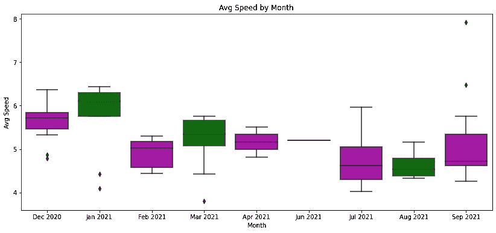

作者图片

有意思。前 2 个月(2020 年 12 月和 2021 年 1 月)是我最快的几个月。我在二月份左腿受伤时放慢了速度，然后我想我恢复了，在四月份右腿受伤。五月和七月几乎没有跑步，七月我开始谨慎锻炼。我的中值速度仍然低于 1 月份，但你可以看到 9 月份我的最大速度的离群值(那是因为我参加了 5K 比赛)。

让我们用节奏和步幅做同样的练习:

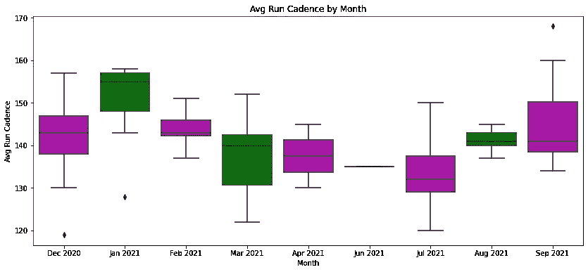

作者图片

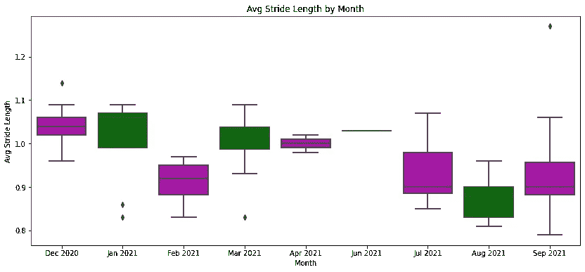

作者图片

这里有一些模式。受伤后，我在 7 月份开始慢慢增加步频，而我的步幅基本保持在同一水平。这正是我想要达到的目标:增加你的节奏是一种压力小得多的提高速度的方法，我现在想放松一下！

我还想知道现在我每周跑步的次数，以及它与我的平均速度之间的关系。

首先，让我们创建一个新的数据集，并按周对数据进行分组。我还将创建“计数”列来计算每周的会议次数:

```
df['Count'] = 1#aggregate data by weekdfW = df.groupby(pd.Grouper(key='Date',freq='W')).agg({'Count':'sum','Distance':'sum', 'Calories':'sum','Avg HR':'mean','Avg Run Cadence':'mean', 'Avg Speed':'mean','Best Speed':'mean', 'Avg Pace':'mean', 'Best Pace':'mean', 'Avg Stride Length':'mean', 'Elapsed Time':'mean'}).reset_index()dfM.head()
```

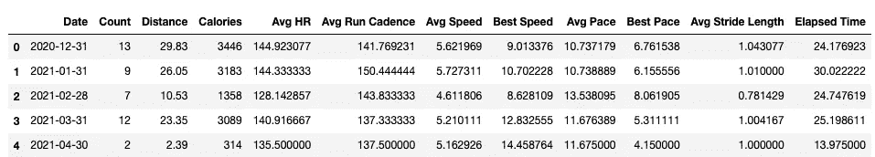

作者图片

现在，我将展示每周的会议次数与我的平均速度:

```
# create figure and axis objects with subplots()fig,ax = plt.subplots(figsize=(14,6))# make a barplotcount = ax.bar(dfW['Date'], dfW['Count'],width=10, color='red',label='Number of Runs')ax.bar_label(count)# set x-axis labelax.set_xlabel('Date')ax.legend(loc=2)# set y-axis labelax.set_ylabel('Number of Runs',color='red')# twin object for two different y-axis on the sample plotax2=ax.twinx()# make a plot with different y-axis using second axis objectax2.plot(dfW['Date'],dfW['Avg Speed'],color='blue',marker='o',label='Average Speed')ax2.set_ylabel('Average Speed',color='blue')ax2.legend()plt.show()
```

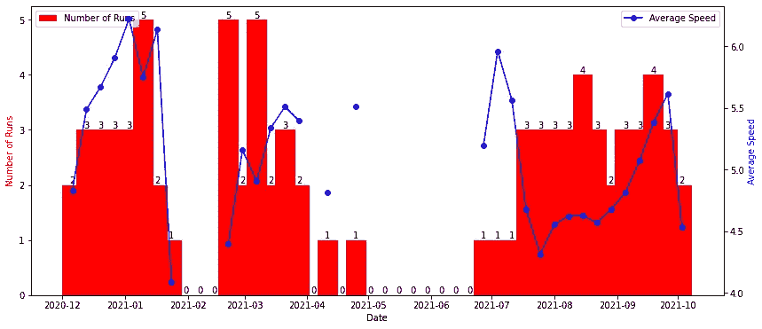

作者图片

我首先在一月份达到了每周训练次数和平均速度的最大值。我感到左腿有些不舒服。我试着减轻负荷，但是没有用，我停止了 3 周的训练。我试图在二月份以较慢的速度恢复训练，但是我的右腿受伤了，几乎完全停止了几个月。我能说什么，永远不要跳过 l̶e̶g̶休息日！

我们可以做同样的练习，但这次用步幅代替速度:

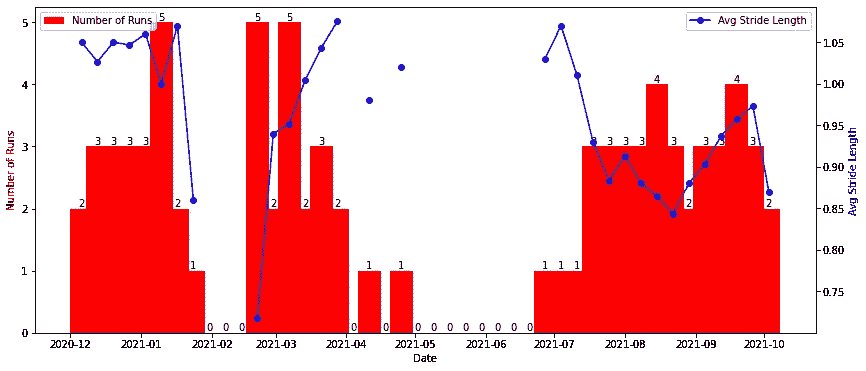

作者图片

这是有道理的，在我受伤的前几个月，我的平均步幅更高。

吸取经验教训，我现在通常每周训练 3 次，并试着专注于节奏而不是步幅。

如果你有兴趣玩代码，可以随意查看[我的 GitHub 页面](https://github.com/maxlys/running_data_analysis)。