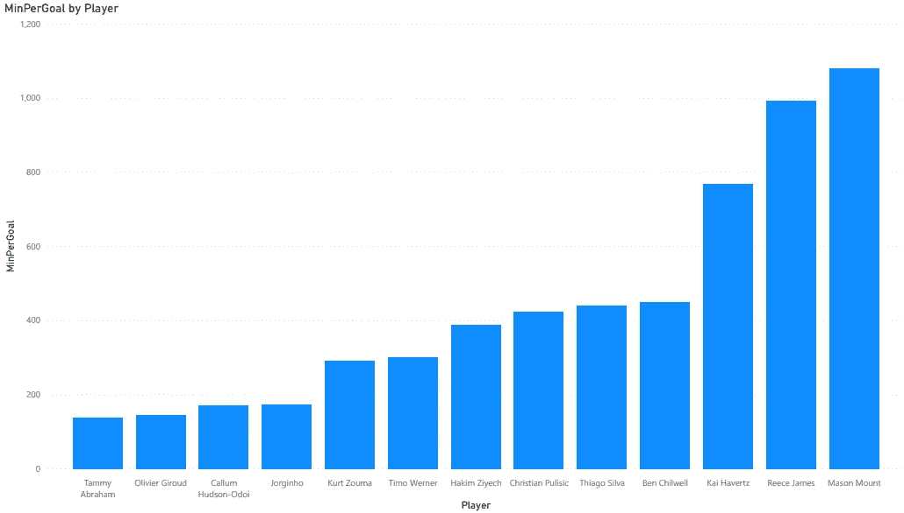

# 2020-21 英超赛季切尔西阵容分析

> 原文：<https://towardsdatascience.com/analysis-of-the-chelsea-squad-for-the-2020-21-premier-league-season-a7b38176bd41?source=collection_archive---------39----------------------->

照片由 Pixabay 上的 [ahundt](https://pixabay.com/users/ahundt-663354/) 拍摄

随着新年的开始，我们已经到达了一个不同寻常的英超赛季的“中点”。当所有球队都打了 19 场比赛时，从技术上来说，这将被视为中点(在以前的赛季中，大多数球队在新年伊始就已经打了 19 场比赛)。然而，由于新冠肺炎的原因，赛季开始的晚些时候打破了通常的循环。因此，目前，我们只进行了 16 场比赛。

由于这个新的正常中点，这将是一个伟大的时间来分析赛季至今。因此，我将利用这篇文章，用数据科学的方法来分析我所支持的俱乐部，即切尔西的联赛赛季。我用于分析的数据只有 14 场比赛的统计数据。

由[乔罗诺](https://pixabay.com/users/jorono-1966666/)在 Pixabay 上拍摄的照片

在这篇文章中，我想回答三个问题

**问:球队中表现最好和最差的射手是谁？**

**问:小队中哪些球员是最倒霉的创造者？**

**问:哪些球员的进球得分率最高？**

数据取自名为[fbref.com](https://fbref.com/)的网站。你可以在这里看一下数据[。](https://fbref.com/en/squads/cff3d9bb/Chelsea-Stats)

关于数据的一些信息:有 30 名切尔西球员的信息，有 25 个特征或指标。一些指标是预期进球(xG)、预期助攻(xA)等的统计数据。

Jannik Skorna 在 Unsplash 上的照片

**Q1。谁是球队中表现最好和最差的射手？**

拉斯·博·尼尔森在 Unsplash 上的照片

对于这个问题，我们将查看预期目标统计(或 xG)。预期目标是一名球员应该进球的数量。该数值基于各种因素，例如离球门的距离、朝向球门的角度等。例如，与从 40 码外射门相比，罚球区内的机会将具有更高的 xG。简单来说，你更有可能或被期望得分的机会，被给予更高的 xG。对于这个例子，我们将从每个球员的 xG 中取得进球的差异，我们将它称为 XGDiff。如果球员表现过度，XGDiff 将为正，这表明球员的进球比预期的多。反之，负的 XGDiff 表示玩家的得分低于预期。大多数最佳射手的 XGDiff 都是正数，或者是略低于 0 的数字。在这个问题中，我们将考虑 90 后的目标，而不是目标。这个数字的计算方法是用进球数除以上场时间和 90 的商。每 90 分钟进球数表示球员每 90 分钟的进球数。这个统计更符合逻辑，因为它更容易比较一个打了 900 分钟的球员和一个只打了 300 分钟的球员的统计。这一指标带来了一个更加公平的竞争环境，对于我们的数据集尤其有用，我们有超过 1400 分钟和低于 300 分钟的球员。因此，我们将使用每 90 个目标和每 90 个 xG 指标。我们将两者相减以得到 XGDiff。

我们可以看到卡勒姆-哈德森-奥多伊以 0.38 的成绩是整个切尔西阵容中 XGDiff 最高的。这意味着每 90 分钟，他都比预期多进 0.38 个球。

我们还可以注意到，蒂莫·韦尔纳的 XGDiff 最低，为-0.18。这意味着沃纳每 90 分钟就要比预期少进 0.18 个球。

**Q.2 阵容中最倒霉的创意球员是哪些？**

由[以赛亚·鲁斯塔德](https://unsplash.com/@isaiahrustad)在 Unsplash 上拍摄的照片

对于这个问题，我们将关注预期助攻指标。和预期进球类似，预期助攻是球员在一场比赛中应该得到的助攻数。导致投篮的传球被算作预期助攻。导致罚球区射门的传球比导致 40 码外射门的传球具有更高的 xA。所以和 XGDiff 类似，XADiff 是助攻数和预期助攻数之差。然而，与 XGDiff 相反，负的 XADiff 被认为比正的 XADiff 更好。一个消极的 XADiff 暗示一个球员正在创造高质量的机会，而不是由前锋/前锋完成。另一方面，积极的 XADiff 表明球员可能得到了他们可能不应该得到的助攻。继续早期的类比，一名球员提供了一个基本的侧身传球，导致 40 码的尖叫，他将获得助攻，但他在该传球中的预期助攻得分较低，导致 XADiff 为正。另一方面，一名球员提供了一个防守分裂传球，但没有被前锋完成，他将不会得到助攻，但会因此得到一个高的预期助攻得分，导致一个负的 XADiff。因此，负的 XADiff 被认为是优越的。理想情况下，大多数伟大的创造者会有一个正的或接近零的 XADiff，因为不是所有的助攻都是突然传中或传球。然而，这个指标让我们可以衡量谁是真正创造高质量机会的球员，而不是纯粹由于外部因素如糟糕的射门或出色的防守而获得助攻的球员。xA 的统计数据允许球队从不太可能的球队中发现未经加工的钻石，这些球队创造了高质量的机会，但纯粹是因为他们无法控制的因素而失望。

和 xG 类似，我们也用过每 90 助攻和每 90 xA。

我们可以看到，克里斯蒂安·普利西奇的 XADiff 最低，为-0.15。这意味着在每 90 分钟里，普利西克应该比现在多 0.15 次助攻。

另一方面，我们可以看到哈基姆·齐耶什的 XADiff 最高。这意味着每 90 分钟，哈基姆·齐耶什都会比预期多 0.24 次助攻。哈基姆·齐耶什可以说是目前切尔西阵容中最有创造力的球员之一，这证明了我之前的观点，即最好的创造者不会总是有一个负面的沙迪夫。这个指标的目的是了解谁是最不幸的创造者，那就是克里斯蒂安·普利西奇。

当我们比较整个切尔西阵容的 XADiff 和 XGDiff 时，我们可以收集关于一名球员正在经历的赛季类型的深刻见解。我已经用 Power Bi 绘制了每个玩家的 XADiff vs XGDiff。

**问题 3 .哪位球员的进球得分率最高？**

由 [Thomas Bormans](https://unsplash.com/@thomasbormans) 在 Unsplash 上拍摄

进球分钟比率是指球员进球所需的分钟数。这是一个非常有用的指标来计算前锋的效率。因此，大多数顶级前锋的上场时间与进球比率都很低。为了计算上场时间与进球的比率或每球上场时间，我们用上场时间除以进球得分。

因此，我们可以看到，塔米·亚伯拉罕的每球分钟数最好，其次是奥利维尔·吉鲁，分别为 138 分钟和 145 分钟。这意味着两名球员都能够在不到 2 场比赛或不到 180 分钟的时间内进球。这是一个很好的迹象，切尔西的两名前锋每球上场时间最少。然而，令人担忧的是蒂莫·韦尔纳，他每球出场时间高达 300 分钟，这表明他需要超过 3 场比赛才能进球。

然而，这些目标包括点球目标。为了真正理解前锋的致命性，我们需要考虑除了点球之外的进球。为了找到这一点，我们从目标中减去惩罚。

最后，我们用它除以分钟数，得到每个非点球进球的分钟数。

从上图中我们可以看到，数据没有太大变化，即塔米·亚伯拉罕和奥利维尔·吉鲁的每球上场时间仍然最低。然而，你会注意到若日尼奥不再被考虑，因为他所有的进球都是点球。

感谢您的阅读。我已经从[fbref.com](https://fbref.com/en/)获取了我的数据，下面的链接指向这些数据

<https://fbref.com/en/squads/cff3d9bb/Chelsea-Stats>  

如果你有兴趣了解我的分析方法，你可以看看我的 Github 资源库和这个项目的 Jupyter 笔记本。

<https://github.com/samuelvarkey/Chelsea_Analysis>  

如果你有兴趣了解更多，我建议你阅读来自 https://fbref.com/en/[的关于预期目标和助攻的文章。你可以在 LinkedIn 上联系我:](https://fbref.com/en/)

【https://www.linkedin.com/in/samuelvarkey】T4/

祝大家新年快乐。