# 情感数据分析:情感识别任务的数据集

> 原文：<https://towardsdatascience.com/analysis-of-the-emotion-data-a-dataset-for-emotion-recognition-tasks-6b8c9a5dfe57?source=collection_archive---------9----------------------->

## 包含展示六种不同情绪的推文的数据集。


[腾雅特](https://unsplash.com/@tengyart?utm_source=medium&utm_medium=referral)在 [Unsplash](https://unsplash.com?utm_source=medium&utm_medium=referral) 上拍摄的照片

> [你永远不会知道…如此多的情感我选择不向你展示](https://www.coolnsmart.com/quote-youll-just-never-knowso-many-emotions-i-17695/)

情感识别是一种常见的分类任务。例如，给定一条推文，你创建一个模型来分类这条推文是正面的还是负面的。然而，人类的情感由无数情感组成，不能仅仅局限于这三类。相反，大多数可用于此目的的数据集只包含两种极性——积极的、消极的，有时是中性的。

然而，最近，我偶然发现了一个由 Twitter 数据构建的新数据集，它似乎填补了这一空白。这个数据集，又名情绪数据集，包含了代表六种基本情绪的英语推特信息——愤怒、厌恶、恐惧、快乐、悲伤和惊讶。在本文中，我们将了解数据收集的背景，并对其进行一些探索。

# 情感分类数据集

情感数据集来自 Saravia 等人的论文[*CARER:Contextualized effect Representations for Emotion Recognition*](https://aclanthology.org/D18-1404.pdf)。作者构建了一组标签，从 Twitter API 中收集独立的英语推文数据集，这些推文属于八种基本情感，包括愤怒、预期、厌恶、恐惧、快乐、悲伤、惊讶和信任。数据已经根据他们论文中描述的方法进行了预处理。数据集被存储为 pandas 数据帧，并准备在 NLP 管道中使用。下面提供了每种情绪的数据分布和标签示例列表。

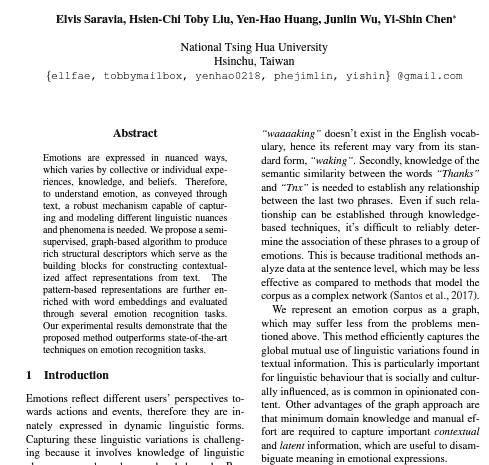

来源:[https://aclanthology.org/D18-1404/](https://aclanthology.org/D18-1404/)

# 访问数据集

我们已经看到了数据集。现在让我们看看如何访问它。我将演示加载和使用数据集的两种方法。

## 1.直接从数据源加载数据

数据集已经可以作为[熊猫数据框架](https://github.com/dair-ai/emotion_dataset/blob/master/README.md)使用。有一个附带的[笔记本](https://colab.research.google.com/drive/1nwCE6b9PXIKhv2hvbqf1oZKIGkXMTi1X#scrollTo=t23zHggkEpc-)展示了如何使用它来微调一个预先训练好的语言模型进行情感分类。可以通过以下方式轻松访问它:

我们来看几个数据的统计。

```
data.head()
```

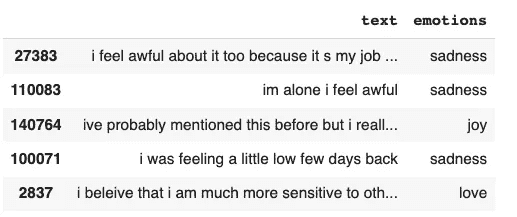

数据集|图像的前几行(按作者)

我们可以找到包含 tweets 及其相应标签的数据集的前五行。从这里，我们可以将数据集分成测试集和验证集，并训练情感分类器。做一些探索性的文本分析来理解数据也是一个好主意。我们一会儿就会谈到这个问题，但在此之前，让我向您展示另一种加载数据集的方法。

## 2.从[拥抱脸](https://huggingface.co/datasets)下载数据🤗[数据集中枢](https://huggingface.co/datasets)。

拥抱脸数据集库提供 API 下载公共数据集和预处理很容易。你可以参考这个关于 Huggingface 数据集的[视频来开始。](https://www.youtube.com/watch?v=_BZearw7f0w&t=16s)

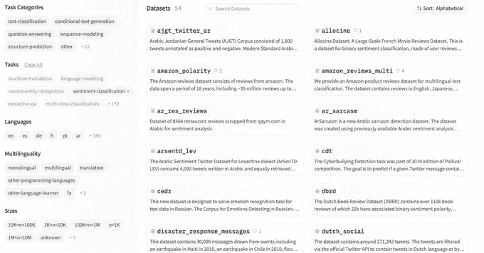

[HuggingFace datasets Hub 主页](https://huggingface.co/datasets) |来源:hugging face 网站

我们将首先下载数据集库并导入必要的模块

```
!pip install datasets
from datasets import load_dataset

emotion_dataset = load_dataset("emotion")
```

这将创建一个 emotion_dataset 对象。

```
emotion_dataset
```

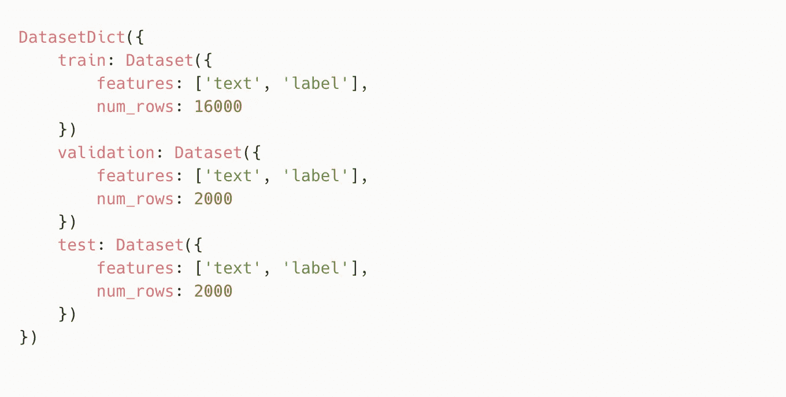

情感 _ 数据集对象|作者图片

我们得到的是一个字典，每个键对应一个不同的拆分。让我们访问培训数据以查看其内容。

```
emotion_train = emotion_dataset['train']
print(emotion_train[0])
print(emotion_train.column_names)
print(emotion_train.features)
```

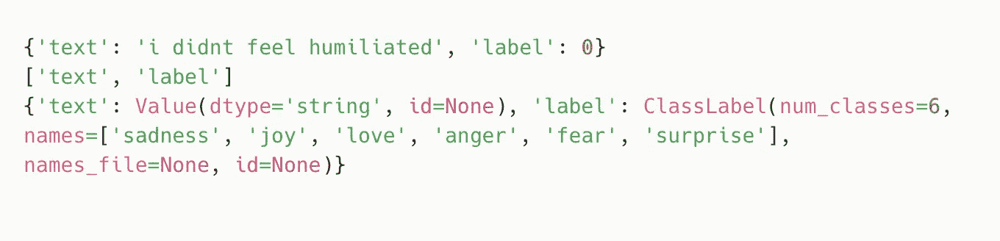

训练数据集|按作者分类的图像

训练数据集包括六个不同的类别——悲伤、快乐、爱、愤怒、恐惧和惊讶。

**将情感数据集转换成熊猫数据帧**

我们现在可以很容易地将上述数据集转换成熊猫数据框架，并对其进行进一步分析。

```
import pandas as pdemotion_dataset.set_format(type="pandas")
train = emotion_dataset["train"][:]
test = emotion_dataset["test"][:]
val = emotion_dataset["validation"][:]
```

让我们快速检查一下转换是否成功。

```
train.head()
```

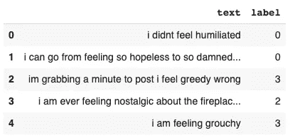

训练数据集|作者图片的前几行

是的，的确！现在您知道如何从 Huggingface 数据集中心访问数据集了，这是您的数据科学技能的又一项提高。那么当你有了数据后你会怎么做呢？你探索它，这正是我们在下一节要做的。

# 情感数据集的探索性数据分析

我们将从导入必要的库和可视化数据开始。正如我们已经知道的，数据已经过预处理，所以这是一个额外的收获。我们通常会从数据集和推文长度的不平衡入手。除此之外，请随意深入研究。

**笔记本跟随一起:** [**情感数据集的探索性数据分析**](https://www.kaggle.com/parulpandey/exploratory-data-analysis-of-the-emotion-dataset)

## 创建带有标签名称的列。

标签列当前有个整数。为了更容易理解，我们将创建一个名为`description`的新列，包含标签列中每个整数的描述。

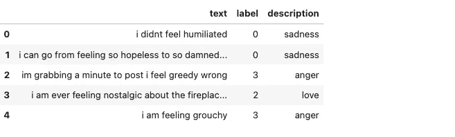

作者图片

## 描述列的分析

现在，我们来分析一下`description`列是什么样子的。我只使用了训练数据集，但如果我们希望对测试数据集也这样做，过程将保持不变。

**每种情绪的例子**

让我们来看看每种情绪的例子。

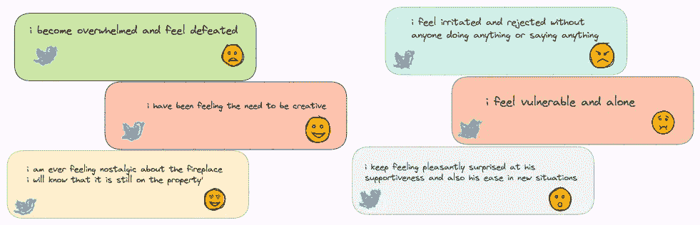

按情绪分类的各种推文示例|按作者分类的图片

## 训练集中标签的分布

看看标签的分布会很有帮助。这也将让我们了解数据集中的不平衡，如果有的话。

```
train['description'].value_counts(normalize=True)
```

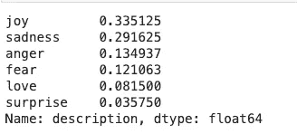

```
sns.countplot(train['description'],order = train['description'].value_counts(normalize=True).index)
```

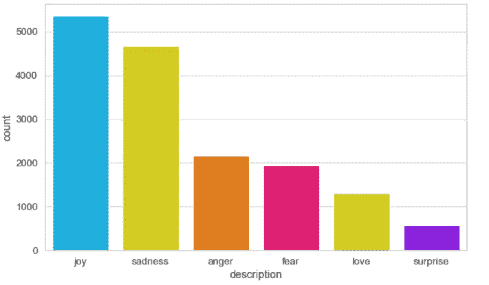

数据集|图像中目标列的分布(按作者)

大约 33%的推文是快乐的，其次是悲伤和愤怒的推文。

## 分析文本统计

我们现在可以做一些统计分析来探索文本数据的基本特征。一些有用的分析如下:

*   **文本长度分析**:计算文本的长度
*   **词频分析**:计算单字、双字和三元字的字数。

```
train['text_length'] = train['text'].astype(str).apply(len)
train['text_word_count'] = train['text'].apply(lambda x: len(str(x).split()))
```

**推文长度分析**

```
sns.distplot(train['text_length'])
plt.xlim([0, 512]);
plt.xlabel('Text Length');
```

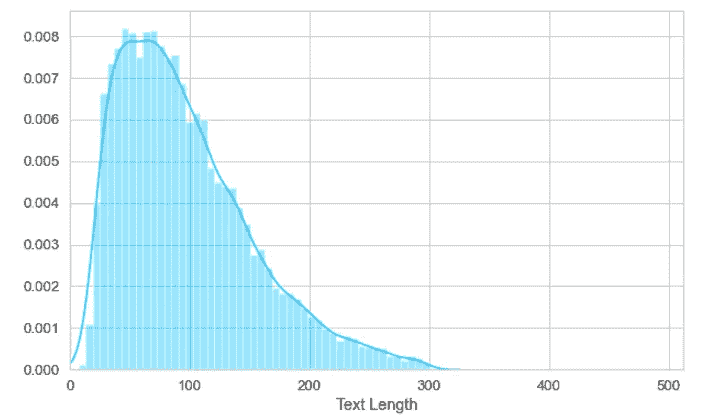

推文长度分析|作者图片

上面的直方图显示，推文的长度从 2 到 300 个字符不等。

## 推文字数分析

现在让我们来分析每类推文的词频。

```
sns.boxplot(x="description", y="text_word_count", data=train)
```

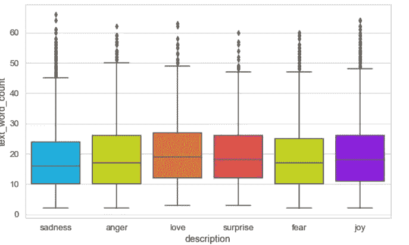

推文字数分析|作者图片

大部分推文平均 15 个字。此外，所有推文的长度似乎都差不多。因此，推文的长度并不是极性的有力指标。

## 顶级 n-grams 的分布

[一个 ***n* -gram** 是来自给定文本或语音样本](https://en.wikipedia.org/wiki/N-gram)的 *n* 项的连续序列。查看各种 n 元语法来了解哪些单词主要一起出现也是一个好主意。例如，我们观察单字母词、双字母词和三字母词在各种情绪——悲伤、愤怒和爱——中的分布。

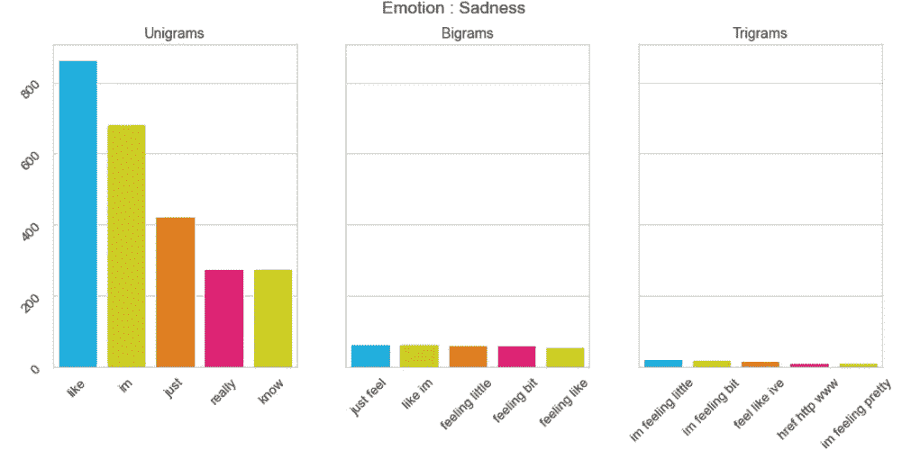

悲伤类推文|作者图片

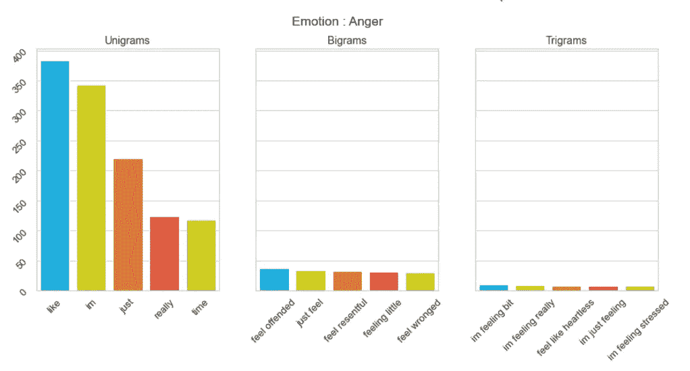

愤怒类别的推文|作者图片

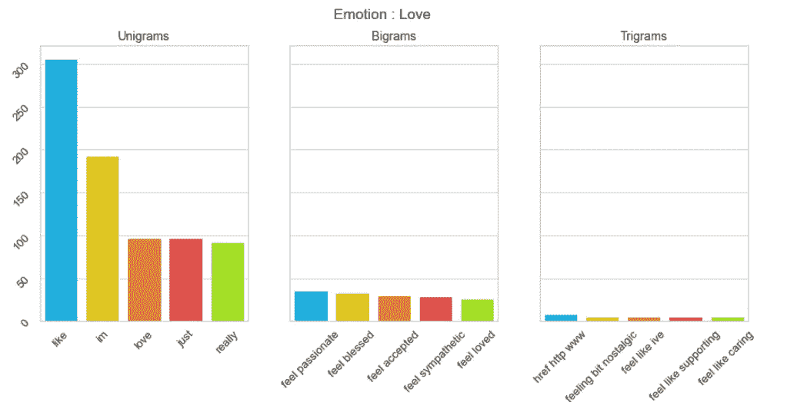

来自“爱情”类别的推文|作者图片

# 接下来呢？

既然我们已经对数据集做了一些初步的探索，接下来就是使用这个数据集来创建一个情感分类器。这可能是一个很好的项目，可以添加到你的简历中，你也可以与社区分享你训练过的模型。如果你想快速旋转笔记本来浏览数据，我现在已经在 [Kaggle](https://www.kaggle.com/parulpandey/emotion-dataset) 上提供了。

[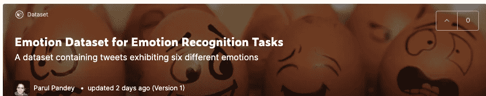](https://www.kaggle.com/parulpandey/emotion-dataset)

https://www.kaggle.com/parulpandey/emotion-dataset