# 印度学校制度分析

> 原文：<https://towardsdatascience.com/analysis-of-the-indian-education-system-388f7ad8c68f?source=collection_archive---------15----------------------->

## 教育空间中若干因素的不同状态比较

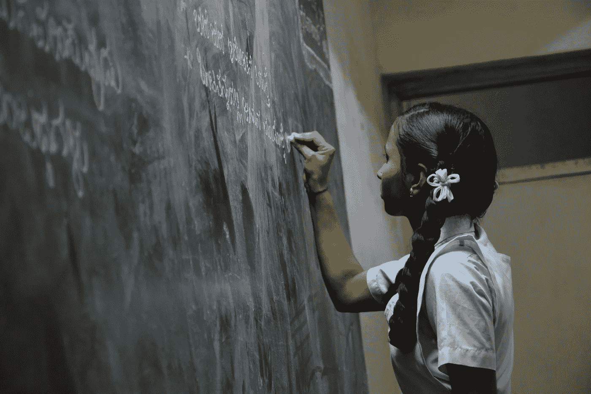

[来源](https://unsplash.com/photos/NsPDiPFTp4c?utm_source=unsplash&utm_medium=referral&utm_content=creditShareLink)

# 背景

印度是文化、传统和价值观的大熔炉。这个拥有 10 多亿人口的次大陆拥有 36 个邦和联邦直辖区的公民。教育质量不仅受到不同教育委员会的影响，还受到不同的普遍社会经济因素的影响。

我在一个安静的小镇上一所美丽的基督教兄弟学校长大。完成学业后，我在印度的几个不同地方呆过，这让我接触到了不同的背景和不同的教育实践。

正如任何问题都可以通过在基层工作得到最有效的解决一样，我相信，一个国家可以通过改善未来领导人学习的学校来实现可持续和稳定的发展。

# 介绍

在这个项目中，我比较了各邦的以下因素，以了解印度教育系统中普遍存在的差距:

*   女孩和男孩的辍学率
*   学校不同部门的辍学率
*   女孩和男孩的入学率
*   学校不同部门的入学率
*   学生与教师的比率
*   存在不同的因素，如电力、男女厕所等。

小学:一至五年级
高级小学:六至八年级
中学:九至十年级
高级中学:XI 至十二年级

# 分析

## 辍学率和入学率

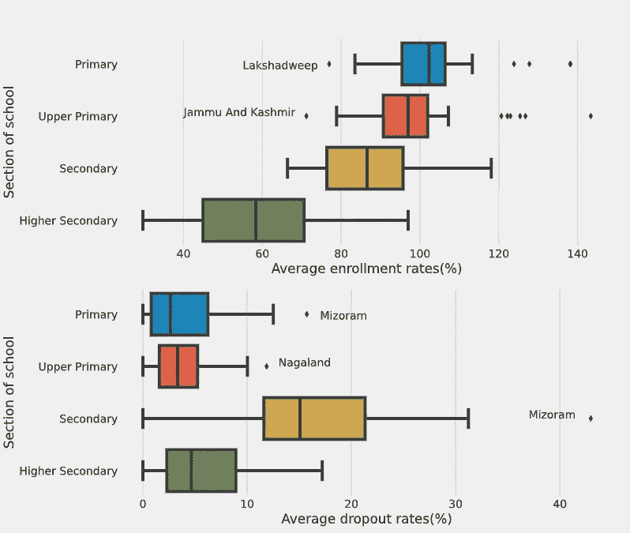

作者图片

**观察:**

*   随着我们进入学校更高的部分，入学率下降，高中入学率从小学的 100%以上急剧下降到 60%。
*   与其他邦相比，两个中央直辖区----拉克沙威和查谟-克什米尔----的早期教育入学率特别低。
*   辍学率最高的是中学，而不是高中，因为入学率已经很低了。

85%的中学注册学生中约有 15%辍学。这导致只有 72%的学生留在 x 班。这成为他们的最高学历。

但是，把它看成点估计是不对的。相反，我们应该把它看作一个范围估计:它大多在 60%到 83%之间。它根据州的不同变化很大。

*   我们还需要检查性别是否是入学和辍学的一个因素。

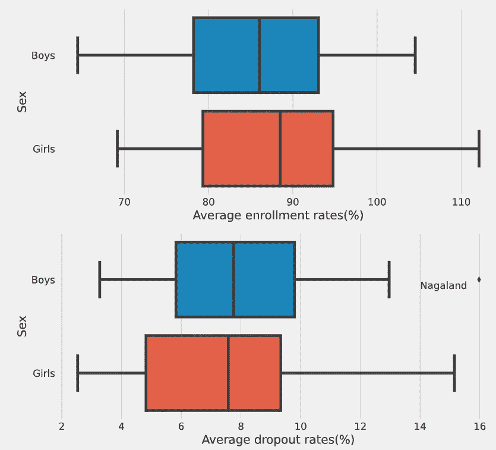

作者图片

**观察:**

*   男孩的入学率较低，辍学率较高

在印度农村，父母一让他们的男孩到了可以挣钱的年龄就去工作，带些钱回家。这可能是男生辍学率略高的原因。还有，也许父母不愿意教育女孩，而是把她们嫁出去。值得注意的是，女孩的辍学率高于男孩。因此，即使男孩的辍学率更高，女孩的辍学率也会受到异常值的影响。

## 学校不同部门的学生与教师比例

**观察:**

*   学生与教师的比例最高的是高中。
*   中学也缺乏教师。合格教师的缺乏可能是因为学校无法用微薄的工资吸引合格的候选人。
*   像北方邦、比哈尔邦、恰尔肯德邦和 WB 邦在这方面做得很差。

学生在中学受到的关注较少。这种情况在高中阶段更加严重。这些是导致初中和高中辍学率较高的重要因素。

# 总体情况

## 学校教育中的不同因素

**观察:**

*   超过 50%的州至少有 92%的学校有饮用水
*   与电力相比，更多的学校有饮用水
*   拥有计算机设施的学校比例很低
*   与男生厕所相比，有女生厕所的学校比例更高

**学校各科不同因素对比:**

出现在学校不同部分的特征的平均百分比:

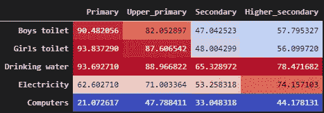

**观察:**

从小学高年级到中学，厕所数量急剧减少，但饮用水供应却没有减少多少。也许学校没有建立卫生厕所的基础设施。厕所里没有水可能是一个原因。

同样令人惊讶的是，中学的电力供应最低。另外，请注意，在小学高年级和高中阶段，计算机的比例有所下降。

农村地区的大多数学校只有教到中学(十年级)的设施。在这些上层阶级中，学校缺乏良好的设施。学生辍学去找工作使情况更加恶化。因此，没有足够的需求来改善这些学校的中学部分的条件。

# 假设检验

我们对数据进行了探索性分析。通过假设检验，我们可以得到结论性的结果。

## 拒绝传统社会的人

**性**

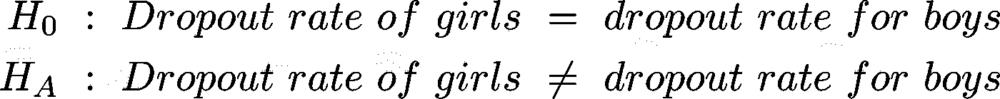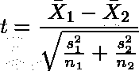

我们进行 t 检验以获得:

t，p = (-0.9810354738258853，0.3282807268)

因此，我们不能拒绝 Ho。

女孩和男孩的辍学率没有什么不同。

**学校的部门**

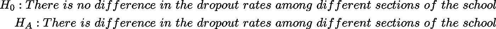

我们进行 ANOVA 测试以获得:

f 统计=45.282，p=0.000

因此我们拒绝 Ho。

学校不同部门之间的辍学率有很大差异。

## 注册

**性**

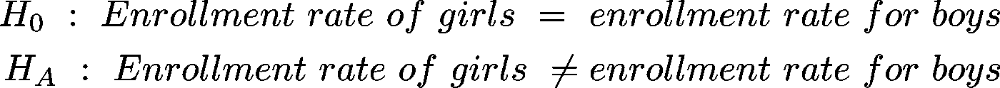

我们进行 t 检验以获得:

t，p = (0.8775733057976992，0.384163598124)

因此，我们不能拒绝 Ho。

女孩和男孩的入学率没有差别。

**学校的部门**

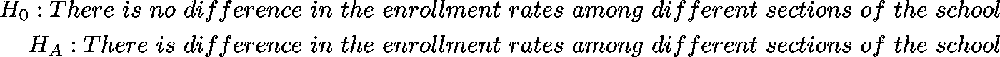

我们进行方差分析测试以获得:

f 统计=58.335，p=0.000

因此我们拒绝 Ho。

学校不同部门的入学率有很大差异。

## 学生与教师的比率

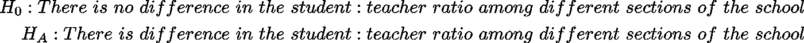

我们进行方差分析测试以获得:

f 统计=12.850，p=0.000

因此我们拒绝 Ho。

学校不同部门的学生与教师的比例有很大差异。

## 其他因素

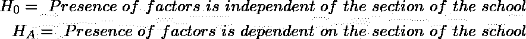

我们做了χ2 检验，以评估学校和不同因素的存在之间的独立性。

χ2 检验的结果:

在 12 个自由度上 p = 0.0054。

因此我们拒绝 Ho。

不同因素的存在取决于学校的区域。

## 假设检验概述

*   男孩和女孩的辍学率和入学率没有差别。
*   学校不同部门的辍学率和入学率不同。
*   学生与教师的比例在学校的不同部门是不同的。
*   不同因素的存在取决于学校的各个部门。

# 可视化状态性能

我们可以将数据可视化到 3D。我做了主成分分析来找出解释最大方差的成分。这样，我们可以缩小维度，同时合并来自更高维度的数据。

进行 PCA 的检验统计量:
KMO 统计量:0.61
p(Bartlett 球形度检验):0

让我们找到这些更广泛的特征。
三个主要成分的因子载荷:

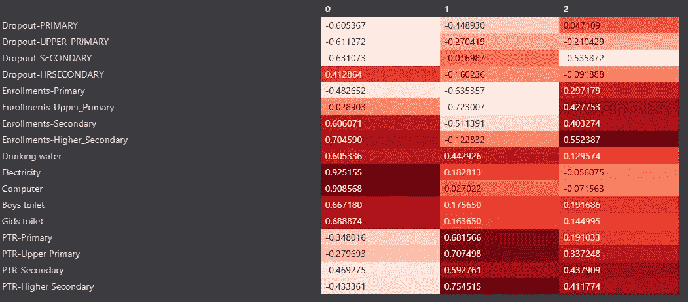

观察结果:

*   PC1 解释了学校中不同因素的存在
*   PC2 解释了学校不同部门的师生比例
*   PC3 解释了学校不同部门的入学情况(以及间接的辍学情况)

这三个因素被用来创建非等级聚类。用 3 个聚类(这里 0=2)获得最大轮廓分数。

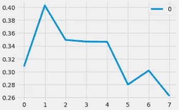

可视化集群:

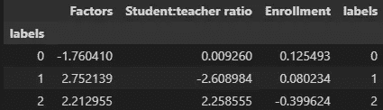

不同聚类的平均值

*解读*

集群 0: *失败者*
缺乏因素；生师比低，升学率高，这两点都值得称道。
这一组州具有最大的潜力，我们应该首先关注改善这一组中学校的因素。

集群 1: *特权阶层*
要素存在率高，学生:教师比率最低。尽管有一些有利因素，这个群体的入学率并不是最高的。当我们看辍学与入学散点图时，这一点就变得很清楚了。这些州的辍学率远远高于平均水平。这可能是由于社会政治、文化和其他原因造成的，这些原因没有被学校系统的特点所解释。

群组 2: *缺席教师* 在这个群组中，学生与教师的比率非常高，这反映在最低的入学率上。我们需要为这个集群中的学校配备教师。

# 结论

造成各州教育部门绩效差异的主要因素有:

*   中学辍学者
*   高中入学率
*   学校里有电和电脑

# 进一步研究

下一个大的创业公司被认为是教育公司。我相信他们会改进现有的基础设施，而不是营销新产品。根据帕累托原则，80%的收益来自于关注 20%的问题。需要弥补中学阶段的差距。**我们需要努力降低中学的辍学率。**

# 行动呼吁

*   第三集群各州人员配备合格教师:
    *具体要求:*
    1。政府必须缩小公立和私立学校之间的薪酬差距来吸引人才。
    2。应该允许教育部门中为资金不足的学校配备人员的主要非政府组织将其研究员/实习生转为长期职位。
    3。许多工程师失业了。他们学了很多数学和科学。他们可以被重新训练成为熟练的教师。
    *可衡量的目标:*

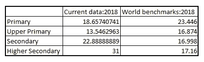

印度与世界的学生:教师比率

印度的学生与教师的比例在中学应该达到 19，在高中应该达到 23。

*假设时间框架:* 3 年。

*   教师是确保学习成果的最重要的因素。教学质量需要评估。
    *具体要求:*
    如[此处](https://www.worldbank.org/en/topic/teachers#2)所述，必须按照全球标准建立新的指标。
    *可衡量的目标:* [教](https://www.worldbank.org/en/topic/education/brief/teach-helping-countries-track-and-improve-teaching-quality)
    *假设时间框架:3 年*
*   通过确保第一组的电力供应，改善学校设施。
    *具体要求:* 提高学校用电比例
    *可衡量目标:*

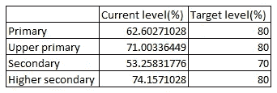

*假设时间框架:3 年*

这些任务并不简单，需要在城镇和农村地区的基层做大量的工作。

*   通过与这些州(主要是东北部各州)的教师和家长进行有针对性的小组讨论，了解是什么导致了第二组的高辍学率。

# 数据

<https://www.kaggle.com/aman139/indian-school-education-data>  

MHRD 数据:[https://www . education . gov . in/sites/upload _ files/mhrd/files/statistics-new/ESAG-2018 . pdf](https://www.education.gov.in/sites/upload_files/mhrd/files/statistics-new/ESAG-2018.pdf)

*其他参考:*

[https://www . India today . in/education-today/news/story/15-initiatives-taked-by-central-government-to-improve-teaching-standards-in-India-HRD-minister-1556357-2019-06-26](https://www.indiatoday.in/education-today/news/story/15-initiatives-taken-by-central-government-to-improve-teaching-standards-in-india-hrd-minister-1556357-2019-06-26)

*全球基准:*

  <https://data.worldbank.org/indicator/SE.SEC.ENRL.LO.TC.ZS>  <https://data.worldbank.org/indicator/SE.SEC.ENRL.TC.ZS>  <https://data.worldbank.org/indicator/SE.SEC.ENRL.UP.TC.ZS> 