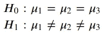
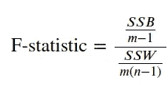

# 用 Python 进行方差分析——ANOVA

> 原文：<https://towardsdatascience.com/analysis-of-variance-anova-8dc889d2fc3a?source=collection_archive---------19----------------------->

## 用 Python 实现大学统计

# 介绍

在一系列的每周文章中，我将会涉及一些重要的统计学主题。

目标是使用 Python 来帮助我们获得对复杂概念的直觉，从经验上测试理论证明，或者从零开始构建算法。在本系列中，您将会看到涵盖随机变量、抽样分布、置信区间、显著性检验等主题的文章。

在每篇文章的最后，你可以找到练习来测试你的知识。解决方案将在下周的文章中分享。

迄今发表的文章:

*   [伯努利和二项随机变量与 Python](/bernoulli-and-binomial-random-variables-d0698288dd36)
*   [用 Python 从二项式到几何和泊松随机变量](/geometric-and-poisson-random-variables-with-python-e5dcb63d6b55)
*   [用 Python 实现样本比例的抽样分布](/sampling-distributions-with-python-f5a5f268f636)
*   [Python 的置信区间](/confidence-intervals-with-python-bfa28ebb81c)
*   [使用 Python 进行显著性测试](/significance-or-hypothesis-tests-with-python-7ed35e9ac9b6)
*   [用 Python 进行组间差异的双样本推断](/two-sample-inference-for-the-difference-between-groups-with-python-de91fbee32f9)
*   [分类数据的推断](/inference-for-categorical-data-9f3c6034aa57)
*   [高级回归](/advanced-regression-f74090014f3)
*   [方差分析— ANOVA](/analysis-of-variance-anova-8dc889d2fc3a)

像往常一样，代码可以在我的 [GitHub](https://github.com/luisroque/College_Statistics_with_Python) 上找到。

# 逐步方差分析

我们再一次用数据科学家的薪水工作。在这种情况下，我们对基于一些独立特征预测工资不感兴趣。我们重点了解具有不同背景的 3 组数据科学家的平均工资是否存在差异:第一组是来自计算机科学专业毕业生的样本，第二组是经济学专业毕业生的样本，第三组是信息工程专业毕业生的样本(请注意，工资单位是 10，000€)。


图 1:数据科学是结合了领域专业知识、编程技能以及数学和统计知识的研究领域，用于从数据中提取有意义的见解；[来源](https://unsplash.com/photos/AxAPuIRWHGk)

```
import pandas as pd
import numpy as np
from scipy.stats import fdf = pd.DataFrame.from_dict({'g1': [5,9,10,12,8,8,9], 
                        'g2': [5,4, 4, 5,5,4,8], 
                        'g3': [9,8, 5, 6,7,7,6]})

df
```


表 1:不同背景的 3 组数据科学家的万人薪酬。

执行 ANOVA 测试的第一步是计算 SST(总平方和)、SSW(总内平方和)、SSB(总间平方和)以及相应的自由度。他们计算如下:

*   SST 是每个数据点和数据集平均值之间的平方距离之和。在这种情况下，自由度是组数 *m* 乘以每组中数据点数 *n* ，然后我们减去 1，即 m**n-1。**
*   SSW 是每个数据点和相应组平均值之间的平方距离之和。自由度是组数乘以数据点数减 1，即 m**(n-1)。**
*   **SSB 是每个组平均值和每个数据点的数据集平均值之间的平方距离之和。自由度是组数减 1，即 m -1。**

```
m = df.shape[1]
n = df.shape[0]SST = np.sum(np.sum((df - np.mean(np.mean(df)))**2))
SST98.57142857142858df_sst = m*n-1
df_sst20SSW = np.sum(np.sum((df - np.mean(df))**2))
SSW50.28571428571429df_ssw = m*(n-1)
df_ssw18SSB = np.sum(np.sum((np.tile(np.mean(df), (3,1)) - np.mean(np.mean(df)))**2))
SSB20.6938775510204df_ssb = m-1
df_ssb2
```

# **假设检验**

**让我们定义我们的假设检验。我们的零假设是背景没有影响的情况。相比之下，我们的另一个假设是，背景会影响数据科学家的薪酬。**

****

**像往常一样，我们将假设我们的零假设是正确的，并计算出得到一个极端统计数据或比我们从观察到的数据得到的数据更极端的概率。为此，我们将使用 F 统计量，它基本上是两个卡方统计量的比率。它实际上是上面计算的两个指标除以各自自由度的比率:**

****

**这个想法是，如果分子明显大于分母，这应该让我们相信，在真正的人口均值之间存在差异。相反，如果分母明显较大，则意味着与样本之间的差异相比，每个样本内的差异占总差异的百分比较大。因此，我们可以观察到的任何均值差异可能只是随机的结果。**

```
F = (SSB/df_ssb)/(SSW/df_ssw)
F3.703733766233764f.ppf(0.95, dfn=df_ssb, dfd=df_ssw)3.554557145661787
```

**现在，我们可以计算我们的 p 值。让我们使用 0.1 的显著性水平。**

```
p_value = (1 - f.cdf(F, dfn=df_ssb, dfd=df_ssw))*2
p_value0.08991458167840971if p_value<0.1:
    print('Reject H_0')
else:
    print('Accept H_0')Reject H_0
```

**我们看到 p 值小于显著性水平，这使我们拒绝零假设。有足够的证据来接受群体间均值的差异，这种差异并不仅仅来自于偶然或每个群体内的差异。说了这么多，我们可以得出结论，一个数据科学家的工资是不同的，取决于毕业背景。**

# **结论**

**本文介绍了方差分析(ANOVA)，这是一组比较不同组的多个平均值的方法。我们还引入了一个新的统计量，称为 F 统计量，我们用它来对我们组的均值差异进行假设检验。**

**这是“使用 Python 进行大学统计”系列的最后一篇文章我希望你喜欢它！**

**保持联系: [LinkedIn](https://www.linkedin.com/in/luisbrasroque/)**

## **上周的答案**

1.  **Márcia 收集了便携式电脑随机样本的电池寿命和价格数据。根据下面提供的数据，总体斜率为 0 的零假设的检验统计量是什么？**

```
data = {'Intercept': [200.312, 92.618],
             'Battery': [7.546,4.798]}df = pd.DataFrame.from_dict(data, columns=['Coef', 'SE Coef'], orient='index')
df
```

****

```
t = (df['Coef'][1]-0)/df['SE Coef'][1]
t1.5727386411004585
```

**2.芮随机抽取了一些同事，注意到他们的年龄和他们昨天步行的公里数成正比。回归线斜率的 95%置信区间为(15.4，155.2)。芮想用这个区间在 5%的显著性水平上检验 H_0: β=0 vs. H_1: β ≠ 0。假设推断的所有条件都已满足。芮应该得出什么结论？**

**芮应该拒绝 H_0，即数据提示年龄和昨天走的公里数成线性关系。**