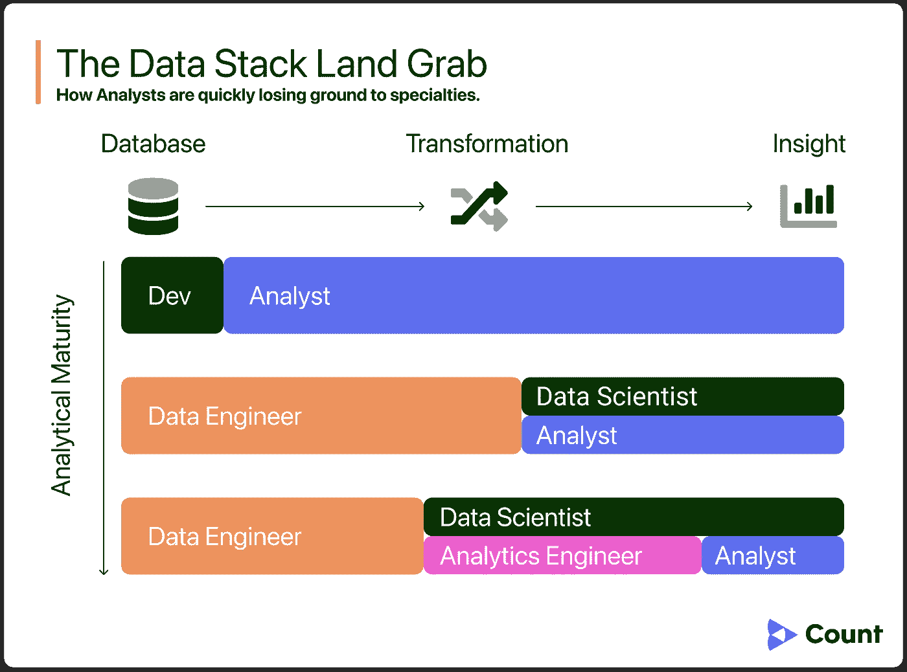
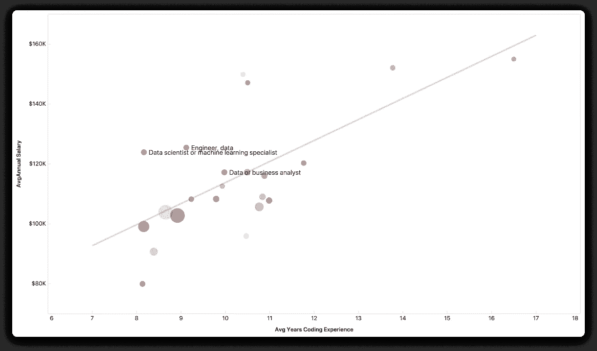
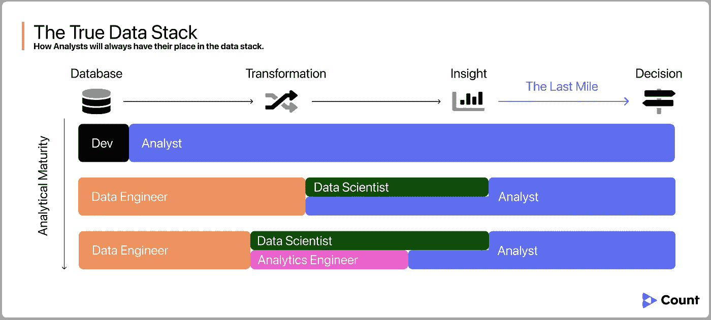

# “分析师 2.0”会是什么样子？

> 原文：<https://towardsdatascience.com/analyst-2-0-3c10daf124c8?source=collection_archive---------3----------------------->

## 最新一代分析师将改变游戏规则。

分析师从一开始就一直是我们数据团队的稳定成员，但可悲的是，近年来他们的角色和声誉一直在下降。如果我们要在新的分析时代取得成功，在这个时代，我们被期望将我们的数据转化为行动，我们必须扭转方向，重新发现谦逊的分析师的角色。

# 今日分析师

当前分析师的化身诞生于“洞察时代”。向企业交付数据的主要方式是小心地将数据打包成仪表板、图表或报告之类的东西。这是分析师的领域，一切都很顺利……有一段时间。

首先，我们的行业经历了一个高度专业化的阶段。数据管道被分割，分配给新的职位，如数据工程师，或者最近的分析工程师。曾经享有大量管道的分析师们发现自己被四面八方排挤。

图片由伯爵提供。

随着专家数据角色成为标准，纯粹的分析师在数据社区和我们的业务合作伙伴眼中的地位下降了，实际上将分析师变成了初级角色。这使得曾经稳定的业务分析师合作关系变成了建立在任务和等级制度基础上的不稳定关系。

当我在一家大公司担任数据分析师时，我们非常强烈地感觉到我们的头衔在拖累我们，以至于有一天我们都被提升为数据科学家。这是在没有任何培训的情况下完成的，没有改变我们的期望或工作方式。这纯粹是为了在我们试图影响的更广泛的企业中赢得更多的尊重和信任。

这种耻辱超越了团队动力。2020 年，数据分析师每年获得的经验比他们的数据科学或数据工程同行少[1]，消除了任何分析师对我们在这个行业中的价值的怀疑。

今天的分析师只剩下一个选择:*专业化或者死亡*。

多年的编码经验与数据专业人员(标记为其他开发人员角色)的平均工资。圆圈大小表示调查对象的数量。([分析链接](https://count.co/notebook/wow8N9ytCBX?block=9PH3jjwuK4l) ) ( [调查链接](https://insights.stackoverflow.com/survey/2020#overview))

# **利害攸关的是什么？**

值得停下来提醒我们自己为什么这是一个如此危险的最后通牒。答案是双重的:

1.  **只有当数据对业务清晰、有用且可操作时，数据堆栈才是成功的。**
2.  **从本质上讲，分析师是他们所服务的组织理解、消费和使用数据的主要方式。**

我们可能拥有一流的数据模型、超高性能的数据库，甚至是最先进的数据应用程序，但是如果没有一个分析师能够将这些信息整合到业务中，那就毫无意义。

削弱分析师的作用只会削弱数据在任何组织中的作用。

# 最后一英里

我们需要一个更大版本的分析师角色。

以前，我们认为数据堆栈的端点是输出(例如，图表、仪表板或报告)。我们越来越认识到这些媒介在更复杂的决策和解决问题中的局限性。我们必须超越“见解”，进入“行动”。

我们正在为分析工作流程的最后一步配音，从洞察到决策，“[最后一英里](/modern-data-stack-its-time-for-your-closeup-28f867cf5a81)”。如果分析师要继续成为数据堆栈向业务交付价值的方式，那么这就是他们必须称之为自己的空间。

图片由伯爵提供。

此外，如果他们想拥有这个空间，他们必须发展一套新的技能和习惯，以适应最后一英里的挑战。

# 分析师 2.0

分析师已经具备了最后一英里分析所需的许多特质，包括强大的数学基础和良好的数据沟通技能。然而，适应这片新土地需要一些关键技能:

## 1.专家翻译

在我看来，这是当今分析师最容易被忽视的技能。最成功的分析师能够无缝弥合数据和业务之间的差距。他们将数据带入业务问题的背景中，确保团队不仅能立即理解图表的内容，还能理解*对他们的意义*。他们可以轻松地将模糊的业务需求转化为上游数据需求，从而节省整个团队的返工时间。

在未来，这将不仅仅是一个天才分析师的“秘方”,而是所有分析师都认同和培养的技能。

2018 年，麦肯锡强调了这种翻译技能的必要性，建议它甚至应该成为自己的[专门]角色:

> “在他们的角色中，[分析]翻译者帮助确保通过复杂的分析产生的深刻见解转化为对组织的大规模影响。麦肯锡全球研究所估计，到 2026 年，仅美国对翻译的需求就可能达到 200 万到 400 万。- [麦肯锡](https://www.mckinsey.com/business-functions/mckinsey-analytics/our-insights/analytics-translator) (2018)

虽然我同意这种观点，但我认为未来的分析师将满足行业对有效翻译的需求。

## 2.决策促进

随着决策变得越来越复杂，我们需要越来越多的数据。查看数据来帮助决定*我该做什么*需要对我们的方法有更细致入微的理解。

看着 A/B 测试结果的仪表板，自信地说你的解释没有偏见，你不是在一个设计糟糕的实验中做决定，或者小样本量对任何人来说都几乎是不可能的，更不用说一个时间紧迫的高管了。(这篇[网飞系列](https://netflixtechblog.com/building-confidence-in-a-decision-8705834e6fd8)的文章是一个很好的例子，说明了这可能是如何工作的。)

分析师处于独特的地位，可以专业地帮助*指导*在这些复杂的决策中使用数据。这意味着他们将对组织内数据的使用负责任和合乎道德——目前这还是一个方便的无人区。

这些讨论不仅促进了数据使用的改进，还促进了数据使用的更加可信——如果数据要在我们的商业决策中发挥更大的作用，这是不可或缺的。

# 酷，但是接下来呢？

重新定义分析师的角色不会在一夜之间发生。这是一个渐进的变化，我相信它已经开始了。有了[指标层](https://cloud.google.com/blog/products/data-analytics/lookers-universal-semantic-model)，分析师和他们的业务合作伙伴将拥有比以往更大的自主权来使用数据推动决策，但他们将需要帮助来有效地做到这一点。

跨越最后一英里可能需要分析师学习新技能和采用新工具。我们还需要考虑我们的组织和团队如何适应新的工作方式。简而言之，在最后一英里，我们不缺少挑战，也不缺少机遇。

*看* [*数*](https://count.co/?utm_source=medium&utm_campaign=closeup) *，我们正在为数据驱动的决策时代而建设。订阅了解更多关于* [*M* 矿石而非数字](https://count.co/join-newsletter) *未来的挑战和机遇。*

# 参考

[1] 2020 年开发者调查。斯塔科弗洛。[https://insights.stackoverflow.com/survey/2020#overview](https://insights.stackoverflow.com/survey/2020#overview)