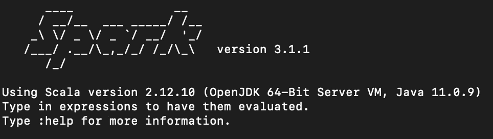
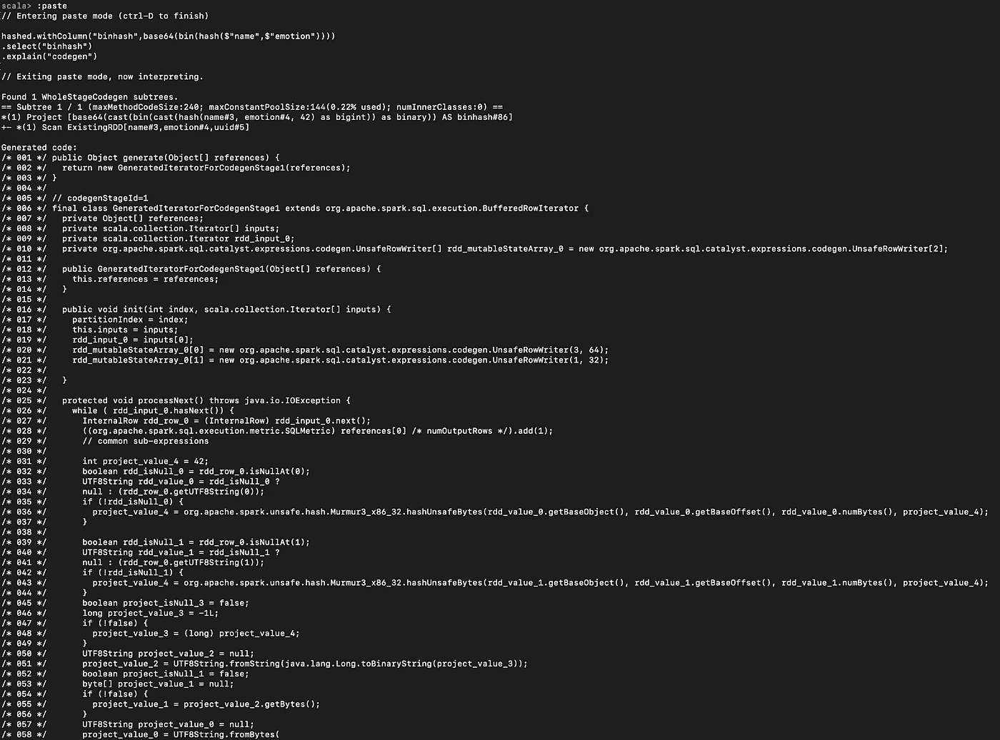

# 分析散列技术

> 原文：<https://towardsdatascience.com/analytical-hashing-techniques-5a0393f3fc1c?source=collection_archive---------11----------------------->

## Spark SQL 函数简化您的生活


图片来源:[https://unsplash.com/@swimstaralex](https://unsplash.com/@swimstaralex)

在分析和机器学习领域工作的任何人最终都需要为他们正在处理的数据生成强大的复合分组键和幂等标识符。这些加密的强标识符有助于减少执行复杂的存储、重复数据删除和一系列其他重要任务所需的工作量。

我们将看看生成散列的两种方法:

1.  使用 Base64 编码和字符串串联
2.  使用杂音哈希和 Base64 编码

## Spark SQL 函数

[核心 spark sql 函数库](https://spark.apache.org/docs/latest/api/sql/index.html)是一个预构建的库，包含 300 多个常用 sql 函数。然而，查看函数索引并简单地列出事情并不像运行代码本身那样令人难忘。如果您有**火花壳**，那么您可以继续学习一些分析散列技术。

## 旋转火花

```
$SPARK_HOME/bin/spark-shell
```



上图:参考我的 Shell 环境

spark-shell 启动并运行后，您可以通过运行**来执行下一步:在 shell 中粘贴**来粘贴 multiline。 **(:粘贴，然后粘贴代码，然后 cmd+D 处理代码)*

## 导入库和隐式

```
import org.apache.spark.sql._
import org.apache.spark.sql.functions._
import org.apache.spark.sql.types._
import spark.implicits._
```

## 创建数据框架

```
val schema = new StructType()
  .add(StructField("name", StringType, true))
  .add(StructField("emotion", StringType, true))
  .add(StructField("uuid", IntegerType, true))val df = spark
  .createDataFrame(
    spark.sparkContext.parallelize(
      Seq(
        Row("happy","smile", 1),Row("angry", "frown", 2))
      ),
      schema
    )
```

此时，您应该有了一个非常简单的数据框架，现在可以对其应用 Spark SQL 函数。使用 **df.show()** 显示其内容。

```
scala> df.show()+-----+-------+----+
| name|emotion|uuid|
+-----+-------+----+
|happy|  smile|   1|
|angry|  frown|   2|
+-----+-------+----+
```

现在我们有了一个简单的数据框。接下来，我们可以简单地通过使用 **withColumn** 函数并传入我们想要使用的 Spark SQL 函数，向数据帧添加一个 base64 编码器列。

## 哈希字符串

Base64 编码的字符串值

```
val hashed = df.withColumn(
  "hash", base64(
    concat_ws("-", $"name", $"emotion")
  )
)
```

这个转换的结果产生了一个新列，它是对来自列 **name** 和 **emotion** 的串联字符串值进行 base64 编码的结果。这被分解为以下流程。

```
df.withColumn("concat",
  concat_ws("-",$"name",$"emotion"))
  .select("concat")
  .show+-----------+
|     concat|
+-----------+
|happy-smile|
|angry-frown|
+-----------+
```

完整列表达式的最终结果如下。

```
scala> hashed.show()
+-----+-------+----+----------------+
| name|emotion|uuid|            hash|
+-----+-------+----+----------------+
|happy|  smile|   1|aGFwcHktc21pbGU=|
|angry|  frown|   2|YW5ncnktZnJvd24=|
+-----+-------+----+----------------+
```

很好。没错。

下一个。我们可以考虑一种更强的散列技术。这使用 Murmur3 哈希算法，并在输入 base64 编码器之前进行显式二进制转换。

## 杂音散列和二进制编码

有许多方法可以生成散列，散列的应用可以从分桶到图的遍历。当你想创建强散列码时，你可以依靠不同的散列技术，从[循环冗余校验(CRC)](https://en.wikipedia.org/wiki/Cyclic_redundancy_check) ，到高效的[杂音散列(v3)](https://en.wikipedia.org/wiki/MurmurHash#MurmurHash3) 。我们将在 Spark 中使用我们可以免费获得的东西，即 Murmur3。

```
hashed.withColumn("binhash",
  base64(bin(hash($"name",$"emotion")))
)
.select("uuid", "hash", "binhash")
.show(false)
```

这将基于相同的输入数据返回下面的行(比较两种散列方法)。

```
+----+----------------+--------------------------------------------+
|uuid|hash            |binhash                                     |
+----+----------------+--------------------------------------------+
|1   |aGFwcHktc21pbGU=|MTAxMTEwMDAxMTAwMDAwMTAwMDAwMDEwMTExMDAxMA==|
|2   |YW5ncnktZnJvd24=|MTEwMTAwMDEwMTExMTExMDEwMDAwMDExMDAxMTAxMA==|
+----+----------------+--------------------------------------------+
```

## 查看 Spark 代码生成

如果你想知道 Spark 在幕后是如何工作的，那么**解释**函数有一个很棒的新特性，可以让你查看 Spark 为你的转换生成(并优化)的代码。要查看这一点，您需要做的就是下面的事情。

```
hashed.withColumn("binhash",
  base64(bin(hash($"name",$"emotion")))
)
.select("binhash")
.explain("codegen")
```

这将输出 java 代码并解释更多关于计算的内容。



上图:查看 Spark 代码生成

这段代码是 [Spark 的 Catalyst Optimizer](https://databricks.com/blog/2015/04/13/deep-dive-into-spark-sqls-catalyst-optimizer.html) 的一部分，幸运的是，你很有可能永远不会在这个较低的级别上工作，很有可能继续你的生活。但是，如果您正在编写定制的数据源读取器和写入器，那么这可能是您想要深入研究的内容。如果没有别的东西可以让你了解更多关于底层机制的知识，在上面的用例中，codegen 详细说明了正在使用的 brunh hash 库的用法。对于调试和那些只想在 360 度模型中学习的人来说，这是一个很好的工具。

## 摘要

现在，您还有两种技术可以用来创建强组合键，或者用作创建幂等键的跳板。我只是觉得分享这些技术会很有趣，因为它们很方便，并且可以重用 side Spark 附带的核心库。愉快的旅行。