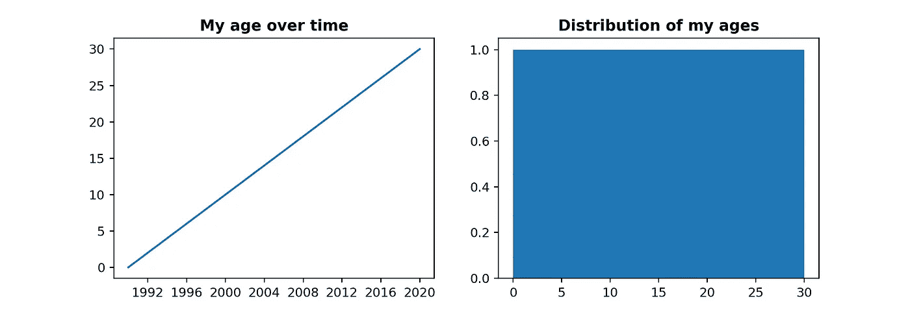
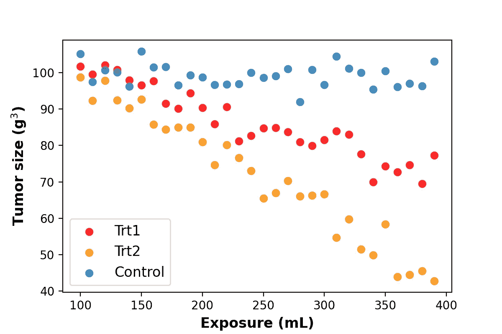
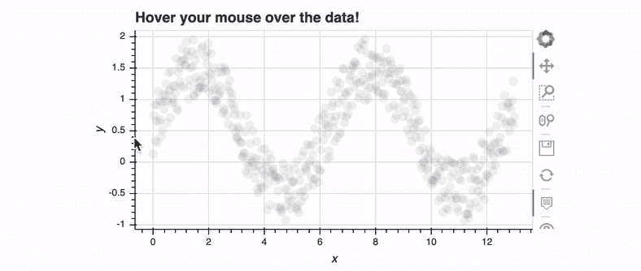
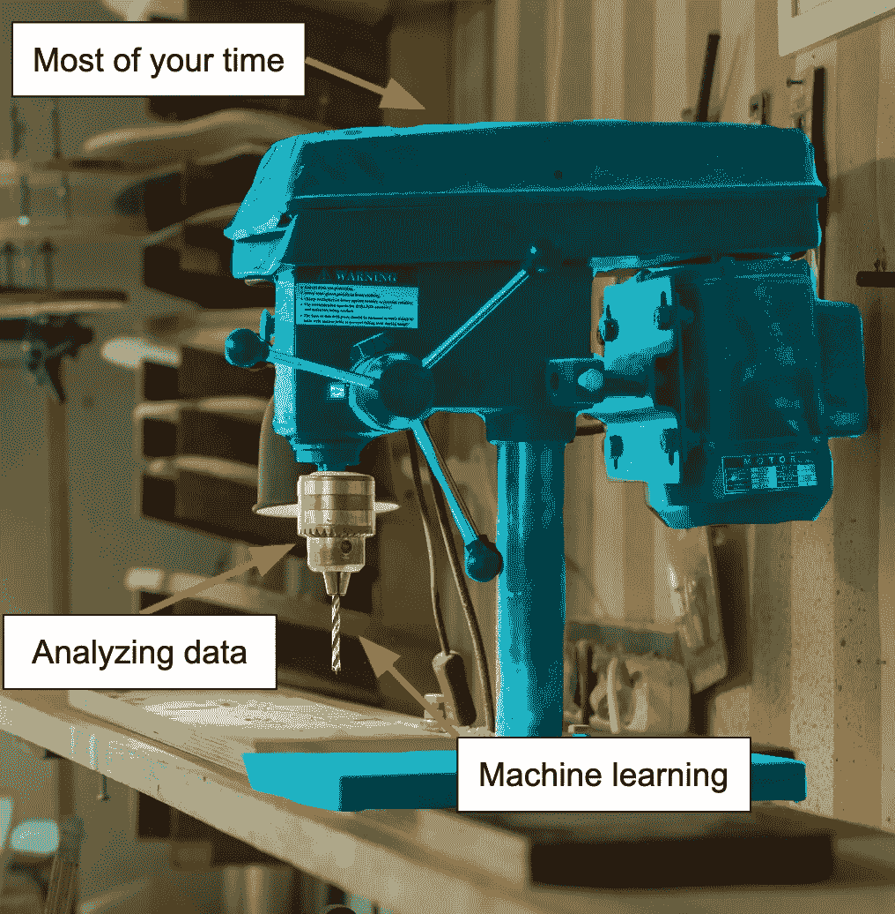
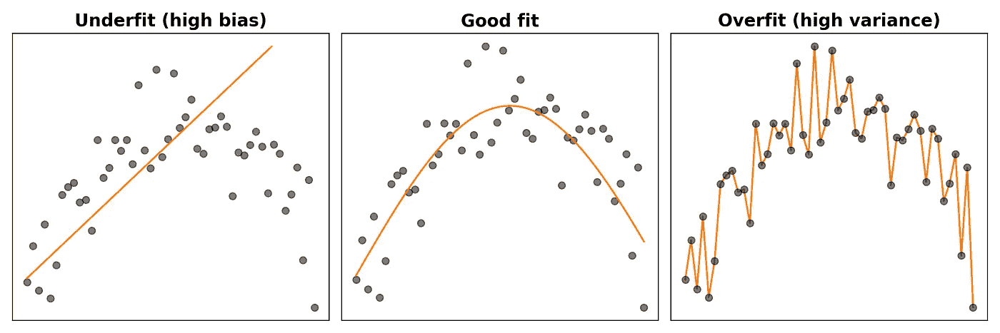

# 数据科学的分析基础

> 原文：<https://towardsdatascience.com/analytics-essentials-for-data-science-25da994f4bed?source=collection_archive---------17----------------------->

## 让数据变得有意义的基础

Robynne Hu 在 [Unsplash](https://unsplash.com?utm_source=medium&utm_medium=referral) 上的照片

虽然 Excel 的魔法可能适合许多分析任务，**数据科学工作严重依赖编程的*细微差别*、*再现性*和*可扩展性*。**从只能在专门的 R 和 Python 库中使用的统计测试，到能够一步一步地展示模型是如何制定和生成预测的，再到能够通过几个按键从处理一个数据集到处理 1000 个数据集， ***流畅的编程对于成为一名高效的数据科学家至关重要。***

因此，我们将重点关注编程技能，这是有效操作和分析数据的关键。无论你在[分析-工程光谱](/the-analytics-engineering-spectrum-of-data-science-jobs-3cf05c5f2d0b)中处于什么位置，这些技能都应该是有用的。

虽然许多数据科学角色只依赖于 R，但这篇文章将展示 Python 的编码概念。Python 的多功能性使其成为一种“一体化”语言，适用于大量的数据科学应用，从数据帧处理到语音识别和计算机视觉 T21。即使你的角色需要在 R 中整天处理数字，也可以考虑学习一点 Python 来自动完成像[将结果保存到你公司的 Dropbox](https://stackoverflow.com/questions/23894221/upload-file-to-my-dropbox-from-python-script) 这样的步骤。

这篇文章假设你熟悉 Python 基础知识。如果没有，请查看[真实 Python](https://realpython.com/tutorials/basics/) 和 [Codecademy](https://www.codecademy.com/learn/learn-python) 中的重要资料。我们将涵盖以下概念:

*   数据帧
*   数组
*   形象化
*   描述统计学
*   使用日期和时间
*   机器学习

要深入了解统计，请查看我的“数据科学统计基础”帖子。

</stats-essentials-for-data-science-cfcdee17af68> [## 数据科学统计基础

towardsdatascience.com](/stats-essentials-for-data-science-cfcdee17af68) 

# 数据帧

数据框架是数据科学和分析的核心。它们本质上只是一个由行和列组成的表格，通常每行是一个 ***记录*** ，每列是该记录的一个 ***属性*** 。例如，您可以有一个雇员表，其中每行是一个人，列是他们的姓名、家庭住址和职务。

因为数据框架在数据科学中起着核心作用，所以您需要掌握可视化和操作其中的数据。`pandas`这里是钥匙库。

基础知识包括能够加载、清理和写出 [CSV 文件](https://en.wikipedia.org/wiki/Comma-separated_values)。清理数据可能涉及删除具有缺失值或重复信息的行，纠正错误值，以及将列重新格式化为不同的[数据类型](https://realpython.com/python-data-types/)。

其他重要的数据操作包括矢量化和迭代数据转换。对于我们的数据框架中的列的简单的元素数学，`pandas`让我们把列当作奇异值。

对于更细微的操作，比如处理丢失的值，否则会导致列操作失败，您可以使用`.apply`。下面，我们使用一个[λ](https://www.programiz.com/python-programming/anonymous-function)将一个自定义函数`safe_divide`应用到每一行的`col1`和`col2`字段。[1]

对于不容易传递到 lambda 中的逻辑，我们可以使用`.itertuples`遍历 dataframe 行。([能避免就不要用](https://medium.com/swlh/why-pandas-itertuples-is-faster-than-iterrows-and-how-to-make-it-even-faster-bc50c0edd30d) `[.iterrows](https://medium.com/swlh/why-pandas-itertuples-is-faster-than-iterrows-and-how-to-make-it-even-faster-bc50c0edd30d)` [！)](https://medium.com/swlh/why-pandas-itertuples-is-faster-than-iterrows-and-how-to-make-it-even-faster-bc50c0edd30d)

最后，我们需要能够组合来自多个数据帧的数据，并对数据运行聚合命令。在下面的代码中，我们合并了两个数据帧，通过指定它是一个[左合并](https://www.shanelynn.ie/merge-join-dataframes-python-pandas-index-1/)，确保不要删除`df1`中的任何行。然后我们创建一个新的 dataframe，`df_agg`，它对每个用户的每一列进行求和。由于`user_id`现在是我们的索引，我们可以使用`.loc`轻松显示特定用户在给定类别中的支出。

泰勒·伊斯顿在 [Unsplash](https://unsplash.com?utm_source=medium&utm_medium=referral) 上拍摄的照片

# 数组

`pandas`数据帧[实际上是建立在](https://stackoverflow.com/questions/11077023/what-are-the-differences-between-pandas-and-numpyscipy-in-python) `[numpy](https://stackoverflow.com/questions/11077023/what-are-the-differences-between-pandas-and-numpyscipy-in-python)` [数组](https://stackoverflow.com/questions/11077023/what-are-the-differences-between-pandas-and-numpyscipy-in-python)之上的，所以了解一些如何有效使用`numpy`的知识会很有帮助。例如，`pandas.Series`(行和列的类似数组的数据类型)上的许多操作与`numpy.array`操作相同。

`numpy`或 [Numerical Python](https://numpy.org/) ，是一个专门为高效数学运算而构建的类库。R 用户会发现`numpy`数组很熟悉，因为它们与 R 的向量共享许多编码逻辑。

下面，我将强调 Python 内置的`list`类的一些区别。我遵循的一个典型经验法则是，只要有可能，最好使用 Python 的内置类，因为它们已经针对该语言进行了高度优化。然而，在数据科学中，`numpy`数组通常是更好的选择。[2]

首先，我们对向量进行简单的过滤。Python 的内置`list`要么需要列表理解，要么需要`filter`函数加上 lambda 和解包(`[*...]`)。与此同时，`numpy`只需要阵列本身。

第二个主要区别是数学运算。`+`操作符将列表连接起来。与此同时，`numpy`数组将`+`解释为元素相加。

为了对 Python 列表进行元素式的数学运算，您需要在两个列表上使用类似于带有`zip`的列表理解。对于`numpy`，只是普通的数学运算符。您仍然可以手动计算简单的聚合，如列表中的平均值，但是我们几乎已经到了使用列表没有意义的地步。

最后，如果您正在处理更高维度的数据，不要为列表的列表而烦恼——只需使用`numpy`。我仍然在挠头，试图弄清楚`[*map(np.mean, zip(*l_2d))]`到底是如何工作的，而`arr_2d.mean(axis=1)`清楚地表明我们取每列(轴 1)的平均值。

如果你最终从事计算机视觉工作，多维数组将是必不可少的，因为它们是存储图像像素亮度的默认数组。例如，您可能会遇到一个二维数组，其中包含每个像素的 [RGB](https://en.wikipedia.org/wiki/RGB_color_model) 值的元组，或者一个五维数组，其中维度 3、4 和 5 分别是红色、绿色和蓝色。

照片由[莎伦·皮特韦](https://unsplash.com/@sharonp?utm_source=medium&utm_medium=referral)在 [Unsplash](https://unsplash.com?utm_source=medium&utm_medium=referral) 拍摄

# 形象化

在数据帧和数组之后，下一个最重要的分析技能是数据可视化。**可视化数据是分析的第一步也是最后一步:**当 Python 向您传达数据时，以及当您向利益相关者传达数据时。

主要的 Python 数据可视化库是`matplotlib`和`seaborn`。下面介绍如何在`matplotlib`中创建一个简单的双面板图。

作者图片

下面是一个简单的方法来绘制多组数据。`label`关键字非常方便，因为您可以简单地调用`plt.legend`并用每个组的信息自动填充图例。

作者图片

如果你想变得有趣，可以看看交互式仪表盘工具，比如[散景](https://bokeh.org/)或 [Plotly](https://plotly.com/) 。这些工具允许用户与绘图进行交互，例如通过将鼠标悬停在某个点上来获取关于该点的更多信息，或者通过单击下拉菜单或拖动滑块来重新生成绘图中的数据。你甚至可以将简单的图嵌入到静态 HTML 中，就像下面的散景图。[3]

作者 Gif

由 [Unsplash](https://unsplash.com?utm_source=medium&utm_medium=referral) 上的 [CHUTTERSNAP](https://unsplash.com/@chuttersnap?utm_source=medium&utm_medium=referral) 拍照

# 描述统计学

虽然你可能已经迫不及待地想要开始机器学习，但我认为首先应该对描述统计学和推断统计学有一个扎实的理解。对于大多数数据科学应用程序来说，这些基础知识应该足够了。

与推断统计学不同，后者涉及将我们样本的数据转化为对更广泛人群的推断。数据是正态分布，[单峰还是双峰](https://www.statisticshowto.com/what-is-a-bimodal-distribution/)，[偏左还是偏右](https://www.mathsisfun.com/data/skewness.html)？什么是[典型值](https://en.wikipedia.org/wiki/Mean)，数据[与该值](https://en.wikipedia.org/wiki/Variance)相差多少？将描述性统计视为数据可视化的“硬数字”对。能够快速传达这些指标将为数据提供一种直觉，这有助于识别异常值，例如数据质量问题。

以下是我认为必须了解的主要指标:

*   **平均值:**平均值，中位数，众数
*   **价差:**标准差
*   **模态:**单峰、双峰、多峰分布
*   **歪斜:**左、右

照片由[阿伦视觉](https://unsplash.com/@aronvisuals?utm_source=medium&utm_medium=referral)在 [Unsplash](https://unsplash.com?utm_source=medium&utm_medium=referral) 上拍摄

# 使用日期和时间

至少有了数据分析，你很可能无法逃避与日期打交道。日期构成了[时间序列分析](https://en.wikipedia.org/wiki/Time_series)的主干，这在像[物联网](https://www.wired.co.uk/article/internet-of-things-what-is-explained-iot)这样有连续数据流的领域中无处不在。

内置的`datetime`库是 Python 的标准，在`dateutil`库中有扩展的方法。幸运的是，当索引设置为 datetime 时，`pandas`具有处理日期的优秀功能，这意味着您可以在`pandas`中进行有日期和无日期的分析。类似地，`matplotlib`让您传入`dt.datetime`值，就像它们是正常数字一样。

在`dt.datetime`和`str`格式之间转换也很重要。这里的功能是:

*   `dt.datetime.strptime`为`str` - >为`dt.datetime`
*   `dt.datetime.strftime`为`dt.datetime` - >为`str`。

(注意:我始终记不住是字符串还是日期时间值先出现！我只是在旁边的 Jupyter 笔记本电池上试了一下，看看哪个能用。)

最后，Python 的`time`模块可以方便地计时分析中的步骤需要多长时间。`time.time()`将返回一个浮点数，表示自 1970 年 1 月 1 日午夜以来的秒数。(也称 [Unix 纪元时间](https://en.wikipedia.org/wiki/Unix_time)。)您可以在代码块之前保存该值，然后在代码之后将其与纪元时间*进行比较。*

安迪·凯利在 [Unsplash](https://unsplash.com?utm_source=medium&utm_medium=referral) 上的照片

# 机器学习

最后，我们有机器学习。在数据科学家做的所有事情中，机器学习最受关注*，但可能是这份工作中最小的方面。*

把成为一名数据科学家想象成建造一台钻孔机。

来自 [Pexels](https://www.pexels.com/photo/black-and-gray-sewing-machine-4889150/?utm_content=attributionCopyText&utm_medium=referral&utm_source=pexels) 的[雅罗斯拉夫·舒拉耶夫](https://www.pexels.com/@yaroslav-shuraev?utm_content=attributionCopyText&utm_medium=referral&utm_source=pexels)的原始照片

训练本身是引人注目的部分——花哨的统计和分析——秘诀是机器学习。钻尖因突破而获得所有荣誉，并且总是有新的和改进的钻尖出现，可以破碎更坚硬的材料。

**但你的大部分时间可能会花在组装*其余的机器***——框架、杠杆、螺丝等。识别*和*在哪里钻孔。(如果你在一个特别缺乏工程技术的组织中，你也可能最终构建前端:用户的控件！)

如果你只关心钻头而不是整个机器，你可能会发现自己对许多数据科学工作大失所望。但是，如果你在建造机器的整个过程中找到乐趣，并创造出真正帮助人们开拓创新的东西，那么你就会热爱你的工作。

无论如何，你*将*需要一些机器学习的知识。虽然你需要了解你使用的任何算法在做什么——以及它是否是解决你所提问题的正确工具——**,但你可能会惊讶地发现，研究完全相似的算法有何不同**(例如[随机森林](https://en.wikipedia.org/wiki/Random_forest)与[支持向量机](https://en.wikipedia.org/wiki/Support_vector_machine)与 [XGBoost](https://xgboost.readthedocs.io/en/latest/) )所带来的商业收益是如此之少，除非你的工作是研究、教育或机器学习咨询。[4]

相反，如果你很好地理解了使用机器学习算法之前和之后的必要步骤*，你会走得更远。因此，我将在这一节讨论有效使用机器学习的“之前和之后”部分。我认为，需要了解的主要概念是:*

1.  特征工程
2.  训练数据与测试数据
3.  评估模型拟合度

## 特征工程

我们的原始数据通常不足以建立一个强大的模型。比方说，我们试图预测在线商店每天售出的商品数量。

我们已经知道周末的销售额比平日高，所以我们希望我们的模型包含工作日/周末的区别，以便更加准确。我们的数据中没有明确的工作日/周末的区别，尽管我们只有销售发生的日期。

线性模型肯定不知道如何处理原始数据。*也许*一个复杂的深度学习模型可以获得与日期相关的销售循环模式，但这可能需要大量数据才能弄清楚。

一个简单得多的选择是**设计**一个`is_weekend` **特性**，询问每笔销售是发生在周六还是周日，而不是一周的其他时间。`is_weekend`功能现在作为一个明确的标志，提醒我们的模型 a 在工作日和周末之间可能会有所不同。

类似地，也许用户购物车中商品的原始数量并不是一个有价值的预测指标，但是这些商品的平方根或对数实际上是。(我其实也不知道。如果电子商务领域的所有数据科学家都在使用某种转换，请给我发消息！)

最终，特征工程是一种将领域专业知识整合到模型中的方法，为模型提供了更有用的工具来理解数据。预计将花费大量时间来尝试为您的模型识别和设计最具信息性的功能。**在精确的数据之后，相关特征是*精确的机器学习模型***的最重要的组成部分——远远超过所使用的精确算法或调整[超参数所花费的时间](/understanding-hyperparameters-and-its-optimisation-techniques-f0debba07568)。

## 训练数据与测试数据

当你建立一个预测模型的时候，知道它有多准确是很重要的。这就是*训练数据*对比*测试数据*的地方。主要的想法是**将你的数据分成“训练”数据和“测试”数据，前者用于创建模型，后者用于评估模型的准确性。**

一旦您的模型了解了输入和输出之间的关系，您就可以使用测试数据来查看模型的预测与真实输出的对比情况。【5】是终极考验！当我们确切知道答案*应该是什么*时，就没有多少解释的余地了。

[Scikit-learn](https://scikit-learn.org/stable/) ( `sklearn`)是机器学习的首选 Python 库。它与`pandas`和`numpy`无缝集成，拥有准备、运行、评估和微调模型所需的一切。

## 评估模型拟合度

我们需要了解的最后一个机器学习理论是评估你的模型对你的数据描述得有多好……以及它对数据的描述是否也很好。

作者图片

模型是真实世界的简化表示。如果模型*过于简单*，那么它既不能代表训练数据，也不能代表真实世界(欠拟合)。另一方面，如果它*太复杂*，它将描述它所训练的数据，但不会推广到现实世界(overfit)。

将模型视为将输入转换为输出的底层“规则”。假设我们有一个模型，可以将学生 1)学习和 2)睡觉的时间转换成考试分数。如果我们开始包括像 3)学生是否吃早餐和 4)他们是否喜欢老师这样的特征，我们可以使模型更加准确。

但是我们拥有的特性越多，我们就需要越多的数据来精确地计算每个特性对输入和输出的贡献，*特别是当特性不是完全独立的时候。*事实上，[研究人员已经估计过](https://academic.oup.com/bioinformatics/article/21/8/1509/249540)当我们有相关特征时，我们的模型不应该有超过我们模型中`n` 个特征的平方根(其中`n`是观察的数量)。除非你有几十或几百名学生的数据，否则这将大大减少你的模型应该具有的特征的数量。

当我们用相关特征包装我们的模型时，比如昨天的*个小时的睡眠*和两天前的*个小时的睡眠*，我们在描述我们的数据时挤出了一些额外的准确性，但我们也稳步地创建了一个像右上方这样的图片，其中我们的模型没有很好地转化为现实世界。为了解决这个问题，我们需要采用类似于[特征选择](https://machinelearningmastery.com/feature-selection-with-real-and-categorical-data/)、 [k 重交叉验证](https://machinelearningmastery.com/k-fold-cross-validation/)、[正则化](https://explained.ai/regularization/index.html)和[信息标准](https://www.sciencedirect.com/science/article/abs/pii/S0167947313002776)的技术。这些技术使我们能够仅基于最具信息性的特征来创建真实世界的最简洁的表示。

亚历山大·波辛汉姆在 [Unsplash](https://unsplash.com?utm_source=medium&utm_medium=referral) 上拍摄的照片

# 总结想法

这篇文章涵盖了我称之为数据科学的“分析”方面——当你操作和分析数据时你写的代码。这些技能通过从数据中提取洞察力来实现精确性、速度和可重复性。

从在`pandas`中重新排列数据，到在`matplotlib`中将其可视化，再到在`sklearn`中训练一个模型，我们现在已经掌握了一些处理任何数据的核心技能。通过留下代码的痕迹，我们写的任何分析都可以被他人更仔细地检查和重复——甚至是未来的我们自己。

下一篇文章将探讨数据科学的软件工程方面，包括你在实际处理数据的之外编写的*代码。在我们的钻孔机例子中，除了钻孔机之外，工程技能是一切。结合这篇文章中的技能，你将为加入数据科学家团队做好充分的准备，并开始做出有意义的贡献。下期帖子再见！*

最好，
马特

# 脚注

## 1.数据帧

`numpy`的`divide`函数与我们的`safe_divide`函数非常相似，我通常会推荐使用已经编写并优化的代码。但是也许在这种情况下，假设我们在被零除的时候想要`np.nan`而不是`Inf`。

此外，您可能会注意到，我们正在将一个预定义的函数`safe_divide`传递给一个 lambda，它应该是一个“匿名”函数。为什么不直接在`.apply`中使用`safe_divide`？我们需要一个额外的 lambda 层，因为`.apply`需要一个`pd.Series`，特别是您的 dataframe 行(`axis=1`)或列(`axis=0`)。我们的匿名函数是一个包装器，它接收一个`pd.Series`，然后将`safe_divide`应用于该系列的`col1`和`col2`字段。

## 2.数组

在列表上使用`numpy`数组的规则的一个明显的例外是，如果您希望您的数组存储不同类型的值。`numpy.array`和`pandas.Series`有类型强制，这意味着[所有元素必须是相同的类型](https://numpy.org/doc/stable/user/quickstart.html#the-basics)，在创建数组时它们将被强制为相同的类型。

下面，`our_list1`的`numpy`版本将`1`和`2`转换为浮动以匹配`3.0`。(整数被转换成浮点数，以保留浮点数中小数点后的信息。)对于`our_list2`，没有明确的整数或浮点版本的`'a'`，所以将`1`和`2.0`转换为字符串。如果出于某种原因，您希望您的数组存储不同类型的数据，那么您最好坚持使用 Python 的`list`类。

## 3.形象化

如果你感兴趣，下面是生成散景图的代码。

## 4.机器学习

作为一个喜欢搞清楚事物如何工作的具体细节的人，我个人建议深入研究随机森林和 XGBoost 等算法之间的区别！我觉得这很有趣，这些知识让我更容易向模型输出的好奇消费者揭开机器学习的神秘面纱。但是总的来说，通过挖掘这些细节，我交付商业价值的能力并没有提高多少；真正的好处是理解细微差别的个人满足感。

## 5.训练数据与测试数据

请注意，这是针对监督学习问题的，其中每个输入都有一个“正确”的输出。对于无监督学习问题，评估模型准确性[更加复杂，并且可能需要特定领域的专业知识。例如，我们可能会看到有四类客户支出，但需要有商业头脑的人才能看出只有三类与公司的市场相关。](https://www.researchgate.net/post/Which_are_the_methods_to_validate_an_unsupervised_machine_learning_algorithm)