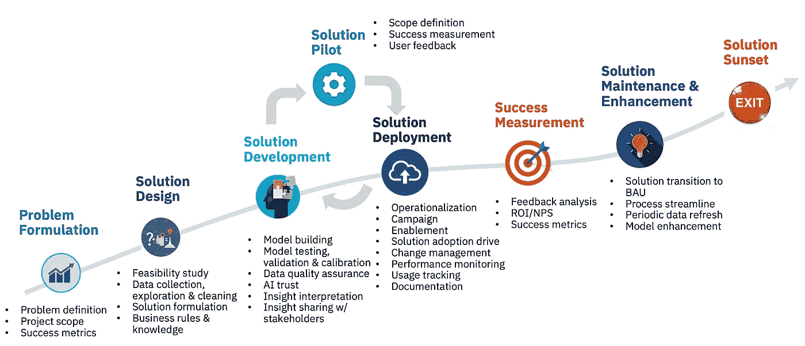

# 分析生命周期管理

> 原文：<https://towardsdatascience.com/analytics-lifecycle-management-f391b3cbebad?source=collection_archive---------15----------------------->

## [行业笔记](https://towardsdatascience.com/tagged/notes-from-industry)

## 从问题形成到解决方案日落的 7 个阶段

现在，将机器智能添加到我们的业务工作流中已经成为常态，越来越多的数据驱动预测分析正在开发并集成到现有的业务运营中，以帮助决策、提高效率、降低风险和增强员工体验。

然而，随着分析和人工智能模型的激增，我们面临着有效管理分析生命周期的挑战，以确保这些模型产生可靠的业务洞察力，从而做出最佳决策，确定机会和合理的行动。这是一项多方面的复杂任务。

下面是我对管理分析的整个生命周期的看法，它提供了一步一步的指导，通过制定业务问题，开发和部署分析，并最终淘汰分析的过程。请注意，虽然该过程是以顺序方式呈现的，但它本质上是一个迭代过程，可用于产生可重复且可靠的预测结果。

**A .问题提法**

任何分析或人工智能解决方案都始于业务问题或业务用例。只有清楚地了解了业务需求，才能设计和开发具有预期业务成果的分析解决方案。在这一阶段，还需要确保业务发起人承诺在提议的用例中使用开发的分析，以满足最初的设计目标。一个项目经常会陷入一个陷阱，那就是它的分析输出没有被任何潜在用户采用，从而浪费了所有的努力。因此，在项目的早期阶段，让业务发起人参与进来并与他们共同创造解决方案是非常重要的。

阐明问题的另外两个方面包括项目范围和成功度量的定义。这是询问关键问题的时候，例如:这个项目的范围是什么？它是包括所有员工，还是仅包括特定的业务部门、地区、国家和部门？我们如何定义成功？衡量成功的标准是什么？现在是什么状态，未来又会是什么状态？目标用户在未来状态下会是怎样的体验？澄清这些问题对于解决方案设计阶段至关重要。

**B .方案设计**

一旦问题得到很好的表述，下一步就是设计解决方案，包括

*   了解该领域的当前形势或现有工作，尤其是公司内部的工作，以避免任何重复工作，并有可能建立在现有解决方案的基础上。如果在外部市场发现类似的解决方案，那么“购买还是建造”的问题可能需要与业务利益相关者讨论。此步骤还应包括可行性研究以及工作规模(如果业务发起人要求的话)
*   确定解决方案所需的数据，并探索其可用性。这一步可能需要与数据工程师、数据科学家、赞助用户和业务利益相关者进行头脑风暴。在这里，让具有业务领域知识的人参与讨论是非常宝贵的。另一方面，数据收集往往是最耗时的步骤，尤其是当数据来自许多不同的来源，混合了数据库表、电子表格、平面文件和其他异构格式时。当大部分数据可以从一个集中的数据仓库中自动提取出来时，开发周期可以大大缩短
*   清理、整合和探索数据。在这一步，团队将使用各种工具来搜索关系、趋势和模式，以更深入地了解数据，并确定有助于从分析角度解决业务问题的显著特征。在检查数据时，团队可能会发现需要添加、删除或组合特征来创建更精确的模型
*   理解应用附加业务规则的需要。如果确实有这样的需要，那么在设计阶段就应该考虑到它们

**C .解决方案开发**

在此阶段，将对数据应用大量分析和机器学习建模算法，以找到数据中关系的最佳表示，这将有助于回答业务问题或解决第一阶段中确定的业务需求。将相应地进行广泛的模型构建、测试、验证和校准。此开发阶段的另一个关键领域是数据质量保证，它根据业务和分析要求，确保不同开发阶段的数据质量。

对于任何基于机器学习的解决方案来说，人工智能信任已经成为一个越来越重要的方面。在一天结束时，如果最终用户不信任人工智能解决方案产生的见解、预测或建议，他们就会忽略这些数据。因此，如何增加数据透明度，展示人工智能输出的公平性和健壮性，以及使人工智能决策可以解释，对于推动解决方案的采用变得非常关键。IBM Research 开发了一些工具来培养 AI 信任，包括 AI Factsheet 360([https://aifs360.mybluemix.net/](https://aifs360.mybluemix.net/))、AI Fairness 360(【http://aif360.mybluemix.net】T2)和 AI explability 360([http://aix360-dev.mybluemix.net](http://aix360-dev.mybluemix.net))。在那里可以找到很多有用的信息。

这个阶段的最后一步是在业务环境中解释见解，与业务涉众分享和验证它们。从 AI 信任评估中收集的信息将在此类审查中非常有用。

**D .解决方案部署**

在这个阶段，我们采用开发的解决方案和衍生的见解，并使用可重复的自动化流程将它们付诸实施。针对目标用户群的活动和支持会议是提高解决方案认知度的好方法，最终推动解决方案的采用。另一方面，将解决方案集成到现有的运营流程中是另一个很好的、事实上也是更好的方法，可以推动其使用并实现业务成果。有时，一定程度的变更管理对于将分析结果纳入之前的流程是必要的，来自业务发起人和利益相关者的有力支持和认可将使该流程变得更容易和更快。

请注意，在开发之后可能需要一个解决方案试验阶段，以便在扩大规模之前在相对较小的范围内验证解决方案。一旦团队确认试点结果确实符合预定义的成功标准，并获得业务利益相关方的批准，就可以进入解决方案部署阶段。

解决方案部署并投入使用后，需要监控其性能、跟踪使用情况并收集反馈，以便支持未来任何潜在的解决方案调整和增强。另一方面，如果确实发现了严重的缺陷或严重的性能问题，那么团队可能需要回到解决方案开发阶段。

**E .成功测量**

一旦解决方案成功部署并持续跟踪其使用情况，就到了衡量成功的时候了。在问题形成阶段定义的成功标准将在这一阶段进行测量和报告。其他指标可能包括成本节约或收入产生方面的 ROI，以及基于反馈的 NPS。

**F .解决方案维护&增强**

一旦溶液处于稳定状态，就可以转换到 BAU 模式。这也是尽可能简化/自动化流程，以最少的维护或人工干预提高效率的时候了。在此阶段，还会定期刷新模型。

此外，通过基于标准化度量标准的模型性能的持续监控和测量，团队应该持续评估解决方案的有效性，以检查它是否仍然满足当前的业务需求。如果发现了差距，那么模型需要改进和重新校准。如果业务需求随着时间的推移发生了变化，现有数据源不再有效，或者有了新的数据，这可能会将周期带回到解决方案开发，甚至是解决方案设计。这最终使得生命周期管理成为一个迭代的过程。

**G .解日落**

如果最初的业务需求不再有效，新的解决方案已经开发出来并具有增强的功能，或者客户已经离开，那么现有的解决方案将不再需要，是时候淘汰该模型了。

回顾完端到端分析生命周期后，我想指出一些可能会使整个过程复杂化、变慢甚至脱轨的事情。

*   所需的数据源可能分散在整个组织中，需要非常手动的收集和整合，或者由于其隐私和敏感性而具有非常严格的访问权限，甚至是机密的，因此无法共享
*   人工智能信任在数据洞察中的建立滞后，目标用户对洞察的有效性和道德性有所担忧
*   企业可能很难利用目标业务用例中的洞察力，或者目标用户不重视这样的洞察力，并选择在任何决策中忽略它们
*   将分析集成到现有工作流中可能需要大量涉及不同用户角色的变更管理

为了避免或减轻上述一些陷阱，以下是一些建议:

*   构建一个非常清晰的用例，并估算投资回报率
*   获得业务发起人和利益相关者的大力支持
*   通过设计思考会议与赞助用户共同创建解决方案，并在整个分析生命周期中让他们参与进来
*   以敏捷的方式开发解决方案

祝您好运，并享受分析生命周期的管理！